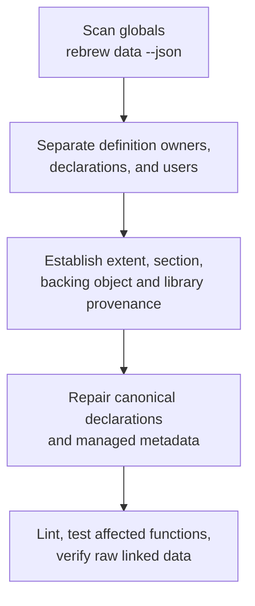

# Rebrew Data Analysis

Inspect global variables and detect type conflicts across translation units.

## When NOT to use this skill

- Function bodies / disassembly / matching → use `rebrew-workflow` or `rebrew-matching`
- Pulling data labels back from Ghidra → use `rebrew-ghidra-sync` (`rebrew sync --pull-data`)

## Ownership first

A storage definition owns a global; an `extern`, annotation, or referring function
is a declaration or user. Keep game and CRT declarations separate, with one
canonical declaration per object. Fully linked CRT storage stays in the stock
library. Interior field views and section-span annotations allocate no storage.
For consolidation, duplicate-owner triage, or gap repair, read
`references/global-ownership.md` before moving definitions or generating padding.

Library owners come from the configured `raw_link` image's sibling MSVC `.map`,
or explicit `--link-map`. The table has one `Owner` column showing source files or
`library:object`; JSON separates `library_owners` from source `defined_in`.
COMMON rows require a unique provider in configured archives already cached on
disk and a member selected by the map; scanning never pulls/extracts libraries.
Owner evidence describes the linked build, whose `linked_va` can differ from the
reference VA. DLL import slots and unresolved aliases are not static library owners.

## Commands

Run from the project root (config discovery walks up to `rebrew-project.toml`). Add
`--target NAME` for non-default targets in multi-target projects.

```bash
rebrew data --link-map build/server.map --json  # explicit MSVC map for library owners
rebrew data --json                              # full inventory: globals, data_annotations, type_conflicts, summary, sections
rebrew data --summary --json                    # per-section progress: JSON `summary` becomes {sections, conflicts}
rebrew data --conflicts --json                  # only globals with type conflicts (same name, different types across files)
rebrew data --dispatch --json                   # detect dispatch tables / vtables in .data/.rdata
rebrew data --dispatch --min-table-len 5 --json # require >= 5 entries per table
rebrew data --dispatch --max-pointer-stride 8   # allow 8-byte stride between slots (sparse tables)
rebrew data --bss --json                        # verify .bss layout, detect gaps from missing externs
rebrew data --fix-bss --dry-run                 # preview bss_padding.c + metadata changes, write nothing
rebrew data --fix-bss                           # generate bss_padding.c + write SIZE/SECTION/NOTE to metadata
rebrew data --gen-header --dry-run              # preview rebrew_globals.h contents
rebrew data --gen-header                        # write rebrew_globals.h from local // GLOBAL: / // DATA: annotations (no Ghidra)
rebrew data --gen-header --gen-header-out /path/to/my_globals.h  # override output path
rebrew data --gen-header --force                # overwrite existing file without prompting
rebrew data --layout-audit --section .rdata     # per-TU span/order audit for .rdata (default .data)
rebrew data --set-type 0x10025000='unsigned char *'  # write type into rebrew-data.toml (repeatable)
rebrew data --set-section 0x10025000=.rdata     # write section (.data / .rdata / .bss); this fixes W016
rebrew data --fix-ownership --dry-run           # re-partition defs; fixes layout-audit SPAN/ORDER
rebrew data --fill-data --dry-run               # emit _dpad_<addr>[N] for uncovered .data runs
rebrew data --own --dry-run                     # materialize link_stubs.c globals into owner TUs
rebrew data --converge --dry-run                # adjust _dlead_<tu> pads vs build/bench; does not rebuild
rebrew verify --data --built build/bench     # byte-compare built .data/.rdata per symbol (VERIFIED/DRIFT/UNCHECKED)
rebrew todo --category data-drift --json                # data symbols whose built bytes differ from the reference
```

`--data` reports comparisons but writes stored verdicts/evidence only with
`--raw-link` or a configured `raw_link` image. Without that acknowledgment,
existing metadata stays unchanged. Compare a raw link: postlink-copied data
can match without demonstrating that the source reproduces it.

`--gen-header` emits externs grouped by physical section, not game/CRT ownership.
Use `--dry-run` or `--gen-header-out` to review output before merging into canonical
subsystem headers. `--force` replaces an existing header. `rebrew sync --pull-data`
also replaces the default header without prompting: preserve and reconcile any
existing split first.

`--layout-audit` reports SPAN/ORDER and unowned symbols. `--fix-ownership`
re-partitions definitions; `--own` materializes stub-file storage. Neither a
reference count nor physical adjacency establishes a library or subsystem owner.
`--fill-data` and `--fix-bss` emit padding; use only for proven uncovered storage,
not aliases or bytes already emitted by stock libraries. Preview every mutation
with `--dry-run`. `--converge` adjusts leading pads against the current build;
it does not build or prove the resulting data: rebuild, then verify.

JSON response shapes and failure-mode table: `references/json-and-failures.md`.

## DATA Annotations

DATA metadata lives in a **`rebrew-data.toml`** beside `rebrew-functions.toml` at
`cfg.metadata_dir`: the parent of `reversed_dir` (e.g. `src/` for sources under
`src/bench/`) when a store sits there, otherwise the outermost store found walking up to
the project root, so one store covers every target. The loader does no walk-up of its own
(it reads exactly `directory / rebrew-data.toml`), so library code must pass
`cfg.metadata_dir` rather than the `.c` file's directory.
Only the stable marker line stays in the `.c` file:

**`.c` file:**
```c
// DATA: SERVER 0x10025000

const unsigned char g_sprite_lut[256] = { ... };
```

**`rebrew-data.toml`** (auto-managed, never edit manually):
```toml
["SERVER.0x10025000"]
name    = "g_sprite_lut"      # preferred label (BinSync/Ghidra import target)
size    = 256
section = ".rdata"
note    = "lookup table for sprite indices"
```

| Field | Purpose |
|-------|---------|
| `name` | Preferred variable label; overrides C stem; imported from BinSync state |
| `type` | Declared type `--gen-header` uses when the source has none; set with `rebrew data --set-type 0xVA=TYPE` |
| `size` | Size in bytes |
| `section` | PE section (`.data`, `.rdata`, `.bss`) |
| `note` | Local analysis description; native BinSync globals do not carry notes |
| `status` | Data verdict written by `rebrew verify --data`: `VERIFIED` (built bytes match), `DRIFT` (differ), `UNCHECKED` (not compared); counted in `rebrew status` and `rebrew todo --category data-drift` |

Changing `name`, `type`, `size`, or `section` clears the previous verdict:
re-run verification after editing a definition. Notes and unchanged values
preserve it. `origins` and `verification` are nested tables for external source
facts and comparison evidence; ordinary edit stamps remain separate. Writers
store `size` as a non-negative integer and descriptive fields as strings; lint W031 uses the same validation. Duplicate spellings
of one `(module, VA)` count once; W031 reports them and granular writers
refuse ambiguous updates.

Verification needs a known complete extent. Without `size`, only supported
x86_32 types and complete constant arrays are inferred; unresolved types or
bounds and other architectures need explicit `size`. A matching prefix of
an unknown-sized symbol cannot earn `VERIFIED`.

> [!CAUTION]
> **Never manually edit `rebrew-data.toml`.** It is managed automatically by `rebrew data`,
> `rebrew data --fix-bss`, and `rebrew sync --pull --state-dir <dir>`. Entries are keyed `"MODULE.0xVA"`
> (qualified, same scheme as `rebrew-functions.toml`).

## GLOBAL Annotations

When a function references a global address from disassembly:

1. Reuse its canonical game/subsystem or CRT header; add an extern there if missing.
2. Annotate with `// GLOBAL: MODULE 0x<VA>` for tracking (declaration must follow on the next line).
3. Metadata (name, size, section, note) goes in `rebrew-data.toml`, same format as DATA.

`--gen-header` picks up both `// GLOBAL:` and `// DATA:` markers, merging in `name`/`type`/`size`/
`section`/`note` from `rebrew-data.toml` (a source declaration's type wins over metadata `type`).
`rebrew lint` flags `DATA`/`GLOBAL` markers missing `SECTION` metadata (W016), inline volatile keys, and the `rebrew-data.toml` shapes the writers reject (W031: an unknown field, a STATUS outside `VERIFIED`/`DRIFT`/`UNCHECKED`, half an `updated_by`/`updated_at` pair); run it after adding markers and after any hand-check of the store. `W032` covers the coverage documents themselves (a `db/coverage-bench.toml` the dashboards cannot serve, or a leftover `coverage.db` / grid JSON / CSV from the replaced stores).
Set a missing section with `rebrew data --set-section 0xVA=.bss` (`.data`, `.rdata`, or `.bss`). Do not hand-edit the TOML.

## Debugging Relocation Mismatches

`~~` rows are accepted relocations (they count toward RELOC); leave them alone.
Two diff signals point at globals:

| Signal in `rebrew diff --json` | Cause | Fix |
|--------------------------------|-------|-----|
| `XX` rows (`summary` counts them as mismatches) | Relocation resolves to a catalogued global at the wrong VA: wrong name or a type conflict | Check the name in `rebrew-data.toml`; run `--conflicts` and unify the type |
| `missing_globals` hints (`[0]` operand on a `**` row) | Reference never resolved: no definition for the target address | Add `extern` + `// GLOBAL: MODULE 0x<VA>` |

### Workflow

1. `rebrew diff --json src/bench/<file>.c`: note `XX` rows and `missing_globals`
2. Add the missing `extern` declarations with `// GLOBAL:` annotations
3. Check the backing object and stock-library provenance before adding storage.
4. Use `rebrew data --bss --json` to inspect gaps. A gap can be an incomplete
   extent, alignment, an interior view, or library storage; it is not proof that
   another allocation is missing. Emit padding only after establishing the cause.
5. Re-run `rebrew data --json`, `rebrew lint --json`, and affected function tests;
   rebuild and verify raw linked data when storage or link inputs changed.

## Dispatch Tables and Vtables

`rebrew data --dispatch` scans `.data` and `.rdata` sections for arrays of
function pointers. Tables are not labelled vtable vs dispatch table; decide from
the callers. Table fields are in `references/json-and-failures.md`.

Names come from source annotations first, then the function list / Ghidra structure
registry, so a low-coverage table usually means its targets lack reversed sources
(pick them up in `rebrew-workflow`), not that the detection failed. Tune detection
with `--min-table-len` (default 3) and `--max-pointer-stride` (default 4; raise it
for sparse tables with mixed payload entries). Use this to identify virtual method
tables that need reverse engineering.
