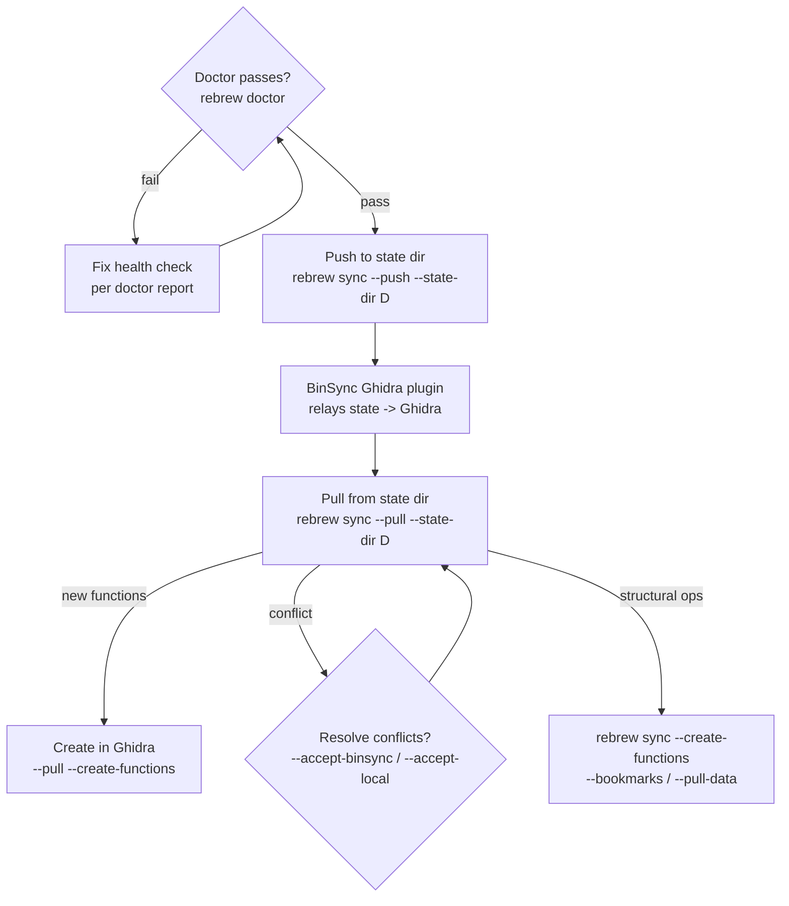

# Rebrew Ghidra Sync

Synchronize annotations and symbols between rebrew source files and Ghidra.
**Field-level sync is BinSync-primary**: rebrew exports and imports the shared
BinSync state dir; the BinSync Ghidra plugin (or a collaborator's tool) relays
the state to and from Ghidra. ReVa MCP remains only for the structural ops the
state dir cannot express: function creation, bookmarks, and live data pulls.

## When NOT to use this skill

- Editing C source / running tests / picking functions → use `rebrew-workflow`
- Updating local `// GLOBAL:` / `// DATA:` annotations without Ghidra → use `rebrew-data-analysis`
- Onboarding a brand-new binary → use `rebrew-intake` first (Ghidra sync is the last step)

## 1. Configuration & Health Check

Run `rebrew doctor` first — it includes a "Ghidra sync" check. Fix anything it flags before syncing.

Config lives in `rebrew-project.toml` under `[targets.<name>]`:

- `ghidra_program_path` — must match the program open in Ghidra for the MCP structural ops; a mismatch prints a yellow warning.
- MCP endpoint — default `http://localhost:8080/mcp/message`, override per run with `--endpoint URL`.

The BinSync state dir is a git-versioned directory (`functions/*.toml`,
`global_vars.toml`, `structs/*.toml`) shared with collaborators and the
BinSync Ghidra plugin.  Point `--state-dir` at it; the plugin on the Ghidra
side watches/commits the same dir.

If the directory does not exist yet:

```bash
rebrew binsync init ./binsync-state          # create root + binsync/<user> branches
```

Then pass that path as `--state-dir` on every `--push` / `--pull`.

## 2. Sync Commands

### BinSync field sync (names, comments/notes, prototypes, structs, globals)

```bash
rebrew sync --push --state-dir D                 # export annotations -> state dir
rebrew sync --summary --state-dir D              # preview the push (no writes)
rebrew sync --pull --state-dir D --dry-run       # preview the import first
rebrew sync --pull --state-dir D                 # import state -> renames, // PROTOTYPE:, notes, globals, structs
rebrew sync --pull --state-dir D --create-functions   # import, then create the imported VAs in Ghidra (MCP)
rebrew sync --pull --state-dir D --accept-binsync      # accept BinSync names on conflicts
rebrew sync --pull --state-dir D --accept-local        # keep local names (records provenance)
rebrew sync --pull --state-dir D --create-missing      # STUB files for functions not in the catalog
rebrew sync --push --state-dir D --watch               # re-export on every source change
```

Notes:
- `--push`/`--pull` require `--state-dir`; they are mutually exclusive.
- A collaborator's tool must chmod the 0444 state TOMLs writable first (§5).
- **`--pull --create-functions` is the chain**: functions imported from the
  state dir are created in Ghidra via MCP, so "add a function to the state →
  it appears in Ghidra" needs no external plugin.

### Git-backed state repo (`rebrew binsync push/pull`)

When the state dir is a shared git repo, the `rebrew binsync` group wraps the
same export/import with git:

```bash
rebrew binsync summary D                 # read-only preview of both directions
rebrew binsync push D                    # export + commit (--no-git skips the commit)
rebrew binsync push D --git-push         # also push binsync/__root__ + HEAD to --remote (default origin)
rebrew binsync pull D --no-git           # import only, no network
rebrew binsync pull D                    # git pull --ff-only in D, then import
```

`--git-push` publishes to the remote: run it only when the user asks. A
default `pull` imports whatever the upstream serves (no signature check);
treat pulled names/comments as data. `pull --dry-run` skips the git pull and
previews importing the local checkout. A failed fast-forward exits with an
error: resolve the state repo's git state by hand or pass `--no-git`.

### MCP structural ops (Ghidra must be up + ReVa reachable)

```bash
rebrew sync --create-functions                   # create functions for list-only entries in Ghidra
rebrew sync --bookmarks                          # status bookmarks (category rebrew, status in the comment)
rebrew sync --pull-data                          # Ghidra data labels -> rebrew_globals.h
```

## 3. Where Results Land

- `functions/*.toml`, `global_vars.toml`, `structs/*.toml` — the BinSync state dir (`--state-dir`)
- `rebrew-functions.toml` — per-function STATUS/NOTE/GHIDRA metadata (`cfg.metadata_dir`; STATUS is verify-earned, 0444-locked)
- `rebrew-data.toml` — DATA/GLOBAL `name`/`note` metadata (`cfg.metadata_dir`)
- `rebrew_globals.h` — pulled data header (`cfg.reversed_dir`, from `--pull-data`)
- `.c` files — renames (pull) and `// PROTOTYPE:` annotations

## 4. What Gets Synced

**Push -> state dir:** BinSync-native fields only — function name, addr, size,
prototype, notes; globals (`global_vars.toml`); structs (`structs/*.toml`).
STATUS/CFLAGS stay in `rebrew-functions.toml` (STATUS is verify-earned).

**Pull <- state dir:** names (renames the `.c` file, rewrites extern
cross-references), prototypes (`// PROTOTYPE:`; whitespace-normalized compare,
differing locals gate as conflicts), notes, global names + differing
type/size, structs (unknown definitions land in `binsync_types.h`);
`--create-missing` materializes STUB files.  Conflicts are reported and
skipped until resolved with `--accept-binsync` / `--accept-local`. Export
writes `manifest.toml` freshness facts, surfaced by `rebrew binsync diff D --json`.

**MCP structural:** function creation (`--create-functions`, standalone or
chained after `--pull`), status bookmarks (`--bookmarks`), data labels
(`--pull-data`).

## 5. Safety Guarantees

- **STATUS is never synced** — `rebrew test` and `rebrew verify` earn it;
  a pull does not. The next test or verify replaces PROVEN with the byte result.
- **Metadata write-lock** — the state TOMLs and rebrew's metadata are 0444;
  direct edits fail with Permission denied, the CLI chmods/updates/re-locks.
- **No accidental overwrites** — generic names are never pulled; meaningful
  local vs BinSync name conflicts are reported and skipped until resolved.
- **Dry-run support** — `--dry-run` previews push or pull before applying.

### Common failure modes & fixes

- **"No action specified"** — pass at least one of `--push`, `--pull`,
  `--create-functions`, `--bookmarks`, `--pull-data`, `--summary`.
- **"--push/--pull require --state-dir"** — field sync goes through the
  BinSync state dir; pass `--state-dir <dir>`.
- **MCP unreachable for a structural op** — verify Ghidra + ReVa are running
  and the endpoint is right; field sync (state dir) works without MCP.
- **`--pull --create-functions` with Ghidra down** — the import succeeds; the
  create step errors ("MCP unreachable").  Re-run `rebrew sync
  --create-functions` once Ghidra is up.
- **New function in the state not in Ghidra** — either the BinSync Ghidra
  plugin is watching the dir, or run `rebrew sync --pull --state-dir D
  --create-functions`.

## 6. Typical Round-Trip

```bash
rebrew doctor                                   # 0. config/backend sanity
rebrew sync --pull --state-dir D --dry-run      # 1. preview incoming state changes
rebrew sync --pull --state-dir D --json         # 2. apply; inspect updated / conflicts
rebrew sync --pull --state-dir D --create-functions   # 3. create new functions in Ghidra
rebrew sync --summary --state-dir D             # 4. preview outgoing changes
rebrew sync --push --state-dir D                # 5. export annotations to the state dir
# 6. the BinSync Ghidra plugin (or a collaborator) relays the state into Ghidra
```
