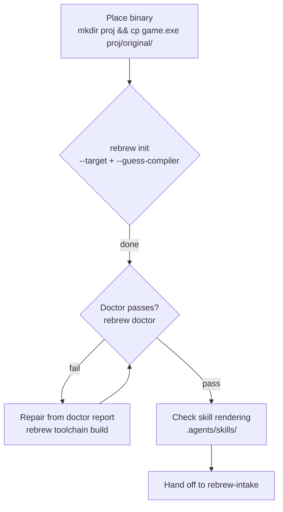

# Rebrew Init

Scaffold a new rebrew project from an empty directory and a target binary.

## When NOT to use this skill

- Binary onboarding into an existing project → use `rebrew-intake`
- Day-to-day reversing → use `rebrew-workflow`
- Deep matching → use `rebrew-matching`

Use this skill exactly once per new project. Re-run `rebrew init --refresh-agents` later to re-render the scaffold after template changes.

## Scaffold

```bash
mkdir <project> && cd <project>
mkdir original && cp /path/to/<binary> original/
rebrew init --target <name> --binary <filename> --guess-compiler
```

Target naming: the bare binary stem (`server.dll` → `server.dll`, `game.exe` → `game`). Keep the extension — targets are keyed by it elsewhere (`layout/bench/`, `src/bench/`).

## Profile selection

`--guess-compiler` detects from the binary (diec → PDB → heuristics) and is
right for standard builds. Override with `--toolchain <profile>` when:

- The binary is a rebuild or repack whose headers lie (guess follows the
  headers, not the codegen).
- You already know the exact toolchain (matching SP-level profile matters:
  `msvc-6.0-sp6` vs `msvc-6.0` is a different code generator).
- 16-bit DOS/NE binaries where the heuristic prefers wrong (see
  `docs/TOOLCHAIN.md` for the `watcom-2.0-win16` / `msvc-1.52` / `borland-3.1`
  decision tree).

```bash
rebrew init --target <name> --binary <filename> --toolchain <profile>
```

## Done-gate

```bash
rebrew doctor
```

`rebrew init` prints `next: rebrew doctor`. Doctor must report healthy
(warnings for unconfigured optionals — FLIRT, Ghidra, BinSync — are fine;
failures are not) before handing off. The commonest failure is the toolchain
image missing — fix with `rebrew toolchain build <profile>` (or `pull`).

## Skill rendering check

`rebrew init` renders the packaged skills (plus any `REBREW_SKILLS_DIR`
overlay) into `.agents/skills/`, substituting the target name. Verify the
render happened — `tests/test_skills_sync.py` pins the copy in this repo;
in a fresh project, `.agents/skills/` should list all six skills.

## Handoff

Scaffold done → `rebrew-intake` owns the binary from here (FLIRT scan,
catalog, triage). The handoff is one line: the target name and profile.
