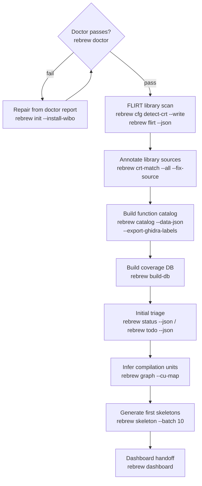

# Rebrew Intake

Onboard a new binary into a rebrew project and produce an initial assessment.

## When NOT to use this skill

- Day-to-day reversing on an already-onboarded target → use `rebrew-workflow`
- Adding a new function inside an existing target → use `rebrew-workflow`
- Deep matching for a single function → use `rebrew-matching`

Use this skill exactly once per new target. Re-run individual steps later if needed.

## Prerequisites

A `rebrew-project.toml` must exist with the new target configured. If starting from scratch:

```bash
rebrew init --target <name> --binary <filename> --guess-compiler   # auto-selects the profile from the binary
rebrew init --install-wibo            # fresh Linux/macOS setup: download wibo runner now
```

Then place the binary at the path specified in `rebrew-project.toml` (default: `original/<filename>`).

`rebrew init` creates `rebrew-project.toml`, `AGENTS.md`, `original/`, `src/<target>/`, and
empty `src/rebrew-function.toml` + `src/rebrew-data.toml` metadata files. Prefer
`--install-wibo` from a fresh environment so compiles run through wibo (a lightweight Win32
PE loader) instead of full Wine — it also writes `runner = "tools/wibo"` into the config.

### Multi-Target File Layout
When adding a new target that shares codebase with an existing target (e.g., adding `BETA10` to a `LEGO1`
project), you do not need to duplicate `.c` files. Add a second `// FUNCTION: BETA10 0x...` annotation block
above the same function body.

## Intake Procedure

### 0. Fast Path — `rebrew intake`

For a brand-new project directory, `rebrew intake <binary>` performs the whole
onboarding in one shot: toolchain detection → `rebrew init` with a matching
profile → copy binary → symlink vendored toolchain → rizin `functions.txt`
(`aaa`, `aap` fallback) → document every function (STUB .c + metadata blocker).
The result is a lint-clean project where every function is matched or
blocker-documented.  Use `--profile` to override the auto-detected profile,
`--dry-run` to preview.  Use the manual procedure below when you need to
customize a step.

### 0b. Identify the Toolchain First

Before anything else, determine the compiler family — it decides the whole
pipeline (MSVC6 vs MinGW GCC):

- `file <binary>` + section list: a `.buildid` section, GNU-style `0f 1f`
  multi-byte nops, and a `mov eax, N; call ___chkstk_ms` stack probe mean
  **MinGW GCC**, not MSVC.
- Imports: MSVC static-CRT binaries import KERNEL32 broadly (`GetCommandLineA`,
  `HeapCreate`, ...).  A standalone MinGW build imports only a handful
  (`ExitProcess`, `GetStdHandle`, `WriteFile`, ...) and FLIRT finds zero
  matches (no MSVC CRT).
- If MinGW: `rebrew init --compiler gcc-pe` (see `docs/TOOLCHAIN.md`).
  Function discovery needs `rizin -qc 'aa; aap; afl'` — `aaa` mis-merges
  functions on this toolchain.  Note that byte-exact matching requires the
  author's exact GCC version; old builds typically match structurally only
  (document the semantic decomp + blocker the byte delta).
- If MSVC: continue with FLIRT from `msvcrt.lib` **and** `libcmt.lib`
  (statically-linked CRT code only matches libcmt signatures).
- If a plain DOS MZ executable (`file` shows "MS-DOS executable, MZ"):
  **check for packing first** — `rebrew toolchain detect` reports
  `packed: lzexe 0.91` (or `packed: pklite` — PKWARE's compressor, also
  very common in the era) when the file is packed (very common for 1990s
  shareware; the visible code is only a decompressor stub, so
  discovery/detection see almost nothing until unpacked).  For LZEXE run
  `rebrew unpack-lzexe <binary>` first and analyze the unpacked file;
  PKLITE has no built-in unpacker — find an unpacked copy.  Borland Turbo C/C++ targets
  byte-match with the `tc16` profile (Turbo C++ 3.1) or `tc20` (Turbo C
  2.0 — the 1988/89-era compiler diec reports as "Borland C/C++ 1991";
  C89-strict, so skeletons use `/* */` markers); Open Watcom wcc16-built
  DOS targets use `watcom16`.  `rebrew init --guess-compiler` picks the
  profile automatically, and `rebrew discover-functions` runs the 16-bit
  capstone sweep over the MZ code region (rizin cannot analyze MZ) — the
  full unpack → init → discover → skeleton → test loop is verified
  end-to-end (see `tests/fixtures/tc16_hello_lzexe.exe`, packed with the
  original LZEXE.EXE).
- If 16-bit NE (Windows 3.x): `file <binary>` shows "NE version N for MS
  Windows 3.x".  `rebrew intake` handles it end-to-end — native NE parsing,
  the loader's linear sweep for function discovery (rizin cannot analyze
  NE), auto `format = "ne"` + `arch = "x86_16"`, and family detection from
  the Borland segment-marker convention (`delphi` vs MSVC-style).
  **MSVC-style NE byte-matches with the `msvc1.52` profile** (DOSBox
  CL.EXE → 16-bit OMF, parsed by `rebrew.matcher.omf16` — skifree16-class
  targets).  Borland *Delphi* NE remains unmatchable (ADR-001): `rebrew
  verify` short-circuits, `rebrew doctor` reports Delphi 1.0 toolchain
  readiness, and functions are documented as BLOCKER stubs for analysis
  only.  `rebrew.delphi16.compile_ne` can already compile 16-bit
  executables headless (the future matching foundation).  Borland *Turbo
  C/C++* DOS targets (plain MZ, e.g. 1990s shareware games) byte-match
  with the `tc16` profile (Turbo C++ 3.1) or `tc20` (Turbo C 2.0 — the
  earlier codegen generation; pick it when the binary is
  1988/89-era-built or `tc16` output drifts).  See
  `docs/TOOLCHAIN.md`.

### 1. Health Check — run `rebrew doctor` first

```bash
rebrew doctor                           # validate config, binary, toolchain, metadata
rebrew doctor --json                    # machine-readable per-check report
rebrew doctor --install-wibo            # auto-download wibo if Wine is unavailable
rebrew cfg list-targets                 # confirm target is configured
```

Run `rebrew doctor` before anything else. It checks that `rebrew-project.toml` parses, the
target binary loads, the compiler (CL.EXE) + runner (wine/wibo) are reachable, include/lib
paths exist, `flirt_sigs/` parses, and `rebrew-function.toml`/`rebrew-data.toml` exist.

- **Exit code is 1 if any check failed** — treat `fail` checks as blockers, not warnings.
- `--json` prints `{"target", "passed", "summary": {"pass","fail","warn"}, "checks": [{name, status, message, fix}]}`.
  Use it to decide what to fix: each `checks[].fix` contains the repair command.
- On Linux, `--install-wibo` downloads wibo (SHA256-verified from GitHub) and rewrites
  `runner = "tools/wibo"` in `rebrew-project.toml`.

Common failures and fixes:

- Config parse fails → run `rebrew init` in the project directory.
- "Target binary not found" → place the binary at the configured path.
- "CL.EXE not found" → fetch the MSVC6 toolchain into `tools/` (see `checks[].fix` for the URL).
- FLIRT signatures missing → generate from a `.lib` or drop `.sig` files into `flirt_sigs/`:

```bash
rebrew gen-flirt-pat toolchain/msvc/6.0-win32/VC98/Lib/msvcrt.lib --output flirt_sigs/msvcrt_vc6.pat
```

If the target is missing, add it (the binary must already exist, or pass `--force`):

```bash
rebrew cfg add-target <name> --binary original/<filename>
```

### 2. FLIRT Library Scan

Identify known library functions (MSVCRT, zlib, DirectX, etc.) to separate
library code from game code:

```bash
rebrew cfg detect-crt --write           # auto-detect and register CRT source dirs (required before crt-match)
rebrew flirt --json                     # scan binary against FLIRT signatures
rebrew crt-match --index --json         # verify CRT source directories are configured
rebrew crt-match --all --fix-source --json # auto-annotate SOURCE references for library functions
```

Without `rebrew cfg detect-crt`, `crt-match --all` finds zero matches because no CRT
source directories are registered in `rebrew-project.toml`.

- `rebrew flirt --json` prints `{signature_count, match_count, skipped_ambiguous, matches: [{va, size, names}]}`.
  Ambiguous hits (>N candidate names) are skipped by default and listed in `ambiguous_matches`.
- Use `matches[].names` to identify library code, and `crt-match --all --fix-source` to record
  `// SOURCE:` references for confirmed matches. `crt-match --index` alone just shows the index.

Library matches are fast wins — they can be skeletonized and matched quickly
since the original source is often available.

### 3. Build Function Catalog + Coverage DB

```bash
rebrew catalog --data-json              # write db/data_<target>.json
rebrew catalog --export-ghidra-labels   # write ghidra_data_labels.json (switch tables etc.)
rebrew catalog --fix-sizes              # backfill SIZE in rebrew-function.toml from catalog
rebrew build-db                         # build SQLite coverage database (db/coverage.db)
```

- `catalog --data-json` scans reversed sources + the function list into `db/data_<target>.json`;
  it also writes `src/<target>/function_structure.json` from `functions.txt` when no Ghidra
  export exists (skeleton generation needs one of the two).
- `--export-ghidra-labels` writes `src/<target>/ghidra_data_labels.json` (data cells, switch
  tables) for labeling non-function addresses in Ghidra.
- `--fix-sizes` edits metadata in place — it prompts interactively, so pass `--force` when
  scripting or in `--json` mode (`--json` without `--force` errors out).
- `build-db` aggregates every `db/data_*.json` into `db/coverage.db` and regenerates
  `CATALOG.md`. On a schema mismatch it refuses unless `--force` is passed (deletes + rebuilds).

### 4. Initial Triage

```bash
rebrew status --json                    # high-level overview: STATUS counts, % coverage
rebrew todo --json                      # prioritized action items
rebrew data --dispatch --json           # detect dispatch tables / vtables
```

- `status --json` → `{functions: {total, covered}, status: {EXACT, RELOC, PROVEN, NEAR_MATCHING, STUB}, coverage_pct, matched_pct, ...}`.
- `todo --json` → ranked `items[]`; each item carries a ready-to-run `command` field
  (e.g. `rebrew skeleton 0x...`, `rebrew diff 0x...`) — use those commands directly.
  Filter with `-c <category>` (e.g. `fix-delta`, `start-function`).
- `data --dispatch --json` → JSON array of dispatch tables `[{va, section, entries: [{target_va, name, status}]}]`
  (requires the target binary).

### 5. Infer Compilation Units

Identify which functions were likely compiled from the same source file:

```bash
rebrew graph --cu-map --json            # cluster functions into inferred translation units
```

This uses inter-function gap analysis and call-graph signals to group contiguous functions.
`--json` → `{total_functions, clustered_functions, total_clusters, clusters, unclustered}`.
High-confidence clusters suggest functions that should be merged into the same `.c` file.

### 6. Assess Scope

From the triage output, evaluate:

- **Total functions** and size distribution
- **Library vs game code ratio** (from FLIRT matches)
- **Quick wins**: small functions, leaf functions, known library matches
- **Blockers**: large functions, functions with many dependencies

### 7. Extract Disassembly (Optional)

```bash
rebrew extract list                     # list un-reversed candidates
rebrew extract batch 20                 # extract first 20 smallest
```

### 8. Generate First Skeletons

Start with the easiest functions identified by triage:

```bash
rebrew todo --json                      # get recommended functions to start
rebrew skeleton --batch 10              # generate 10 skeletons (smallest first)
rebrew skeleton 0x<VA>                  # generate one skeleton by VA
rebrew skeleton 0x<VA> --decomp         # include decompilation in skeleton
rebrew skeleton 0x<VA> --decomp --decomp-backend ghidra  # Ghidra via MCP
rebrew skeleton 0x<VA> --xrefs          # with caller context from Ghidra
```

`--batch N` picks the N smallest eligible functions first. `--decomp` requires a reachable
decompiler (`--decomp-backend`: `auto`, `r2ghidra`, `r2dec`, `ghidra`; default `auto`).

For library functions identified by FLIRT, check if reference source is available
(e.g. `toolchain/msvc/6.0-win32/VC98/CRT/SRC/` for MSVCRT, `references/zlib-1.1.3/` for zlib).

### 9. Sync to Ghidra (Optional)

If a Ghidra instance is available with ReVa MCP:

```bash
rebrew sync --push                      # push annotations + FLIRT labels to Ghidra
```

`--push` exports and applies in one step (also supports the `ghidra_backend = "cli"` config
option). `--sync-sizes` additionally pushes corrected function sizes; `--sync-data` (default
on) pushes `// DATA:` / `// GLOBAL:` labels.

### 10. Coverage Dashboard — the handoff

```bash
rebrew build-db                         # refresh db/coverage.db after any changes
rebrew dashboard                        # serve read-only web dashboard on http://127.0.0.1:8000
```

`rebrew dashboard` serves the coverage database — targets, per-status counts, function search,
per-section cell stats, globals, and status-change history — at `http://127.0.0.1:8000`
(`--port` to change). It is read-only, so it is safe to leave running.

The dashboard is the handoff to the reversing loop. As reversing proceeds, `rebrew verify`
(writes `db/verify_results.json` by default) plus the next `rebrew build-db` import each
function's byte delta into the DB's `verify_results` table, so the dashboard stays current.

## Summary Checklist

```
Intake Progress:
- [ ] Binary placed at configured path
- [ ] rebrew doctor passes (config, binary, compiler, metadata)
- [ ] rebrew cfg confirms target
- [ ] CRT source dirs detected (rebrew cfg detect-crt --write)
- [ ] FLIRT scan complete (rebrew flirt --json)
- [ ] Catalog + coverage DB built (rebrew catalog --data-json && rebrew build-db)
- [ ] Ghidra data labels exported (rebrew catalog --export-ghidra-labels)
- [ ] SIZE backfilled (rebrew catalog --fix-sizes)
- [ ] Status + triage reviewed (rebrew status / rebrew todo)
- [ ] Compilation units inferred (rebrew graph --cu-map)
- [ ] First skeletons generated
- [ ] Ghidra synced (if available)
- [ ] Dashboard served (rebrew dashboard) — handoff ready
```

After intake completes, hand off to the `rebrew-workflow` skill for the iterative reversing loop.
