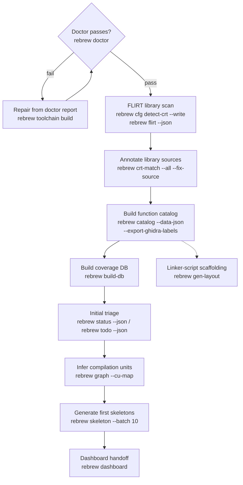

# Rebrew Intake

Onboard a new binary into a rebrew project and produce an initial assessment.

## When NOT to use this skill

- Day-to-day reversing on an already-onboarded target → use `rebrew-workflow`
- Adding a new function inside an existing target → use `rebrew-workflow`
- Deep matching for a single function → use `rebrew-matching`

Use this skill exactly once per new target. Re-run individual steps later if needed.

## Prerequisites

A `rebrew-project.toml` must exist with the new target configured. If starting from scratch:

```bash
rebrew init --target <name> --binary <filename> --guess-compiler   # auto-selects the profile from the binary
rebrew toolchain build <profile>      # fetch the profile's docker image (wibo/host-wine are gone: docker-only)
```

## Linker-script scaffolding (optional, after the catalog)

```bash
rebrew gen-layout --target <name>
```

Writes `src/bench/bench.def`, `src/bench/crt_region/crt_imports.c`, and
`layout/bench/` (text-only `rebrew-layout.toml` + hex dumps). Then
`rebrew postlink <built.dll> --layout layout/bench` can converge without the
original DLL present. Keep `layout/` in VCS.

Place the binary at the configured path (default `original/<filename>`).
`rebrew init` creates project dirs + empty metadata TOMLs. Shipped toolchains
are docker-only (`rebrew toolchain build <profile>`); `--install-wibo` is ignored
for image-backed profiles.

### Multi-Target File Layout
When adding a target that shares code with an existing one, add a second
`// FUNCTION: BETA10 0x...` marker above the same body — do not duplicate `.c` files.

## Intake Procedure

### 0. Fast Path — `rebrew intake`

For a brand-new project directory, `rebrew intake <binary>` performs the whole
onboarding in one shot: toolchain detection → `rebrew init` with a matching
profile → copy binary → optional symlink of the vendored toolchain tree into
`tools/` (build-source nicety; compile still uses the docker image) →
discoverer-plugin enumeration → document every function (STUB .c + metadata
blocker).
The result is a lint-clean project where every function is matched or
blocker-documented.  Use `--toolchain` to override the auto-detected profile,
`--dry-run` to preview.  Use the manual procedure below when you need to
customize a step.

### 0b. Identify the Toolchain First

Before FLIRT/catalog, determine the compiler family (MSVC vs MinGW vs DOS MZ vs NE).
Decision tree, packing (LZEXE/PKLITE), and profile picks:
`references/toolchain-id.md`. Prefer `rebrew init --guess-compiler` /
`rebrew intake`; override with `--toolchain` when headers lie.

### 0c–0d. Optional recon

Fingerprints, `pe-info`, crypto-scan, and source `security-scan` are optional
before triage — see `references/binary-recon.md`.

```bash
rebrew doctor                           # validate config, binary, toolchain, metadata
rebrew doctor --json                    # machine-readable per-check report
rebrew toolchain build <profile>        # fetch the profile's docker image when the toolchain check fails
rebrew cfg list-targets                 # confirm target is configured
```

Exit 1 on any `fail`. `--json` → `checks[].fix` repair commands. Missing image →
`rebrew toolchain build <profile>`. Config fail → `rebrew init`. Missing binary →
place at configured path. Missing FLIRT →:

```bash
rebrew gen-flirt-pat toolchain/msvc/6.0-win32/source/VC98/Lib/msvcrt.lib --output flirt_sigs/msvcrt_vc6.pat
rebrew cfg add-target <name> --binary original/<filename>   # or --force if binary absent
```

### 2. FLIRT Library Scan

Identify known library functions (MSVCRT, zlib, DirectX, etc.) to separate
library code from game code:

```bash
rebrew cfg detect-crt --write           # auto-detect and register CRT source dirs (required before crt-match)
rebrew flirt --json                     # scan binary against FLIRT signatures
rebrew crt-match --index --json         # verify CRT source directories are configured
rebrew crt-match --all --fix-source --json # auto-annotate SOURCE references for library functions
```

Needs `cfg detect-crt` first or `crt-match --all` finds nothing. FLIRT JSON:
`matches[].names`; ambiguous hits in `ambiguous_matches`. Use
`crt-match --all --fix-source` for `// SOURCE:` on confirmed library hits.

### 3. Build Function Catalog + Coverage DB

```bash
rebrew catalog --data-json              # write db/data_bench.json
rebrew catalog --export-ghidra-labels   # write ghidra_data_labels.json (switch tables etc.)
rebrew catalog --fix-sizes              # backfill SIZE in rebrew-functions.toml from catalog
rebrew build-db                         # build SQLite coverage database (db/coverage.db)
```

`--data-json` → `db/data_bench.json` (+ `function_structure.json` when no Ghidra
export). `--fix-sizes` prompts unless `--force` (required with `--json`).
`build-db` needs `--force` to rebuild on schema mismatch.

### 4. Initial Triage

```bash
rebrew status --json                    # high-level overview: STATUS counts, % coverage
rebrew todo --json                      # prioritized action items
rebrew data --dispatch --json           # detect dispatch tables / vtables
```

- `status --json` → `{functions: {total, covered}, status: {EXACT, RELOC, PROVEN, NEAR_MATCHING, STUB}, coverage_pct, matched_pct, ...}`.
- `todo --json` → ranked `items[]`; each item carries a ready-to-run `command` field
  (e.g. `rebrew skeleton 0x...`, `rebrew diff 0x...`) — use those commands directly.
  Filter with `-c <category>` (e.g. `fix-delta`, `start-function`).
- `data --dispatch --json` → JSON array of dispatch tables `[{va, section, entries: [{target_va, name, status}]}]`
  (requires the target binary).

### 5. Infer Compilation Units

Identify which functions were likely compiled from the same source file:

```bash
rebrew graph --cu-map --json            # cluster functions into inferred translation units
```

This uses inter-function gap analysis and call-graph signals to group contiguous functions.
`--json` → `{total_functions, clustered_functions, total_clusters, clusters, unclustered}`.
High-confidence clusters suggest functions that should be merged into the same `.c` file.

### 6. Assess Scope

From the triage output, evaluate:

- **Total functions** and size distribution
- **Library vs game code ratio** (from FLIRT matches)
- **Quick wins**: small functions, leaf functions, known library matches
- **Blockers**: large functions, functions with many dependencies

### 7. Extract Disassembly (Optional)

```bash
rebrew extract list                     # list un-reversed candidates
rebrew extract batch 20                 # extract first 20 smallest
```

### 8. Generate First Skeletons

Start with the easiest functions identified by triage:

```bash
rebrew todo --json                      # get recommended functions to start
rebrew skeleton --batch 10              # generate 10 skeletons (smallest first)
rebrew skeleton 0x<VA>                  # generate one skeleton by VA
rebrew skeleton 0x<VA> --decomp         # include decompilation in skeleton
rebrew skeleton 0x<VA> --decomp --decomp-backend ghidra  # Ghidra via MCP
rebrew skeleton 0x<VA> --xrefs          # with caller context from Ghidra
```

`--batch N` picks the N smallest eligible functions first. `--decomp` requires a reachable
decompiler (`--decomp-backend`: `auto`, `r2ghidra`, `r2dec`, `ghidra`; default `auto`).

For library functions identified by FLIRT, check if reference source is available
(e.g. `toolchain/msvc/6.0-win32/source/VC98/CRT/SRC/` for MSVCRT, `references/zlib-1.1.3/` for zlib).

### 9. Sync to Ghidra (Optional)

If a Ghidra instance is available with ReVa MCP:

```bash
rebrew sync --push --state-dir <dir>      # export annotations to the BinSync state dir
```

`--push` exports to the state dir; `--pull --state-dir <dir>` imports it back
(conflicts via `--accept-binsync` / `--accept-local`). MCP structural ops
(`--create-functions`, `--bookmarks`, `--pull-data`) still need ReVa.

### 10. Coverage Dashboard — the handoff

```bash
rebrew build-db                         # refresh db/coverage.db after any changes
rebrew dashboard                        # read-only coverage UI (http://127.0.0.1:8000)
```

`rebrew dashboard` serves the coverage DB (targets, status counts, search, globals,
history). It blocks the shell until stopped — run it only when the user wants the
UI handoff; do not leave it running unattended. `--port` changes the bind port.

## Summary Checklist

Binary placed → `doctor` pass → `cfg detect-crt --write` → `flirt --json` →
`catalog --data-json` + `--export-ghidra-labels` + `--fix-sizes` → `build-db` →
`status`/`todo` → `graph --cu-map` → first skeletons → optional Ghidra sync →
optional `dashboard` handoff. Then switch to `rebrew-workflow`.
