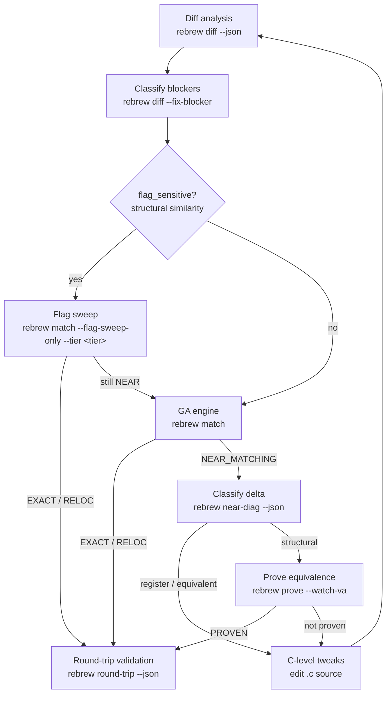

# Rebrew Matching

Deep dive into diff analysis and the GA engine.
For the overall reversing workflow, see the `rebrew-workflow` skill.

## When NOT to use this skill

- Picking which function to work on → use `rebrew-workflow` (`rebrew todo`)
- Generating skeletons / editing source / verifying STATUS → use `rebrew-workflow`
- Fixing missing globals / `~~` diffs caused by BSS gaps → use `rebrew-data-analysis`

## 1. Diff Analysis (Always Start Here)

```bash
rebrew diff src/bench/<file>.c --json         # structured diff + structural similarity
rebrew diff src/bench/<file>.c -m --json      # mismatches only (** lines)
rebrew diff src/bench/<file>.c -r --json      # register-aware (mark RR encoding diffs)
rebrew diff src/bench/<file>.c --format csv   # CSV for spreadsheet analysis
rebrew diff 0x10009310 --json                    # resolve a VA directly (no .c path needed)
```

> **VA on a multi-function file**: `rebrew diff/match/prove/test 0x<va>` targets the
> annotation whose VA matches, NOT the first function in the file. When the
> resolved file covers a different function than the VA, the tool errors out
> instead of silently diffing the wrong bytes.

### Diff Markers

- `==` identical bytes
- `~~` relocation difference (acceptable — counts as RELOC)
- `RR` register encoding difference (only with `-r` / `--register-aware`)
- `**` structural difference (needs fixing)
- `XX` invalid relocation difference (wrong target VA — counts as MISMATCH)

If the diff shows only `~~` lines, the function is already RELOC — `rebrew test` will promote it.

Exit codes: `0` = no structural differences (EXACT/RELOC), `1` = structural `**` lines
found (fix them), `2` = build error. With `--json`, read `summary.exact / summary.reloc /
summary.reg / summary.structural` instead of parsing lines.

### How Relocations are Scored
Rebrew parses the COFF object's relocation and symbol tables. It resolves symbols against
the Data Catalog to find their intended VAs.
- `~~` means the relocation points to the correct global variable.
- `XX` means it points to the wrong variable (forces MISMATCH).
Use `-r` / `--register-aware` to see if remaining `**` diffs are register allocation differences.

### Auto-Classified Blockers

`rebrew diff` auto-classifies systemic compiler differences from `**` / `RR` lines
(e.g. "register allocation", "loop rotation / branch layout", "stack frame choice").
Use `--fix-blocker` to auto-write these to the `rebrew-function.toml` metadata file:

```bash
rebrew diff --fix-blocker src/bench/<file>.c        # auto-write BLOCKER to metadata file
rebrew diff --fix-blocker --json src/bench/<file>.c # with JSON output
# Ad-hoc BLOCKERs that diff cannot classify (needs structs, SEH helper, etc.):
rebrew blocker set src/bench/<file>.c "needs RE structs -- see struct_recover"
rebrew blocker clear src/bench/<file>.c
```

When no structural diffs remain, `--fix-blocker` clears existing BLOCKER/BLOCKER_DELTA.
**Never hand-edit `rebrew-function.toml` for BLOCKER — use `rebrew blocker set/clear` or the `--fix-blocker` writers.**

Use this to quickly rule out structural issues before running the GA.

## 2. GA Engine (Single File)

For automated matching when manual tuning and diffs are insufficient:

```bash
rebrew match src/bench/<file>.c --generations 200 --pop-size 64 -j 16
```

- `-g / --generations N` — GA generations (default: 100)
- `-p / --pop-size N` — population size (default: 64)
- `-j / --jobs N` — parallel compilation jobs (default: from config)
- `--seed N` — RNG seed for reproducibility
- `--extra-seed FILE` — additional `.c` file(s) to seed initial population
- `--no-seed` — disable cross-function solution seeding
- `--mutation-focus register|equivalent|structural|auto` — bias mutation
  selection toward a near-diag category (its suggested operators get 6x
  weight). `auto` reads the function's BLOCKER metadata for the category
  (single-function only). Use it after `near-diag --fix-blocker`: the
  blocker names the category, the GA then samples its operators more often.
- `--seed-from-solved / --no-seed-from-solved` — seed from solutions DB (default on)
- `--out-dir DIR` — output directory (default: `output/ga_runs`)
- `--compare-obj / --no-compare-obj` — use object-level comparison
- `--ignore-lint` — continue even if annotation linter finds errors
- `--collect-pairs FILE` — record `(source, binary)` pairs for ML training

The GA mutates C source (variable types, casts, loop structures) and scores
each variant against the target bytes. Best source is written to `best.c` in
`--out-dir` (default `output/ga_runs/<relpath>/`) and, when it beats the current
source, back into the `.c` file itself.

Exit codes: `0` = match found (EXACT or RELOC), `1` = no match (structural diffs
remain — see §8), `2` = build or config error. `--out-dir` applies to
single-function mode only; batch mode always writes to `output/ga_runs` and
errors if you pass it.

## 3. Flag Sweep

When diff shows `flag_sensitive: true`, try compiler flag combinations before running the GA:

```bash
rebrew match src/bench/<file>.c --flag-sweep-only                      # targeted tier (default)
rebrew match src/bench/<file>.c --flag-sweep-only --tier quick         # 192 combos, < 1 min
rebrew match src/bench/<file>.c --flag-sweep-only --tier targeted      # 1,152 combos, adds /Oy /Op
rebrew match src/bench/<file>.c --flag-sweep-only --tier normal        # 5,376 combos, adds /ML-/MTd
rebrew match src/bench/<file>.c --flag-sweep-only --tier thorough      # 258k combos, ~15–60 min
rebrew match src/bench/<file>.c --flag-sweep-only --tier full          # 6.2M combos, hours
rebrew match --all --flag-sweep                                           # batch: all NEAR_MATCHING
rebrew match --all --flag-sweep --fix-cflags                              # auto-update CFLAGS on hit
rebrew match --all --sweep-then-ga                                        # sweep flags, then GA with best flags
rebrew match --all --sweep-then-ga --skip-recent 24                       # resume: skip stubs GA-run in last 24h
```

The sweep axes are per-profile: `msvc6/msvc7` (decomp.me-synced `/` flags),
`watcom`/`watcom16` (wcc386/wcc `-os/-ot/-ol/-ox`, `-3..-6`, `-zp`,
`-mf/-fpc` — quick=5, targeted=25), `msvc1.52` (16-bit `/O`, `/G2/G3`,
`/Aw/Au`, `/Gs`/`/Za` — quick=5, targeted=15), `tc16`/`borlandc55`
(Borland `-O1/-O2/-Od`, `-K`, `-Z` — quick=4).  The compiler itself comes
from the toolchain abstraction (`rebrew.toolchain`): docker image first
(`rebrew toolchain pull <profile>`), vendored `tools/` binary fallback —
see `docs/TOOLCHAIN.md`.

**Read the codegen to pick the flag direction before sweeping** (validated on a
fresh MSVC6 C++ project): the target's instruction choices reveal the original
optimization level, so try `/O2` (or `/O1`) manually first instead of a blind
sweep:

- `mov eax, [mem]` + `push eax` (or first global load into ECX/EDX instead of
  EAX) → **/O2-style** scheduling; `/O1` would emit `push [mem]` or `mov eax`.
- `push dword ptr [mem]`, `inc word ptr [mem]` (direct memory inc) → **/O1**.
- `mov eax, 1` vs the 3-byte `push 1; pop eax` → /O2 vs /O1 return constant.
- Zeroing a global: `and dword ptr [mem], 0` (7B) is the /O1 size form; `/O2` emits `mov dword ptr [mem], 0` (10B).
- Arg cleanup after a cdecl call: `add esp, 4` (/O2) vs `pop ecx` (/O1); a `pop ecx; pop ecx` pair after a call can mean a 2-arg cdecl cleanup.
- `rep stosd`/`repne scasb` string ops with `push N; pop ecx` count setup mean the **/O1 + /Oi** combo (size-optimized + intrinsics) — try cflags `/O1 /Oi /Gd /Oy`. Constant-size `memset` under /Oi inlines to the rep-stos form (a trailing single `stosb` after `rep stosd` means the size is a non-multiple-of-4, or a merged adjacent byte write).
- `shr` (logical) vs `sar` (arithmetic) on a shift → unsigned vs signed index;
  a `(x >> N) * 4` that compiled to `sar 0xb; and -4` instead of `shr 0xd` +
  scale-4 addressing means the source indexed an `int*` array, not a shifted
  multiply.
- Imported functions must be `__declspec(dllimport)` (declspec FIRST for MSVC6)
  or the compiler emits a direct `e8` call instead of the target's 6-byte
  `ff 15 [IAT]` — shifting every later branch offset by one.
- `__int64` returns use the EDX:EAX pair; virtual calls with a pushed arg are
  `__stdcall` (no `add esp,4` after the call).
- **Post-decrement loops**: `mov r1, r2; dec r2; test r1; jcc` is the
  `while (x-- > 0)` idiom — write the decrement IN the condition, not at the
  loop bottom. `jne` (not `jg`) after the post-decrement test means the C is
  `while (m-- != 0)`; a `je` guard (not `jle`) means `if (n != 0)`.
- **`movsx reg, byte ptr [mem]`** when passing a char to a function → the
  callee's parameter is `int`, not `char` (declare it int or the call site
  emits a plain 8-bit move).
- **`test ax, imm16` / `and al, imm8` on a 32-bit field** — MSVC6's mask-size
  optimization; a C `& 0xfd` may compile to the byte form in the target but
  the dword form from a re-written source — often unreproducible from
  cast-derefs; try `unsigned short` field types before giving up.
- **Param-slot spills**: `mov [esp+X], al` (storing a masked value back into
  the parameter slot, then reloading + `and eax, 0xff` for a table index)
  comes from reassigning the parameter or from MSVC reusing the dead param
  slot for an out-parameter local (e.g. `int used = 0; ... &used` reusing
  `out`'s slot when `out` dies before the call).

When the manual flag guess lands you within a few bytes, the remaining diffs
are usually expression shape (member held in a local vs re-read global, control
flow placement like `obj = 0` inside vs outside the `if`) — iterate those
before reaching for the GA.

**Known unreproducible codegen** — recognize these up front and document a
blocker instead of burning attempts (validated across smygb.exe + e2e_32.exe):

- CRT assembly routines: `strlen`/`strcpy` word-at-a-time (magic constant
  `0x7efefeff`), `strrchr` (repne scasb + `std`), `_chkstk` (the
  `sub 0x1000; test [ecx], eax` probe loop), `_aulldiv`/`_aullrem` 64-bit
  div/rem (div/rcr normalization). MSVC6 *calls* the library versions from C
  (`#pragma intrinsic` still emits a call) — the inline forms are asm.
- SEH prologues: `push -1; push handler; push ...; mov reg, fs:[0]` /
  `push -2; push handler; push fs:[0]` (`__try/__finally`) and the
  RtlUnwind helper (`push ebp; push 0; push 0; push handler; push arg;
  call [RtlUnwind thunk]`) — compiler-generated.
- Caller-ebp helpers: `mov reg, [ebp+8]` with no own frame + `ret 4` —
  exception-frame helpers.
- Direct-memory increments: `inc word/dword ptr [abs]` from a cast-deref —
  MSVC6 always emits load-inc-store for `(*(T*)0xADDR)++` (all spellings and
  volatile); the direct form needs a declared global symbol, which can't be
  byte-matched. Same for `inc dword ptr [abs]`.
- HeapCreate-style arg push order: `push 0; cmp [esp+8]; push 0x1000;
  sete al; push eax` vs MSVC6's `cmp [esp+4]; sete; push eax; push 0x1000;
  push 0` — unreproducible from any C shape.
- `memset` intrinsic expansion variant: the alignment+replication form is
  build-specific; our MSVC6 may emit a different (rep stosb tail) form.
- Register-scheduling diffs (the big class): the first-global load register
  (`mov eax,[g]` vs `mov ecx,[g]`), a callee-saved cache (esi) vs stack
  reload, `movzx` vs `xor eax,eax;mov al,[mem]` zero-extension, `and`-before-
  `sar` ordering, branch-layout (which path is fall-through), and
  frame-elimination (esp-relative locals vs ebp frame). 2–3 C formulations
  then document.

For each blocker, write the STUB `.c` (SIZE from the function list) and record
the class via `update_field(metadata_dir, va, 'blocker', note, module=...)` —
the goal-counting treats blocker-documented functions as complete.

Tiers (combinations are for MSVC6; see [FLAG_SWEEP_TIERS.md](../../../../docs/FLAG_SWEEP_TIERS.md)):

| Tier | Combinations | When to use |
|------|-------------|-------------|
| `quick` | 192 | First pass on a new STUB |
| `targeted` | 1,152 | Default tier; when `quick` is close but not EXACT |
| `normal` | 5,376 | Good general-purpose sweep |
| `thorough` | 258,048 | Near-match persists after `normal` |
| `full` | 6,193,152 | Last resort; combine with `--sample N` |

### Batch GA Mode (`--all`)

```bash
rebrew match --all --near-miss                            # only run on near-misses
rebrew match --all --improve                              # try to improve any non-EXACT
rebrew match --all --threshold 8                          # only target functions ≤8 byte delta
rebrew match --all --max-stubs 10                         # cap how many stubs to attempt
rebrew match --all --min-size 32 --max-size 512           # filter by target function size
rebrew match --all --filter "MyClass::"                   # substring match on symbol names
rebrew match --all --timeout-min 5                        # per-function wall-clock budget
rebrew match --all --dry-run                              # plan without compiling
rebrew match --ga-history                                 # show past GA runs (.rebrew/ga_runs.jsonl)
rebrew match --ga-history --json                          # same, machine-readable
```

Before launching a long batch, run `--ga-history` to see how many past runs
converged (total / matched % / avg & best score) — it tells you whether GA has
already plateaued on these stubs. `--skip-recent N` drops stubs with a GA run
record in the last N hours, so you can resume an interrupted batch without
re-attempting finished work. `--seed-from-solved` (default on) seeds the
population from similar solved functions; pass `--no-seed-from-solved` to
disable.

## 4. Scoring (lower = better)

| Component | Weight | Measures |
|-----------|--------|----------|
| Length penalty | 3.0 | `abs(candidate_size - target_size)` |
| Weighted byte similarity | 1000.0 | Position-weighted, prologue 3x |
| Relocation-aware similarity | 500.0 | After masking relocatable fields |
| Mnemonic similarity | 200.0 | Via capstone disassembly |
| Prologue bonus | -100.0 | If first 20 bytes match |

## 5. Structural Similarity Metric

`rebrew diff` outputs a structural similarity breakdown:

```
Structural similarity (flags unlikely to help):
  Instructions: 12 exact, 3 reloc, 2 register, 1 structural (of 18 total)
  Mnemonic match: 94.4%  |  Structural ratio: 5.6%
```

With `--json`, the output includes a `structural_similarity` object:
- `mnemonic_match_ratio`: how similar the mnemonic sequences are (1.0 = identical)
- `structural_ratio`: fraction of instructions with real structural diffs
- `flag_sensitive`: `true` when flag sweeping may help

Use this to quickly rule out flag-based solutions before spending time on sweeps:
`flag_sensitive: false` means flag sweeping won't help — go straight to the GA or
`rebrew prove`. A high `mnemonic_match_ratio` with low `structural_ratio` means the
code is semantically close and C-level tweaks (or `rebrew near-diag`) may finish
the job.

## 6. Blocker Tracking

When a function is NEAR_MATCHING but not byte-perfect, blockers live in the `rebrew-function.toml` metadata file (managed programmatically — never hand-edit):

```toml
["SERVER.0x<VA>"]
blocker = "register allocation, jump condition swap"
blocker_delta = 3
```

Set them via `rebrew blocker set <file|0xVA> "<reason>" [--delta N]` (and `rebrew blocker clear` to remove).
Use `rebrew diff --fix-blocker` / `rebrew near-diag --fix-blocker` to auto-generate from classification.

## 7. Tips

- Always start with `rebrew diff` before running the GA.
- For library-origin functions (MSVCRT, ZLIB), use `rebrew crt-match` to identify the reference source first.
- Common CFLAGS presets: `/O2 /Gd` (GAME), `/O1 /Gd` (MSVCRT).
- If a function remains NEAR_MATCHING after GA and blockers are structural, use `rebrew prove`.
- While iterating on a single function, `--watch` (on `diff`, `prove`, or `match`) re-runs on every
  file save — faster than re-typing the command.

## 8. Symbolic Equivalence Proving

When stuck at NEAR_MATCHING due to structural differences (register allocation, instruction reordering,
loop unrolling), first classify the delta, then use `rebrew prove` to mathematically prove semantic
equivalence:

> **Register-gap functions are prime PROVEN candidates.** A verdict of
> `REGISTER (N% of delta)` means the bytes differ only by register
> allocation — semantically identical. `rebrew prove` establishes EAX
> equivalence directly, promoting to PROVEN *without* fighting the bytes.
> Run `rebrew prove --all` on the project's NEAR_MATCHING set first (smygb:
> 7/7 promoted, NEAR_MATCHING → 0); a "no terminal states" failure usually
> means a loop — retry the function with `--loop-bound 50 --timeout 120`
> before giving up. Only functions that still fail (float-heavy bodies) need
> the GA or manual work.

```bash
rebrew near-diag src/bench/<file>.c --json    # classify the delta: register/equivalent/reloc/structural
rebrew near-diag src/bench/<file>.c --fix-blocker   # ...and document the verdict as BLOCKER
rebrew near-diag --all --fix-blocker --json      # batch: classify + document EVERY NEAR_MATCHING
rebrew prove src/bench/<file>.c --json                 # prove and update STATUS → PROVEN
rebrew prove src/bench/<file>.c --dry-run --json       # preview without updating
rebrew prove src/bench/<file>.c --timeout 120 --json   # allow 2 min for complex funcs
rebrew prove src/bench/<file>.c --loop-bound 50        # raise LoopSeer ceiling (default 10)
rebrew prove my_func --start-offset 0 --end-offset 48     # prove only a byte slice of the function
rebrew prove --all --json                                 # batch: prove every NEAR_MATCHING function
rebrew prove my_func --json                               # find by symbol name
rebrew prove my_func --check-edx --json                   # also compare EDX (64-bit return)
rebrew prove my_func --watch-va 0x10123456 --json         # also compare memory at a watched VA
```

`near-diag` buckets the mismatching bytes — register-alloc and equivalent-selection deltas are usually
solvable via C-level tweaks; a structural verdict points at block/loop layout, where `rebrew prove`
(register + watched-VA memory equivalence) is the right tool. With `--json`, read `categories`
(byte count per bucket: `register` / `equivalent` / `reloc` / `structural`) and `verdict` (dominant
category + share, e.g. `STRUCTURAL (70% of delta)`). Relocation sites are masked only when they
validate against the target's name→VA catalog (the same DIR32/REL32 check as `rebrew test` /
`rebrew verify`) — an invalid reloc (wrong call target / global address) surfaces as real
`structural` bytes, and a RELOC-dominant verdict with leftover structural bytes says
"NEAR_MATCHING-level, not RELOC". `--all` runs the same pipeline over every
NEAR_MATCHING function in the project (per-function failures are recorded, not fatal), and
`--fix-blocker` writes each verdict as `BLOCKER` metadata (including the top GA mutations to
try next) — the classify → document loop for a whole project in one command.

How it works:
1. Extracts target bytes from the DLL and compiles the C source to an .obj
2. Loads both byte blobs into angr's symbolic execution engine
3. Parses the C function definition for calling convention and argument setup
4. Hooks external call relocations with `ReturnUnconstrained`
5. Runs LoopSeer-bounded symbolic execution on both
6. Compares EAX (and optionally EDX) via Z3 — if no input can distinguish them, PROVEN

**64-bit returns and EDX**: Functions that return `long long`, `__int64`, `int64_t`, or
`uint64_t` use the EDX:EAX register pair (high 32 bits in EDX, low 32 bits in EAX). Pass
`--check-edx` to include EDX in the comparison. When the function's `PROTOTYPE` annotation
declares one of the above return types, EDX checking is **auto-enabled** — no flag needed.
Use `--check-edx` to force it even when the prototype heuristic does not trigger.

Requirements:
- angr must be installed: `uv sync --all-extras` (the documented dev install includes the prove extra)
- Function must have STATUS: NEAR_MATCHING

Limitations:
- Floating-point heavy functions may not prove (Z3 struggles with x87/SSE)
- Complex loops may cause timeout (raise `--timeout` or `--loop-bound`)
- Never produces false positives — if it can't prove, STATUS stays NEAR_MATCHING
- Use `--start-offset`/`--end-offset` to prove tail-call or partial-block equivalence
- Memory side-effect checking is implemented via `--watch-va` (repeatable) or
  `prove_constraints.watched_vas` metadata: the first 4 bytes at each watched
  address are compared between the original and compiled executions; an address
  mapped on only one side counts as a difference. Keep the watched set small
  (<10) to avoid Z3 blowup. Gotcha: `--watch-va` values are **decimal unless
  `0x`-prefixed** — unlike most other rebrew tools, bare digits are NOT hex
  (use `0x10123456`, not `10123456`)

## 9. End-to-End Round-Trip

After `rebrew verify` reports all EXACT/RELOC, run round-trip to confirm
the matches actually splice back into a byte-identical PE:

```bash
rebrew round-trip --json                     # full splice validation
rebrew round-trip --json --dry-run           # preview the splice set
rebrew round-trip --json --filter "MyClass::"  # scope to a symbol substring
rebrew round-trip --json --strict-catalog    # exit non-zero on unresolved catalog symbols
```

Writes `<binary>.reasm` next to the target and exits non-zero on any mismatch.
Report keys to inspect: `spliced`, `mismatches` (each with a `reason` —
`compile_drift` vs `catalog_resolution_drift`), `skipped_catalog`, `skipped_proven`.

- Relocation targets the catalog can't resolve by name fall back to three
  round-trip-specific lookups: Ghidra auto-names with hex VAs (`_g_1003546c`),
  MSVC `$L<N>` / `$cleanup_loop$<N>` jump-table labels mapped from the compiled
  .obj's own layout, and string literals whose compiled copy is a strict prefix
  of the target's. A wrong fallback surfaces as a `catalog_resolution_drift`
  mismatch — never silent corruption.
- PROVEN functions are deliberately skipped (`skipped_proven`): their bytes
  differ by design (semantic, not byte, equivalence), so they are excluded from
  the splice and reported separately. Treat them as matched.

Use this in CI alongside `verify --compare`.
