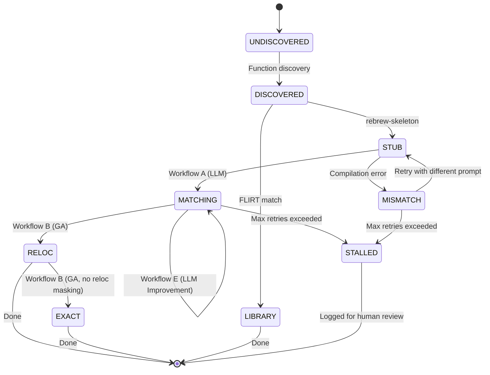
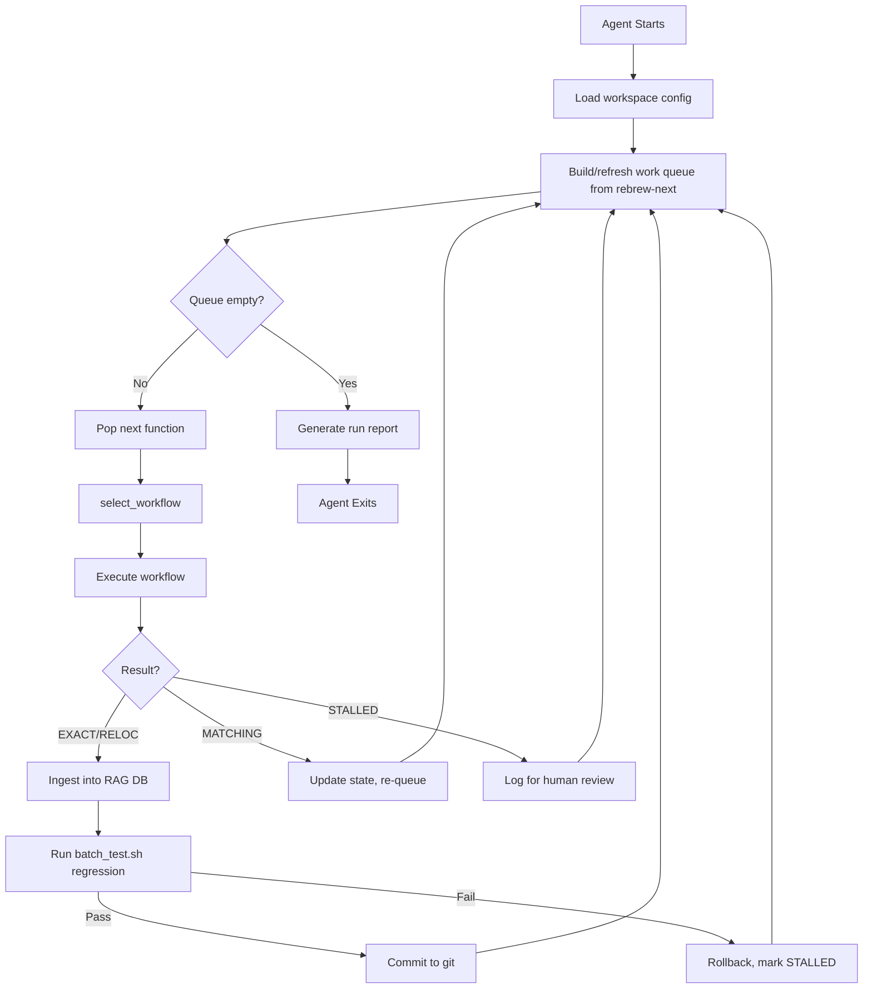
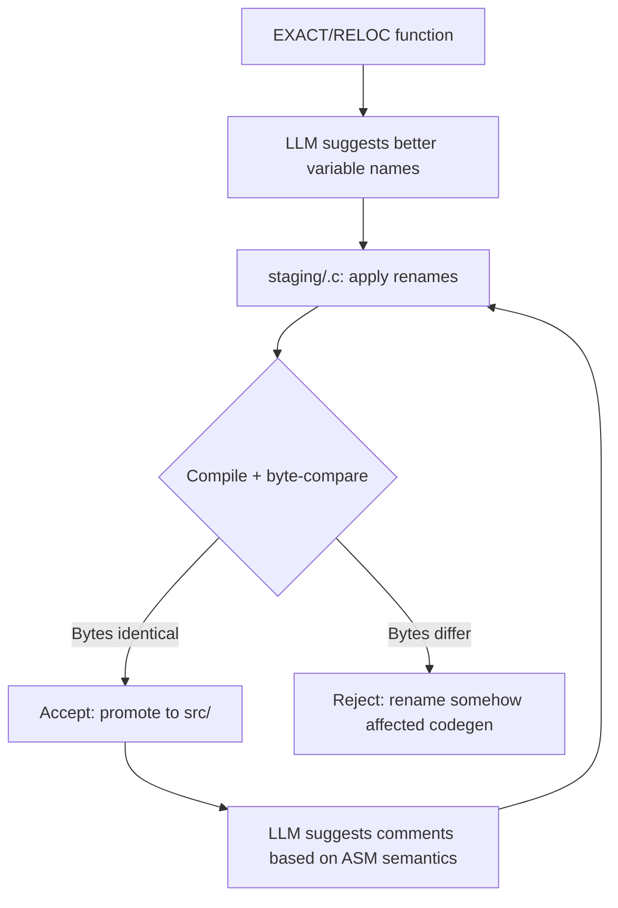
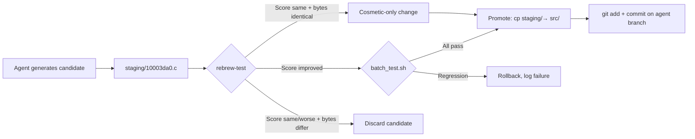
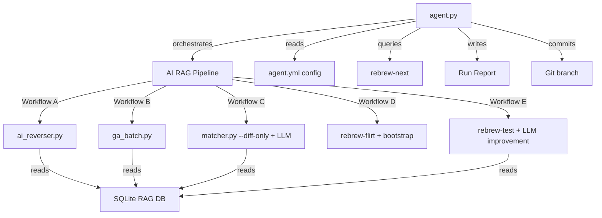
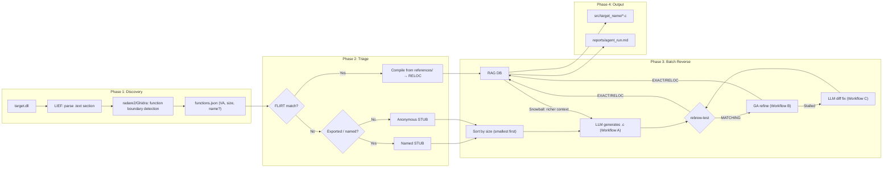

# Product Requirements Document (PRD): Autonomous RE Agent

> **Depends on**: [AI_RAG_PRD.md](./AI_RAG_PRD.md) — This document extends the RAG-enabled AI pipeline with a fully autonomous orchestration layer.

## 1. Overview

The [AI RAG PRD](./AI_RAG_PRD.md) defines five workflows (A–E) for AI-assisted reverse engineering, each requiring a human to choose which workflow to run, when to stop, and what to do next. This PRD proposes an **autonomous agent** layer that chains those workflows together in a self-driving loop, consuming an entire binary (or a prioritized subset) without human interaction.

The agent operates as a **batch supervisor** that decides — for each function — which workflow to invoke, when to escalate, and when to give up. It runs overnight, and the human reviews the results in the morning.

## 2. Goals

* **Hands-off batch processing**: Given a binary and a workspace config, reverse as many functions as possible without human input.
* **Intelligent workflow selection**: Automatically pick the optimal workflow (A/B/C/D/E) for each function based on its current state.
* **Resource-aware scheduling**: Respect LLM token budgets, API rate limits, and compilation concurrency limits.
* **Transparent reporting**: Produce a structured run report showing what was attempted, what succeeded, what failed, and why.
* **Safe by default**: Never overwrite an `EXACT`/`RELOC` file. Always run regression tests before committing changes.

## 3. Agent Architecture

### 3.1 State Machine

The agent maintains a per-function state that drives workflow selection:



### 3.2 Decision Engine

For each function in the work queue, the agent evaluates:

```python
def select_workflow(func_state):
    if func_state.status == "UNDISCOVERED":
        return WorkflowD()  # Cold-start bootstrap

    if func_state.flirt_match:
        return CompileFromReference()  # No LLM needed

    if func_state.status == "STUB":
        return WorkflowA()  # Zero-shot RAG generation

    if func_state.status == "MATCHING":
        byte_delta = func_state.best_score
        if byte_delta < THRESHOLD_GA:       # e.g., < 10 mismatched bytes
            return WorkflowB()              # GA can probably close this
        elif func_state.ga_stalled:
            return WorkflowC()              # GA failed, ask LLM for structural fix
        elif func_state.llm_attempts < MAX_LLM_RETRIES:
            return WorkflowE()              # LLM improvement pass
        else:
            return MarkStalled()            # Give up, log for human

    if func_state.status == "MISMATCH":
        if func_state.llm_attempts < MAX_LLM_RETRIES:
            return WorkflowA(retry=True)    # Re-attempt with different prompt
        else:
            return MarkStalled()
```

### 3.3 Execution Loop



## 4. Configuration

The agent reads from `rebrew.toml` (for target config) and a dedicated `agent.yml`:

```yaml
# agent.yml
agent:
  max_functions: 100          # Max functions to attempt per run
  max_llm_retries: 3          # Max LLM attempts per function
  max_ga_generations: 200     # GA budget per function
  ga_stagnation_limit: 50     # Generations without improvement before stalling
  concurrency: 4              # Parallel compilations
  token_budget: 32000         # Max tokens per LLM prompt
  auto_commit: true           # Git commit on EXACT/RELOC
  run_regression: true        # batch_test.sh after each commit

priorities:
  - origin: GAME              # Process GAME functions first
    min_size: 10
    max_size: 500
  - origin: MSVCRT
    min_size: 10
    max_size: 200

llm:
  provider: litellm
  model: qwen3-coder-next
  api_base: http://localhost:8000/v1
  temperature: 0.2
  max_tokens: 4096

retry_strategy:
  on_mismatch: rephrase_prompt # or: increase_context, try_ghidra_baseline
  on_ga_stall: escalate_to_llm
  on_compile_error: fix_includes_and_retry
```

## 5. Run Report

After each run, the agent produces `reports/agent_run_<timestamp>.md`:

```markdown
# Agent Run Report — 2026-02-22T22:00:00

## Summary
| Metric | Count |
|--------|-------|
| Functions attempted | 47 |
| New EXACT matches | 12 |
| New RELOC matches | 8 |
| Improved to MATCHING | 15 |
| Stalled (needs human) | 7 |
| Skipped (FLIRT) | 5 |
| Total LLM calls | 89 |
| Total GA generations | 4,200 |
| Regression tests | PASS |

## Stalled Functions (Human Review Required)
| VA | Name | Status | Reason |
|----|------|--------|--------|
| 0x10004A00 | `process_packet` | MATCHING | GA stalled after 3 LLM rewrites |
| 0x10007B20 | `render_frame` | MISMATCH | Compilation error: unknown type `D3DMATRIX` |

## New Matches
| VA | Name | Workflow | LLM Calls | GA Gens |
|----|------|----------|-----------|---------|
| 0x10001860 | `copy_fields` | A→B | 1 | 45 |
| 0x10003140 | `get_record` | A | 2 | 0 |
```

## 6. Safety & Access Control

The core problem: how does the agent get enough access to improve decompilations without risking corruption of already-good matches?

**Principle: Score monotonicity.** The agent can never make a function *worse*. Every change must pass through a gate that compares the new score to the old:

```
BEFORE: MATCHING (score: 1540, 8 mismatched bytes)
AFTER:  MATCHING (score: 1520, 6 mismatched bytes)  ← Accept ✓ (improved)
AFTER:  MATCHING (score: 1560, 10 mismatched bytes) ← Reject ✗ (regressed)
AFTER:  RELOC    (score: 0)                         ← Accept ✓ (promoted)
```

### Layered Safety Model

| Layer | Mechanism | What It Prevents |
|-------|-----------|-----------------|
| **L0: Read-only RAG** | Agent reads from the SQLite DB but writes candidates to a **staging area**, never directly to `src/` | LLM can't corrupt source files |
| **L1: Status lock** | `EXACT` and `RELOC` files are **frozen** — agent skips them entirely unless `--force-recheck` is set | Can't touch finished work |
| **L2: Shadow workspace** | Agent writes candidates to `staging/<VA>.c`. Only promoted to `src/` after passing all gates | Bad output never hits the source tree |
| **L3: Score gate** | `rebrew-test` compares new candidate score vs current best. Only promote if **strictly better or equal status** | Regressions are impossible |
| **L4: Regression gate** | After any promotion, `batch_test.sh` re-verifies **all** existing matches, not just the changed file | Catches cross-function side effects (e.g., symbol collisions) |
| **L5: Git isolation** | All changes on `agent/batch-<timestamp>` branch. Never touches `main` directly | Human reviews the PR before merge |
| **L6: Audit trail** | Every LLM prompt/response pair logged to `reports/audit/<VA>/attempt_<N>.json` | Full reproducibility for debugging |

### File Access Rules

```
src/target_name/*.c          → READ-ONLY during agent run
staging/<VA>.c              → WRITE (candidates go here)
rebrew.db                → READ (RAG lookups) + WRITE (new matches only)
reports/                    → WRITE (logs, report)
.git/                       → WRITE (agent branch only)
```

### Status Promotion Rules

The agent may only move functions **up** this ladder:

```
STUB → MISMATCH → MATCHING → RELOC → EXACT
  ↑       ↑          ↑         ↑        ↑
  Can write to any   |    Can only   Cannot
  of these states    |    promote    touch
                     |    upward     these
              Never demote ←───────────┘
```

Concrete rules for **byte-affecting changes** (logic, control flow, types):
* `STUB` → Any status is acceptable (first attempt)
* `MATCHING` → Accept only if byte delta improved OR status promoted to `RELOC`/`EXACT`
* `RELOC` → Accept only if promoted to `EXACT`. **Never** overwrite with a worse `MATCHING` result
* `EXACT` → **Frozen for logic changes**. Do not touch the compiled output.

#### Byte-Neutral Changes (Always Allowed)

Variable renames, comments, whitespace, and annotation updates **don't change the compiled bytes**. These are explicitly allowed on *any* status, including `EXACT` and `RELOC`:

| Change Type | Byte-Affecting? | Allowed on EXACT/RELOC? |
|-------------|:---------------:|:-----------------------:|
| Rename `var1` → `player_hp` | No | ✅ |
| Add/edit `/* comment */` | No | ✅ |
| Update `// STATUS:` annotation | No | ✅ |
| Reformat whitespace/indentation | No | ✅ |
| Change `if` condition logic | **Yes** | ❌ |
| Add/remove a function call | **Yes** | ❌ |
| Change a type (`int` → `short`) | **Yes** | ❌ |

The verification is simple: after a cosmetic change, `rebrew-test` must produce **byte-identical output**. If the compiled bytes change at all, the edit is rejected.

```
Cosmetic edit: rename var1 → player_hp
  1. Apply edit to staging/<VA>.c
  2. Compile → extract bytes
  3. Compare to current EXACT bytes
  4. Bytes identical? → Accept (cosmetic only) ✓
  5. Bytes differ?   → Reject (not actually cosmetic) ✗
```

This enables an **iterative readability loop** on finished functions:



> [!IMPORTANT]
> The Ghidra deep-analysis skill (§Phase 2.5) feeds directly into this loop — when ReVa renames variables and fixes types in Ghidra's database, those improved names can be propagated back to the C source file as byte-neutral edits.

### Shadow Workspace Flow



### Rate Limiting & Stall Detection
* **Token budget**: The agent respects `max_functions` and per-function token limits to prevent runaway costs.
* **Stall detection**: If a function makes no progress after `max_llm_retries` + GA stagnation, it's marked `STALLED` and skipped. The agent does not loop forever.
* **Cooldown**: After a function stalls, it enters a cooldown period and won't be retried until the next agent run (when the RAG may have new context from other matches).

## 7. CLI Interface

```bash
# Full autonomous run (process everything)
uv run python tools/agent.py

# Process only GAME functions up to 200 bytes
uv run python tools/agent.py --origin GAME --max-size 200

# Improve existing MATCHING functions only (Workflow E)
uv run python tools/agent.py --improve-only

# Cold-start a new binary
uv run python tools/agent.py --bootstrap path/to/binary.exe

# Dry run (show what would be attempted, no changes)
uv run python tools/agent.py --dry-run

# Resume a previous run
uv run python tools/agent.py --resume reports/agent_run_20260222.md
```

## 8. Relationship to AI_RAG_PRD

This agent is a **consumer** of the RAG pipeline, not a replacement:



The RAG PRD defines *how* each workflow works. This PRD defines *when* and *in what order* to invoke them, and how to handle the lifecycle of an entire binary's worth of functions autonomously.

## 9. End-to-End Pipeline: `.exe` In → `.c` Out

This section describes the complete autonomous pipeline from a cold binary to a directory of matched C source files. No human interaction required.

### Input
```
target.dll              # The target binary
rebrew.toml          # Target + compiler config (multi-target)
agent.yml               # Agent tuning (retries, budget, priorities)
references/             # Optional: known library sources (zlib, Lua, etc.)
*.sig / *.pat           # Optional: FLIRT signature databases
```

### Output
```
src/target_name/         # Generated .c files with annotation headers
  alloc_game_object.c   #   STATUS: EXACT / RELOC / MATCHING
  process_packet.c
  render_frame.c
  ...
reports/
  agent_run_<ts>.md     # Summary: what matched, what stalled
  audit/                # Every LLM prompt/response pair
```

### Pipeline Phases



### Phase 1: Discovery (runs once)

| Step | Command | Output |
|------|---------|--------|
| Parse binaries | `lief` | Section headers, entry point, exports |
| Find functions | `r2 -qc 'aaa; aflj' target.dll` | `functions.json` with VA + size for every function |
| Extract strings | `r2 -qc 'izj' target.dll` | String→VA mapping for RAG |
| Detect compiler | PE Rich header / CRT prologue scan | Auto-populate `rebrew.toml` |

**Result**: A list of every function in the binary with its address and size. Typically 500–5000 functions.

#### Alternative: Ghidra MCP via ReVa

If a Ghidra headless instance is available, the agent can use the [ReVa MCP server](https://github.com/cyberkaida/reverse-engineering-assistant) instead of radare2. ReVa exposes Ghidra's analysis through MCP tool calls that the agent can invoke directly:

| ReVa MCP Tool | Replaces | Output |
|---------------|----------|--------|
| `get-current-program` | `lief` parsing | Program metadata (name, type, platform) |
| `get-memory-blocks` | PE section parsing | Section layout with permissions and sizes |
| `get-strings` (paginated) | `r2 izj` | All strings with addresses, paginated |
| `get-symbols` (`includeExternal=true`) | `r2 aflj` / PE export table | Named + imported symbols |
| `get-function-count` / `get-functions` | Function boundary detection | Complete function list with named/unnamed ratio |
| `get-decompilation` | N/A (new capability) | Ghidra pseudo-C for any function |
| `find-cross-references` | Manual XREF scraping | Structured XREF data with context snippets |

### Phase 2: Triage (runs once)

The triage phase classifies every discovered function and seeds the RAG database. It follows ReVa's [binary-triage skill](https://github.com/cyberkaida/reverse-engineering-assistant/tree/main/ReVa/skills/binary-triage) methodology, adapted for Rebrew's matching pipeline.

#### Step 1: FLIRT Signature Matching
Run `rebrew-flirt` against all `.sig`/`.pat` files. ~20–40% of functions typically match CRT/runtime libraries. Each match is a **free win** — no LLM needed.

#### Step 2: Symbol & Import Survey
Using ReVa MCP or `lief`:
* Named exports get real symbol names. Unnamed functions get `FUN_<VA>`.
* Categorize imports by type (network APIs, file I/O, crypto, Win32, CRT) — this tells the LLM what headers to include.

#### Step 3: String & XREF Anchoring
Using ReVa's `get-strings` + `find-cross-references`:
* Map every string literal to the functions that reference it.
* Follow XREFs for key strings (error messages, library version strings, format strings) to identify high-value functions.
* This produces semantic hints even with zero prior decompilation.

#### Step 4: Selective Decompilation (Ghidra)
For the most promising functions (entry points, string-heavy, small leaf functions):
* Use ReVa's `get-decompilation` to get Ghidra's pseudo-C.
* This pseudo-C is **not** the output — it's **additional RAG context** fed to the LLM alongside the ASM.
* Ghidra's decompilation provides variable count estimates, control flow structure, and approximate type hints that dramatically improve LLM accuracy.

#### Step 5: Skeleton Generation & RAG Seeding
* `rebrew-skeleton` creates the `.c` file with the annotation header for every non-FLIRT function.
* Every FLIRT match + Ghidra decompilation becomes an instant entry in the RAG DB.

#### Triage Output

The triage phase produces a structured report following ReVa's format:

```
Triage Report: target.dll
├── Program: PE32 / Windows / MSVC6 (detected)
├── Functions: 1,847 total (312 named, 1,535 unnamed)
├── FLIRT matches: 347 (18.8%) — CRT: 280, zlib: 52, Lua: 15
├── String anchors: 423 unique strings → 198 functions tagged
├── Ghidra decompiled: 50 entry-point + high-value functions
├── STUB files created: 1,500
└── RAG DB seeded: 347 signatures + 423 strings + 50 pseudo-C
```

**Result**: The RAG DB has its initial seed. All remaining functions have STUB `.c` files ready for the LLM. Ghidra pseudo-C is available as additional context for the 50 most important functions.

#### Phase 2.5: Deep Analysis (Optional, Per-Function)

For complex or high-value functions where the LLM struggles, the agent can invoke ReVa's [deep-analysis skill](https://github.com/cyberkaida/reverse-engineering-assistant/tree/main/ReVa/skills/deep-analysis) — a depth-first investigation loop:

1. **READ**: `get-decompilation` with `includeIncomingReferences=true`
2. **UNDERSTAND**: Analyze control flow, identify crypto patterns, trace data flow
3. **IMPROVE**: Rename variables, fix types, add comments in Ghidra's database
4. **VERIFY**: Re-decompile to confirm improvements
5. **FOLLOW THREADS**: Chase XREFs to callers/callees
6. **TRACK**: Bookmark findings for the agent to consume

The deep-analysis output feeds directly into the RAG as enriched context — renamed variables and corrected types from Ghidra make the LLM's job significantly easier.

### Phase 3: Batch Reverse (runs in a loop)

The agent processes functions **smallest-first** to maximize the snowball effect:

```
Queue: [12 bytes, 18 bytes, 24 bytes, ... 2400 bytes]
       ^^^^^^^^^^^^^^^^^^^^^^^^
       Leaf functions — trivial getters/setters
       LLM nails these on attempt #1
       Each match enriches RAG for the next
```

For each function:

```
┌─────────────────────────────────────────────────┐
│  1. dump_asm.py → extract ASM                   │
│  2. RAG lookup → gather context (§3.5 Tier 1)   │
│  3. Assemble prompt (P0→P4 priority budget)      │
│  4. LLM generates C body                        │
│  5. Normalize output (§3.9)                      │
│  6. rebrew-test → classify result               │
│                                                  │
│  ┌── EXACT/RELOC ──→ Ingest into RAG DB ✓       │
│  │                                               │
│  ├── MATCHING ──→ GA (Workflow B, up to 200 gen) │
│  │   ├── EXACT/RELOC ──→ Ingest ✓               │
│  │   └── Stalled ──→ LLM diff fix (Workflow C)   │
│  │       └── Re-test → loop back to GA           │
│  │                                               │
│  └── MISMATCH ──→ Retry LLM (up to 3x)          │
│      └── Still failing ──→ Mark STALLED          │
└─────────────────────────────────────────────────┘
```

**Key invariant**: Every successful match immediately enriches the RAG DB, so the *next* function in the queue benefits from richer context. This is the snowball.

### Phase 4: Output

After the queue is exhausted (or budget reached):

1. **Final regression**: `batch_test.sh` verifies every `.c` file still compiles and matches.
2. **Git commit**: All changes on `agent/batch-<timestamp>` branch.
3. **Run report**: `reports/agent_run_<ts>.md` with stats, stalled list, and match table.
4. **Audit trail**: Full LLM prompt/response log for every function attempted.

### Realistic Expectations

| Binary Size | Functions | FLIRT Free Wins | LLM + GA Matches | Stalled | Coverage |
|------------|-----------|-----------------|-------------------|---------|----------|
| Small (200KB) | ~300 | ~80 (CRT) | ~120–160 | ~60–80 | 65–80% |
| Medium (2MB) | ~2000 | ~400 (CRT+zlib) | ~800–1200 | ~400–600 | 60–80% |
| Large (10MB+) | ~8000 | ~1500 | ~3000–5000 | ~1500–3000 | 55–75% |

> [!IMPORTANT]
> These are rough estimates. Actual match rates depend heavily on compiler optimization level, coding complexity, and how many open-source libraries are statically linked. Game binaries with lots of template/C++ code will have lower match rates than C-heavy system binaries.

## 10. Tech Stack

| Component | Choice | Rationale |
|-----------|--------|-----------|
| **Language** | Python 3.11+ | Entire Rebrew ecosystem is Python. Zero friction |
| **LLM client** | `litellm` | Single API for vLLM, Ollama, OpenAI. Provider-agnostic |
| **Agent loop** | Plain `asyncio` state machine | 6 states, 5 workflows. A `dict` + `match`, not a framework |
| **State/cache** | SQLite (extend `BuildCache`) | Already exists in `rebrew/core.py`. Add `functions` + `agent_runs` tables |
| **Config** | `pydantic` + YAML | Type-safe, good error messages |
| **Async compilation** | `asyncio.create_subprocess_exec` | Already shelling out to `wine CL.EXE` |
| **Reporting** | Jinja2 → Markdown | Lightweight, human-readable |
| **Function discovery** | `radare2` (r2pipe) or Ghidra headless | Both free, both have JSON output modes |
| **FLIRT** | `rebrew-flirt` (existing) | Already in the codebase |

> [!TIP]
> Start with this minimal stack. If you later need checkpointing, human-in-the-loop breakpoints, or distributed execution across multiple machines, graduate to **LangGraph** (medium complexity) or **Temporal** (heavy, for multi-binary farms).
