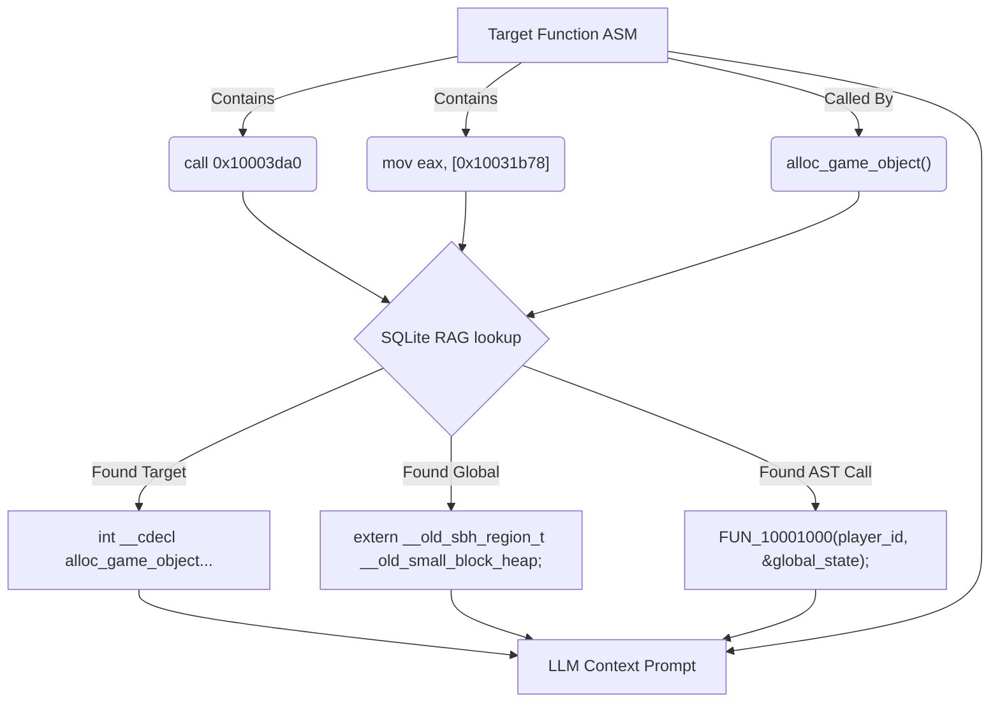
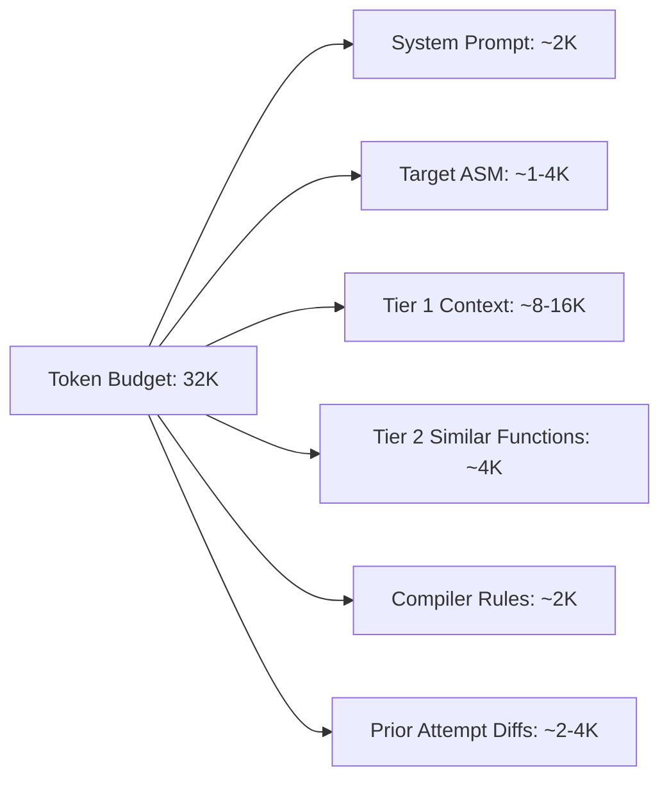
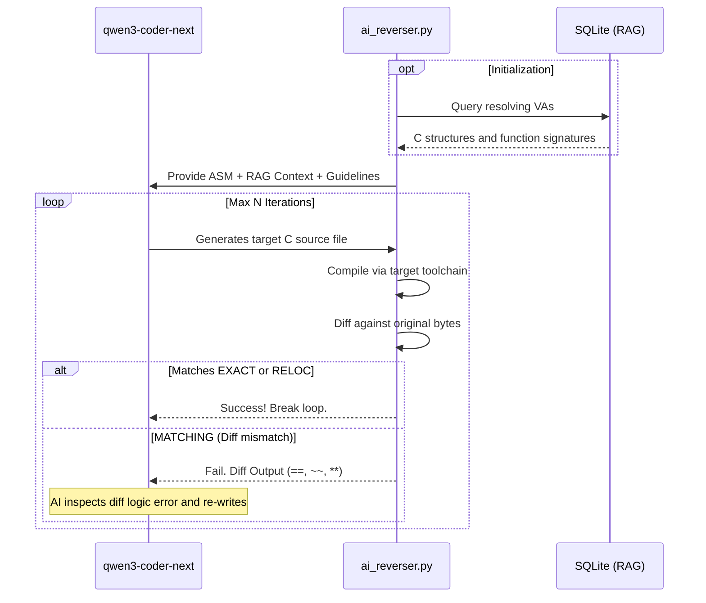
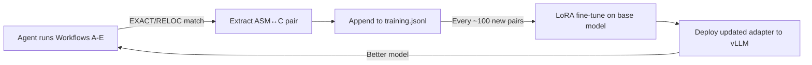
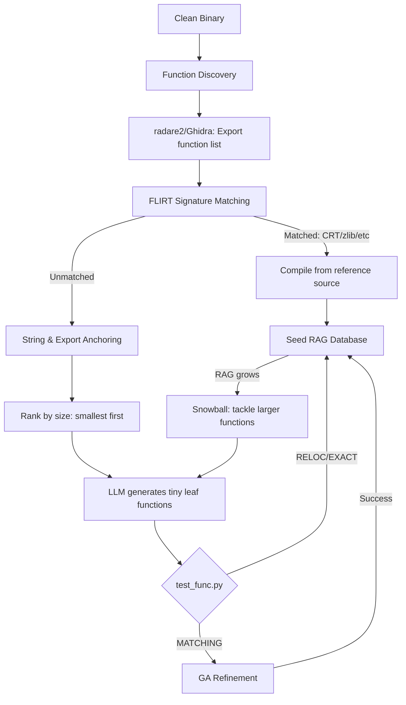
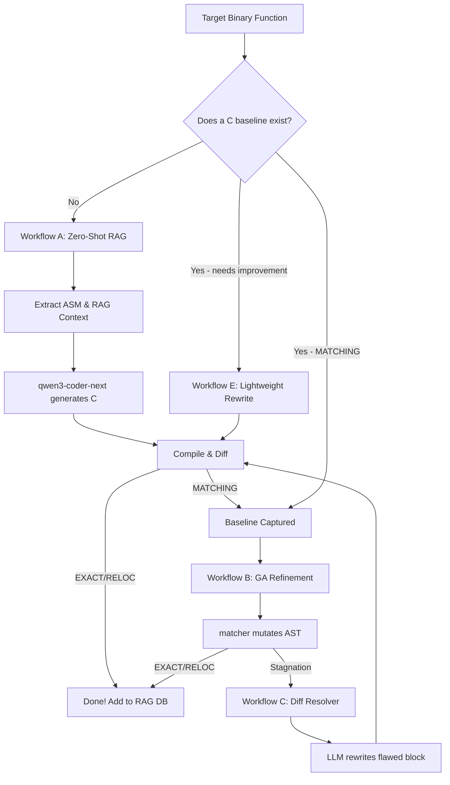

# Product Requirements Document (PRD): RAG-Enabled AI ASM-to-C Translation

## 1. Overview
The **Rebrew** ecosystem currently relies on a genetic algorithm (GA) to mutate C source code and a manual reverse-engineering workflow. We propose integrating a powerful Large Language Model (**qwen3-coder-next**) into the loop to automatically translate target assembly (ASM) to functionally identical source code across **various compilers and operating systems** (e.g., MSVC, GCC, Clang targeting Windows PE or Linux ELF).

Crucially, this AI integration will not operate in isolation. It will be backed by a **Retrieval-Augmented Generation (RAG)** system that provides context from the already reverse-engineered parts of the codebase. By cross-referencing known jump targets, function calls, and global variable addresses against the existing matched functions, the AI will make highly educated inferences about types, signatures, and data structures.

> [!NOTE]
> For fully autonomous operation (no human in the loop), see the companion [Autonomous RE Agent PRD](./AGENT_PRD.md) which orchestrates these workflows as a self-driving batch supervisor.

## 2. Goals & Objectives
* **Automated ASM-to-C Translation**: Utilize `qwen3-coder-next` to generate initial C/C++ implementations that closely match the specific compiler's codegen patterns.
* **Context-Aware Generation (RAG)**: Whenever the target ASM references an absolute address (global) or calls a relative/absolute address (function), the system will fetch the known C signature/definition and inject it into the AI's prompt.
* **Iterative Refinement Loop**: The AI will act as an autonomous agent in a fast feedback loop. It will write code, invoke the matching engine (`tools/matcher.py`), parse the structural differences, and refine the source code dynamically.
* **Compiler/OS Agnostic Architecture**: Ensure the RAG prompting and extraction pipeline supports arbitrary executable formats (PE, ELF) and handles distinct Application Binary Interfaces (ABIs), calling conventions, and compiler dialects (C89, C99, C++11, etc.).
* **Continuous Knowledge Base**: As new functions hit `EXACT` or `RELOC` status, they are automatically added to the RAG database, improving future translation attempts.

## 3. Detailed Requirements

### 3.1 ASM Extraction and Pre-processing
* The system must extract the target ASM instruction stream using `capstone` (already a project dependency).
* **Existing tool**: `tools/dump_asm.py` already provides Capstone-based disassembly given a VA and size. The `ai_reverser.py` orchestrator should call `dump_asm.dump_asm()` directly rather than reimplementing PE parsing.
* **Existing tool**: `tools/batch_extract.py` can bulk-extract `.bin` files and disassembly for multiple VAs at once. Useful for batch AI runs.
* **Existing tool**: `tools/nasm_extract.py` provides round-trip verified NASM output with `db` fallbacks for instructions Capstone encodes differently — this can serve as a higher-fidelity ASM representation for the LLM prompt than raw Capstone output.
* All immediate displacements, relative branch targets, and global memory accesses must be resolved to their absolute Virtual Addresses (VAs).

### 3.2 Retrieval-Augmented Generation (RAG) System
* **Vector / Relational Database**: A fast, local database linking VAs to their resolved C artifacts.
* **Target Functions**: When `call 0x10003da0` is seen inside the ASM, the system looks up `0x10003da0`. If it's already matched as `_alloc_game_object` (from `CATALOG.md`), the RAG retrieves its C signature (`int __cdecl alloc_game_object(...)`) and injects it into the prompt.
* **Caller Context (Reverse Lookups)**: If the function currently being reversed is already known to be *called by* other matched functions, the system queries the DB for the AST context of those calls. For example, if we are reversing `0x10001000` and `_alloc_game_object` calls `FUN_10001000(player_id, &global_state)`, providing this surrounding code block to the LLM allows it to deduce the exact intended parameter names (`player_id`, `state`), struct types, and the semantic purpose of returning values.
* **Globals**: When `mov eax, [0x10031b78]` is found, the system queries the RAG to find this is `__old_small_block_heap`. The struct definition of `__old_sbh_region_t` should also be provided to the AI.
* **Cross-References (XREFs)**: The system utilizes Capstone, `pefile` (Windows), or `pyelftools` (Linux) to scrape all direct code and data cross-references pointing *to* and *from* the target VA.
  * **Data XREFs**: For example, if the function references static strings (`mov eax, offset "Error loading AI"`) or a VTable pointer (`mov dword ptr [ecx], 0x1005a0b8`), the RAG dumps the strings/vtable layouts to the LM.
  * **Code XREFs**: By providing a list of all callers to the current function (`XREF from 0x1004a8b0`, `XREF from 0x1009c2a4`), the LM maps the overall application flow, even if the caller isn't decompiled yet, by exposing its raw assembly blocks for heuristic naming.
* **String Literals**: A core part of RE is relying on embedded text. The RAG system must scrape the read-only data sections (`.rdata` / `.rodata`) so that when the target function moves a string address (`mov edi, offset string_val`), the LLM receives the absolute ASCII/UTF-16 text.
* **Magic Numbers & Known Constants**: The system should maintain a local definitions file of common OS constants (e.g., Win32 `E_FAIL`, Linux POSIX `EINVAL`). If the LLM sees `cmp eax, 0x80000003`, the RAG should inject `HRESULT E_INVALIDARG`.
* **Stack Frame / Local Variable Inference**: By analyzing the function prologue and `sub esp/rsp, N`, the RAG must identify the size of the local stack frame. Furthermore, by observing how `ebp-X` offsets are passed to known called functions, it should provide layout size hints.
* **RTTI and Virtual Tables**: The RAG should attempt to parse compiler-specific Run-Time Type Information (e.g., MSVC `.rdata` RTTI structs or Itanium C++ ABI for GCC/Clang) to feed the exact class name and inheritance hierarchy to the LLM when observing virtual dispatch.
* **Compiler & Architecture Idioms**: 
  * Providing the LLM with known compilation artifacts specific to the target compiler/OS. 
  * MSVC: `__local_unwind2` usage implies a `try/finally` block; `fs:[0]` manipulates SEH frames. 
  * GCC/Clang: Recognizing `.eh_frame` exception handling tables or System V AMD64 ABI parameter passing in registers (`rdi`, `rsi`, `rdx`, etc.).
  * `switch` jump tables: If an indexed jump table is detected, RAG must inject the jump table's size and block addresses so the LLM knows exactly how many `case` statements to generate.



### 3.3 Context Management & Bounds Checking
Given Qwen3-Coder-Next's large context window, it is still critical to aggressively curate the RAG injections to prevent attention dilution and reduce inference cost/time:
* **AST Truncation**: When querying the RAG for Caller Context, we must not inject the entire 1000-line `.c` file of the caller. We will use `pycparser`/`tree-sitter` to extract *only* the specific function AST holding the `call`, or even just the exact basic block.
* **Struct Dependency Trees**: If injecting a struct definition (e.g., `__old_sbh_region_t`), the script must recursively resolve only the nested structs it explicitly depends on, ignoring unrelated headers.
* **XREF Limits**: Data and Code XREFs will be capped (e.g., Top 5 callers). If a function corresponds to an OS API called 500 times, the prompt must gracefully summarize: `"Called by 500 locations including 0x10001A... [TRUNCATED]"`.

### 3.4 Additional Context Sources
Beyond the binary itself, several external sources can dramatically improve the LLM's output quality:

* **SDK Headers & Documentation**: If the target binary links against known SDKs (DirectX, Winsock, Lua, etc.), the relevant API headers and docs should be indexed. When the RAG detects a call to `WSAStartup@8`, it can inject the full MSDN-style signature and parameter semantics.
* **Open-Source Library Source Code**: Many binaries statically link open-source libraries (zlib, Lua, OpenSSL, libpng). If the exact version is identified (via strings or FLIRT), the **entire reference source tree** can be provided to the LLM. The user's workspace already demonstrates this with `references/zlib-1.1.3/`.
* **Ghidra / IDA Decompiler Output**: Ghidra's pseudo-C output (via `ghidra_sync.py` or headless analysis) provides a high-level structural baseline. Even when the decompilation is imperfect, it gives the LLM a rough skeleton of control flow, variable count, and call patterns to work from.
* **Debug Symbols from Related Builds**: If a debug build, PDB, DWARF info, or map file exists for a related version of the binary (e.g., a demo build, a different platform port), the type and function name information can be extracted and cross-referenced against the target.
* **Game Modding Community Knowledge**: For game binaries, modding communities often maintain partial symbol lists, struct layouts, and function documentation. These can be scraped and ingested as RAG context (e.g., wiki pages, GitHub repos with partial RE work, IDA `.idb` exports).
* **Compiler-Specific Documentation**: MSVC6 codegen quirks, GCC optimization passes, and Clang-specific behaviors should be maintained as a static knowledge base injected into the system prompt. The existing `docs/WORKFLOW.md` "Known MSVC6 Codegen Patterns" table is an excellent example — this should be fed verbatim to the LLM.
* **Prior Failed Attempts**: When the LLM has already attempted a function and failed, the history of previous attempts and their diff outputs should be stored and summarized. This prevents the model from repeating the same mistakes across retries.
* **FLIRT Signature Databases**: `.sig`/`.pat` files (like the `lua-5.0.3-vc6-x86.sig` already in the workspace) provide not just function identification but also partial byte patterns that hint at the expected prologue/epilogue structure.

### 3.5 RAG Retrieval Architecture

The core question is: *how does context actually get from the database into the model's prompt?* The system uses a **two-tier retrieval** approach followed by a **prompt assembly** step.

#### Tier 1: Deterministic Lookups (SQLite)
Most RAG queries in this domain are **exact address lookups**, not fuzzy semantic searches. When the orchestrator disassembles a target function, it collects a set of concrete addresses:

```python
# Pseudocode: extract all referenced addresses from ASM
referenced_vas = set()
for insn in capstone.disasm(target_bytes, target_va):
    if insn.mnemonic in ('call', 'jmp'):       # code refs
        referenced_vas.add(insn.operands[0].imm)
    if insn.mnemonic in ('mov', 'cmp', 'push'):  # data refs
        for op in insn.operands:
            if op.type == X86_OP_MEM and op.mem.disp > 0x10000000:
                referenced_vas.add(op.mem.disp)
            if op.type == X86_OP_IMM and op.imm > 0x10000000:
                referenced_vas.add(op.imm)
```

Each address is then queried against the SQLite knowledge base:

```sql
-- Function signatures
SELECT name, symbol, signature, source_file, status
FROM functions WHERE va = ?;

-- Global variables
SELECT name, type_decl, struct_def
FROM globals WHERE va = ?;

-- String literals
SELECT content, encoding FROM strings WHERE va = ?;

-- Callers (reverse xrefs)
SELECT caller_va, call_site_context
FROM xrefs WHERE target_va = ? LIMIT 5;
```

This is O(1) per address — fast, deterministic, no embeddings needed.

#### Tier 2: Semantic Search (Vector DB, Optional)
For cases where exact lookups fail but *similar patterns* exist in the codebase, a vector database (LanceDB/ChromaDB) stores **ASM embeddings**:

* Each matched function's disassembly is embedded as a vector using a code embedding model (e.g., `jina-embeddings-v3` or a fine-tuned model on x86 ASM).
* When the target function's ASM has no direct hits in Tier 1, the orchestrator runs a similarity search: *"find me the 3 most structurally similar functions already reversed."*
* This handles cases like: *"This function looks like a variation of `game_init_player` but with different field offsets."*

> [!NOTE]
> Tier 2 is optional for MVP. Tier 1 (deterministic lookups) covers 80%+ of useful context. Vector search adds value primarily for large codebases with repetitive patterns.

#### Prompt Assembly Pipeline

Once all context fragments are retrieved, they must be assembled into a single prompt that fits the model's context window. The orchestrator uses a **priority-based token budget**:



Each context fragment is assigned a **priority score**:

| Priority | Context Type | Rationale |
|----------|-------------|----------|
| P0 (always include) | Target ASM, compiler constraints | Without these, the model can't do anything |
| P1 (critical) | Directly called function signatures | The model needs correct prototypes to generate valid calls |
| P1 (critical) | Referenced global declarations + struct defs | Wrong types = wrong codegen |
| P2 (important) | String literals referenced by the function | Strong semantic hints for naming and logic |
| P2 (important) | Caller context (how this function is called) | Infers parameter names and types |
| P3 (helpful) | Ghidra decompiler pseudo-C | Structural skeleton, but may be inaccurate |
| P3 (helpful) | Similar functions from vector search | Pattern hints |
| P4 (nice-to-have) | Code XREFs (other callers' raw ASM) | Broad flow context |
| P4 (nice-to-have) | Prior failed attempts + diffs | Prevents repeating mistakes |

The assembler iterates through priorities P0→P4, appending context until the token budget is exhausted. Lower-priority items are truncated or dropped entirely.

#### Ingestion Pipeline (Keeping the RAG Fresh)
After every successful match, the ingestion pipeline runs:
1. `pycparser` parses the new `.c` file to extract function prototypes and struct definitions.
2. `catalog.py` is re-run to update the function registry.
3. New entries are inserted into the SQLite `functions`/`globals`/`xrefs` tables.
4. (Optional) The function's ASM embedding is computed and inserted into the vector DB.

This ensures the next function reversal attempt benefits from the latest context.

### 3.6 Dynamic Translation Constraints
* The LLM must be tightly prompted with the target project's specific **Dialect**, **Compiler**, and **Architecture** configurations (e.g., C89 vs C++11, MSVC `/O2` vs GCC `-O3`).
* **Calling Conventions & ABIs**: The model must understand and respect the target System V AMD64 ABI (Linux) vs Microsoft x64 calling convention (Windows), or `__stdcall`/`__cdecl` for 32-bit targets.
* The script orchestrator will dynamically inject these constraints based on `rebrew.toml` or a global workspace config rather than hardcoding any single compiler's rules.

### 3.7 Iterative Feedback Loop
1. **Initial Output**: The LLM outputs a `.c` file based on the ASM and RAG context.
2. **Compilation & Diff**: The system runs `rebrew-match --diff-only ...` against the candidate.
3. **Feedback Analysis**: The AI receives the byte-matching score and the structural diff output (the `==`, `~~`, `**` markers).
4. **Correction**: The AI observes the deviation (e.g., "The compiler used `je` instead of `jne`, meaning my `if` condition might be inverted"), modifies the code, and re-submits.
5. **Termination**: The loop ends when `STATUS` hits `RELOC` or `EXACT`, or a maximum iteration limit is reached (recording the `MATCHING` state).



### 3.8 Example Prompts (Qwen3-Coder-Next Format)

Qwen3-Coder-Next utilizes the ChatML format. Below are examples of how the prompts should be structured when injecting the RAG context.

**Initial Generation Prompt:**
```text
<|im_start|>system
You are an expert compiler and reverse engineering assistant. Your task is to translate the provided assembly into functionally identical source code that will compile to the exact same bytes using the target configuration.
Target Configuration:
- OS: Windows 32-bit (PE)
- Compiler: MSVC6 (/O2 /Gd)
- Dialect: C89
Strict Rules:
- Declare all variables at the beginning of the block.
- No C99 features (no inline for-loop declarations).
- Use __cdecl for game functions, __stdcall for Win32 API.
<|im_end|>
<|im_start|>user
Target Function ASM:
```asm
0x10003da0: push ebp
0x10003da1: mov ebp, esp
0x10003da3: push esi
0x10003da4: mov esi, ecx
0x10003da6: mov eax, dword ptr [0x10031b78]
0x10003dab: push 0x14
0x10003dad: push eax
0x10003dae: call 0x10001bc0
...
```
RAG Context Available:
- Global `0x10031b78` matches `extern __old_sbh_region_t __old_small_block_heap;` (Struct size: 0x24)
- Function `0x10001bc0` matches `void* __cdecl crt_malloc_base(__old_sbh_region_t* heap, size_t size);`

Provide ONLY the implementation for `_alloc_game_object` in C89.
<|im_end|>
<|im_start|>assistant
```c
extern __old_sbh_region_t __old_small_block_heap;
extern void* __cdecl crt_malloc_base(__old_sbh_region_t* heap, size_t size);

void* __cdecl alloc_game_object(void)
{
    void* obj;
    obj = crt_malloc_base(&__old_small_block_heap, 0x14);
    /* ... */
}
```
<|im_end|>
```

**Generation Prompt with C++ RTTI and Linux ELF Context:**
```text
<|im_start|>system
You are an expert compiler and reverse engineering assistant. Translate the assembly into functionally identical C++11 source code.
Target Configuration:
- OS: Linux 64-bit (ELF)
- Compiler: GCC 9.3 (-O3)
- Dialect: C++11
Strict Rules:
- System V AMD64 ABI (Params in RDI, RSI, RDX, RCX).
- Use proper class structures based on injected RTTI.
<|im_end|>
<|im_start|>user
Target Function ASM:
```asm
0x4015f0: push rbp
0x4015f1: mov rbp, rsp
0x4015f4: sub rsp, 0x20
0x4015f8: mov qword ptr [rbp-8], rdi     ; this pointer
0x4015fc: mov rax, qword ptr [rdi]       ; load vtable
0x4015ff: call qword ptr [rax+0x10]      ; virtual dispatch
...
```
RAG Context Available:
- Virtual call at `0x4015ff` uses RTTI offset resolving to `Entity::Update(float delta)`
- Caller XREF at `0x402A10` passes `Entity*` and `float 0.016f`
- Data XREF at `0x40160a` references string literal `".rodata: Failed to update entity"`

Provide ONLY the method implementation for `Entity::Tick` in C++11.
<|im_end|>
```

**Iterative Correction Prompt:**
```text
<|im_start|>user
The compiled code produced a MISMATCH. 
Score: 1540 (Target Size: 160, Output Size: 160)
Structural Diff:
Target:  83 f8 05 7e 0a
Output:  83 f8 06 7c 0a
         ** ** ** ** **

The target used `cmp eax, 5; jle` but your code generated `cmp eax, 6; jl`.
Please adjust your C89 logic to match the target's comparison operators exactly and provide the full updated file.
<|im_end|>
```

### 3.9 Output Normalization

Because LLM generation isn't always perfectly clean, a normalization pipeline must be used before writing the model's output to `src/server_dll/<func>.c` and executing the compiler:

1.  **Markdown Extraction**: Use regex to extract the code block from the ChatML response (e.g., matching `` ```c\n(.*?)\n``` ``). If no markdown block is found, the system should parse the raw text body but warn or trigger a retry.
2.  **Top-level Comments and Metadata**:
    *   Rebrew requires very specific metadata comments (e.g., `// FUNCTION: SERVER 0x...`, `// STATUS: ...`, `// ORIGIN: ...`, `// SIZE: ...`, `// CFLAGS: ...`).
    *   The orchestration script (`ai_reverser.py`) must *prepend* these system-generated headers automatically to the extracted code. The LLM should not be relied upon to perfectly format the `// STATUS:` line.
3.  **Includes and Headers**:
    *   Compilation often fails if types are missing (e.g., `size_t`, `BOOL`, `DWORD`). The orchestration script should automatically detect and prepend missing includes based on the target dialect (e.g., `#include <windows.h>` for MSVC, `#include <stdint.h>` for GCC/Clang).
4.  **Dialect Enforcement**:
    *   Apply compiler-specific sanitization rules. For example, convert `//` comments to `/* */` for strict C89 targets, or remove `__attribute__` annotations when targeting MSVC. These rules should be driven by the workspace config, not hardcoded.

### 3.10 LoRA Fine-Tuning (Complementing RAG)

RAG provides **per-function facts** (VA→signature lookups, struct defs, globals). LoRA provides **pattern knowledge** — teaching the base model how a specific compiler translates C constructs into machine code. They solve different problems and are most effective together.

#### When to Use LoRA vs RAG

| Need | RAG | LoRA |
|------|-----|------|
| "What function is at `0x10003da0`?" | ✅ Exact address lookup | ❌ Can't memorize VAs |
| "How does MSVC6 `/O2` encode a 6-case `switch`?" | ❌ Not a fact to retrieve | ✅ Pattern internalized in weights |
| "What are this function's parameter names?" | ✅ Caller AST context | ✅ Naming convention patterns |
| "Fix `cmp eax, 6; jl` → should be `cmp eax, 5; jle`" | ❌ Too subtle for retrieval | ✅ Trained on diff→fix pairs |

#### Adapter 1: Compiler Idiom LoRA (Highest Value)

Fine-tune on **matched ASM↔C pairs** auto-extracted from existing `EXACT`/`RELOC` files:

```jsonl
{"instruction":"Translate MSVC6 /O2 x86 ASM to C89","input":"push ebp\nmov ebp,esp\nsub esp,0x10\nmov eax,[ebp+8]\n...","output":"int __cdecl get_player_hp(Player* p) {\n    int hp;\n    hp = p->stats.hp;\n    return hp;\n}"}
```

This teaches the model compiler-specific codegen quirks: register allocation preferences, `ebp` frame layouts, jump table encoding, `__cdecl` vs `__stdcall` epilogue patterns.

#### Adapter 2: Diff-Resolution LoRA (Targeted)

Train on **failed→fixed** pairs from Workflow C and E:

```jsonl
{"instruction":"Fix the C to match target bytes","input":"Diff: target 'cmp eax,5; jle' vs output 'cmp eax,6; jl'\nC: if (x < 6) {","output":"if (x <= 5) {"}
```

This teaches the exact relationship between C source changes and byte-level diffs.

#### Adapter 3: Project Naming LoRA (Optional)

Train on the naming conventions of the target codebase so the model predicts contextually appropriate variable and function names even for unknown functions.

#### Training Data Flywheel

LoRA training data is a natural byproduct of the pipeline — every successful match produces a new pair:



> [!TIP]
> The `train_mutation_model.py` script already collects JSONL training data from GA runs. The same infrastructure can produce LoRA training pairs by extracting the final matched ASM→C from each `EXACT`/`RELOC` result.

#### Deployment

LoRA adapters are lightweight (~50–100MB) and can be hot-swapped on vLLM without reloading the base model. Multiple adapters can be served simultaneously:

```bash
# vLLM with LoRA adapter
python -m vllm.entrypoints.openai.api_server \
    --model qwen3-coder-next \
    --enable-lora \
    --lora-modules msvc6-idioms=./adapters/msvc6_o2_lora \
                   diff-resolver=./adapters/diff_fix_lora
```

The orchestrator selects the appropriate adapter per-request based on the workflow:
- Workflow A (zero-shot): `msvc6-idioms` adapter
- Workflow C/E (diff fixing): `diff-resolver` adapter

## 4. Workflows & Tool Engine Interoperability

Rebrew possesses an existing, highly effective Genetic Algorithm (GA) engine (`tools/matcher/`) and a rich set of supporting scripts. The LLM is **not** a replacement for any of these tools; it is a collaborative layer that generates semantic baselines for the programmatic tools to refine.

### Existing Tool Inventory

The following table maps every existing tool to its role in the AI-augmented pipeline:

| Tool | Purpose | AI Pipeline Role |
|------|---------|------------------|
| `dump_asm.py` | Disassemble a VA with Capstone | **ASM extraction** for LLM prompt (§3.1) |
| `batch_extract.py` | Bulk extract `.bin` files + ndisasm | **Batch mode** ASM extraction |
| `nasm_extract.py` | Round-trip verified NASM output | **High-fidelity ASM** for prompt |
| `gen_skeleton.py` | Generate annotated `.c` skeleton from VA | **Scaffolding** — AI fills the skeleton body |
| `next_work.py` | Prioritize uncovered functions by difficulty | **Work queue** — feeds AI batch runner |
| `identify_libs.py` | FLIRT signature matching | **Pre-filter** — skip LLM for known libs |
| `catalog.py` | Annotation parser + function registry | **RAG source** — VA→signature lookups |
| `test_func.py` | Quick compile-and-compare | **Validation** — classifies each result |
| `matcher.py` | Unified GA engine (diff, flag-sweep) | **Diff engine** — `--diff-only` for feedback |
| `matcher/mutator.py` | 40+ C mutation operators | **GA refinement** — closes byte gaps |
| `matcher/scoring.py` | Multi-metric fitness scoring | **Score parsing** — decides next action |
| `matcher/compiler.py` | Compilation backend (Wine/MSVC6) | **Compiler** — shared by AI & GA |
| `matcher/parsers.py` | COFF and PE byte extraction | **Target extraction** — reference bytes |
| `matcher/core.py` | SQLite `BuildCache` + checkpointing | **Shared cache** — deduplicates builds |
| `ga_batch.py` | Batch GA runner for STUBs | **Workflow B** — bulk GA processing |
| `verify.py` | Full verification pipeline | **CI/CD gate** — post-batch validation |
| `ghidra_sync.py` | Ghidra label/comment sync | **Decompilation source** — pseudo-C |
| `train_mutation_model.py` | Train ML mutation model | **Future** — improve GA selection |
| `lint_annotations.py` | Annotation linter | **Post-gen lint** — validates headers |
| `batch_test.sh` | Batch test all reversed functions | **Regression gate** — prevents breaks |

### Workflow A: Zero-Shot RAG Pipeline (LLM Heavy)
Used for **entirely new, unreversed functions**.
1. **Target Selection**: `next_work.py --origin GAME` picks the next function by difficulty.
2. **Pre-filter**: `identify_libs.py` checks if the VA matches a known FLIRT signature. If matched (CRT/zlib), skip LLM — use reference source directly.
3. **Scaffolding**: `gen_skeleton.py 0x<VA>` creates the annotated `.c` file with the correct header.
4. **ASM Extraction**: `dump_asm.py` (or `nasm_extract.py` for higher fidelity) dumps the target function.
5. **Context Assembly**: The RAG queries `catalog.py`'s function registry and trims ASTs to fit the context budget (§3.5).
6. **LLM Generation**: Qwen3 generates the C implementation body.
7. **Validation**: `test_func.py` compiles and classifies the result (`EXACT`/`RELOC`/`MATCHING`/`MISMATCH`).
8. *Result*: A `MATCHING` or `RELOC` baseline is established.

### Workflow B: GA-Refinement Pipeline (Programmatic Heavy)
Used when a function is `MATCHING` but needs minor register allocation or comparison operator fixes.
1. **Trigger**: `test_func.py` classified the result as `MATCHING` with a small byte delta.
2. **Programmatic Handoff**: Do *not* waste LLM tokens guessing compilation jitter. Pass the LLM's output as the `--seed-c` to `ga_batch.py` or `matcher.py`.
3. **GA Brute-force**: `matcher/mutator.py` (40+ operators: `if`-branch swaps, `for`↔`while`, operand commutation) mutates the C AST until the byte distance reaches 0.
4. **Shared Cache**: Results stored in `matcher/core.py`'s `BuildCache` (SQLite) — no duplicate compilations across AI and GA runs.
5. *Result*: Byte-perfect matching achieved programmatically using the LLM's semantic baseline.

### Workflow C: AI-Assisted Diff Resolver (Hybrid)
Used when the GA stalls on a `MATCHING` file because the structural logic is fundamentally flawed (e.g., missed an `else if` block).
1. **Trigger**: `ga_batch.py` hits its stagnation limit without finding a match.
2. **Diff Extraction**: `matcher.py --diff-only` outputs the byte-level comparison with `**` markers.
3. **Targeted Prompt**: The LLM receives only the exact failure block: `"Your code produced 'cmp eax, 6' but the target requires 'test eax, eax' at offset +0x14. Rewrite this specific loop."`
4. **Lint Check**: `lint_annotations.py` validates the annotation header after rewrite.
5. **Regression Gate**: `batch_test.sh` ensures the fix doesn't break existing matches.

### Workflow D: Cold-Start Bootstrapping (Clean Binary)
Used when starting from **a completely new binary with zero prior RE work**.

1. **Function Discovery**: `pefile`/`pyelftools` + radare2/Ghidra headless to identify function boundaries → export as `r2_functions.json`.
2. **FLIRT Pre-filter**: `identify_libs.py` auto-identifies CRT/zlib/Lua functions. Each match is a free win seeding the RAG DB.
3. **String & Export Anchoring**: Scrape `.rdata`/`.rodata` strings and PE export table for named entry points.
4. **Progressive Snowball**: Start with smallest leaf functions (10–30 bytes). Each `RELOC`/`EXACT` match enriches the RAG for larger functions.
5. **Compiler Identification**: Detect compiler from PE Rich Header or CRT prologue patterns → auto-configure workspace.



### Workflow E: Improving an Existing Decompilation (Lightweight)
Used when a `.c` file already exists at `MATCHING` or `STUB` status and you want the LLM to take a fresh pass.

This is the **shortest path** — no discovery, no scaffolding, no FLIRT. The code and its diff already exist.

1. **Input**: The existing `.c` file + its annotation header (VA, SIZE, CFLAGS already known).
2. **Diff Snapshot**: `test_func.py` captures the current byte delta and structural diff.
3. **Contextual Prompt**: Feed the LLM the current source, diff output, `BLOCKER` notes, and minimal RAG context.
4. **LLM Rewrites**: Targeted fixes (swap `if`/`else`, change `> 5` to `>= 6`).
5. **Validate**: `test_func.py` re-checks. If `MATCHING` → optionally hand off to GA (Workflow B).

> [!TIP]
> Can be triggered in batch via `next_work.py --improving` to list all `MATCHING` functions sorted by proximity to `RELOC`.



## 5. Architecture & Tooling Recommendations

### 5.1 LLM Provider & SDK
* **Model**: **qwen3-coder-next** (excellent at code completion and logic extraction).
* **Provider**: Depending on hardware, inferencing can be local using **vLLM** / **Ollama**, or via a unified API client using **LiteLLM**. `LiteLLM` is recommended to keep tooling provider-agnostic.
* **Orchestration**: A lightweight agent framework like **LangGraph** or a custom Python state machine to manage the loop between "Write Code" -> "Compile" -> "Eval Diff" -> "Rewrite".

### 5.2 RAG Knowledge Base Storage
* **LanceDB or ChromaDB**: For embedding-based search (Tier 2, optional for MVP).
* **SQLite (existing)**: Since Rebrew already uses SQLite in `rebrew.core` (`BuildCache`), it is highly recommended to extend this existing SQLite DB with `functions`, `globals`, `strings`, and `xrefs` tables (Tier 1).

### 5.3 Context Extraction Pipeline
* **pycparser**: Automatically parse `EXACT`/`RELOC` files, extracting function prototypes, struct definitions, and global declarations.
* **Ghidra Headless**: Expand `ghidra_sync.py` to dump the target function's decompiled pseudo-C as additional LLM context.

## 6. Proposed MVP Execution Order

1. User invokes: `uv run python tools/ai_reverser.py 0x<VA>`
2. Script extracts target bytes and ASM via Capstone.
3. Script scans ASM for absolute addresses and queries the internal RAG.
4. Prompt is dynamically constructed (truncated to context budget):
   * Target ASM
   * Known linked functions/globals
   * Compiler constraints (from workspace config)
5. `qwen3-coder-next` generates the initial `.c` file.
6. Output is normalized (headers, dialect enforcement).
7. Evaluated via `matcher.py --diff-only`.
8. Depending on the result:
   * **EXACT/RELOC**: Saved, added to RAG DB. Done.
   * **MATCHING**: Handed off to PyGAD GA (`matcher_pygad.py`) for permutation brute-forcing.
   * **STUB/Far miss**: Diff fed back to the LLM for semantic rewrite (up to `N` iterations).
