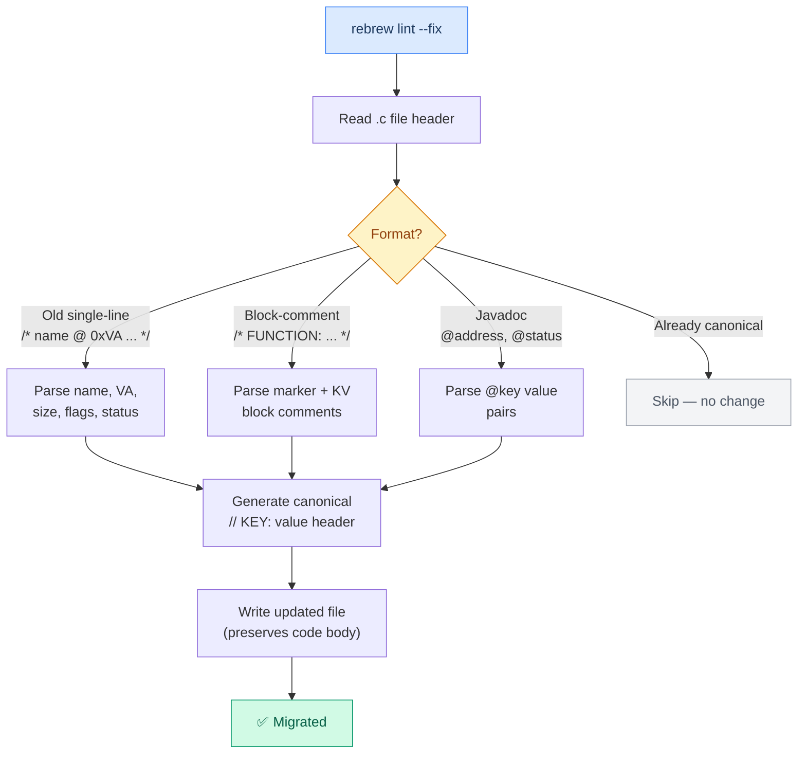

# Annotation Reference

Rebrew annotations are built on the [reccmp](https://github.com/isledecomp/reccmp) annotation format — the standard used by the LEGO Island decompilation project.

## What comes from reccmp

The `// MARKER: MODULE 0xVA` syntax and the following **markers** are reccmp's format:

| Marker | reccmp usage |
|--------|-------------|
| `FUNCTION` | Non-library functions |
| `LIBRARY` | Third-party / statically-linked library functions |
| `GLOBAL` | Global variables in `.data`, `.rdata`, or `.bss` |
| `VTABLE` | C++ virtual function tables |
| `STRING` | String literals |

Rebrew currently uses `FUNCTION`, `LIBRARY`, and `GLOBAL` from the reccmp set. `VTABLE` and `STRING` are recognized but not actively used.

## What rebrew adds

Rebrew extends the reccmp baseline with:

| Addition | Purpose |
|----------|---------|
| `DATA` marker | Marks standalone global data (`// DATA: MODULE 0xVA`) |
| `STUB` marker | Marks incomplete implementations (`STATUS: STUB`) — not a reccmp marker |
| `STATUS` key | Track match quality (EXACT, RELOC, MATCHING, etc.) |
| `ORIGIN` key | Code provenance — config-driven (e.g. GAME, MSVCRT, ZLIB) |
| `CFLAGS` key | Compiler flags needed to reproduce original compilation |
| `SIZE` key | Function/data size in bytes from the original binary |
| `SYMBOL` key | Decorated symbol name for verifier lookup |
| `SOURCE` key | Reference file for library functions |
| `BLOCKER` key | Explanation for why a STUB doesn't match yet |
| `NOTE` key | Freeform notes |
| `GLOBALS` key | Comma-separated globals referenced by a function |
| `SKIP` key | Known acceptable byte differences |
| `SECTION` key | Section name for data annotations (`.data`, `.rdata`, `.bss`) |
| `GHIDRA` key | Tracks the Ghidra name to prevent conflict loops |
| `PROTOTYPE` key | Real typed signature pulled from Ghidra decompilation |
| `STRUCT` key | Reference to a shared struct definition pulled from Ghidra |
| `CALLERS` key | Comma-separated callers (optional, auto-generated from xrefs) |

All rebrew-specific keys use unique names that reccmp's parser safely ignores, so files remain compatible with both toolchains.

---

## Function Annotations

Every `.c` file containing a reversed function must begin with a header block:

```c
// MARKER: MODULE 0xVA
// STATUS: value
// ORIGIN: value
// SIZE: bytes
// CFLAGS: compiler_flags
// SYMBOL: _decorated_name
```

### Example

```c
// FUNCTION: SERVER 0x10008880
// STATUS: EXACT
// ORIGIN: GAME
// SIZE: 31
// CFLAGS: /O2 /Gd
// SYMBOL: _bit_reverse

int __cdecl bit_reverse(int x)
{
    return x;
}
```

### Marker Types (Functions)

| Marker | When to use |
|--------|-------------|
| `FUNCTION` | Game code (`ORIGIN: GAME`) that isn't a stub |
| `LIBRARY` | Third-party library code (origins listed in `library_origins` config) |
| `STUB` | Incomplete implementation (any origin, `STATUS: STUB`) |

Format: `// MARKER: MODULE 0xVA`

- **MODULE** — the target identifier from `rebrew-project.toml` (e.g. `SERVER`, `CLIENT`)
- **VA** — virtual address in the original binary, hex with `0x` prefix

---

## Annotation Keys (Functions)

| Key | Required? | Linter | Description |
|-----|:---------:|--------|-------------|
| Marker line | **Mandatory** | E001 | `// FUNCTION:`, `// LIBRARY:`, or `// STUB:` with MODULE and VA |
| `STATUS` | **Mandatory** | E003, E004 | Match quality (see below) |
| `ORIGIN` | **Mandatory** | E005, E006 | Code provenance (see below) |
| `SIZE` | **Mandatory** | E007, E008 | Function size in bytes from the original binary |
| `CFLAGS` | **Mandatory** | E009 | Compiler flags to reproduce original compilation (e.g. `/O2 /Gd`) |
| `SYMBOL` | **Recommended** | W001 | Decorated symbol name (e.g. `_bit_reverse`). Used by verifier to locate function in `.obj` |
| `SOURCE` | Conditional | W006 | **Required for library origins** — reference file (e.g. `SBHEAP.C:195`, `deflate.c`) |
| `BLOCKER` | Conditional | W005 | **Required for STUB** — explain why the function doesn't match yet |
| `NOTE` | Optional | — | Freeform notes (e.g. `NOTE: uses SSE2 intrinsics`) |
| `GHIDRA` | Optional | — | The Ghidra name, added by `rebrew sync --pull --accept-local` to prevent conflict loops |
| `PROTOTYPE` | Optional | — | Added by `rebrew sync --pull-signatures` |
| `STRUCT` | Optional | — | Linked structs for this file |
| `CALLERS` | Optional | — | Incoming cross-references |
| `GLOBALS` | Optional | — | Comma-separated list of globals referenced (e.g. `g_counter, g_state`) |
| `SKIP` | Optional | — | Known acceptable byte differences (e.g. `SKIP: xor edi,edi after call`) |

> [!TIP]
> **Rule of thumb**: The first 5 keys (marker through CFLAGS) are enforced as errors — missing any of them will fail CI. `SYMBOL` is strongly recommended. `SOURCE` and `BLOCKER` are enforced as warnings only for specific origins/statuses.

### STATUS Values

| Status | Meaning |
|--------|---------|
| `EXACT` | Compiled bytes are identical to the original |
| `RELOC` | Matches after masking relocation addresses |
| `MATCHING` | Functionally equivalent but bytes differ |
| `MATCHING_RELOC` | Functionally equivalent with reloc masking |
| `STUB` | Placeholder, doesn't match yet |

### ORIGIN Values

Origins are **config-driven** — each project defines its own in `rebrew-project.toml`. Example defaults:

| Origin | Meaning | Default CFLAGS |
|--------|---------|----------------|
| `GAME` | Original game code | `/O2 /Gd` |
| `MSVCRT` | Microsoft Visual C++ runtime library | `/O1` |
| `ZLIB` | zlib compression library | `/O2` |

Configure in `rebrew-project.toml`:

```toml
[targets."server.dll"]
origins = ["GAME", "MSVCRT", "ZLIB"]       # valid ORIGIN values
default_origin = "GAME"                      # default when not specified
library_origins = ["MSVCRT", "ZLIB"]         # origins using LIBRARY marker

[targets."server.dll".origin_comments]       # skeleton preamble per origin
GAME = "TODO: Add extern declarations for globals and called functions"
MSVCRT = "CRT function - check tools/MSVC600/VC98/CRT/SRC/ for original source"

[targets."server.dll".origin_todos]          # skeleton TODO text per origin
GAME = "Implement based on Ghidra decompilation"
MSVCRT = "Implement from CRT source"
```

If `library_origins` is not set, it defaults to all origins except the first (the first origin is treated as the primary/FUNCTION origin).

---

## Data Annotations (.data / .rdata / .bss)

Global variables, dispatch tables, const arrays, and string tables live in the data sections. These are annotated using rebrew's `DATA` marker (or reccmp's `GLOBAL` marker).

### Format

```c
// DATA: MODULE 0xVA
// SIZE: bytes
// SECTION: .data | .rdata | .bss
// ORIGIN: value
// NOTE: optional description
```

### Examples

#### Named global variable (.data)

```c
// DATA: SERVER 0x1002c5a0
// SIZE: 32
// SECTION: .data
// ORIGIN: GAME
// NOTE: dispatch table for packet handlers
extern dispatch_fn g_packet_handlers[8];
```

#### Const lookup table (.rdata)

```c
// DATA: SERVER 0x10025000
// SIZE: 256
// SECTION: .rdata
// ORIGIN: GAME
// NOTE: sprite index lookup table
const unsigned char g_sprite_lut[256] = { 0x00, 0x01, /* ... */ };
```

#### Uninitialized state (.bss)

```c
// DATA: SERVER 0x10031b78
// SIZE: 4
// SECTION: .bss
// ORIGIN: GAME
extern int g_frame_counter;
```

### Annotation Keys (Data)

| Key | Required? | Description |
|-----|:---------:|-------------|
| `DATA` marker | **Mandatory** | `// DATA: MODULE 0xVA` — the data address in the original binary |
| `SIZE` | **Mandatory** | Size of the data item in bytes |
| `SECTION` | **Mandatory** | Which PE section: `.data`, `.rdata`, or `.bss` |
| `ORIGIN` | **Recommended** | Code provenance (per project's configured origins) |
| `NOTE` | Optional | Description of the data item's purpose |

> [!NOTE]
> `DATA` markers are recognized and tracked as first-class citizens by `rebrew data` and `rebrew catalog`.

### Filename Convention

Data files should use a `data_` prefix to distinguish them from function files:

```
src/server.dll/data_dispatch_table.c       # dispatch table
src/server.dll/data_sprite_lut.c           # const lookup table
src/server.dll/data_frame_counter.c        # global state variable
```

---

## Struct SIZE Comments (reccmp recommendation)

When a file defines structs, annotate their size:

```c
// SIZE 0x1c
typedef struct {
    int x;       // 0x00
    int y;       // 0x04
    char* name;  // 0x08
} MyStruct;
```

The linter (W007) will warn if a file defining structs lacks the `// SIZE 0xNN` annotation.

---

## Linter Reference (`rebrew lint`)

The linter validates annotation headers in all `.c` files under the reversed source directory. It enforces the format described above and catches common mistakes.

```
Usage:  rebrew lint [OPTIONS]
```

### Errors (block CI, non-zero exit)

Errors indicate broken annotations that will cause `rebrew test`, `rebrew verify`, and other tools to fail.

#### Structural Errors

| Code | Description | Triggered by |
|------|-------------|--------------|
| E000 | Cannot read file | File permissions, encoding issues |
| E001 | Missing or invalid marker | No `// FUNCTION:`, `// LIBRARY:`, or `// STUB:` line, or unknown marker type |
| E002 | Invalid or suspicious VA | VA outside 32-bit range, non-hex string, or missing `0x` prefix |

#### Field Validation Errors

| Code | Description | Triggered by |
|------|-------------|--------------|
| E003 | Missing `STATUS` | No `// STATUS:` line in header |
| E004 | Invalid STATUS value | `STATUS: DONE` or other non-standard value (valid: EXACT, RELOC, MATCHING, MATCHING_RELOC, STUB) |
| E005 | Missing `ORIGIN` | No `// ORIGIN:` line in header |
| E006 | Invalid ORIGIN value | `ORIGIN: UNKNOWN` — must be in `origins` list from `rebrew-project.toml` (falls back to GAME, MSVCRT, ZLIB) |
| E007 | Missing `SIZE` | No `// SIZE:` line in header |
| E008 | Invalid SIZE value | `SIZE: -1`, `SIZE: 0`, `SIZE: abc` |
| E009 | Missing `CFLAGS` | No `// CFLAGS:` line in header |
| E010 | Unknown annotation key | `// FOOBAR: value` — key not in the known set |
| E014 | Corrupted annotation value | Literal `\n` inside a field value (typically from a line-wrapping bug) |
| E015 | Marker/ORIGIN mismatch | `// FUNCTION:` with a library origin (expected `LIBRARY`). Library origins defined by `library_origins` config |
| E016 | Filename/SYMBOL mismatch | File `func_10003da0.c` with `SYMBOL: _alloc_game_object`. Allows origin prefixes: `crt_foo.c` matches `_foo` |
| E017 | Contradictory status/marker | `STATUS: MATCHING` on a `// STUB:` marker |

#### Config-Aware Errors (require `rebrew-project.toml`)

| Code | Description | Triggered by |
|------|-------------|--------------|
| E012 | Module name mismatch | `// FUNCTION: CLIENT 0x...` when `rebrew-project.toml` says `marker = "SERVER"` |

#### Cross-File Errors

| Code | Description | Triggered by |
|------|-------------|--------------|
| E013 | Duplicate VA | Two files annotate the same virtual address |

---

### Warnings (advisory, zero exit)

Warnings indicate style issues, missing optional fields, or format migration opportunities.

#### Missing Recommended Fields

| Code | Description | Triggered by |
|------|-------------|--------------|
| W001 | Missing `SYMBOL` | No `// SYMBOL:` line (recommended for verifier) |
| W003 | No function implementation | File has annotations but no C code body |
| W005 | STUB missing `BLOCKER` | `STATUS: STUB` without `// BLOCKER:` explaining why |
| W006 | Library missing `SOURCE` | Library origin (per `library_origins` config) without `// SOURCE:` pointing to reference file |
| W007 | Struct without SIZE annotation | File defines `typedef struct` but lacks `// SIZE 0xNN` comment |

#### Format Migration Warnings

| Code | Description | Triggered by |
|------|-------------|--------------|
| W002 | Old single-line format | `/* func @ 0xVA (NB) - /flags - STATUS [ORIGIN] */` — run `--fix` |
| W012 | Block-comment format | `/* FUNCTION: SERVER 0x... */` — run `--fix` |
| W013 | Javadoc format | `@address 0x...` / `@status RELOC` — run `--fix` |

#### Consistency Warnings

| Code | Description | Triggered by |
|------|-------------|--------------|
| W008 | CFLAGS differ from preset | `CFLAGS: /O2 /Gd` on a `MSVCRT` function when preset says `/O1` |
| W014 | Filename prefix mismatch | File named `crt_malloc.c` with `ORIGIN: GAME` (prefix `crt_` implies MSVCRT) |
| W015 | Mixed-case VA hex digits | `0x10003Da0` — prefer consistent `0x10003da0` or `0x10003DA0` |

#### Data Annotation Warnings

| Code | Description | Triggered by |
|------|-------------|--------------|
| W016 | DATA/GLOBAL missing `SECTION` | `// DATA:` or `// GLOBAL:` marker without `// SECTION:` (.data, .rdata, .bss) |
| W017 | NOTE contains sync metadata | `NOTE: [rebrew] ...` — looks like auto-generated sync metadata, not a human note |

---

### CLI Options

| Flag | Description |
|------|-------------|
| `--fix` | Auto-migrate old/block/javadoc format headers to canonical `// KEY: value` format |
| `--quiet` | Suppress warnings, show errors only |
| `--json` | Machine-readable JSON output (schema below) |
| `--summary` | Print status × origin breakdown table after results |
| `--files FILE [FILE...]` | Check specific files instead of scanning the entire directory |
| `--target NAME` | Select a target from `rebrew-project.toml` (for config-aware checks) |

### Example Usage

```bash
# Lint all files in the configured source directory
rebrew lint

# Fix legacy annotations and re-lint
rebrew lint --fix && rebrew lint

# CI pipeline — errors only, JSON for parsing
rebrew lint --quiet --json > lint-results.json

# Check a specific file during development
rebrew lint --files src/server.dll/alloc_game_object.c

# Print progress breakdown after linting
rebrew lint --summary
```

### `--fix` Migration Flow



### JSON Output Schema

```json
{
  "total": 463,
  "passed": 190,
  "errors": 1,
  "warnings": 396,
  "files": [
    {
      "file": "func_10003da0.c",
      "path": "/path/to/src/server.dll/func_10003da0.c",
      "errors": [
        {"line": 1, "code": "E004", "message": "Invalid STATUS: DONE"}
      ],
      "warnings": [
        {"line": 1, "code": "W001", "message": "Missing // SYMBOL: annotation (recommended)"}
      ],
      "passed": false
    }
  ]
}
```

### `--summary` Output

When `--summary` is passed, the linter prints a breakdown table after results:

```
Summary
Category  Value     Count
STATUS    RELOC       198
STATUS    STUB        141
STATUS    MATCHING     63
STATUS    EXACT        60
ORIGIN    MSVCRT      217
ORIGIN    GAME        207
ORIGIN    ZLIB         38
MARKER    STUB        141
MARKER    LIBRARY     114
MARKER    FUNCTION    207
```

---

## Filename Conventions

| Prefix | ORIGIN | Example |
|--------|--------|---------|
| `crt_` | MSVCRT | `crt_malloc.c`, `crt_sbh_alloc_new_group.c` |
| `zlib_` | ZLIB | `zlib_deflateReset.c`, `zlib_inflate_blocks_new.c` |
| `game_` | GAME | `game_allocate_entity_slot.c` |
| `data_` | (any) | `data_dispatch_table.c`, `data_sprite_lut.c` |
| `func_` | (any) | `func_10008880.c` — unnamed, address-based (pre-reversal) |

The linter accepts both `crt_foo.c` and `foo.c` for SYMBOL `_foo` when ORIGIN is MSVCRT. It will warn (W014) if a `crt_*` file has `ORIGIN: GAME`.

---

## Old Format (Legacy)

The old format is a single-line comment:

```c
/* func_name @ 0x10008880 (31B) - /O2 /Gd - EXACT [GAME] */
```

Run `rebrew lint --fix` to auto-migrate to the new multi-line format.

### Block-Comment Format (Legacy)

```c
/* FUNCTION: SERVER 0x10003260 */
/* STATUS: MATCHING */
/* ORIGIN: GAME */
/* SIZE: 183 */
/* CFLAGS: /O2 /Gd */
/* SYMBOL: _AnalyzeInstruction */
```

### Javadoc Format (Legacy)

```c
/**
 * @brief Core logging function
 * @address 0x10003640
 * @size 132
 * @cflags /O2 /Gd
 * @symbol _LogMessageInternal
 * @origin GAME
 * @status RELOC
 */
```

All legacy formats are auto-migrated by `rebrew lint --fix`.

---


### Multi-Target Support

Rebrew supports maintaining code for multiple targets (e.g., `LEGO1` and `BETA10`) in the exact same `.c` file.
When parsing annotations, Rebrew extracts the module name from the `// FUNCTION: <MODULE> 0x...` marker.
If you pass `--target BETA10` to a CLI tool, Rebrew will **automatically ignore** any annotation blocks that belong to `LEGO1`.

```c
// FUNCTION: LEGO1 0x1009a8c0
// STATUS: EXACT
// SYMBOL: my_func

// FUNCTION: BETA10 0x101832f7
// STATUS: MATCHING
// SYMBOL: my_func
void my_func() {}
```

This allows you to test the identical C function against different binaries at different virtual addresses without duplicating source files.

## Multi-Function Files

A single `.c` file may contain **multiple `// FUNCTION:` annotation blocks**, each with its own `STATUS`, `SIZE`, `SYMBOL`, etc. This enables grouping related functions together (e.g., all CRT environment functions in one file).

### Format

Each annotation block follows the same format as a single-function file. Blocks are separated by code:

```c
// FUNCTION: SERVER 0x10022340
// STATUS: MATCHING
// ORIGIN: MSVCRT
// SIZE: 125
// CFLAGS: /O1 /Gd
// SYMBOL: _getenv

char *getenv(const char *name)
{
    /* implementation */
}

// FUNCTION: SERVER 0x10022f83
// STATUS: STUB
// BLOCKER: initial decompilation - needs analysis
// ORIGIN: MSVCRT
// SIZE: 110
// CFLAGS: /O1 /Gd
// SYMBOL: __wsetenvp

int _wsetenvp(void)
{
    /* TODO: Implement from CRT source */
    return 0;
}
```

### Rules

- Each `// FUNCTION:` marker starts a new annotation block
- Key-value lines (`// STATUS:`, `// SIZE:`, etc.) attach to the most recent marker
- Code lines between blocks are ignored by the parser — they don't terminate scanning
- `parse_c_file()` returns only the **first** annotation (backward compatible)
- `parse_c_file_multi()` returns **all** annotations as a list

### Creating Multi-Function Files

Use `rebrew skeleton --append` to add a function to an existing file:

```bash
# Create the first function
rebrew skeleton 0x10022340 --name getenv

# Append a related function to the same file
rebrew skeleton 0x10022f83 --append crt_getenv.c
```

### Testing Multi-Function Files

`rebrew test` automatically detects multi-function files and tests each symbol independently:

```bash
# Tests all annotated functions in the file (compiles once, tests each symbol)
rebrew test src/server.dll/crt_getenv.c
```

### When to Use Multi-Function Files

| Use case | Recommendation |
|----------|---------------|
| Related CRT functions (`getenv`/`setenv`/`putenv`) | ✅ Group together |
| Functions sharing static data | ✅ Group together |
| Independent game functions | ❌ Keep separate |
| Functions with different CFLAGS | ⚠️ Only if all share the same flags for compilation |

> [!IMPORTANT]
> All functions in a multi-function file are compiled together with the **same CFLAGS**.
> Only group functions that use identical compiler flags.
