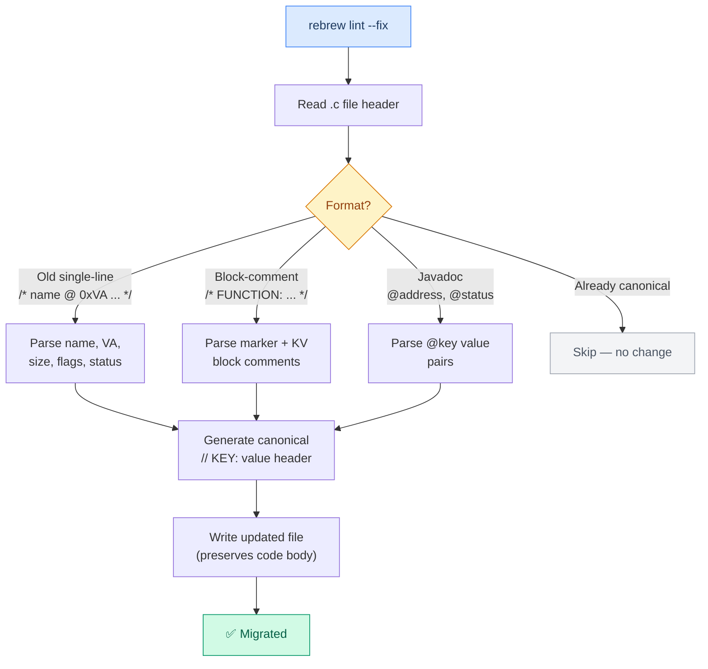

# Annotation Reference

Rebrew annotations are built on the [reccmp](https://github.com/isledecomp/reccmp) annotation format — the standard used by the LEGO Island decompilation project.

## What comes from reccmp

The `// MARKER: MODULE 0xVA` syntax and the following **markers** are reccmp's format:

| Marker | reccmp usage |
|--------|-------------|
| `FUNCTION` | Non-library functions |
| `LIBRARY` | Third-party / statically-linked library functions |
| `GLOBAL` | Global variables in `.data`, `.rdata`, or `.bss` |
| `VTABLE` | C++ virtual function tables |
| `STRING` | String literals |

Rebrew currently uses `FUNCTION`, `LIBRARY`, and `GLOBAL` from the reccmp set. `VTABLE` and `STRING` are recognized but not actively used.

## What rebrew adds

Rebrew extends the reccmp baseline with:

| Addition | Purpose |
|----------|---------|
| `DATA` marker | Marks standalone global data (`// DATA: MODULE 0xVA`) |
| `STUB` marker | Marks incomplete implementations (`STATUS: STUB`) — not a reccmp marker |
| `STATUS` key | Track match quality (EXACT, RELOC, MATCHING, etc.) |
| `CFLAGS` key | Compiler flags needed to reproduce original compilation |
| `SIZE` key | Function/data size in bytes from the original binary |
| `SOURCE` key | Reference file for library functions |
| `BLOCKER` key | Explanation for why a STUB doesn't match yet |
| `NOTE` key | Freeform notes |
| `GLOBALS` key | Comma-separated globals referenced by a function |
| `SKIP` key | Known acceptable byte differences |
| `SECTION` key | Section name for data annotations (`.data`, `.rdata`, `.bss`) |
| `GHIDRA` key | Tracks the Ghidra name to prevent conflict loops |
| `STRUCT` key | Reference to a shared struct definition pulled from Ghidra |
| `CALLERS` key | Comma-separated callers (optional, auto-generated from xrefs) |

> **Note:** `SYMBOL` and `PROTOTYPE` are now **derived automatically** from the C function definition.
> No explicit `// SYMBOL:` or `// PROTOTYPE:` annotation is needed.

All rebrew-specific keys use unique names that reccmp's parser safely ignores, so files remain compatible with both toolchains.

---

## Function Annotations

Every `.c` file containing a reversed function must begin with a **marker line**:

```c
// MARKER: MODULE 0xVA
```

That's it. All metadata (STATUS, SIZE, CFLAGS, BLOCKER, etc.) lives in the `rebrew-function.toml`
sidecar found via walk-up from the source file's directory (rebrew climbs parent dirs
until it is found), managed automatically by the CLI tools.

> [!CAUTION]
> **Never manually add STATUS, SIZE, or CFLAGS to a `.c` file.** These are managed
> by `rebrew test`, `rebrew verify --fix-status`, `rebrew match`, and `rebrew sync`.
> Manual edits to `rebrew-function.toml` or volatile annotation lines in `.c` files
> will be overwritten or ignored.

### Example

```c
// FUNCTION: SERVER 0x10008880

int __cdecl bit_reverse(int x)
{
    return x;
}
```

`rebrew-function.toml` (found via walk-up, managed by tools):
```toml
["0x10008880"]
status = "EXACT"
size = 31
```

### Marker Types (Functions)

| Marker | When to use |
|--------|-------------|
| `FUNCTION` | Non-library game code that isn't a stub |
| `LIBRARY` | Third-party library code (modules configured as `library_origins` in config) |
| `STUB` | Incomplete implementation (`STATUS: STUB`) |

Format: `// MARKER: MODULE 0xVA`

- **MODULE** — the target identifier from `rebrew-project.toml` (e.g. `SERVER`, `CLIENT`)
- **VA** — virtual address in the original binary, hex with `0x` prefix

---

## Annotation Keys (Functions)

| Key | Required? | Linter | Description |
|-----|:---------:|--------|-------------|
| Marker line | **Mandatory** | E001 | `// FUNCTION:`, `// LIBRARY:`, or `// STUB:` with MODULE and VA |
| `STATUS` | **Mandatory** | E003, E004 | Match quality (see below) |
| `SIZE` | **Mandatory** | E007, E008 | Function size in bytes from the original binary |
| `CFLAGS` | Optional | W018 | Per-function compiler flag override. Falls back to the target's `base_cflags` / `cflags_presets` in `rebrew-project.toml`. Only needed for functions compiled with non-default flags (e.g. a static lib linked with `/O1` into an `/O2` binary). |
| `SOURCE` | Conditional | W006 | **Required for library origins** — reference file (e.g. `SBHEAP.C:195`, `deflate.c`). Use `rebrew crt-match --fix-source` to auto-populate. |
| `BLOCKER` | Conditional | W005 | **Required for STUB** — explain why the function doesn't match yet. Now lives in `rebrew-function.toml` sidecar; auto-added by `rebrew promote` on demotion. |
| `NOTE` | Optional | — | Freeform notes (e.g. `NOTE: uses SSE2 intrinsics`) — lives in sidecar |
| `GHIDRA` | Optional | — | The Ghidra name, added by `rebrew sync --pull --accept-local` to prevent conflict loops — lives in sidecar |
| `STRUCT` | Optional | — | Linked structs for this file |
| `CALLERS` | Optional | — | Incoming cross-references |
| `GLOBALS` | Optional | — | Comma-separated list of globals referenced (e.g. `g_counter, g_state`) |
| `SKIP` | Optional | — | Known acceptable byte differences (e.g. `SKIP: xor edi,edi after call`) |
| `ANALYSIS` | Optional | — | Freeform analysis notes from decompiler or reverse engineer |

> [!CAUTION]
> **Never manually edit `rebrew-function.toml`.** This sidecar file stores volatile metadata
> (STATUS, CFLAGS, SIZE, BLOCKER, NOTE, GHIDRA, etc.) and is managed exclusively by
> Rebrew CLI tools (`rebrew promote`, `rebrew match`, `rebrew sync`, etc.).
> Manual edits will be silently lost or may corrupt the file.

> [!TIP]
> **Rule of thumb**: Marker, STATUS, and SIZE are enforced as errors by the linter — missing any
> of them will fail CI. CFLAGS is optional and falls back to the target default from config.
> `SOURCE` and `BLOCKER` are enforced as warnings only for specific origins/statuses. Function
> name and symbol are derived automatically from the C function definition.

### STATUS Values

| Status | Meaning |
|--------|---------|
| `EXACT` | Compiled bytes are identical to the original |
| `RELOC` | Matches after masking relocation addresses |
| `MATCHING` | Functionally equivalent but bytes differ |
| `MATCHING_RELOC` | Functionally equivalent with reloc masking |
| `PROVEN` | Semantically equivalent, proven via symbolic execution (angr + Z3) |
| `STUB` | Placeholder, doesn't match yet |

### Origin / Compiler Preset Configuration

Origin is a **project-level concept** — not a per-function `.c` annotation. Each project
configures its own origins (compiler profiles) in `rebrew-project.toml`:

```toml
[targets."server.dll"]
origins = ["GAME", "MSVCRT", "ZLIB"]       # known compiler profiles
default_origin = "GAME"                      # applied when unspecified
library_origins = ["MSVCRT", "ZLIB"]         # origins using LIBRARY marker

[targets."server.dll".origin_comments]       # skeleton preamble per origin
GAME = "TODO: Add extern declarations for globals and called functions"
MSVCRT = "CRT function - check tools/MSVC600/VC98/CRT/SRC/ for original source"

[targets."server.dll".origin_todos]          # skeleton TODO text per origin
GAME = "Implement based on Ghidra decompilation"
MSVCRT = "Implement from CRT source"
```

The origin is **inferred from the module name** — either via the `default_origin` setting
or by matching the module against `library_origins`. There is no `// ORIGIN:` annotation
in `.c` files.

---

## Data Annotations (.data / .rdata / .bss)

Global variables, dispatch tables, const arrays, and string tables live in the data sections. These are annotated using rebrew's `DATA` marker (or reccmp's `GLOBAL` marker).

### Format

The **reccmp-compatible marker line** stays in the `.c` file.  All rebrew-specific
metadata (SIZE, SECTION, NOTE) lives in the **`rebrew-data.toml` sidecar** — the
data analogue of `rebrew-function.toml` (also found via walk-up from the source file's directory).

**`.c` file** (only the stable identity):
```c
// DATA: MODULE 0xVA

extern type name;
```

**`rebrew-data.toml`** (found via walk-up from source dir, auto-managed):
```toml
["MODULE.0xVA"]
size    = <bytes>
section = ".data" | ".rdata" | ".bss"
note    = "optional description"
```

### Examples

#### Named global variable (.data)

`.c` file:
```c
// DATA: SERVER 0x1002c5a0

extern dispatch_fn g_packet_handlers[8];
```

`rebrew-data.toml`:
```toml
["SERVER.0x1002c5a0"]
size    = 32
section = ".data"
note    = "dispatch table for packet handlers"
```

#### Const lookup table (.rdata)

`.c` file:
```c
// DATA: SERVER 0x10025000

const unsigned char g_sprite_lut[256] = { 0x00, 0x01, /* ... */ };
```

`rebrew-data.toml`:
```toml
["SERVER.0x10025000"]
size    = 256
section = ".rdata"
note    = "sprite index lookup table"
```

#### Uninitialized state (.bss)

`.c` file:
```c
// DATA: SERVER 0x10031b78

extern int g_frame_counter;
```

`rebrew-data.toml`:
```toml
["SERVER.0x10031b78"]
size    = 4
section = ".bss"
```

### Annotation Keys (Data)

| Key | Location | Required? | Description |
|-----|----------|:---------:|-------------|
| `DATA` marker | `.c` file | **Mandatory** | `// DATA: MODULE 0xVA` — the data address in the original binary |
| `name` | `rebrew-data.toml` | Optional | Preferred variable name (overrides C stem; import target from BinSync/IDA) |
| `size` | `rebrew-data.toml` | Recommended | Size of the data item in bytes |
| `section` | `rebrew-data.toml` | Recommended | Which PE section: `.data`, `.rdata`, or `.bss` |
| `note` | `rebrew-data.toml` | Optional | Description of the data item's purpose |

> [!NOTE]
> `DATA` markers are recognized and tracked as first-class citizens by `rebrew data` and `rebrew catalog`.
> The `rebrew-data.toml` sidecar is created and updated automatically by rebrew tools.
> **Never edit it manually.**

### Filename Convention

Data files should use a `data_` prefix to distinguish them from function files:

```
src/server.dll/data_dispatch_table.c       # dispatch table
src/server.dll/data_sprite_lut.c           # const lookup table
src/server.dll/data_frame_counter.c        # global state variable
```

---

## Struct SIZE Comments (reccmp recommendation)

When a file defines structs, annotate their size:

```c
// SIZE 0x1c
typedef struct {
    int x;       // 0x00
    int y;       // 0x04
    char* name;  // 0x08
} MyStruct;
```

The linter (W007) will warn if a file defining structs lacks the `// SIZE 0xNN` annotation.

---

## Linter Reference (`rebrew lint`)

The linter validates annotation headers in all `.c` files under the reversed source directory. It enforces the format described above and catches common mistakes.

Before running validation, the linter loads the **`rebrew-function.toml`** sidecar for each directory and overlays any fields it contains into the annotation being checked. This means that files whose STATUS, SIZE, CFLAGS etc. live only in the sidecar (no inline annotation) will still pass validation correctly — sidecar values count just as much as inline values.

```
Usage:  rebrew lint [OPTIONS]
```

### Errors (block CI, non-zero exit)

Errors indicate broken annotations that will cause `rebrew test`, `rebrew verify`, and other tools to fail.

#### Structural Errors

| Code | Description | Triggered by |
|------|-------------|--------------|
| E000 | Cannot read file | File permissions, encoding issues |
| E001 | Missing or invalid marker | No `// FUNCTION:`, `// LIBRARY:`, or `// STUB:` line, or unknown marker type |
| E002 | Invalid or suspicious VA | VA outside 32-bit range, non-hex string, or missing `0x` prefix |

#### Field Validation Errors

| Code | Description | Triggered by |
|------|-------------|--------------|
| E003 | Missing `STATUS` | No `// STATUS:` line in header |
| E004 | Invalid STATUS value | `STATUS: DONE` or other non-standard value (valid: EXACT, RELOC, MATCHING, MATCHING_RELOC, PROVEN, STUB) |
| E006 | *(reserved)* | Unused — was ORIGIN validation |
| E007 | Missing `SIZE` | No `// SIZE:` line in header |
| E008 | Invalid SIZE value | `SIZE: -1`, `SIZE: 0`, `SIZE: abc` |
| E014 | Corrupted annotation value | Literal `\n` inside a field value (typically from a line-wrapping bug) |
| E015 | Marker/module mismatch | `// FUNCTION:` with a library-configured module (expected `LIBRARY`). Library modules defined by `library_origins` config |
| E017 | Contradictory status/marker | `STATUS: MATCHING` on a `// STUB:` marker |

#### Config-Aware Errors (require `rebrew-project.toml`)

| Code | Description | Triggered by |
|------|-------------|--------------|
| E012 | Module name mismatch | `// FUNCTION: CLIENT 0x...` when `rebrew-project.toml` says `marker = "SERVER"` |

#### Cross-File Errors

| Code | Description | Triggered by |
|------|-------------|--------------|
| E013 | Duplicate VA | Two files annotate the same virtual address |

---

### Warnings (advisory, zero exit)

Warnings indicate style issues, missing optional fields, or format migration opportunities.

#### Missing Recommended Fields

| Code | Description | Triggered by |
|------|-------------|--------------|
| W003 | No function implementation | File has annotations but no C code body |
| W005 | STUB missing `BLOCKER` | `STATUS: STUB` without `// BLOCKER:` explaining why |
| W006 | Library missing `SOURCE` | Library module (per `library_origins` config) without `// SOURCE:` pointing to reference file |
| W007 | Struct without SIZE annotation | File defines `typedef struct` but lacks `// SIZE 0xNN` comment |

#### Format Migration Warnings

| Code | Description | Triggered by |
|------|-------------|--------------|
| W002 | Old single-line format | `/* func @ 0xVA (NB) - /flags - STATUS */` — run `--fix` |
| W012 | Block-comment format | `/* FUNCTION: SERVER 0x... */` — run `--fix` |
| W013 | Javadoc format | `@address 0x...` / `@status RELOC` — run `--fix` |

#### Consistency Warnings

| Code | Description | Triggered by |
|------|-------------|--------------|
| W008 | CFLAGS differ from preset | `CFLAGS: /O2 /Gd` on a `MSVCRT` function when preset says `/O1` |
| W018 | Missing CFLAGS with no config fallback | No `// CFLAGS:` line **and** no `base_cflags` in project config — compile may use wrong flags |
| W019 | *(reserved)* | Unused — was missing ORIGIN warning |
| W010 | Unknown annotation key | `// FOOBAR: value` — key not in the known set |
| W015 | Mixed-case VA hex digits | `0x10003Da0` — prefer consistent `0x10003da0` or `0x10003DA0` |

#### Data Annotation Warnings

| Code | Description | Triggered by |
|------|-------------|--------------|
| W016 | DATA/GLOBAL missing `section` in sidecar | `// DATA:` or `// GLOBAL:` marker with no `section` in `rebrew-data.toml` (.data, .rdata, .bss) |
| W017 | NOTE contains sync metadata | `NOTE: [rebrew] ...` — looks like auto-generated sync metadata, not a human note |

---

### CLI Options

| Flag | Description |
|------|-------------|
| `--fix` | Auto-migrate old/block/javadoc format headers to canonical `// KEY: value` format |
| `--quiet` | Suppress warnings, show errors only |
| `--json` | Machine-readable JSON output (schema below) |
| `--summary` | Print status × origin breakdown table after results |
| `--files FILE [FILE...]` | Check specific files instead of scanning the entire directory |
| `--target NAME` | Select a target from `rebrew-project.toml` (for config-aware checks) |

### Example Usage

```bash
# Lint all files in the configured source directory
rebrew lint

# Fix legacy annotations and re-lint
rebrew lint --fix && rebrew lint

# CI pipeline — errors only, JSON for parsing
rebrew lint --quiet --json > lint-results.json

# Check a specific file during development
rebrew lint --files src/server.dll/alloc_game_object.c

# Print progress breakdown after linting
rebrew lint --summary
```

### `--fix` Migration Flow


```mermaid
graph TD
    A["rebrew lint --fix"] --> B["Read .c file header"]
    B --> C{"Format?"}
    C -->|"Old single-line<br/>/* name @ 0xVA ... */"| D["Parse name, VA,<br/>size, flags, status"]
    C -->|"Block-comment<br/>/* FUNCTION: ... */"| E["Parse marker + KV<br/>block comments"]
    C -->|"Javadoc<br/>@address, @status"| F["Parse @key value<br/>pairs"]
    C -->|"Already canonical"| G["Skip — no change"]

    D --> H["Generate canonical<br/>// KEY: value header"]
    E --> H
    F --> H

    H --> I["Write updated file<br/>(preserves code body)"]
    I --> J["✅ Migrated"]

    style A fill:#dbeafe,stroke:#3b82f6,color:#1e3a5f
    style J fill:#d1fae5,stroke:#059669,color:#065f46
    style G fill:#f3f4f6,stroke:#9ca3af,color:#4b5563
    style C fill:#fef3c7,stroke:#d97706,color:#92400e
```

### JSON Output Schema

```json
{
  "total": 463,
  "passed": 190,
  "errors": 1,
  "warnings": 396,
  "files": [
    {
      "file": "func_10003da0.c",
      "path": "/path/to/src/server.dll/func_10003da0.c",
      "errors": [
        {"line": 1, "code": "E004", "message": "Invalid STATUS: DONE"}
      ],
      "passed": false
    }
  ]
}
```

### `--summary` Output

When `--summary` is passed, the linter prints a breakdown table after results:

```
Summary
Category  Value     Count
STATUS    RELOC       198
STATUS    STUB        141
STATUS    MATCHING     63
STATUS    EXACT        60
MARKER    STUB        141
MARKER    LIBRARY     114
MARKER    FUNCTION    207
```

---

## Filename Conventions

Filenames are derived from the function's symbol name — no origin-based prefixes are added.
Users control the directory structure freely (e.g. `rendering/draw.c`, `crt/malloc.c`).

| Pattern | Example |
|---------|---------|
| Symbol-based | `malloc.c`, `ParsePacket.c`, `deflateReset.c` |
| `data_` prefix | `data_dispatch_table.c`, `data_sprite_lut.c` |
| `func_` prefix | `func_10008880.c` — unnamed, address-based (pre-reversal) |

Filenames do not need to match the function name — multi-function files
and grouped files (e.g., `command.c` with multiple functions) are common.

---

## Old Format (Legacy)

The old format is a single-line comment:

```c
/* func_name @ 0x10008880 (31B) - /O2 /Gd - EXACT [GAME] */
```

Run `rebrew lint --fix` to auto-migrate to the new multi-line format.

### Block-Comment Format (Legacy)

```c
/* FUNCTION: SERVER 0x10003260 */
/* STATUS: MATCHING */
/* SIZE: 183 */
/* CFLAGS: /O2 /Gd */
```

### Javadoc Format (Legacy)

```c
/**
 * @brief Core logging function
 * @address 0x10003640
 * @size 132
 * @cflags /O2 /Gd
 * @status RELOC
 */
```

All legacy formats are auto-migrated by `rebrew lint --fix`.

---


### Multi-Target Support

Rebrew supports maintaining code for multiple targets (e.g., `LEGO1` and `BETA10`) in the exact same `.c` file.
When parsing annotations, Rebrew extracts the module name from the `// FUNCTION: <MODULE> 0x...` marker.
If you pass `--target BETA10` to a CLI tool, Rebrew will **automatically ignore** any annotation blocks that belong to `LEGO1`.

```c
// FUNCTION: LEGO1 0x1009a8c0
// STATUS: EXACT

// FUNCTION: BETA10 0x101832f7
// STATUS: MATCHING
void my_func() {}
```

This allows you to test the identical C function against different binaries at different virtual addresses without duplicating source files.

#### Version differences

A common use-case is the same function appearing at a different VA across retail builds of the game. Annotate both addresses in the same file and rebrew diffing will test whichever target you select:

```c
// FUNCTION: SERVER_V1 0x10022340
// FUNCTION: SERVER_V2 0x10023b10

char *getenv(const char *name)
{
    /* implementation */
}
```

`rebrew-project.toml` defines both as separate targets pointing to their respective DLL:

```toml
[targets."server_v1.dll"]
marker = "SERVER_V1"

[targets."server_v2.dll"]
marker = "SERVER_V2"
```

Running `rebrew test --target SERVER_V2 getenv.c` will compile and diff against the v2 binary, ignoring the `SERVER_V1` annotation block entirely.

## Multi-Function Files

A single `.c` file may contain **multiple `// FUNCTION:` annotation blocks**, each with its own `STATUS`, `SIZE`, etc. This enables grouping related functions together (e.g., all CRT environment functions in one file).

Use `rebrew split` to break a multi-function file into individual files, or `rebrew merge` to combine single-function files into one. Use `rebrew split --va 0xVA` to extract a single function for focused iteration (creates `source_c/name.c` and removes the block from the original). Both tools preserve annotation blocks and shared preamble.

### Format

Each annotation block follows the same format as a single-function file. Blocks are separated by code:

```c
// FUNCTION: SERVER 0x10022340

char *getenv(const char *name)
{
    /* implementation */
}

// FUNCTION: SERVER 0x10022f83

int _wsetenvp(void)
{
    /* TODO: Implement from CRT source */
    return 0;
}
```

### Rules

- Each `// FUNCTION:` marker starts a new annotation block
- Key-value lines (`// STATUS:`, `// SIZE:`, etc.) attach to the most recent marker
- Code lines between blocks are ignored by the parser — they don't terminate scanning
- `parse_c_file()` returns only the **first** annotation (backward compatible)
- `parse_c_file_multi()` returns **all** annotations as a list

### Creating Multi-Function Files

Use `rebrew skeleton --append` to add a function to an existing file:

```bash
# Create the first function
rebrew skeleton 0x10022340 --name getenv

# Append a related function to the same file
rebrew skeleton 0x10022f83 --append getenv.c
```

### Testing Multi-Function Files

`rebrew test` automatically detects multi-function files and tests each symbol independently:

```bash
# Tests all annotated functions in the file (compiles once, tests each symbol)
rebrew test src/server.dll/getenv.c
```

### When to Use Multi-Function Files

| Use case | Recommendation |
|----------|---------------|
| Related CRT functions (`getenv`/`setenv`/`putenv`) | ✅ Group together |
| Functions sharing static data | ✅ Group together |
| Independent game functions | ❌ Keep separate |
| Functions with different CFLAGS | ⚠️ Only if all share the same flags for compilation |

> [!IMPORTANT]
> All functions in a multi-function file are compiled together with the **same CFLAGS**.
> Only group functions that use identical compiler flags.

---

## Library Header Files (`library_*.h`)

Library header files provide a lightweight way to register known library functions
(CRT, zlib, etc.) in the catalog without creating individual `.c` files. These are
functions you've **identified** — they show up in coverage stats as covered, and
`rebrew next` / `rebrew skeleton` won't suggest them as work items.

### Filename Convention

Files must be named `library_<suffix>.h`. The suffix determines the default ORIGIN:

| Filename | Inferred ORIGIN |
|----------|----------------|
| `library_msvc.h` | MSVCRT |
| `library_msvcrt.h` | MSVCRT |
| `library_crt.h` | MSVCRT |
| `library_zlib.h` | ZLIB |
| `library_<other>.h` | `<OTHER>` (uppercased) |

### Minimal Format (reccmp-compatible)

For functions you've identified but don't intend to recompile (pure CRT stubs, etc.):

```c
#ifdef 0
// LIBRARY: SERVER 0x1001A18A
// _fflush

// LIBRARY: SERVER 0x1001A1BB
// __fclose_lk
#endif
```

Each entry is two lines: the `// LIBRARY:` marker and a `// _symbol` comment.
This format is fully compatible with [reccmp](https://github.com/isledecomp/reccmp).

### Extended Format (rebrew-only)

For library functions you actively compile and match from reference source (e.g. zlib),
add key-value annotation lines **after** the symbol line:

```c
// LIBRARY: SERVER 0x10050000
// _deflate
// STATUS: MATCHING
// SIZE: 120
// CFLAGS: /O2 /Gd
// SOURCE: deflate.c
// BLOCKER: 2B diff in loop epilogue
```

reccmp's parser reads the marker + symbol, calls `_function_done()`, and resets to
search state. The KV lines are invisible to reccmp but captured by rebrew.

Supported KV keys: `STATUS`, `SIZE`, `CFLAGS`, `SOURCE`, `BLOCKER`, `NOTE`.

Entries without explicit `STATUS` default to `EXACT`. Entries without `SIZE` default to 0
(resolved from the function registry at catalog time).

### When to Use

| Scenario | Use |
|----------|-----|
| Identified CRT stub, no source matching | Minimal `library_*.h` entry |
| Library function compiled from reference source | Extended `library_*.h` entry with KV lines |
| Game function (primary origin) | Regular `.c` file with full annotations |
| Library function needing inline C code | Regular `.c` file with `LIBRARY` marker |
