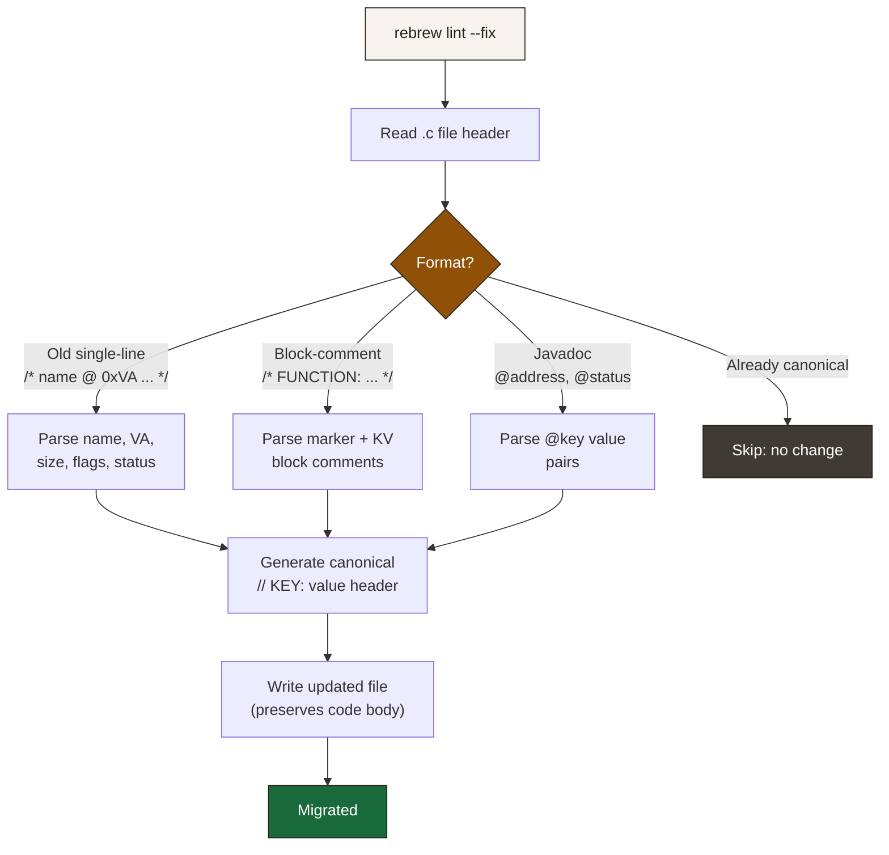

# Annotation Reference

> **Scope:** Function and data identity is a `MODULE.0xVA` row (`file` plus a kind).
> This document also covers the legacy inline marker the parser still reads
> (`// FUNCTION: MODULE 0xVA`) and the `library_*.h` header format.  For the
> TOML field rules see [METADATA_FORMAT.md](METADATA_FORMAT.md).

The parser still reads the [reccmp](https://github.com/isledecomp/reccmp) annotation format. New writers do not emit it: identity is a `MODULE.0xVA` row (`file` plus a kind) and the `.c` is pure C. `rebrew source migrate-markers` moves an unmigrated tree. The examples below are that legacy input.

## Table of Contents

- [What comes from reccmp](#what-comes-from-reccmp)
- [What rebrew adds](#what-rebrew-adds)
- [Function Annotations](#function-annotations)
  - [Marker Types](#marker-types-functions)
  - [Annotation Keys](#annotation-keys-functions)
  - [STATUS Values](#status-values)
  - [Origin / Compiler Preset Configuration](#origin--compiler-preset-configuration)
- [Data Annotations](#data-annotations-data--rdata--bss)
- [Struct SIZE Comments](#struct-size-comments-reccmp-recommendation)
- [Linter Reference](#linter-reference-rebrew-lint)
  - [Errors](#errors-block-ci-non-zero-exit)
  - [Warnings](#warnings-advisory-zero-exit)
  - [CLI Options](#cli-options)
  - [JSON Output Schema](#json-output-schema)
- [Filename Conventions](#filename-conventions)
- [Old Format (Legacy)](#old-format-legacy)
- [Multi-Target Support](#multi-target-support)
- [Multi-Function Files](#multi-function-files)
- [Library Header Files](#library-header-files-library_h)

## What comes from reccmp

The `// MARKER: MODULE 0xVA` syntax and the following **markers** are reccmp's format:

| Marker | reccmp usage |
|--------|-------------|
| `FUNCTION` | Non-library functions |
| `LIBRARY` | Third-party / statically-linked library functions |
| `GLOBAL` | Global variables in `.data`, `.rdata`, or `.bss` |
| `VTABLE` | C++ virtual function tables |
| `STRING` | String literals |

Rebrew recognizes `FUNCTION`, `LIBRARY`, and `GLOBAL` from the reccmp set, as well as `VTABLE` and `STRING` (per ADR-023; recognized as data markers). `DATA` and `STUB` are rebrew extensions.

## What rebrew adds

Rebrew extends the reccmp baseline with:

| Addition | Purpose |
|----------|---------|
| `DATA` marker | Marks standalone global data (`// DATA: MODULE 0xVA`) |
| `STUB` marker | Marks incomplete implementations (`STATUS: STUB`), not a reccmp marker |
| `STATUS` key | Track match quality (EXACT, RELOC, NEAR_MATCHING, etc.): metadata-only, never parsed inline from `.c` (`_kv_to_annotation` hardcodes `STUB`; the value lives in `rebrew-functions.toml`) |
| `CFLAGS` key | Compiler flags needed to reproduce original compilation: metadata-owned. An inline copy is migration debt |
| `SIZE` key | Function/data size in bytes from the original binary: metadata-owned. An inline copy is migration debt |
| `SOURCE` key | Reference file for library functions |
| `BLOCKER` key | Explanation for why a STUB doesn't match yet |
| `NOTE` key | Freeform notes |
| `GLOBALS` key | Comma-separated globals referenced by a function |
| `SKIP` key | Known acceptable byte differences |
| `SECTION` key | Section name for data annotations (`.data`, `.rdata`, `.bss`) |
| `GHIDRA` key | Tracks the Ghidra name to prevent conflict loops |
| `STRUCT` key | Reference to a shared struct definition pulled from Ghidra |
| `CALLERS` key | Comma-separated callers (optional, auto-generated from xrefs) |

> **Note:** `SYMBOL` and `PROTOTYPE` are now **derived automatically** from the C function definition.
> No explicit `// SYMBOL:` or `// PROTOTYPE:` annotation is needed.

On an unmigrated file, rebrew-specific keys use names that reccmp's parser ignores. A migrated file has no marker lines, so a reccmp checkout of that tree sees no annotations.

---

## Function Annotations

Unmigrated `.c` files containing reversed functions carry a MODULE/VA marker.
`rebrew source migrate-markers` moves function identity and fields into TOML and leaves
pure C; migrated files must not regain marker blocks. The examples below show
the unmigrated format:

```c
// FUNCTION: MODULE 0xVA
```

That's it. Volatile per-function fields (STATUS, BLOCKER, NOTE, GHIDRA, …)
live in the `rebrew-functions.toml` file at `cfg.metadata_dir`: the parent of `reversed_dir`
(e.g. `src/` for sources under `src/<module>/`). Inline `// STATUS:` etc. in
`.c` files are NOT parsed (`_kv_to_annotation` hardcodes `STUB`): they are
migration debt that `lint --fix` (W019) moves to the TOML, including
`SIZE` and `CFLAGS`. A disagreement warns and the store wins. File-borne /
structural keys that stay inline: `// SOURCE: naked`, plus `STRUCT` /
`CALLERS`. `SECTION` on DATA/GLOBAL migrates to `rebrew-data.toml`; on
functions it is a legacy key that `--fix` strips. `TOOLCHAIN` and other
`SOURCE` values are metadata-owned: W019 migrates them. `cfg.metadata_dir` is the
parent of `reversed_dir`, or the outermost store found walking up to the project root
when no store sits beside it. There is no walk-up inside the loader: callers must
pass the correct metadata root. Metadata is managed automatically by the CLI tools.

> [!CAUTION]
> **Never manually add volatile metadata keys (`STATUS`, `BLOCKER`, `NOTE`, `GHIDRA`, `SIZE`, `CFLAGS`, …) to a `.c` file**: they are not the contract (`_kv_to_annotation` hardcodes `STUB` for STATUS) and `lint --fix` / W019 migrates an equal copy into `rebrew-functions.toml`. Do not hand-edit that file: use the CLI / `rebrew.metadata` APIs.

### Example

```c
// FUNCTION: SERVER 0x10008880

int __cdecl bit_reverse(int x)
{
    return x;
}
```

`rebrew-functions.toml` (at `cfg.metadata_dir`, managed by tools):
```toml
["SERVER.0x10008880"]
status = "EXACT"
size = 31
```

### Marker Types (Functions)

`marker_type` on the `MODULE.0xVA` row:

| `marker_type` | When to use |
|--------|-------------|
| `FUNCTION` | Non-library game code that isn't a stub |
| `LIBRARY` | Third-party library code. `LIBRARY` records origin. A project `.c` is built from source, and a unique member of a configured external archive is statically linked. A row with neither stays unresolved. When both exist, the source wins. |
| `STUB` | Incomplete implementation (`status = "STUB"`) |

An unmigrated file spells the same word as `// <MARKER TYPE>: MODULE 0xVA`. New writers record the row and do not emit that line.

- **MODULE**: the target identifier from `rebrew-project.toml` (e.g. `SERVER`, `CLIENT`)
- **VA**: virtual address in the original binary, hex with `0x` prefix, the key `MODULE.0xVA`

### Support TUs (link-only files)

A file that exists purely for link reasons (linker-forced shims, CRT guard
stubs, BSS pads) has no binary VA of its own to anchor a marker to.  It
declares itself with a single comment line before any code:

```c
// SUPPORT: SERVER linker shims keep LIBCMT sbheap.obj out of the link
```

`// SUPPORT:` blesses the file against E001; the reason (what breaks without
this file) is mandatory: a reason-less declaration errors the same way a
missing marker does.  The blessing is lint-level only: the annotation parser
(`annotation.py`, `VALID_MARKERS`) does not handle SUPPORT, so no `Annotation`
is yielded for support files; they are invisible to verify/match/test.
No annotation checks apply (there are no headers), but body rules still run:
a support file with no code earns W003.  Prefer folding
support content into a VA-anchored file when one exists; keep a standalone
support TU only when nothing in the reversed tree can carry it.

---

## Annotation Keys (Functions)

| Key | Required? | Linter | Description |
|-----|:---------:|--------|-------------|
| Identity | **Mandatory** | E001 | Migrated function identity in TOML, or an inline marker: `// FUNCTION:`, `// LIBRARY:`, `// STUB:`, `// GLOBAL:`, or `// DATA:` with MODULE and VA, or `// SUPPORT:` (see below) for link-only files. Note: `SUPPORT` is lint-only (blesses against E001); the annotation parser does not yield an `Annotation` for support files |
| `STATUS` | Metadata-owned | n/a | Match quality (see below); lives in rebrew-functions.toml, never parsed inline |
| `SIZE` | Metadata-owned | W019 | Function size in bytes from the original binary. An equal inline `// SIZE:` is migration debt (`32` and `0x20` agree). A disagreement warns and the store wins |
| `CFLAGS` | Metadata-owned | W018 | Per-function compiler flags. An equal inline copy is migration debt; disagreement ignores flag order and `/D` defines. Falls back to the module's `[compiler].cflags_presets` entry, then `[compiler].cflags` (`/O2 /Gd` for MSVC profiles when unset); `base_cflags` is always prepended, never the fallback. Only needed for functions compiled with non-default flags (e.g. a static lib linked with `/O1` into an `/O2` binary). |
| `SOURCE` | Conditional | W006 | **Required for library modules**: reference file (e.g. `SBHEAP.C:195`, `deflate.c`). Use `rebrew library crt-match --fix-source` to auto-populate. |
| `BLOCKER` | Conditional | W005 | **Required for STUB**: explain why the function doesn't match yet. Lives in `rebrew-functions.toml` metadata; set via `rebrew blocker set <file|0xVA> "<reason>"` or auto-written by `rebrew diff --fix-blocker`: never hand-edit the TOML. |
| `NOTE` | Optional | n/a | Freeform notes (e.g. `NOTE: uses SSE2 intrinsics`): lives in metadata |
| `GHIDRA` | Optional | n/a | The Ghidra name, added by `rebrew sync pull --accept-local` to prevent conflict loops: lives in metadata |
| `STRUCT` | Optional | n/a | Linked structs for this file |
| `CALLERS` | Optional | n/a | Incoming cross-references |
| `GLOBALS` | Optional | n/a | Comma-separated list of globals referenced (e.g. `g_counter, g_state`) |
| `SKIP` | Optional | n/a | Known acceptable byte differences (e.g. `SKIP: xor edi,edi after call`) |
| `ANALYSIS` | Optional | n/a | Freeform analysis notes from decompiler or reverse engineer; the per-address form `// ANALYSIS @ 0xADDR: text` is documented below |
| `ORIGINS` / `VERIFICATION` | Tool-owned tables | W031 | Imported field source facts and comparison evidence; see [METADATA_FORMAT.md](METADATA.md#external-origin-and-measurement-evidence) |

> [!CAUTION]
> **Never manually edit `rebrew-functions.toml`.** This metadata file stores volatile metadata
> (STATUS, CFLAGS, SIZE, BLOCKER, NOTE, GHIDRA, etc.) and is managed exclusively by
> Rebrew CLI tools (`rebrew blocker`, `rebrew test`, `rebrew match run`, `rebrew diff --fix-blocker`, `rebrew diagnose near --fix-blocker`, `rebrew source document-unmatched`, `rebrew sync push`, etc.).
> Every BLOCKER/BLOCKER_DELTA write must go through those CLIs (or the `rebrew.metadata` API).
> Manual edits bypass the write-lock/atomicity and will be silently lost or may corrupt the file.

> [!TIP]
> **Rule of thumb**: E001 requires identity from a marker or migrated metadata
> (or a SUPPORT declaration for a link-only file). `STATUS`
> (and other volatile keys) are metadata-only in `rebrew-functions.toml`, not parsed
> inline. `SIZE` and `CFLAGS` are metadata-owned: an equal inline copy migrates,
> and a disagreement leaves the inline text because the store wins. Bare `CFLAGS` falls back to the
> target default from config. `SOURCE` and `BLOCKER` are warnings only for specific
> origins/statuses. Function name and symbol are derived from the C definition.

### Per-Address ANALYSIS Comments

Per-instruction comments can be written as address-anchored line comments,
placed in a single trailing block at the END of the owning `.c` file (one line
per comment, sorted by address, separated from the code by one blank line):

```c
// ANALYSIS @ 0x401010: some note
```

The address is the anchor; rebrew has no source line table, so the block is
file-level and never touches a function body. `rebrew binsync pull`
writes these markers for comments that fall inside a function's range, and
`rebrew binsync push` scans them back out; a source marker wins over
the metadata `comments` store for the same address.

### STATUS Values

| Status | Meaning |
|--------|---------|
| `EXACT` | Compiled bytes are identical to the original |
| `RELOC` | Matches after masking relocation addresses |
| `NEAR_MATCHING` | At least 60% byte similarity; no guarantee of semantic equivalence |
| `PROVEN` | Semantically equivalent, proven via symbolic execution (angr + Z3); bytes still differ, so not matched |
| `STUB` | Placeholder, doesn't match yet |
| `SKIP` | User-parked ("don't touch"): neutral gate rank, status-equal with `STUB` (see `verify._STATUS_RANK`/`_STATUS_ORDER`) |

Machine verdicts persisted outside the lifecycle (see
`rebrew.metadata.KNOWN_STATUSES`): `SIZE_MISMATCH`, `COMPILE_ERROR`,
`EXTRACT_ERROR`, `MISSING_SIZE`, `MISSING_FILE`, `INVALID_VA`
(`INTERNAL_ERROR` is never persisted). `LIBRARY` is a marker type, not a
status.

A `NEAR_MATCHING` whose **entire** byte delta is register allocation is
labeled an *effective match* (reccmp's 100% effective-match case): `rebrew
verify` appends the note to the function's message, and `rebrew diagnose near`
returns the `EFFECTIVE` verdict.  Same instructions, different registers,
**not byte-identical**; `rebrew prove` establishes PROVEN, or register-nudging
C tweaks (reorder expressions, swap loop counters) chase byte-identity.

### Effective Status (verify cache vs metadata)

`rebrew status` reports each function's **effective** status, not just the
metadata `STATUS` value.  The verify cache (`.rebrew/verify_cache.toml`,
written by `rebrew verify`) overlays metadata because metadata statuses can be
optimistic: a hand-set `STATUS: RELOC` may not survive a real compile.  The
overlay rules, in order:

1. **`PROVEN`** (from `rebrew prove`) wins over the cache: prove compiles
   after any cached verdict.  The next `rebrew verify`/`test` replaces the
   metadata PROVEN with the byte result.
2. **Metadata `SKIP`** (user-parked) also wins over the cache.
3. **Metadata `STUB`** stays `STUB` unless the cache holds a *more actionable*
   status (`COMPILE_ERROR`, `EXACT`, `RELOC`, `NEAR_MATCHING`, ...).  Cache
   states `SIZE_MISMATCH`, `MISSING_SIZE`, and `STUB` do **not** override:
   a stub's size mismatch is expected until it is decompiled.
4. **Anything else** (metadata `EXACT`/`RELOC`/`NEAR_MATCHING`) is replaced by
   the cached verify result when one exists; otherwise the metadata value is
   kept.

`rebrew status` surfaces this explicitly: the terminal output prints how many
functions the cache overrode, and how many are stuck on `MISSING_SIZE`
(metadata `SIZE` missing → verify could not extract the function; set `SIZE`
via `rebrew coverage catalog --fix-sizes` or the inline `// SIZE:` marker and
re-verify).  JSON output carries the same numbers
under `verify_cache: {overrides, missing_size, effective_matches}` (present
only when a verify cache exists).

`rebrew prove` applies the same overlay to its status gate: a function whose
metadata `STATUS` lags (e.g. a flag-swept function still marked `STUB`) is
accepted for symbolic proving when the verify cache holds a measured
`NEAR_MATCHING`/`SIZE_MISMATCH`: the gate checks the *effective* status, not
the bare metadata value.

This is by design, not a bug: metadata is the *documented* intent, the verify
cache is the *measured* truth.  When they disagree, the measured truth wins
for counting coverage, and the mismatch is now visible instead of emergent.

### Origin / Compiler Preset Configuration

Origin is a **project-level concept**, not a per-function `.c` annotation. Each project
configures its own module categories and flag presets in `rebrew-project.toml`:

```toml
[targets."server.dll"]
origins = ["GAME", "MSVCRT", "ZLIB"]       # known module labels
library_modules = ["MSVCRT", "ZLIB"]       # modules using LIBRARY marker

[compiler.cflags_presets]
GAME = "/O2 /Gd"
MSVCRT = "/O1"
```

The origin is **inferred from the module name**. Modules listed in `library_modules`
use `marker_type = "LIBRARY"`. There is no `// ORIGIN:` annotation in `.c`
files. An unmigrated file may still carry a `// LIBRARY:` line.

---

## Data Annotations (.data / .rdata / .bss)

Global variables, dispatch tables, const arrays, and string tables live in the data sections. These are annotated using rebrew's `DATA` marker (or reccmp's `GLOBAL` marker). `VTABLE` and `STRING` are the same kind of row with a more specific label.

### Format

New data writers emit the declaration and record `file` plus `marker_type` in `rebrew-data.toml`. They do not write a marker line. The parser still reads an unmigrated line, and `rebrew source migrate-markers` strips it. The examples below are that unmigrated form. Extent fields (SIZE, SECTION, NOTE, plus verify-written STATUS) live in **`rebrew-data.toml`**, the data analogue of `rebrew-functions.toml` (also at `cfg.metadata_dir`).

**`.c` file** (unmigrated identity):
```c
// DATA: MODULE 0xVA

extern type name;
```

**`rebrew-data.toml`** (at `cfg.metadata_dir`, auto-managed):
```toml
["MODULE.0xVA"]
size    = <bytes>
section = ".data" | ".rdata" | ".bss"
note    = "optional description"
status  = "VERIFIED" | "DRIFT" | "UNCHECKED"   # written by `rebrew verify --data`
```

### Examples

#### Named global variable (.data)

`.c` file:
```c
// DATA: SERVER 0x1002c5a0

extern dispatch_fn g_packet_handlers[8];
```

`rebrew-data.toml`:
```toml
["SERVER.0x1002c5a0"]
size    = 32
section = ".data"
note    = "dispatch table for packet handlers"
```

#### Const lookup table (.rdata)

`.c` file:
```c
// DATA: SERVER 0x10025000

const unsigned char g_sprite_lut[256] = { 0x00, 0x01, /* ... */ };
```

`rebrew-data.toml`:
```toml
["SERVER.0x10025000"]
size    = 256
section = ".rdata"
note    = "sprite index lookup table"
```

#### Uninitialized state (.bss)

`.c` file:
```c
// DATA: SERVER 0x10031b78

extern int g_frame_counter;
```

`rebrew-data.toml`:
```toml
["SERVER.0x10031b78"]
size    = 4
section = ".bss"
```

### Annotation Keys (Data)

| Key | Location | Required? | Description |
|-----|----------|:---------:|-------------|
| `DATA` marker | `.c` file, until `rebrew source migrate-markers` | **Mandatory** while the line is inline | `// DATA: MODULE 0xVA`: the data address in the original binary. After migration the address is the `rebrew-data.toml` key and `file` names the source |
| `name` | `rebrew-data.toml` | Optional | Preferred variable name (overrides C stem; import target from BinSync/IDA) |
| `size` | `rebrew-data.toml` | Recommended | Size of the data item in bytes |
| `section` | `rebrew-data.toml` | Recommended | Which PE section: `.data`, `.rdata`, or `.bss` |
| `note` | `rebrew-data.toml` | Optional | Description of the data item's purpose |

> [!NOTE]
> `DATA` markers are recognized and tracked as first-class citizens by `rebrew data list` and `rebrew coverage catalog`.
> The `rebrew-data.toml` metadata file is created and updated automatically by rebrew tools.
> **Never edit it manually.**

## Struct SIZE Comments (reccmp recommendation)

When a file defines structs, annotate their size:

```c
// SIZE 0x1c
typedef struct {
    int x;       // 0x00
    int y;       // 0x04
    char* name;  // 0x08
} MyStruct;
```

The linter (W007) will warn if a file defining structs lacks the `// SIZE 0xNN` annotation.

---

## Linter Reference (`rebrew lint`)

The linter validates annotation headers in all `.c` files under the reversed source directory. It enforces the format described above and catches common mistakes.

Before running validation, the linter loads the **`rebrew-functions.toml`** metadata file for each directory and overlays any fields it contains into the annotation being checked. This means that files whose STATUS, SIZE, CFLAGS etc. live only in the metadata file (no inline annotation) will still pass validation correctly: metadata values count just as much as inline values.

```
Usage:  rebrew lint [OPTIONS]
```

### Errors (block CI, non-zero exit)

Errors indicate broken annotations that will cause `rebrew test`, `rebrew verify`, and other tools to fail.

#### Structural Errors

| Code | Description | Triggered by |
|------|-------------|--------------|
| E000 | Cannot read file | File permissions, encoding issues |
| E001 | Missing identity | No marker and no metadata row for this file, or a reason-less `// SUPPORT:`. A marker-less file whose store row names the path is not E001. An empty file is. `// SUPPORT: <MODULE> <reason>` blesses a link-only TU at lint level (the parser itself ignores SUPPORT files) |
| E002 | Invalid or suspicious VA | VA outside the valid range. Non-hex strings and missing `0x` prefixes never reach E002: the marker regexes require `0x[hex]+`, so such lines yield E001 instead |

#### Field Validation Errors

| Code | Description | Triggered by |
|------|-------------|--------------|
| E003 | *(deprecated)* | STATUS is metadata-only: no longer validated inline |
| E004 | Unknown STATUS value | A persisted metadata `status` outside `metadata.KNOWN_STATUSES` (typo or legacy value). `canonical_status` only upper-cases, so the unknown word would otherwise be treated as a real classification |
| E006 | *(reserved)* | Unused: was ORIGIN validation |
| E007 | *(deprecated)* | Inline SIZE is metadata-owned; W019 covers the inline copy |
| E008 | Invalid SIZE value | A metadata `size` that is not an integer (`size = "abc"`). Inline `// SIZE:` is covered by W019, not E008; a non-numeric metadata spelling would make consumers slice the wrong byte count |
| E014 | *(not implemented)* | Reserved for corrupted annotation value detection |
| E015 | Marker/module mismatch | `// FUNCTION:` with a library-configured module (expected `LIBRARY`). Library modules defined by `library_modules` config |
| E017 | Contradictory status/marker | `// STUB:` marker carrying any matched STATUS (`EXACT`, `RELOC`, `NEAR_MATCHING`, …): a stub by definition has no matching bytes |

#### Config-Aware Errors (require `rebrew-project.toml`)

| Code | Description | Triggered by |
|------|-------------|--------------|
| E012 | Module name mismatch | `// FUNCTION: CLIENT 0x...` when neither the target `marker` nor any known project marker names `CLIENT`: a stacked `src/shared` block for another target (ADR-010) is accepted |

#### Cross-File Errors

| Code | Description | Triggered by |
|------|-------------|--------------|
| E013 | Duplicate VA | Two files annotate the same virtual address |

#### Decomp Quality Errors

| Code | Description | Triggered by |
|------|-------------|--------------|
| E023 | Whole-function naked asm | `__declspec(naked)` + `__asm`/`__emit` body beyond 1-2 padding bytes (`nop` / `0x90` / `0xCC`). Only 1-2 alignment nops are allowed as minor padding; a whole-function naked dump must be decompiled to C |

---

### Warnings (advisory, zero exit)

Warnings indicate style issues, missing optional fields, or format migration opportunities.

#### Missing Recommended Fields

| Code | Description | Triggered by |
|------|-------------|--------------|
| W003 | No function implementation | File has annotations but no C code body |
| W005 | STUB missing `BLOCKER` | `STATUS: STUB` without BLOCKER in metadata explaining why |
| W006 | Library missing `SOURCE` | Library module (per `library_modules` config) without `// SOURCE:` pointing to reference file |
| W007 | Struct without SIZE annotation | File defines `typedef struct` but lacks `// SIZE 0xNN` comment |

#### Format Migration Warnings

| Code | Description | Triggered by |
|------|-------------|--------------|
| W002 | *(not implemented)* | Reserved for old single-line format migration |
| W012 | *(not implemented)* | Reserved for block-comment format migration |
| W013 | *(not implemented)* | Reserved for javadoc format migration |

#### Consistency Warnings

| Code | Description | Triggered by |
|------|-------------|--------------|
| W008 | *(not implemented)* | Reserved for CFLAGS preset validation |
| W018 | Missing CFLAGS with no config fallback | No CFLAGS in metadata **and** no `[compiler].cflags` default in project config: compile may use wrong flags |
| W019 | Inline metadata annotation | `// STATUS:`, `// SIZE:`, `// CFLAGS:`, `// BLOCKER:`, `// NOTE:`, `// GHIDRA:`, and the other metadata-owned keys: `--fix` moves an equal copy into the store. A disagreement warns and the store wins. `// SOURCE: naked` is exempt (file-borne) |
| W010 | Unknown annotation key | `// FOOBAR: value`: key not in the known set. `--fix` strips only retired derived keys (`SYMBOL`, `PROTOTYPE`; recomputed from the C source); anything else stays until a human decides |
| W015 | Mixed-case VA hex digits | `0x10003Da0`: prefer consistent `0x10003da0` or `0x10003DA0` |
| W020 | Asm-dump placeholder | Body uses `__asm`/`__emit`: pasted disassembly, not real C.  Does **not** fire for whole-function `__declspec(naked)` + asm (that is **E023**; error).  **Escalates** when the file's `STATUS` claims a non-stub match (`EXACT`/`RELOC`/...): an asm dump cannot be a byte-match, so the metadata status is wrong (fix it or mark `BLOCKER`).  `STATUS: STUB` + asm dump is an expected documented placeholder and gets the base message only |
| W021 | Duplicate global | Conflicting addresses for one module/name, or initialized definitions in more than one file; same-address extern references are allowed |
| W022 | Zero-init `.bss` global | File-scope `= 0` initializer on a `.bss`-style global |
| W023 | Default function name | Function named `fcn`/`fn`/`fun`/... (pedantic only): rename it; a descriptive name is what the call graph and reports key on |
| W024 | Function naming convention | Function name does not match project naming convention (`lint_naming_convention` in config) |
| W025 | Opening brace style | Opening brace style does not match project configuration (`lint_brace_style` in config) |
| W026 | Line indent style | Line indent style does not match project configuration (`lint_indent_style` in config) |
| W027 | Line too long | Line exceeds `lint_max_line_length` characters |
| W028 | Stale annotation VA | FUNCTION/STUB marker VA has no function in the current discovery inventory (`function_structure.json`, removed/shifted) or points inside another function's span (moved/merged): re-annotate or refresh with `rebrew binary functions`; LIBRARY/DATA/GLOBAL markers excluded |
| W029 | Redundant cflags | Per-function `cflags` in `rebrew-functions.toml` or `compiler.cflags_presets.<MODULE>` that only repeat the inherited value (`resolve_cflags` ladder: function → module preset → project `compiler.cflags`); flagged by `rebrew lint` (project-level `check_redundant_cflags` moved from `rebrew doctor`). `rebrew lint --fix` drops the redundant field; the fallback chain already supplies the same flags |
| W030 | Markers out of VA order | A file's FUNCTION/STUB markers for one module do not ascend by VA. The linker lays out a translation unit's functions in source order, so a definition above a lower-VA one links at the wrong address and displaces every function between them. Move the definition; keep any `#pragma optimize` pair around the function it scopes. Markers stacked above one body (identical copies at several VAs) count as one definition at their lowest VA. Each module is checked on its own |
| W031 | Metadata store problem | A `rebrew-functions.toml` / `rebrew-data.toml` entry a reader will not honour: an unknown field (dropped silently, so a typo'd `blocked` looks like a blocker that never applied), a STATUS outside the store's vocabulary, half an `updated_by`/`updated_at` pair, a provenance tag outside `rebrew.metadata.PROVENANCE_TAGS`, a stray top-level key that is neither `format` nor a `MODULE.0xVA` entry, or a missing / foreign top-level `format` stamp |
| W032 | Coverage store hygiene | An artifact from a store rebrew no longer writes: `db/coverage.db` (SQLite), `db/data_<target>.json` (catalog grid), `db/*.csv`, or a `db/coverage-<target>.toml` the dashboards cannot serve: unreadable to the loader (foreign `version`, malformed TOML) or one whose `target` key disagrees with its filename, so that target answers with another's data. Re-run `rebrew coverage build` and delete the old artifacts |
| W033 | Agent scaffold drift | `AGENTS.md`, `PRINCIPLES.md` or `.agents/skills/**` no longer matches the installed rebrew's packaged sources, so an agent follows workflow instructions for a version that is not running. Warn-only; fix with `rebrew init --refresh-agents` (it writes only differing files and prunes a skill the packaged tree no longer ships). `AGENTS.md`'s own comparison is profile-rendered: `rebrew init --refresh-agents --check` reports it in full |
| W034 | `file` identity is not joinable | A stored `file` in `rebrew-functions.toml` is absolute or contains a `..` segment, so `verify`/`rename`/BinSync would join it to a path outside the checkout. Writers refuse it (`rebrew.metadata.validate_identity_file`); this reports rows written before the gate |
| W035 | Module belongs to no target | A metadata row's `module` matches no project marker, target marker, or declared library module, so `status`, `todo` and the dashboards (all of which filter by module) cannot show it. Typical after a target rename left rows behind |
| W036 | Stray metadata store | A `rebrew-data.toml` / `rebrew-functions.toml` outside the directories the readers use (`metadata_dir`, `reversed_dir`, `shared_dir`). The readers resolve a store by directory with no fallback, so a second copy is not a backup: pointed at its directory it answers with its own smaller entry set, and is invisible otherwise. Warn-only; delete the copy that no command is pointed at |

#### Data Annotation Warnings

| Code | Description | Triggered by |
|------|-------------|--------------|
| W016 | DATA/GLOBAL missing `section` in metadata | `// DATA:` or `// GLOBAL:` marker with no `section` in `rebrew-data.toml` (.data, .rdata, .bss). `--fix` backfills it from the target binary's section table when the VA resolves; otherwise warn-only |
| W017 | *(not implemented)* | Reserved for detecting auto-generated sync metadata in NOTE |

---

### CLI Options

| Flag | Description |
|------|-------------|
| `--fix` | Migrate leftover inline metadata keys into `rebrew-functions.toml` / `rebrew-data.toml`; strip redundant inline lines (retired `SYMBOL`/`PROTOTYPE` keys, legacy `ORIGIN`, inline `// CFLAGS:` that only repeat the inherited flags, copies already in metadata); backfill missing W016 `SECTION` from the target binary; drop W029-redundant per-function `cflags` and matching `cflags_presets` |
| `--quiet` | Suppress warnings, show errors only |
| `--json` | Output results as JSON (schema below) |
| `--summary` | Print a status/marker-type breakdown table after results |
| `FILE [FILE...]` | Check specific files (positional) instead of scanning the entire directory |
| `--target NAME` | Select a target from `rebrew-project.toml` (for config-aware checks) |

### Example Usage

```bash
# Lint all files in the configured source directory
rebrew lint

# Fix legacy annotations and re-lint
rebrew lint --fix && rebrew lint

# CI pipeline: errors only, JSON for parsing
rebrew lint --quiet --json > lint-results.json

# Check a specific file during development
rebrew lint src/server.dll/alloc_game_object.c

# Print progress breakdown after linting
rebrew lint --summary
```

### `--fix` Migration Flow


```mermaid
graph TD
    A["rebrew lint --fix"] --> B["Read .c file header"]
    B --> C{"Format?"}
    C -->|"Old single-line<br/>/* name @ 0xVA ... */"| D["Parse name, VA,<br/>size, flags, status"]
    C -->|"Block-comment<br/>/* FUNCTION: ... */"| E["Parse marker + KV<br/>block comments"]
    C -->|"Javadoc<br/>@address, @status"| F["Parse @key value<br/>pairs"]
    C -->|"Already canonical"| G["Skip: no change"]

    D --> H["Generate canonical<br/>// KEY: value header"]
    E --> H
    F --> H

    H --> I["Write updated file<br/>(preserves code body)"]
    I --> J["Migrated"]

    style A fill:#f7f4ef,stroke:#2a201a,color:#2a201a
    style J fill:#1a6b3c,stroke:#2a201a,color:#fff
    style G fill:#3f3a33,stroke:#2a201a,color:#fff
    style C fill:#8f5105,stroke:#2a201a,color:#fff
```

The node fills are the marks the report and the call graph paint
(`rebrew.status_style.STATUS_HEX`, `rebrew.theme.TOKENS`): EXACT green for a
migrated file, the STUB grey for one left alone, NEAR_MATCHING amber for the
branch, and plain chrome for the entry point.

### JSON Output Schema

```json
{
  "total": 463,
  "passed": 190,
  "errors": 1,
  "warnings": 396,
  "files": [
    {
      "file": "func_10003da0.c",
      "path": "/path/to/src/server.dll/func_10003da0.c",
      "errors": [
        {"line": 1, "code": "E001", "message": "Missing marker line"}
      ],
      "passed": false
    }
  ]
}
```

### `--summary` Output

When `--summary` is passed, the linter prints a breakdown table after results:

```
Summary
Category  Value     Count
STATUS    RELOC       198
STATUS    STUB        141
STATUS    NEAR_MATCHING     63
STATUS    EXACT        60
MARKER    STUB        141
MARKER    LIBRARY     114
MARKER    FUNCTION    207
```

---

## Filename Conventions

Filenames are derived from the function's symbol name: no origin-based prefixes are added.
Users control the directory structure freely (e.g. `rendering/draw.c`, `crt/malloc.c`).

| Pattern | Example |
|---------|---------|
| Symbol-based | `malloc.c`, `ParsePacket.c`, `deflateReset.c` |
| `data_` prefix | `data_dispatch_table.c`, `data_sprite_lut.c` |
| `func_` prefix | `func_10008880.c`: unnamed, address-based (pre-reversal) |

Filenames do not need to match the function name: multi-function files
and grouped files (e.g., `command.c` with multiple functions) are common.

---

## Old Format (Legacy)

Legacy single-line, block-comment, and javadoc annotation formats are
documented here for readers of old sources. They are **not** auto-migrated:
`rebrew lint --fix` migrates leftover *inline metadata keys* (W019) to TOML,
not comment formats; converting legacy headers is manual.

The old format is a single-line comment:

```c
/* func_name @ 0x10008880 (31B) - /O2 /Gd - EXACT [GAME] */
```

### Block-Comment Format (Legacy)

```c
/* FUNCTION: SERVER 0x10003260 */
/* STATUS: NEAR_MATCHING */
/* SIZE: 183 */
/* CFLAGS: /O2 /Gd */
```

### Javadoc Format (Legacy)

```c
/**
 * @brief Core logging function
 * @address 0x10003640
 * @size 132
 * @cflags /O2 /Gd
 * @status RELOC
 */
```

---


### Multi-Target Support

Rebrew supports maintaining code for multiple targets (e.g., `LEGO1` and `BETA10`) in the exact same `.c` file.
Each target is a `MODULE.0xVA` row naming that file. If you pass `--target BETA10` to a CLI tool, Rebrew compiles the `BETA10` row and ignores the `LEGO1` row.
An unmigrated file may still carry one marker line per target. The parser reads the module name from that line. The blocks below are that legacy input.

```c
// FUNCTION: LEGO1 0x1009a8c0

// FUNCTION: BETA10 0x101832f7
void my_func() {}
```

This allows you to test the identical C function against different binaries at different virtual addresses without duplicating source files.

#### Version differences

A common use-case is the same function appearing at a different VA across retail builds of the game. Annotate both addresses in the same file and rebrew diffing will test whichever target you select:

```c
// FUNCTION: SERVER_V1 0x10022340
// FUNCTION: SERVER_V2 0x10023b10

char *getenv(const char *name)
{
    /* implementation */
}
```

`rebrew-project.toml` defines both as separate targets pointing to their respective DLL:

```toml
[targets."server_v1.dll"]
marker = "SERVER_V1"

[targets."server_v2.dll"]
marker = "SERVER_V2"
```

Running `rebrew test --target SERVER_V2 getenv.c` will compile and diff against the v2 binary, ignoring the `SERVER_V1` annotation block entirely.

## Multi-Function Files

A migrated `.c` holds several functions as several `MODULE.0xVA` rows that name that file. Per-function STATUS lives in `rebrew-functions.toml`. This groups related functions together (e.g., all CRT environment functions in one file).

An unmigrated file may still contain **multiple `// FUNCTION:` annotation blocks**, each anchored to its own VA. The parser treats each marker line as one block. The example below is that legacy input. `rebrew source merge` and `rebrew source split` still rearrange a file that already has those lines. A migrated file is split from the function row: the C definition moves, file-scope storage stays, and every row that names that definition is retargeted. A migrated merge copies those definitions and their file-scope objects into one file and retargets every row that names an input.

Use `rebrew source split` to break a multi-function file into individual files, or `rebrew source merge` to combine single-function files into one. Use `rebrew source split --va 0xVA` to extract a single function for focused iteration (creates `<stem>_c/name.c`; e.g. `sim.c` → `sim_c/`, and removes the block from the original). On an unmigrated file both tools keep the marker blocks and the shared preamble.

### Format

Each annotation block follows the same format as a single-function file. Blocks are separated by code:

```c
// FUNCTION: SERVER 0x10022340

char *getenv(const char *name)
{
    /* implementation */
}

// FUNCTION: SERVER 0x10022f83

int _wsetenvp(void)
{
    /* TODO: Implement from CRT source */
    return 0;
}
```

### Rules

- Each `// FUNCTION:` marker line starts a new annotation block
- Code lines between blocks are ignored by the parser: they don't terminate scanning
- `parse_c_file_multi()` returns **all** annotations as a list (there is no
  single-annotation `parse_c_file`; it was removed; multi-function files
  yield one `Annotation` per `// FUNCTION:` block)

### Creating Multi-Function Files

Use `rebrew skeleton --append` to add a function to an existing file. The new function is another `MODULE.0xVA` row. A file that still has marker lines is migrated first:

```bash
# Create the first function
rebrew skeleton 0x10022340 --name getenv

# Append a related function to the same file
rebrew skeleton 0x10022f83 --append getenv.c
```

### Testing Multi-Function Files

`rebrew test` automatically detects multi-function files and tests each symbol independently:

```bash
# Tests all annotated functions in the file (compiles once, tests each symbol)
rebrew test src/server.dll/getenv.c
```

### When to Use Multi-Function Files

| Use case | Recommendation |
|----------|---------------|
| Related CRT functions (`getenv`/`setenv`/`putenv`) | Group together |
| Functions sharing static data | Group together |
| Independent game functions | Keep separate |
| Functions with different CFLAGS | Only if all share the same flags for compilation |

> [!IMPORTANT]
> All functions in a multi-function file are compiled together with the **same CFLAGS**.
> Only group functions that use identical compiler flags.

---

## Library Header Files (`library_*.h`)

Library header files provide a lightweight way to register known library functions
(CRT, zlib, etc.) in the catalog without creating individual `.c` files. These are
functions you've **identified**: they show up in coverage stats as covered, and
`rebrew todo` / `rebrew skeleton` won't suggest them as work items.

### Filename Convention

Files must be named `library_<suffix>.h`, which is how `iter_library_headers`
finds them. The `library_` prefix and `.h` suffix are the whole convention:
the module recorded for each function comes from the `LIBRARY` row, never
from the filename. `rebrew library identify` and `rebrew binary imports mark`
write a banner comment and the row. They do not append `// LIBRARY:` lines.
The blocks below are the legacy form the parser still reads.

### Minimal Format (legacy input)

For functions you've identified but don't intend to recompile (pure CRT stubs, etc.):

```c
#ifdef 0
// LIBRARY: SERVER 0x1001A18A
// _fflush

// LIBRARY: SERVER 0x1001A1BB
// __fclose_lk
#endif
```

Each entry is two lines: the `// LIBRARY:` marker and a `// _symbol` comment.
This format is fully compatible with [reccmp](https://github.com/isledecomp/reccmp).

### Extended Format (rebrew-only)

For library functions you actively compile and match from reference source (e.g. zlib),
add key-value annotation lines **after** the symbol line:

```c
// LIBRARY: SERVER 0x10050000
// _deflate
// STATUS: NEAR_MATCHING
// SIZE: 120
// CFLAGS: /O2 /Gd
// SOURCE: deflate.c
// BLOCKER: 2B diff in loop epilogue
```

reccmp's parser reads the marker + symbol, calls `_function_done()`, and resets to
search state. The KV lines are invisible to reccmp but captured by rebrew.

Supported KV keys: `STATUS`, `SIZE`, `CFLAGS`, `TOOLCHAIN`, `SOURCE`, `BLOCKER`, `NOTE`.

Entries without explicit `STATUS` default to `EXACT`. Entries without `SIZE` default to 0
(resolved from the function registry at catalog time).

### When to Use

| Scenario | Use |
|----------|-----|
| Identified CRT stub, no source matching | Minimal `library_*.h` entry |
| Library function compiled from reference source | Extended `library_*.h` entry with KV lines |
| Game function (primary origin) | Regular `.c` file with full annotations |
| Library function needing inline C code | Regular `.c` file with `LIBRARY` marker |
