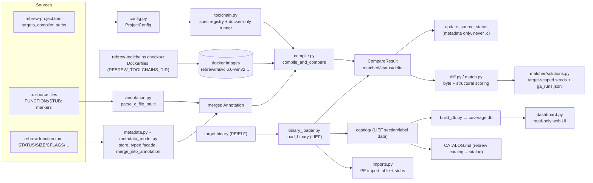

# Rebrew Architecture

Compiler-in-the-loop decompilation workbench for binary-matching game
reversing. C source is compiled in a pinned toolchain docker image
(MSVC6 runs wine inside its image; there is no host wine/wibo path),
byte-compared against a target binary's functions, and the result drives
STATUS promotion and the GA matching engine.

## Ecosystem

rebrew is one repo in a wider workspace. Sibling projects plug in at stable
boundaries: `rebrew-toolchains` supplies the docker compiler images,
`resembl` supplies the assembly-similarity scoring core, `recoverage` serves
the `db/coverage.db` this repo builds, `recompile` wraps the toolchain zoo
as an HTTP API, and `reagent` automates the loop with an LLM. External
tools interoperate through file formats: reccmp-compatible source
markers/catalog CSV, and the BinSync state directory (`rebrew binsync-*`).
The full cross-repo map, dependency layering, and mermaid diagrams are in
[ECOSYSTEM.md](ECOSYSTEM.md).

## High-level data flow

## Module map

| Package / module | Responsibility |
|---|---|
| `rebrew/` top-level tools | One CLI command each (`test`, `verify`, `diff`, `match`, `lint`, `data`, `status`, `todo`, …), registered in `main.py` |
| `rebrew/intake.py` | One-shot binary onboarding: init + toolchain detect (diec → PDB → heuristics) + rizin function enumeration + STUB/blocker documentation |
| `rebrew/main.py` | Umbrella CLI. Flat `app.command()` for single-command modules, `app.add_typer()` for multi-command (`cfg`, `cache`, `extract`, `skills`, `resource`, `library`, `toolchain`) |
| `rebrew/cli.py` | Shared options/helpers: `TargetOption`, `require_config`, `iter_annotations`, `error_exit`, `json_print`, exit codes |
| `rebrew/sources.py` | Source-tree discovery: `source_exts`, `source_glob`, `target_marker`, `iter_sources`, `iter_library_headers` (pure pathlib/config logic, importable by library modules) |
| `rebrew/config.py` | `ProjectConfig` dataclass + `rebrew-project.toml` loader (multi-target) |
| `rebrew/annotation.py` | Marker/KV annotation parsing (`// FUNCTION: MOD 0xVA`), key classification (file-only vs metadata) |
| `rebrew/metadata.py` | `rebrew-function.toml` store + routing (`METADATA_FIELDS`, `update_source_status`); typed facade in `metadata_model.py` (`MetadataEntry`) |
| `rebrew/compile.py` | Compile (docker image or native backend) + compare → `CompareResult` |
| `rebrew/binary_loader.py` | PE/ELF/Mach-O loading via LIEF → `BinaryInfo` (sections, VAs, raw bytes) |
| `rebrew/matcher/` | GA engine: `scoring.py` (numpy + capstone), `mutator.py` (119 tree-sitter mutations), `compiler.py` (flag sweep), `solutions.py` (cross-function seeding + run history) |
| `rebrew/catalog/` | Function registry, coverage grid (`grid.py`), `data_*.json` export, `coverage.db` schema consumers |
| `rebrew/ghidra/` | ReVa MCP sync: push/pull structs, signatures, renames, size-sync |
| `rebrew/core/` | Relocation-aware byte comparison, MSVC env setup |
| `rebrew/extract.py` | Batch extract/disassemble command (group: `list`/`show`/`batch`) |
| `rebrew/crt_match.py` | CRT source cross-reference matcher (index, match, ASM detection) |
| `rebrew/flirt.py` | FLIRT signature scanning |
| `rebrew/prove.py` | Symbolic equivalence prover via angr (optional dep) |
| `rebrew/delphi16.py` | Delphi 1.0 (16-bit) compile support — headless DOSBox sandbox + NE parse (ADR-001 foundation) |
| `rebrew/msvc16.py` | MSVC 1.52 (16-bit) compile support — DOSBox + 16-bit OMF objects |
| `rebrew/dosbox.py` | Shared headless DOSBox runner (mount sandbox as C:, FAT-uppercase reads) |
| `rebrew/toolchain.py` | Toolchain abstraction: spec registry, docker-only runner (images for Windows/DOS, native for Linux compilers) |
| `rebrew/toolchain_cli.py` | `rebrew toolchain` CLI (`list`/`status`/`detect`/`pull`/`build`/`vendor`/`smoke`/`update`/`check-updates`) |
| `rebrew/round_trip.py` | Splice matched functions back into the target PE, verify byte equality |
| `rebrew/similar.py` | Structural clone detection (mnemonic-histogram similarity) |
| `rebrew/near_diag.py` | NEAR_MATCHING delta classification (register/reloc/structural buckets) |
| `rebrew/headless.py` | Persistent per-process Xvfb for headless wine compiles (no window, no DISPLAY needed) |
| `rebrew/toolchain_detect.py` | Layered compiler-family detector: Detect It Easy (diec) → PDB → codegen heuristics; feeds init's CRT/opt seeding and doctor's alignment check |
| `rebrew/wibo.py` | Auto-download + SHA256-verify the wibo runner (fast headless wine alternative) |
| `rebrew/binsync_export.py` / `binsync_import.py` / `binsync_diff.py` | BinSync state export/import/diff (TOML-based, no libbs dependency) |
| `rebrew/document_unmatched.py` | STUB skeleton + BLOCKER writer for unmatched functions (standalone intake document step) |
| `rebrew/discover.py` | Function enumeration: rizin aaa→aap→capstone linear sweep with size cross-checks |
| `rebrew/pdb_info.py` | PDB metadata extraction (S_COMPILE3 compiler + command line) |
| `rebrew/identify_library.py` | Library-function identification backends (CRT/ZLIB marking) |
| `rebrew/dashboard.py` | Read-only web dashboard over `db/coverage.db` |
| `rebrew/imports.py` | Import-table symbol listing — PE IAT + `jmp [iat]` stub detection, 16-bit NE module references |
| `rebrew/skills.py` | Agent-skill discovery CLI (`list`/`show` subcommands) |
| `rebrew/agent-skills/` | Bundled `SKILL.md` workflows (intake, workflow, matching, data analysis, ghidra sync) |

## The compile → compare → STATUS loop

1. `parse_c_file_multi()` reads markers + inline keys from a `.c` file.
2. `merge_into_annotation()` overlays `rebrew-function.toml` values (metadata
   wins for owned fields: STATUS, SIZE, CFLAGS, BLOCKER, NOTE, GHIDRA, …).
3. `compile_and_compare()` compiles the source in the pinned toolchain
   image (`toolchain.py` — docker-only for every Windows/DOS compiler, built
   from the `rebrew-toolchains` checkout) and byte-compares against the
   target bytes → `CompareResult`.
4. `update_source_status()` writes STATUS to the metadata file only — the
   `.c` marker lines are never rewritten.

## Metadata routing rules (file-only vs metadata-only)

- **metadata-owned**: STATUS, SIZE, CFLAGS, TOOLCHAIN, BLOCKER, BLOCKER_DELTA,
  NOTE, GHIDRA, ANALYSIS, SKIP, GLOBALS, SOURCE, PROVE_CONSTRAINTS — live in
  `rebrew-function.toml`; inline use fires lint W019.
- **file-only**: MARKER, VA, MODULE, SYMBOL — live in the `.c` block.
- **legacy**: ORIGIN (derived from module), SECTION (owned by
  `rebrew-data.toml`) — inline → W019, never stored in function metadata.
- `metadata.METADATA_FIELDS` is the single routing table (annotation.py keeps
  `METADATA_KEYS` in sync so lint W019 fires on inline metadata keys);
  `metadata_model.MetadataEntry.apply` rejects writes of any other key with
  `MetadataValidationError`.

## Key architectural rules

- Config-driven: every tool reads `rebrew-project.toml` via `require_config`.
- Idempotent: every tool is safe to re-run.
- One canonical name per function — no aliases/shims/legacy wrappers.
- STATUS promotion only via `update_source_status` (never inline in `.c`).
- Source discovery via `iter_sources`; batch annotations via `iter_annotations`.
- Read-only tools open the DB/binary read-only (`mode=ro` sqlite, lazy LIEF).
- See `docs/DEVELOPMENT.md` for test conventions, Typer quirks, and
  metadata/tomlkit gotchas.
