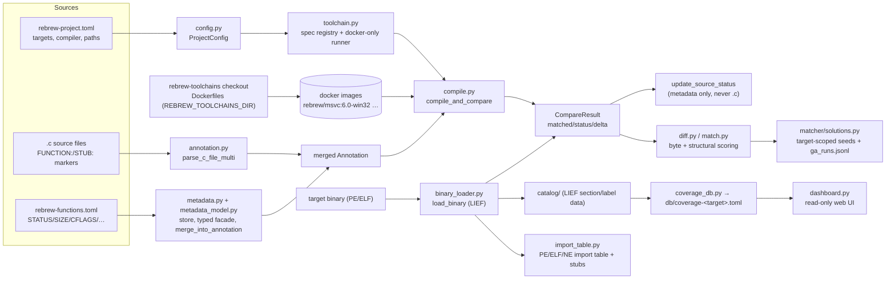

# Rebrew Architecture

Compiler-in-the-loop decompilation workbench for binary-matching game
reversing. C source is compiled in a pinned toolchain docker image
(MSVC6 runs wine inside its image; there is no host wine/wibo path),
byte-compared against a target binary's functions, and the result drives
STATUS promotion and the GA matching engine.

## Ecosystem

rebrew is one repo in a wider workspace. Sibling projects plug in at stable
boundaries: `rebrew-toolchains` supplies the docker compiler images,
`resembl` supplies the assembly-similarity scoring core, `recovery` serves
the `db/coverage-<target>.toml` documents this repo builds, `recompile` wraps the toolchain zoo
as an HTTP API, and `reagent` automates the loop with an LLM. External
tools interoperate through file formats: reccmp-compatible source
markers and the coverage document (the catalog's reccmp CSV export is gone
with the catalog's own artifacts), and the BinSync state directory (`rebrew binsync`, plus `rebrew binsync export` / `-import` /
`-diff` / `-init` / `-overlay`).
The full cross-repo map, dependency layering, and mermaid diagrams are in
[ECOSYSTEM.md](ECOSYSTEM.md). Open [architecture.drawio](architecture.drawio)
in diagrams.net for the same map as nine pages: ecosystem, compile-compare
loop, toolchains, FLIRT/resembl/GA, reverse data flows, config/store tiers,
data/globals/layout, LLM training export, and the local AI-decomp research
landscape.

## High-level data flow

```mermaid
flowchart LR
    subgraph Sources
        C[".c source files<br/>FUNCTION:/STUB: markers"]
        TOML["rebrew-project.toml<br/>targets, compiler, paths"]
        META["rebrew-functions.toml<br/>STATUS/SIZE/CFLAGS/…"]
    end

    C --> ANNOT["annotation.py<br/>parse_c_file_multi"]
    META --> FACADE["metadata.py + metadata_model.py<br/>store, typed facade, merge_into_annotation"]
    TOML --> CFG["config.py<br/>ProjectConfig"]

    ANNOT --> MERGED["merged Annotation"]
    FACADE --> MERGED

    CFG --> TOOLCHAIN["toolchain.py<br/>spec registry + docker-only runner"]
    RT["rebrew-toolchains checkout<br/>Dockerfiles (REBREW_TOOLCHAINS_DIR)"] --> IMG[("docker images<br/>rebrew/msvc:6.0-win32 …")]
    TOOLCHAIN --> COMPILE["compile.py<br/>compile_and_compare"]
    IMG --> COMPILE

    BIN["target binary (PE/ELF)"] --> LOAD["binary_loader.py<br/>load_binary (LIEF)"]
    MERGED --> COMPILE
    COMPILE --> CMP["CompareResult<br/>matched/status/delta"]
    LOAD --> CMP

    CMP --> STATUS["update_source_status<br/>(metadata only, never .c)"]
    CMP --> DIFF["diff.py / match.py<br/>byte + structural scoring"]

    LOAD --> CATALOG["catalog/ (LIEF section/label data)"]
    CATALOG --> DB["coverage_db.py → db/coverage-&lt;target&gt;.toml"]
    DB --> DASH["dashboard.py<br/>read-only web UI"]

    LOAD --> IMPORTS["import_table.py<br/>PE/ELF/NE import table + stubs"]
    DIFF --> SOL["matcher/solutions.py<br/>target-scoped seeds + ga_runs.jsonl"]
```

## Module map

| Package / module | Responsibility |
|---|---|
| `rebrew/` top-level tools | One CLI command each (`test`, `verify`, `diff`, `match`, `lint`, `data`, `status`, `todo`, …), declared as `CliComponent` rows in `builtins.py` (plus `main.py::_EXTRA_COMPONENTS` for `import-splat`) |
| `rebrew/plugin.py` | Cordis composition runtime: `Context`, `CoeffectScope`, `activate()`, `CliComponent`. Mounts are reversible effects; inverses fire at most once. Unmet `needs` stay inactive; disposing the context closes the scope. HMR/loader tier is not built (ADR 014) |
| `rebrew/registry.py` | Entry-point discovery and conflict policy for every component registry (single-source: a duplicate name raises `RegistryError`, except the CLI warn+skip and the optional-registry skip-with-warning groups). `refresh_all()` republishes every group under one lock for a long-lived host; readers take one generation (see "Registry snapshots" in `docs/DEVELOPMENT.md`) |
| `rebrew/intake.py` | One-shot binary onboarding: init + toolchain detect (diec → PDB → PE metadata → heuristics) + plugin function discovery + STUB/blocker documentation |
| `rebrew/main.py` | Umbrella CLI. Provides `app` (and the re-exported `console`), then `activate()`s packaged `CliComponent`s plus `rebrew.commands` / `rebrew.multicommands` plugins |
| `rebrew/cli.py` | Shared options/helpers: `TargetOption`, `require_config`, `error_exit`, `json_print`, exit codes |
| `rebrew/errors.py` | `RebrewError`, the base every public exception type inherits alongside its original `RuntimeError`/`ValueError`/`FileNotFoundError` base: one `except` clause for library consumers. Re-exports every public error class by lazy attribute, so `from rebrew.errors import DosboxError` works without knowing the defining submodule. Imports no other `rebrew` module at module scope (leaf module; stdlib only). `to_dict()` serializes `_STRUCTURED_FIELDS` (`kind`, `name`, `status_code`, `group`; a subclass extends the tuple for anything more it carries), coercing `Path` to `str` so the result survives `json.dumps`, and `from_dict()` rebuilds the named class, so a persisted failure still branches on the same data |
| `rebrew/sources.py` | Source-tree discovery: `source_exts`, `source_glob`, `target_marker`, `scan_files`, `iter_sources`, `iter_library_headers` (pure pathlib/config logic, importable by library modules; a command that needs several views of one tree scans it once via `scan_files` and passes `scanned=`). `source_roots` + `contained_path` own the metadata `file` field: every join of an annotation's `file` onto a source tree resolves through `contained_path(roots, value)`, which returns `None` for a value that is empty, absolute, or escapes every root |
| `rebrew/limits.py` | `NO_MAX_SIZE` / `NO_DELTA`, the "bound not measured" sentinels behind `--max-size` and `--max-delta`. A leaf so `match_run` can recognise an unset bound without importing the `skeleton` or `match_batch` command modules |
| `rebrew/config.py` | `ProjectConfig` dataclass + `rebrew-project.toml` loader (multi-target) |
| `rebrew/workspace/` | Workspace-root discovery and the target list (`find_root`, `db_dir`, `default_target`, `config.py`'s resolved view, `status.py`, `va.py`). Stdlib-only leaf, so a tool needing just the project's directories and target names never pulls in LIEF, capstone, or tree-sitter. It resolves no coverage data: `db_dir` names the directory, `coverage_toml.py` reads it |
| `rebrew/annotation.py` | Marker/KV annotation parsing (`// FUNCTION: MOD 0xVA`), key classification (file-only vs metadata), `iter_annotations` batch loader |
| `rebrew/metadata.py` | `rebrew-functions.toml` store + routing (`METADATA_FIELD_TYPES`, `METADATA_FIELDS`, `SYNC_FIELD_RULES`, `update_source_status` / `update_field` / `remove_field`); typed facade in `metadata_model.py` (`MetadataEntry`) |
| `rebrew/decompiler.py` | Pluggable decompiler backends for pseudo-C (`r2`/`rz` ghidra and dec, Ghidra via the ReVa MCP bridge, m2c for MIPS/PPC/ARM/SH), registered through the `rebrew.decompiler_backends` entry-point group. `fetch_decompilation` is the one entry point `rebrew skeleton --decomp` calls; `"auto"` picks the first backend that answers |
| `rebrew/llm_seed.py` | Optional LLM-assisted GA seeding for `rebrew match run --seed-llm`: asks the `[llm]` endpoint for alternative C, keeps only tree-sitter-valid single-function snippets, injects them as extra seeds. Off by default; with no endpoint the flag warns and the GA runs unchanged |
| `rebrew/compile.py` | Compile (docker image by default; host binary only for plugin toolchains without `image`) + compare → `CompareResult` |
| `rebrew/binary_model.py` | `BinaryInfo` / `SectionInfo`: the format-agnostic parsed-binary types every loader fills in and every consumer reads. Owns the lazy `data` read and its size cap, so a format loader never imports the dispatcher that selects it |
| `rebrew/binary_loader.py` | PE/ELF/Mach-O via LIEF, NE via `ne_loader.py`, MZ via its own header parser → `BinaryInfo` (sections, VAs, raw bytes) |
| `rebrew/pe_image.py` | PE32 section/export/import walk and the MSVC LINK options read off those header fields. Shared by `gen-layout` and `link-sweep`; the command modules do not own the parser |
| `rebrew/pseudo_c.py` | Deterministic rewrite of decompiler pseudo-C into C89 tokens (`sanitize_tokens`). Shared by `rebrew source fix` and Kuna seeding |
| `rebrew/matcher/` | GA engine: `scoring.py` (numpy + capstone), `mutator.py` (`ALL_MUTATIONS`: the 128 tree-sitter mutations from `mutations/*.py` plus plugin entry points), `compiler.py` (flag sweep), `solutions.py` (cross-function seeding + run history) |
| `rebrew/catalog/` | Function registry and the coverage grid (`grid.py`) the `db/coverage-<target>.toml` document is rendered from |
| `rebrew/ghidra/` | BinSync-primary field sync + ReVa MCP structural ops (function create/delete and similar) |
| `rebrew/coff_reloc.py` | Relocation-aware byte comparison (COFF/ELF reloc masking) |
| `rebrew/msvc_env.py` | MSVC include/lib env for host-side compile helpers |
| `rebrew/extract.py` | Batch extract/disassemble command (group: `list`/`show`/`batch`) |
| `rebrew/crt_match.py` | CRT source cross-reference matcher (index, match, ASM detection) |
| `rebrew/flirt.py` | FLIRT signature scanning |
| `rebrew/prove.py` | Symbolic equivalence prover via angr (optional dep) |
| `rebrew/delphi16.py` | Delphi 1.0 (16-bit) compile support: headless DOSBox sandbox + NE parse (ADR-001 foundation) |
| `rebrew/msvc16.py` | MSVC 1.0 / 1.5 / 1.52 (16-bit) compile support: DOSBox + 16-bit OMF objects |
| `rebrew/dosbox.py` | Shared headless DOSBox runner (mount sandbox as C:, FAT-uppercase reads) |
| `rebrew/toolchain.py` | Toolchain abstraction: spec registry + docker-only runner for every shipped profile (plugin toolchains without `image` may run as a host binary), plus the project-side MSVC layout table (`resolve_msvc_toolchain` / `toolchain_link_candidates`) init and config resolve against |
| `rebrew/toolchain_cli.py` | `rebrew toolchain` CLI (`list`/`status`/`detect`/`pull`/`build`/`vendor`/`smoke`/`update`/`check-updates`) |
| `rebrew/round_trip.py` | Splice matched functions back into the target PE, verify byte equality |
| `rebrew/similar.py` | Structural clone detection (mnemonic-histogram similarity) |
| `rebrew/near_analysis.py` | NEAR_MATCHING delta classification (register/encoding/equivalent/reloc/structural buckets) and the verdict; the library half, with no Typer app, so the GA engine and `probe` import it |
| `rebrew/near_diag.py` | The `rebrew diagnose near` CLI over `near_analysis.py`: argument parsing, Rich output, BLOCKER metadata writes, `--catalog` |
| `rebrew/stack_analysis.py` | Stack-frame derivation and diff (frame size, ebp-vs-esp, `ret N` popping, `[ebp±N]` slots) from disassembly on both sides; the library half |
| `rebrew/stack_cmp.py` | The `rebrew diagnose stack` CLI over `stack_analysis.py` |
| `rebrew/headless.py` | Persistent per-process Xvfb for headless wine compiles (no window, no DISPLAY needed) |
| `rebrew/toolchain_detect.py` | Layered compiler-family detector: Detect It Easy (diec) → PDB → PE metadata (Rich header/linker version) → codegen heuristics; feeds init's CRT/opt seeding and doctor's alignment check. Its four tables (profile compat, Rich-build and linker-era profiles, plugin detectors) are one generation: read them through `detection_tables()` |
| `rebrew/wibo.py` | Locate + SHA256-verify the wibo runner (`toolchain install-wibo`); a legacy host-runner fallback for toolchains registered without an `image`, not a shipped compile path (ADR 008) |
| `rebrew/binsync/` (`export.py` / `importer.py` / `diff.py` / `git.py` / `init.py` / `overlay.py`, plus `serial.py`, `cli.py`, `state.py`) | BinSync state export/import/diff/init/overlay, the `rebrew binsync` umbrella (git automation), and the shared state readers/reconciliation baseline and freshness projection; artifact TOML serialized with declib (the `binsync` extra) |
| `rebrew/crypto_scan.py` | Cryptography detection: data-section constant tables (AES S-boxes, SHA-256 K/H, SHA-1, MD5 T) plus imported-API and project-name matching |
| `rebrew/fingerprints.py` | Content fingerprint bundle for a binary: streamed MD5/SHA1/SHA256/SHA512/SHA3 digests and CRC32, Mandiant imphash, PE export hash, MSVC Rich-header hash, per-section entropy, optional TLSH/ssdeep |
| `rebrew/climb.py` | Deterministic single-statement hill-climb over one function body (adjacent-statement swaps scored through the compile→compare path); complements the GA when the residual is statement order |
| `rebrew/blocker.py` | Programmatic BLOCKER writer: `rebrew blocker set/clear/show` (by file/VA/symbol; every write locked + atomic) |
| `rebrew/document_unmatched.py` | STUB skeleton + BLOCKER writer for unmatched functions (standalone intake document step) |
| `rebrew/discover.py` | Function enumeration via `rebrew.discoverers` plugins (packaged: rizin aaa/aap, capstone sweep, `.eh_frame` and `.pdata` unwind tables, NE loader, MZ sweep) with size cross-checks |
| `rebrew/pdb_info.py` | PDB metadata extraction (S_COMPILE3 compiler version + flags) |
| `rebrew/identify_library.py` | Library-function identification backends (CRT/ZLIB marking) |
| `rebrew/dashboard.py` | Read-only web dashboard over the `db/coverage-<target>.toml` documents |
| `rebrew/import_table.py` | Import-table parsing (PE IAT, ELF dynamic imports, 16-bit NE module references) and `jmp [iat]` stub detection; library layer shared by analysis passes |
| `rebrew/imports.py` | `rebrew binary imports list` CLI over `import_table.py`, plus `--mark` LIBRARY annotation of import stubs |
| `rebrew/skills.py` | Agent-skill discovery CLI (`list`/`show` subcommands) |
| `rebrew/agent-skills/` | Bundled `SKILL.md` workflows (init, intake, workflow, matching, data analysis, ghidra sync) |

## Which similarity tool

Seven surfaces answer similarity questions (the last row is library
identification, which is not a similarity score). They are not alternatives
to each other: each measures a different thing, and picking the wrong one
wastes the answer. Use this table before adding an eighth.

| Surface | Answers | Input and cost |
|---|---|---|
| `similar.py` | which functions in this target rank closest to this one | this target, mnemonic histogram, linear per candidate |
| `similar.py --submatch` (`instruction_clones.find_common_runs`) | where inside these two functions do they correspond | two functions, exact longest common runs, quadratic in the pair |
| `similar.py --cluster` (`instruction_clones.cluster_units`) | which functions are identical after normalization | this target, one hash per function, linear in total instructions |
| `binary_similarity.py` | how alike are two whole binaries (versions, DLL vs EXE) | two images, section and structural summary |
| `cfg_ged.py` | how alike are two control-flow graphs | per function pair, block-graph edit distance |
| `matcher/scoring.py` → `resembl.scoring` | which stored snippets resemble this query | a persisted cross-project corpus, approximate (MinHash + LSH) |
| `crt_match.py` / `flirt.py` / `identify_library.py` | is this function library code, and from which archive | signature and archive matching, not a similarity score |

The boundary that matters is the last two rows against `instruction_clones`: in-process,
exact, no persistence, one target (instruction_clones) versus a persisted corpus with
approximate near-neighbour search across projects (`resembl`). A request for
cross-project duplicate detection, a fragment query against a snippet library,
or near-duplicate clustering belongs on `resembl`, which rebrew already reuses
for the whole-function score; growing an index or a MinHash inside rebrew
would be a second answer to that question. See
[ECOSYSTEM.md](ECOSYSTEM.md#resembl-assembly-similarity-search).

## The compile → compare → STATUS/BLOCKER loop

1. `parse_c_file_multi()` reads the marker line plus inline keys still
   used from the `.c`. A migrated, marker-less file (ADR 023) has no
   block to read: `_annotations_from_metadata` synthesizes the same
   Annotations from the TOML entries whose `file` field matches. Inline
   keys still read on an unmigrated file: co-read `SIZE`/`CFLAGS` (reccmp contract),
   `TOOLCHAIN`/`SOURCE` (until migrated; metadata wins on merge),
   `// SOURCE: naked` (file-borne), and structural `STRUCT`/`CALLERS`
   (`SECTION` on DATA/GLOBAL is data-metadata-owned). Inline `STATUS`
   etc. are NOT parsed (`_kv_to_annotation` hardcodes `STUB`).
2. `merge_into_annotation()` overlays `rebrew-functions.toml` values (metadata
   wins for owned fields: STATUS, TOOLCHAIN, BLOCKER, NOTE, GHIDRA, …;
   SIZE/CFLAGS are co-read with metadata as override).
3. `compile_and_compare()` compiles the source in the pinned toolchain
   image (`toolchain.py`; docker-only for every shipped profile, including
   gcc/clang/mingw; images built from the `rebrew-toolchains` checkout) and
   byte-compares against the target bytes → `CompareResult`.
4. `update_source_status()` writes STATUS to the metadata file only: the
   `.c` marker lines are never rewritten. `update_field` / `remove_field`
   (via `rebrew blocker set/clear`, `rebrew diff --fix-blocker`, etc.) do the
   same for BLOCKER/BLOCKER_DELTA: never hand-edit `rebrew-functions.toml`.

## Metadata routing and provenance

[`metadata.py`](../src/rebrew/metadata.py) owns `METADATA_FIELD_TYPES`,
`METADATA_FIELDS`, and `SYNC_FIELD_RULES`. The typed facade, data-field schemas,
linter, and integration projections reuse those definitions. Keep field shapes
and native sync permissions there rather than copying catalogs into callers.

[METADATA_FORMAT.md](METADATA_FORMAT.md) owns inline/migrated identity and field
rules; [METADATA.md](METADATA.md) owns canonical/derived/cache tiers and the
separate ordinary edit stamps, imported origins, and verification evidence.
[BINSYNC_INTEGRATION.md](BINSYNC_INTEGRATION.md) specifies field reconciliation,
manifest freshness, deletion handling, and the per-file atomicity boundary.

Status/todo reuse one accounting frame. Coverage documents and grids are derived
views; their cell/symbol counts do not replace the disjoint byte buckets in
[status accounting](CLI.md#rebrew-status).

## Composition guarantees

The [Cordis guide](CORDIS.md) owns component lifecycle and API contracts,
the [paper mapping and limits](CORDIS.md#paper-contracts-and-limits), and
component-author recipes. Its [tutorial](CORDIS_TUTORIAL.md) demonstrates
dependency-driven activation and provider replacement with executable checks.
Registry publication has its own [snapshot contract](DEVELOPMENT.md#registry-snapshots).

## Key architectural rules

- Config-driven: every tool reads `rebrew-project.toml` via `require_config`.
- Idempotent: every tool is safe to re-run.
- One canonical name per function: no aliases/shims/legacy wrappers.
- STATUS promotion only via `update_source_status` (never inline in `.c`); BLOCKER only via `update_field`/`remove_field` through `rebrew blocker set/clear` or the auto-writers (`diff --fix-blocker`, `near-diag --fix-blocker`, `document-unmatched`).
- Source discovery via `iter_sources`; batch annotations via `iter_annotations`.
- Registries republish as a whole: one `refresh_*` call is one generation, and a
  reader that needs two tables takes one snapshot (`registry_snapshot()`,
  `detection_tables()`) or reads under the module's refresh lock.
- Read-only tools never write a store: the dashboards parse `db/coverage-<target>.toml` and cache a frozen snapshot, and the binary is read lazily through LIEF.
- See `docs/DEVELOPMENT.md` for test conventions, Typer quirks, and
  metadata/tomlkit gotchas.
