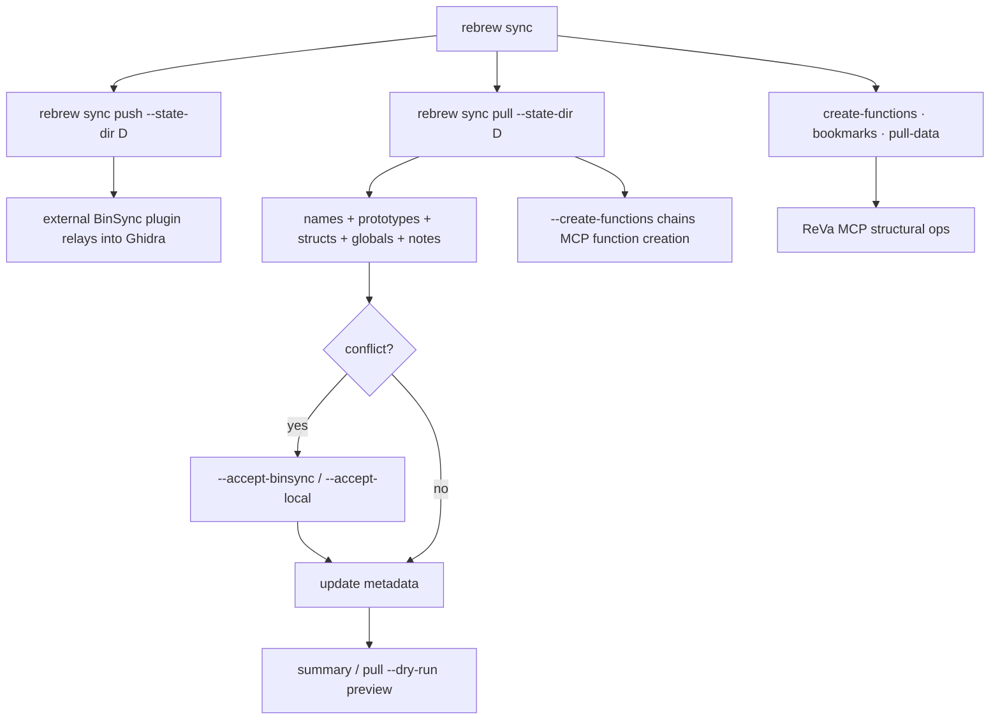

# BinSync Integration

`rebrew binsync export`, `rebrew binsync import`, and `rebrew binsync diff`
provide a bidirectional bridge between rebrew and any BinSync-aware decompiler
plugin (IDA Pro, Binary Ninja, Ghidra via BinSync). Shared native fields include
names, C signatures, notes, comments, locals, globals, structs, enums, and
typedefs. `rebrew binsync diff` reports divergence and provenance freshness read-only.

> BinSync state I/O goes through [declib](https://github.com/binsync/declib), BinSync's
> artifact layer (the `declib>=4.5` dependency of the `binsync` extra). Install it with
> `uv sync --extra binsync`. Stack vars, per-instruction comments, enums, and typedefs
> all round-trip; the `rebrew binsync` push/pull umbrella ships alongside the flat
> commands ([prd/09-binsync-full.md](prd/09-binsync-full.md)).

---

## Init: `rebrew binsync init <state-dir>`

Creates the git envelope upstream BinSync's `Client` requires. rebrew writes
BinSync-format files, but upstream resolves the state root from a git repo
whose `binsync/__root__` branch root commit carries `.gitignore` (`.git/*`)
and `binary_hash` (the target binary's MD5), plus a `binsync/<user>` branch
created from that root. Without it, `_get_or_init_binsync_repo` raises "not a
BinSync repo".

```bash
rebrew binsync init ./binsync_state
rebrew binsync init ./binsync_state --user alice
rebrew binsync init ./binsync_state --dry-run
```

`--user` defaults to `git config user.name` (else `rebrew`). The root commit
adds only `.gitignore` and `binary_hash` (never `-A`), so files already present
in the state directory stay untracked. Rerunning against a state directory that
already has a `binsync/__root__` branch keeps the root and checks out
`binsync/<user>`, creating it from the root if missing (a second user joining,
or recovery after a crash past the root commit). A root `binary_hash` that
differs from the target binary errors.

---

## Umbrella: `rebrew binsync <push|pull|summary|init|diff|overlay>`

`rebrew binsync` is a multi-command group that orchestrates the same
export/import owners and adds Git automation:

```bash
rebrew binsync init ./binsync_state          # build the Git envelope
rebrew binsync push ./binsync_state          # export + git commit
rebrew binsync push ./binsync_state --git-push --remote origin
rebrew binsync pull ./binsync_state          # git pull --ff-only + import
rebrew binsync pull ./binsync_state --no-git --accept-binsync
rebrew binsync summary ./binsync_state       # read-only preview of both directions
rebrew binsync diff ./binsync_state          # inspect divergence
rebrew binsync overlay ./binsync_state       # apply related-target evidence
```

- **`push`** runs `rebrew binsync export`, staging and committing the state directory
  (`--no-git` skips the commit). `--git-push` pushes both `binsync/__root__` and
  the current branch to `--remote` (default `origin`).
- **`pull`** fast-forwards the state directory's git repo (`--no-git` skips it;
  a non-fast-forward points you at resolving the repo by hand), then runs
  `rebrew binsync import`. Unresolved conflicts exit `1`, like raw import.
- **`summary`** calls export and import in dry-run mode and reports the counts
  each direction would change. It writes nothing and never touches git.

Raw `rebrew binsync export` and `rebrew binsync import` exchange local state
without the default Git steps of push/pull. All operations live under the
`rebrew binsync` group and retain their distinct option sets.

---

## Field ownership, reconciliation, and provenance

`SYNC_FIELD_RULES` in `rebrew.metadata` is the shared field schema used by
push, pull, and diff. Function size is push-only; global name/type/size and
native function/type fields synchronize in both directions. STATUS, CFLAGS,
toolchain choices, blockers, origins, and verification evidence stay local.

Push and pull compare each field with the last shared value:

| Change since baseline | Pull | Push |
|---|---|---|
| Local only | Preserve local edit | Export local edit |
| Remote only | Apply remote edit | Preserve incoming edit |
| Both, same value | Keep shared value | Keep shared value |
| Both, different values | Report conflict | Preserve conflict |
| Remote field/artifact removed | Report deletion requiring resolution | Do not recreate it automatically |

Without a baseline, import keeps the conservative meaningful-name/prototype
conflict rules. `--accept-binsync` chooses remote conflict values;
`--accept-local` keeps local values (and retains alternate function names as
GHIDRA). Generic incoming names never replace meaningful names.

The binary-scoped baseline is a local `.rebrew/sync/<hash>.toml` sidecar keyed
by resolved state-directory path and module. Only equal fields after successful
writes/applications advance it. Previews and failed writes do not. Atomic
replacement protects each file/store; an entire sync is not a multi-file
transaction. Related-target overlays use structural matching rather than this
same-binary baseline.

Imported function/global fields record tool, user, snapshot, and value digests
in canonical `origins` tables. Comparison writers maintain separate
`verification` evidence. Later local edits can make an origin stale without
rewriting its history. See [METADATA.md](METADATA.md#external-origin-and-measurement-evidence)
for evidence ownership and [the baseline contract](METADATA.md#integration-baseline-and-freshness).

`rebrew binsync diff STATE_DIR --json` exposes `health`: pending push/pull,
conflicts, unbased fields, deletions requiring resolution, stale verification,
and stale origins. Binary identity or metadata-schema mismatches block writes.
Ordinary local/remote changes since export are freshness information for the
merge, not a blanket write prohibition. Matching digests indicate unchanged
inputs/artifacts, not a byte-match verdict.

---

## Export: `rebrew binsync export <outdir>`

Writes a [BinSync](https://github.com/binsync/binsync) state directory from the
project's annotations and metadata:

```
<outdir>/
    metadata.toml        -- user + version (declib State.parse requires it)
    functions/
        <hex>.toml       -- one declib Function artifact per function
    structs/
        <name>.toml      -- one declib Struct artifact per struct (name sanitized)
    comments.toml        -- Comment.dumps_many, keyed by hex addr
    global_vars.toml     -- GlobalVariable.dumps_many, keyed by hex addr
    enums.toml           -- Enum.dumps_many, keyed by name
    typedefs.toml        -- Typedef.dumps_many, keyed by name
    binary_hash          -- target binary MD5 (rebrew-added)
    manifest.toml        -- rebrew freshness facts (ignored by declib)
```

Export merges two sources: reversed annotations (`scan_reversed_dir`, the
authoritative names/sizes/prototypes) plus the **project file / catalog**
(`src/<target>/function_structure.json` → `build_function_registry`,
canonical sizes) for functions that have not yet been reversed.  This keeps
BinSync in sync with your binary's full function list and offsets, not just the
reversed subset.  Catalog-only functions are exported with no `STATUS`/`CFLAGS`
and no `GHIDRA` comment; import surfaces them as `proposed_missing` until created
with `--create-missing`.

### What Gets Exported

| Rebrew field | declib artifact | Location |
|---|---|---|
| `va` + `name`/`symbol` | `Function.addr` / `Function.name` | `functions/<hex>.toml` |
| `size` | `Function.size` | `functions/<hex>.toml` |
| `prototype` | `Function.header.type` | `functions/<hex>.toml` |
| `locals` metadata | `Function.stack_vars` (`StackVariable`) | `functions/<hex>.toml` |
| `note` | `Comment` at `va + 1` (`func_addr=va`) | `comments.toml` |
| `ghidra` | `Comment` at `va + 2` (only when different) | `comments.toml` |
| `comments` metadata | `Comment` per instruction addr | `comments.toml` |
| DATA/GLOBAL entries | `GlobalVariable.addr/name/type/size` | `global_vars.toml` (hex-addr keys) |
| Struct definitions | `Struct` members keyed by byte offset | `structs/<name>.toml` |
| Enum definitions | `Enum.name` + `Enum.members` values | `enums.toml` (`[<name>.members]`) |
| Standalone typedefs | `Typedef.name` + `Typedef.type` | `typedefs.toml` |
| Target binary MD5 | Binary identity binding | `binary_hash` (omitted when the target binary is unavailable) |
| Export manifest | Freshness facts | `manifest.toml` (`exported_at`, `content_hash`, `target`, `binary_hash`, optional `commit`, `metadata_schema`, `input_hash`) |

### Rebrew Metadata Comment Format

`STATUS` is comparison-earned; CFLAGS are local compiler inputs. Neither is exported.  Notes, the
Ghidra-synced name, and per-instruction comments all travel as declib
`Comment` artifacts in `comments.toml`, keyed by address and tagged with the
owning function's `func_addr`:

```toml
# comments.toml
[0x10008881]
addr = 0x10008881
func_addr = 0x10008880
comment = "[rebrew:note] Matches original exactly"
decompiled = false
```

(`va + 1` for the note, `va + 2` for a differing Ghidra name; the comment
prefix distinguishes provenance from a real instruction comment.)

### Function TOML Layout

```toml
# functions/10008880.toml
addr = 0x10008880
size = 0x1f
name = "_BitReverse@4"

[header]
name = "_BitReverse@4"
addr = 0x10008880
type = "int __cdecl BitReverse(int x)"

[header.args]

[stack_vars.-0x4]
offset = -4
name = "ret"
type = "int"
size = 0x4
addr = 0x10008880
```

### Global Variables

DATA and GLOBAL annotations are written as declib `GlobalVariable` artifacts
with their real C types (resolved from `extern` declarations + data metadata;
`char` fallback).  Section is not part of declib's `GlobalVariable`; import and
overlay derive the section from the binary by address:

```toml
[0x10008000]
addr = 0x10008000
name = "g_szNotepad"
type = "char[64]"
size = 0x40
```

### Structs

Struct definitions are collected from `*.h` headers and source files via
tree-sitter and emitted with field-level detail.  Headers are scanned in the
target's `reversed_dir` and, when configured, the project-shared tree
(`[project].shared_dir`, default `src/shared`), so a type declared once for
every target exports for each of them:

```toml
# structs/Point.toml
name = "Point"
size = 0x28

[members.0x0]
name = "x"
offset = 0x0
type = "int"
size = 0x4

[members.0x4]
name = "y"
offset = 0x4
type = "int"
size = 0x4

[members.0x8]
name = "name"
offset = 0x8
type = "char[32]"
size = 0x20
```

If `STRUCT:` annotations name a struct that isn't defined in any scanned header,
a minimal placeholder (no members) is still emitted.

### Enums and typedefs

Enums and standalone typedefs are name-keyed like structs and collected from
the same header/shared/source scan via tree-sitter.  Each is a **single**
file (matching upstream BinSync, which dumps many enums/typedefs per file);
an empty collection writes nothing:

```toml
# enums.toml
[E]
name = "E"

[E.members]
A = 0x0
B = 0x5
C = 0x6
```

```toml
# typedefs.toml
[uint32_t]
name = "uint32_t"
type = "unsigned int"
```

Bare enum members auto-increment from the previous value (starting at 0).
declib carries no enum/typedef body text, so import synthesizes the
declaration from the name + members/type.  `rebrew binsync import` writes unknown
enum/typedef definitions into the local `binsync_types.h`. Remote-only changes
to an existing, unambiguous definition update it through the C AST; concurrent
edits are conflicts. Related-target overlays add unknown definitions and
preserve known ones.

---

## Import: `rebrew binsync import <state-dir>`

Reads a BinSync state directory (own export or one produced by another tool)
and applies changes back into rebrew metadata/source:

- **Names**: declib `Function.name` → rebrew symbols
  (via `rebrew source rename` cross-reference rewriting). Generic→meaningful is applied
  directly without a baseline; established fields follow the three-way rules above.
- **Prototypes**: declib `Function.header.type` → the actual C function
  signature through the AST. The body and locally selected name are preserved;
  name changes use the rename path. No `// PROTOTYPE:` comment is written.
  Whitespace-only differences are ignored; concurrent signature edits conflict.
- **Globals**: declib `GlobalVariable` records → `rebrew-data.toml` names,
  plus differing `type`/`size` written back (section comes from the binary).
- **Notes / comments**: declib `Comment` artifacts in `comments.toml`:
  `[rebrew:note]`/`[rebrew:ghidra]` prefixes become rebrew `note`/`ghidra`
  metadata; every other comment lands in the function's `comments` metadata
  keyed by hex address. A comment whose address falls inside the owning
  function's range also gets a human-editable source marker (see below).
- **Locals**: declib `Function.stack_vars` → the function's `locals` metadata
  (`[<module>.<va>.locals]`, offset-keyed `{name, type, size}`).
- **Structs / enums / typedefs**: declib `Struct`, `Enum`, and `Typedef`
  records unknown locally land in `binsync_types.h`. Remote-only changes update
  one unambiguous existing definition; concurrent edits conflict. Unparseable
  synthesized definitions import as comments rather than active declarations.

### Per-address comment markers

Per-instruction comments have a line-comment representation, anchored by
address (rebrew has no source line table, so the block is placed at the END of
the owning `.c` file and never touches a function body):

```c
// ANALYSIS @ 0x401010: some note
```

- **Import/pull** writes or updates one marker per comment whose address is
  inside a local function's range, in a single trailing block sorted by
  address, separated from the code by one blank line. Re-import updates the
  existing line in place (idempotent, no duplicates). A comment outside every
  known function's range stays in the `comments` metadata only.
- **Export/push** collects comments from BOTH the metadata `comments` field and
  a scan of the project sources for the marker pattern, merged by address. A
  source marker wins over the metadata entry for the same address, so an edit
  made in source flows out to `comments.toml`. `func_addr` is derived from the
  owning function's VA.
- **Overlay** shifts each transferred comment address by the matched pair's VA
  delta and writes the marker in the destination file too.

The metadata `comments` field remains the lossless store (it survives even for
addresses with no source marker).

Conflict resolution mirrors `rebrew sync push`:

```
CONFLICT 0x10001000: local=_OldName vs binsync=_NewName
```

- `--accept-binsync`: accept remote field values on conflicts.
- `--accept-local`: keep local field values; record an alternate function name as GHIDRA.

`--module FILTER` restricts to one module; `--dry-run`/`--json` work as elsewhere.  For BinSync
functions with no local annotation but present in the catalog, import proposes a new STUB
(`proposed_missing`); pass `--create-missing` to materialize it (see `--create-missing` in the flag table).

### Examples

```bash
# Preview what would be imported
rebrew binsync import ./binsync_state --dry-run

# Accept remote values on conflicts
rebrew binsync import ./binsync_state --accept-binsync

# Accept only one module
rebrew binsync import ./binsync_state --module SERVER --accept-binsync

# Machine-readable summary
rebrew binsync import ./binsync_state --dry-run --json | jq .
```

---

## Overlay: `rebrew binsync overlay <state-dir>`

Transfers BinSync names, prototypes, and notes from a **related target** onto
structurally-matched functions of the target the command runs against. Two
binaries in one project (a DLL+EXE pair sharing a static lib, or two versions)
hold the same code at different VAs; this command pairs them by structural
signature (no compilation needed) and overlays the fields the source target
already knows.

The source target comes from `--from`, or from the `target` key in the state
`manifest.toml` when `--from` is omitted. The destination is the command's
`--target` (the project default when omitted).

- **Names**: applied when the local name is generic or empty; a meaningful
  local name that differs is a conflict.
- **Prototypes**: applied when the local prototype is empty; a differing
  non-empty local prototype is a conflict (whitespace-normalized compare).
- **Notes**: a differing non-empty remote note is written to the `note`
  metadata field.
- **Structs, enums, typedefs**: unknown definitions from the state import into
  the destination's `binsync_types.h` as in `rebrew binsync import`; known names are
  never overwritten.
- **Globals** (opt-in via `--fields global`): a source global is matched to
  the destination by exact content, not by address. Its bytes are searched in
  the destination's same-named section and mapped only when they occur exactly
  once; a duplicate or a missing section is skipped, never guessed. The matched
  destination VA takes the source name plus `type`/`size`/`section`.

`--fields name,prototype,note` restricts which fields run (add `global` to
include content-matched globals). `--module NAME` restricts the destination to
one module.

Default conflict behavior matches `rebrew binsync import`: a conflict is reported,
nothing is written, and the command exits `1`. Pass `--accept-binsync` to take
the remote value, or `--accept-local` to keep the local value and record the
remote one as `GHIDRA` provenance.

```bash
# Preview what would move from v1's state onto this target
rebrew binsync overlay ../v1/state --dry-run

# Source target from the manifest; accept BinSync names on conflicts
rebrew binsync overlay ../v1/state --accept-binsync

# Only names and prototypes, machine-readable
rebrew binsync overlay ./state --fields name,prototype --json | jq .

# Include content-matched globals
rebrew binsync overlay ./state --fields global
```

---

## Diff: `rebrew binsync diff <state-dir>`

Read-only divergence report between the local project (reversed annotations +
catalog) and a BinSync state directory. Never writes; exits `1` when any
divergence exists (CI-friendly). Same filtering semantics as
`rebrew binsync import --dry-run`.

- **Names**: generic-vs-meaningful and meaningful↔meaningful conflicts
- **Prototypes**: BinSync `[header].type` vs local prototype (whitespace-normalized)
- **Globals**: `global_vars.toml` labels missing or renamed locally
- **New in BinSync**: catalog-known functions present in BinSync but not yet
  reversed locally (the same population import surfaces as `proposed_missing`)
- **Types, locals, comments, and deletions**: shared field rules identify incoming, outgoing, and conflicting changes
- **Freshness**: manifest schema/input/artifact digests and canonical origin/verification freshness in JSON `health`

```bash
rebrew binsync diff ./binsync_state            # divergences (exit 1 if any)
rebrew binsync diff ./state --json | jq .      # machine-readable report
rebrew binsync diff ./state --module SERVER    # one module only
```

---

## Common Flags

`rebrew binsync export`, `rebrew binsync import`, and `rebrew binsync diff` share the standard
rebrew surface (`rebrew binsync diff` is read-only: no `--dry-run` or `--accept-*`;
it exits `1` on divergence). `rebrew binsync overlay` adds `--from` and `--fields`,
and supports the same `--target`/`--module`/`--dry-run`/`--json` flags:

| Flag | Effect |
|---|---|
| `--target NAME` | Operate on a specific target |
| `--module NAME` | Only this module (export filters, import/diff skip) |
| `--dry-run` | Preview without writing |
| `--json` | Machine-readable output |
| `--git` (export only) | Stage + `git commit` the state directory after writing |
| `--clean` (export only) | Delete orphan `functions/<hex>.toml` no longer in the catalog/annotations |
| `--create-missing` (import only) | Create STUB files for catalog-known BinSync functions with no local annotation |

### Export Examples

```bash
# Export to a directory
rebrew binsync export ./binsync_state

# Export one module only
rebrew binsync export ./binsync_state --module SERVER

# Export + git commit the state
rebrew binsync export ./binsync_state --git

# Export for a specific target (multi-target project)
rebrew binsync export ./binsync_state --target server

# Preview without writing (dry-run)
rebrew binsync export ./binsync_state --dry-run

# Machine-readable summary
rebrew binsync export ./binsync_state --json
```

---

## Coverage by Status

| Status | Name | Prototype | Metadata comment |
|--------|------|-----------|-----------------|
| EXACT / RELOC / PROVEN | yes | yes (if a C signature is available) | yes |
| NEAR_MATCHING | yes | yes (if a C signature is available) | yes |
| STUB | yes | yes (if a C signature is available) | yes |
| LIBRARY | yes | yes (if a C signature is available) | yes |
| (no STATUS) | yes | yes (if a C signature is available) | omitted |

The metadata-comment column is notes and differing Ghidra names only:
`STATUS` is comparison-earned; CFLAGS are local compilation inputs. Both stay local.

---

## Limitations (remaining)

- **Comments outside a function range**: a per-instruction comment whose
  address falls outside every known function's range has no source marker
  (rebrew has nowhere to anchor it); it stays in the metadata `comments` store
  and still round-trips through `comments.toml`.
- **Marker placement**: the `// ANALYSIS @ 0xADDR: text` block is file-level
  (one trailing block per `.c`), not mapped to a source line; rebrew has no
  line table, so the address is the only anchor.

---

## `rebrew sync push`: feature matrix and known issues

`rebrew sync push` is BinSync-primary: field sync (names, prototypes, structs,
globals) goes through the shared state dir above, and ReVa MCP remains only
for the structural ops the state dir cannot express (create-functions,
bookmarks, pull-data).  For the product vision see [prd/07-ghidra-sync.md](prd/07-ghidra-sync.md);
for flags see [CLI.md](CLI.md#rebrew-sync-push).



| Feature | Direction | Status | Command |
|---------|-----------|--------|---------|
| Export annotations to a BinSync state dir | Local → file | Done | `--push --state-dir D` |
| Import a BinSync state dir into rebrew | File → Local | Done | `--pull --state-dir D` |
| Import structs / notes / global types+sizes | File → Local | Done | `--pull` (structs → `binsync_types.h`, notes → metadata, global type/size → `rebrew-data.toml`) |
| Create missing functions in Ghidra | Local → Ghidra | Done | `--pull --create-functions` (MCP create op over imported VAs) |
| Status bookmarks | Local → Ghidra | Done | `--bookmarks` (category `rebrew`, status in the comment) |
| Custom MCP endpoint URL | n/a | Done | `--endpoint URL` |
| Summary / dry-run preview | n/a | Done | `--summary`, `--dry-run` |
| Prototype conflict gating | File → Local | Done | remote-only edits apply; concurrent edits conflict; `--accept-binsync` resolves |
| Whitespace-normalized prototype compare | n/a | Done | formatting-only differences are not divergence |
| Freshness manifest | File | Done | `manifest.toml` schema/input/artifact digests; JSON `health` reports freshness |
| Field conflict detection | Both | Done | Warns on conflict, `--accept-binsync`/`--accept-local` |
| Pull data labels from Ghidra | Ghidra → Local | Done | `--pull-data` (generates `rebrew_globals.h`) |
| Validate `programPath` against Ghidra project | n/a | Done | queries `get-current-program` via ReVa MCP and warns on mismatch |
| Watch mode (live input-change sync) | Local → state dir | Done | `--watch` (push only) |
| XREF context in skeleton generation | Ghidra → Local | Done | `skeleton --xrefs` |
| Ghidra decompilation backend for skeleton | Ghidra → Local | Done | `skeleton --decomp --decompiler ghidra` |
| Metadata-aware linting | Local | Done | `rebrew lint` reads `rebrew-functions.toml` before validation |

### Known issues

- **Per-instruction comments outside a function range**: an in-range comment
  round-trips through the `// ANALYSIS @ 0xADDR: text` source marker; one with
  no anchorable function stays in the metadata `comments` store (see
  [Limitations](#limitations-remaining)).

---

## Related

- [`rebrew coverage catalog`](CLI.md#rebrew-coverage-catalog): function registry and coverage grid
- [BinSync GitHub](https://github.com/binsync/binsync)
- [declib](https://github.com/binsync/declib)
