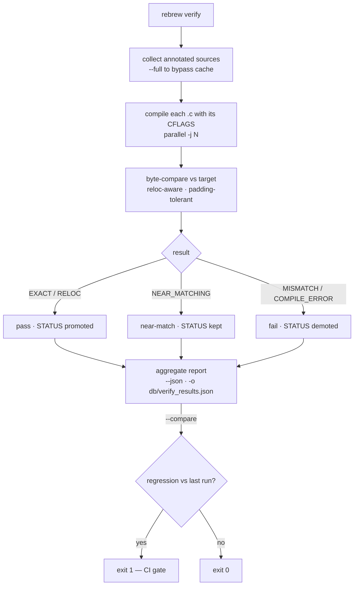
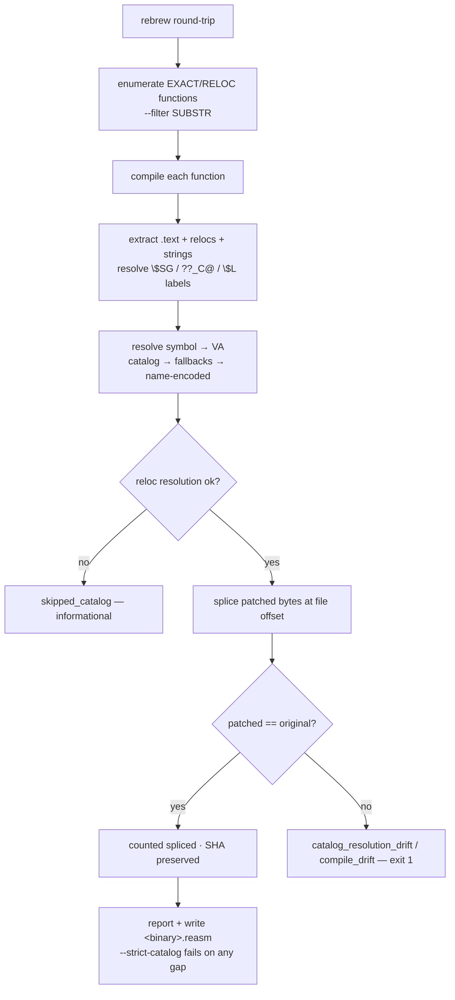

# CLI Reference

All 48 CLI commands are registered under the unified `rebrew` entry point in `main.py`.
Every tool supports `--target / -t` to select a target from `rebrew-project.toml` and
reads defaults (binary path, reversed_dir, compiler settings) from the project config.

Run any tool with `--help` to see usage examples and context
(typer `rich_markup_mode="rich"` with epilog text).

New to rebrew?  Start with the [first-run walkthrough](ONBOARDING.md)
(`rebrew init` → `rebrew intake` → `rebrew doctor` in ~5 minutes).

## Typical Workflow

```
rebrew todo              See what needs work (prioritized by ROI)
rebrew skeleton 0x<VA>   Generate a .c skeleton from address
rebrew test src/<func>.c Compile, byte-compare, and auto-update STATUS
rebrew diff src/f.c      Show byte diff for near-misses
rebrew verify            Bulk-verify all reversed functions
```

## test vs verify vs match

| Command | Scope | Caching | Use when |
|---------|-------|---------|----------|
| `rebrew test <file>` | Single function | No | Iterating on one function |
| `rebrew test --all` | Batch (all files) | No | Like verify but always recompiles |
| `rebrew verify` | Batch (incremental) | Yes | CI / bulk status check |
| `rebrew match <file>` | Single function | No | GA engine to find byte-perfect match |

Byte-match ladder (best → worst): `EXACT` → `RELOC` → `NEAR_MATCHING` → `STUB`.
`PROVEN` is a side path: semantic equivalence via `rebrew prove` when bytes still
differ (NEAR_MATCHING only). It is sticky under test/verify and ranks with RELOC
for `--compare` (not “better than EXACT”).

> The same table is shown in `rebrew --help` (source of truth: `src/rebrew/main.py` epilog).

## Entry Points

| Command | Script | Description |
|-------------|--------|-------------|
| `rebrew` | `main.py` | Unified CLI entry point for all subcommands |
| `rebrew rename` | `rename.py` | Rename a function and update all cross-references |
| `rebrew init` | `init.py` | Scaffold a new project directory and `rebrew-project.toml` |
| `rebrew test` | `test.py` | Compile-and-compare; auto-promotes STATUS on EXACT/RELOC; `--no-promote` to skip; `--json` output |
| `rebrew asm` | `asm.py` | Dump disassembly (`--format hex`) or NASM (`--format nasm`) from target binary at a VA |
| `rebrew switch` | `switch.py` | Decode jump-table switch dispatches in a function (case → handler map; `--window`) |
| `rebrew diff` | `diff.py` | Side-by-side disassembly diff against target binary; `--fix-blocker` writes BLOCKER metadata |
| `rebrew skeleton` | `skeleton.py` | Generate annotated `.c` skeleton from VA (with `--decomp`, `--xrefs`, `--append` for multi-function files) |
| `rebrew catalog` | `catalog/` | Parse annotations, generate catalog + coverage JSON |
| `rebrew sync` | `ghidra/cli.py` | Sync source markers, metadata, structs, and signatures to/from Ghidra via ReVa MCP (`--push`, `--pull`, `--apply`, `--export`) |
| `rebrew lint` | `lint.py` | Lint source marker standards in decomp C files |
| `rebrew extract` | `extract.py` | Batch extract and disassemble functions from binary |
| `rebrew match` | `match.py` / `matcher/` | GA matching engine (single-function or `--all` batch); `--fix-blocker`; `--json` structured output |
| `rebrew verify` | `verify.py` | Compile all `.c` files and verify byte match against target binary; `--compare` regression detection; `--json` structured reports. 16-bit NE targets run when `profile = "msvc1.52"` is configured, otherwise short-circuit with a notice naming the required profile |
| `rebrew todo` | `todo.py` | Prioritized action list: what to work on next, ROI-ranked across all signals |
| `rebrew cache` | `cache_cli.py` | Compile cache management (`stats` reports hit rate + disk usage, `clear` purges cache) |
| `rebrew cfg` | `cfg.py` | Read and edit `rebrew-project.toml` programmatically (see [CONFIG.md](CONFIG.md)) |
| `rebrew split` | `split.py` | Split multi-function C files into individual files |
| `rebrew merge` | `merge.py` | Merge single-function C files into multi-function file |
| `rebrew prove` | `prove.py` | Prove semantic equivalence via angr symbolic execution (optional dep) |
| `rebrew flirt` | `flirt.py` | FLIRT signature scanning (see [FLIRT_SIGNATURES.md](FLIRT_SIGNATURES.md)) |
| `rebrew gen-flirt-pat` | `gen_flirt_pat.py` | Generate FLIRT `.pat` files from COFF `.lib` archives |
| `rebrew imports` | `imports.py` | List import-table symbols — PE IAT (with `jmp [iat]` stub detection) or 16-bit NE module references (library identification) |
| `rebrew strings` | `strings.py` | Extract printable ASCII/UTF-16 strings from data sections, with cross-references (`--xref`, `--filter`, `--min-len`, `--section`) |
| `rebrew xrefs` | `xrefs.py` | Cross-reference explorer: find code that references an address (calls, jumps, `push`/`mov`/`lea`, IAT slots) |
| `rebrew describe` | `describe.py` | Per-function recon dossier: callers, callees, strings, globals, imports (project-based) |
| `rebrew report` | `report.py` | Generate a static self-contained HTML documentation site (`--out`; index, strings, imports, call graph) |
| `rebrew dashboard` | `dashboard.py` | Read-only web dashboard over `db/coverage.db` (`--port`, `--host`) |
| `rebrew crt-match` | `crt_match.py` | CRT source cross-reference matcher (index, match, ASM detection) |
| `rebrew data` | `data.py` | Global data scanner for .data/.rdata/.bss; `--bss` layout verification; `--dispatch` vtable detection |
| `rebrew graph` | `depgraph.py` | Function dependency graph (mermaid, DOT, summary); `--cu-map` infers compilation unit boundaries |
| `rebrew doctor` | `doctor.py` | Diagnostic checks for project health (config, compiler, binary, paths); Delphi 1.0 toolchain readiness for 16-bit targets; `--install-wibo`; `--json` |
| `rebrew toolchain` | `toolchain_cli.py` | Standardized toolchain management (`list`, `status`, `detect`, `pull`, `build`, `vendor`, `smoke`, `check-updates`, `update`) — docker-only execution for Windows/DOS toolchains |
| `rebrew library` | `library.py` | Per-library toolchain/flags overrides (`set`/`show`/`list`/`rm` — writes/reads `rebrew-libraries.toml`, walk-up from any function dir; `list` enumerates every override under a project root; `--preset` fills known shipped-library settings like `msvcrt-static`) |
| `rebrew binsync-export` | `binsync_export.py` | Export source markers and metadata to BinSync state directory (prototype, STATUS/CFLAGS, globals with real types, structs with fields; `--module`, `--git`) |
| `rebrew binsync-import` | `binsync_import.py` | Import a BinSync state directory into rebrew metadata (names, prototypes, globals; `--accept-binsync`/`--accept-local`, `--module`) |
| `rebrew binsync-diff` | `binsync_diff.py` | Read-only divergence report between rebrew and a BinSync state directory (`--module`, `--target`; exits 1 on any divergence) |
| `rebrew build-db` | `build_db.py` | Build SQLite `db/coverage.db` from `data_*.json` ([schema docs](DB_FORMAT.md)) |
| `rebrew status` | `status.py` | At-a-glance reversing progress overview (per-module coverage, status ladder counts) |
| `rebrew similar` | `similar.py` | Find structurally similar functions in the target binary (clone detection) |
| `rebrew binary-similarity` | `binary_similarity.py` | Whole-binary structural similarity vs another binary — per-function best matches aggregated into a byte-weighted score (versions/DLL+EXE) |
| `rebrew near-diag` | `near_diag.py` | Classify why a `NEAR_MATCHING` function does not byte-match — categories: register / equivalent / reloc / structural, plus the `EFFECTIVE` verdict when the entire delta is register allocation (reccmp's 100% effective-match case); JSON carries a `frame` stack-comparison field; `--fix-blocker` auto-writes BLOCKER |
| `rebrew diagnose` | `diagnose.py` | Explain why a function compiles with its toolchain+flags: prints the resolution chain (per-function metadata → nearest `rebrew-libraries.toml` → project defaults) and validates the declarations (unknown toolchains, preset contradictions, function-vs-library family drift); `--json` |
| `rebrew stack-cmp` | `stack_cmp.py` | Compare a compiled function's stack frame against the target (reccmp `stackcmp` without a PDB): frame size, ebp-vs-esp (/Oy), `ret N` popping, `[ebp±N]` slot layout — flag-focused hints for per-function CFLAGS tuning |
| `rebrew verify-exports` | `exports.py` | Verify the recompiled binary's export table matches the original target (reccmp `verexp` equivalent; compares export names, exits 1 on missing/added) |
| `rebrew round-trip` | `round_trip.py` | Splice matched functions back into the target PE and verify byte equality |
| `rebrew skills` | `skills.py` | Discover and manage AI agent skills (`list`, `show`, `install`, `remove` — the latter two manage the `REBREW_SKILLS_DIR` overlay) |
| `rebrew blocker` | `blocker.py` | Manage `BLOCKER` / `BLOCKER_DELTA` in `rebrew-functions.toml` (`set`/`clear`/`show` by file, VA, or symbol; `--delta`, `--va`, `--dry-run`, `--json`) — ad-hoc BLOCKER for STUBs `diff --fix-blocker` cannot classify; every write via `rebrew.metadata` (locked + atomic, never hand-edited) |

## Component Registration (Plugins)

Rebrew's component registries — toolchains, decompiler backends, CLI
subcommands, and GA mutations — accept registrations from outside the host
source tree (see `src/rebrew/registry.py`).  The packaged built-ins form the
base registry; discovered components merge on top, and a duplicate name
between any two sources raises a `RegistryError` (single-source discipline:
a component name has exactly one provider).

| Component | Entry-point group | Registration shape |
|-----------|-------------------|--------------------|
| Toolchain | `rebrew.toolchains` | `module:attr` — a zero-arg callable returning `dict[str, ToolchainSpec]` |
| Decompiler backend | `rebrew.decompiler_backends` | `module:attr` — `fn(binary, va, root, **kwargs) -> str \| None`; selectable by name, and joins the `--auto` probe order when the callable carries `__rebrew_auto_probe__ = True` |
| CLI single command | `rebrew.commands` | `module` (uses `main`/`app` help, like built-ins) or `module:callable` |
| CLI multi-command group | `rebrew.multicommands` | `module` (a Typer app) or `module:app` |
| GA mutation | `rebrew.mutations` | `module:attr` — `(source, rng) -> str \| None` |
| Sweep flag set | `rebrew.flag_sets` | `module:attr` — zero-arg callable returning `dict[profile, (Flags, tiers)]`; tuning data — may override a packaged profile's axes |
| Library preset | `rebrew.library_presets` | `module:attr` — zero-arg callable returning `dict[name, {toolchain, cflags}]`; tuning data — may override a packaged preset |
| Detection alignment | `rebrew.toolchain_detectors` | `module:attr` — zero-arg callable returning `dict[family, list[profile]]`; lets a plugin toolchain align with a detected family (or open an un-matchable one) |
| Binary family detector | `rebrew.binary_detectors` | `module:attr` — `(path) -> ToolchainInfo \| None`; runs when the packaged backends (DIE/PDB/PE-meta/heuristics) leave the family unknown, so a novel compiler is detectable end-to-end (`detected_by` = `plugin-<name>`) |
| Binary loader | `rebrew.binary_loaders` | `module:attr` — `(path, fmt) -> BinaryInfo \| None`; runs when LIEF cannot parse the file, so a novel container format can be loaded |
| MSVC version table | `rebrew.msvc_versions` | `module:attr` — zero-arg callable returning `dict["build:<n>" \| "linker:<M>.<m>", list[profile]]`; a plugin MSVC-derivative declares which exact builds it byte-matches, joining the version-exact `suggested_profiles` (union per key) |
| Compile-cache backend | `rebrew.cache_backends` | `module:attr` — factory `(cache_dir, size_limit) -> CacheBackend` (get/put/volume/count/clear/close/stats); selected via `[cache] backend` in `rebrew-project.toml`; the keying semantics are shared and not pluggable |

A CLI plugin whose module cannot be imported degrades to a stub command that
reports the missing dependency (exit 2) — the same fallback built-ins get
when an optional dependency is absent.  A non-CLI registration that fails to
load raises `RegistryError` naming its origin.

Project-local toolchains (not packaged) declare themselves as TOML files in
the directory named by `REBREW_TOOLCHAIN_OVERLAY_DIR`; each file is one or
more `name = { … }` tables of `ToolchainSpec` fields:

```toml
# mytoolchain.toml
[mytc]
image = "rebrew/custom:1.0-win32"
binary = "mycc"
flags_style = "posix"
obj_ext = ".o"
```

Unknown spec fields in an overlay file are a declaration error, and a name
that collides with a packaged toolchain raises `RegistryError`.  A spec may
declare `bits = 16` (or `32`/`64`) — the arch-alignment check then treats a
16-bit toolchain as valid on x86_16 DOS/NE targets instead of flagging it as
a 32/64-bit compiler.

Community/user agent skills extend the packaged `agent-skills/` tree through
the `REBREW_SKILLS_DIR` environment variable — a directory of SKILL.md
directories merged over the packaged set (a user skill with the same name
wins; unset means packaged-only).  `rebrew skills install <dir|git-url>` /
`rebrew skills remove <name>` manage that overlay, `rebrew skills list`
marks user skills (`origin` in JSON, a `(user)` suffix in the table), and
`rebrew init` renders both the packaged and the community skills into a
project's `.agents/skills/` (same override semantics).  A missing
`REBREW_SKILLS_DIR` path warns once instead of silently disabling community
skills.

## Tool Flags

### `rebrew match`

| Flag | Description |
|------|-------------|
| `--cl COMMAND` | CL.EXE command (auto from config) |
| `--inc DIR` | Include dir (auto from config) |
| `--cflags FLAGS` | Compiler flags (auto from source) |
| `--symbol NAME` | Symbol to match (auto from source) |
| `--va HEX` | Target VA hex (auto from source) |
| `--size N` | Target size (auto from source) |
| `--seed N` | Seed RNG for reproducible GA runs |
| `--ignore-lint` | Continue even if source marker linter finds errors |
| `--generations N` | Number of GA generations (default 100) |
| `--pop-size N` | GA population size (default 64) |
| `-j N` | Parallel compilation workers |
| `--out-dir DIR` | Output directory for GA results |
| `--compare-obj` / `--no-compare-obj` | Use object comparison instead of full link (default: true) |
| `--extra-seed FILE` | Extra `.c` file(s) to seed GA population from solved functions |
| `--no-seed` | Disable cross-function solution seeding |
| `--mutation-focus CAT` | Bias GA mutation selection: `register` / `equivalent` / `structural`, or `auto` (derives the category from the function's BLOCKER metadata; single-function only) — the category's suggested operators get 6x selection weight |
| `--cl COMMAND` | CL.EXE command (auto from rebrew-project.toml) |
| `--lib DIR` | Lib dir (for non-obj comparison) |
| `--ldflags FLAGS` | Linker flags (for non-obj comparison) |
| `--flag-sweep-only` | Exhaustive flag-combination sweep; skip GA (**MSVC-only** — posix profiles like gcc-pe refuse with a clear error) |
| `--sweep-toolchain` | Try each vendored MSVC toolchain (the full 4.0→7.0 line: 6.0-sp3/sp6, 7.0, 4.2, 5.0, 4.0); combine with `--flag-sweep-only` to flag-sweep with each toolchain ("which MSVC version + flags built this function?" — the combined mode reports the best flags per toolchain) |
| `--tier NAME` | Flag-sweep tier: `quick`, `targeted` (default), `normal`, `thorough`, `full` — see [FLAG_SWEEP_TIERS.md](FLAG_SWEEP_TIERS.md) |
| `--collect-pairs FILE` | Save source/binary pairs to JSONL for ML training |
| `--json` | Output results as JSON |

### `rebrew diff`

The seed argument accepts a `.c` path, a symbol name, or a hex VA — VAs and
symbols resolve to their source file (shared `resolve_source_arg` helper),
matching `rebrew prove` / `rebrew test`.

| Flag | Description |
|------|-------------|
| `-m` / `--mismatches-only` | Show only structural (`**`) diff lines |
| `-r` / `--register-aware` | Normalize register encodings and mark differences as `RR` |
| `--fix-blocker` | Auto-write `BLOCKER`/`BLOCKER_DELTA` metadata from diff classification |
| `--dry-run` | Preview BLOCKER metadata writes without touching the toml |
| `-f FORMAT` / `--format FORMAT` | Output format: `terminal` (default), `csv` |
| `--ignore-lint` | Continue even if source marker lint errors exist |
| `--json` | Output results as JSON |

When the compiled candidate is shorter than the target, `--json` adds a
`missing_tail` summary (`count` / `first` / `last` target instruction) —
the not-yet-decompiled tail, e.g. `{"count": 6, "first": "call 0xcf26",
"last": "ret"}` — and the terminal output prints a matching hint.

With `--fix-blocker --json`, the payload also embeds a `blocker` outcome
dict (`written` / `cleared` / `text` / `delta` / `dry_run`) so script
consumers can learn whether the blocker landed (mirrors `near-diag`'s
`blocker_written` contract).

### `rebrew test`

| Flag | Description |
|------|-------------|
| `<source>` | C source file (positional; omit with `--all`) |
| `--va HEX` | VA in hex (e.g. `0x10009310`) |
| `--symbol NAME` | COFF symbol name (e.g. `_funcname`) |
| `--target-bin PATH` | Test against a raw `.bin` file instead of the target binary |
| `--size N` | Target size in bytes |
| `--cflags FLAGS` | Override compiler flags |
| `--all` | Batch test all reversed .c files |
| `--dir PATH` | With `--all`, restrict to this subdirectory |
| `--origin TYPE` | With `--all`, filter by origin (GAME, MSVCRT, ZLIB) |
| `--jobs N` / `-j N` | Parallel compile jobs (with `--all`) |
| `--dry-run` | Preview changes without writing |
| `--no-promote` | Skip STATUS metadata update |
| `--force-status` | Force the STATUS update even from sticky PROVEN (deliberately demote a stale PROVEN to its actual result; single-function only) |
| `--fix-size` | Fix a stale `SIZE` annotation when ALL common bytes match: writes the compiled size into metadata and reclassifies as EXACT/RELOC (no-op when the mismatch is a real byte difference; `--dry-run` previews). File-scoped — batch size repair is `rebrew verify --fix-sizes` |
| `--linked` | Linked compare (single-function, VA required): compile in a padded `#pragma data_seg(".text$A")` + `code_seg(".text$B")` shell, LINK a real DLL at the target's image base inside the toolchain image, compare the linker-resolved bytes RAW — no relocation masking. rel32 displacements are linker-resolved and in-`.text` jump tables land in the window, so a match is byte-identical output, not RELOC-level. Sources with externals (imports, cross-TU calls) fail the link by design; MSVC docker toolchains only |
| `--watch` | Re-test the source file on every save (single-file mode) |
| `--json` | JSON structured output |
| `--target NAME` | Select a target from `rebrew-project.toml` |

`rebrew test <file.c> [--va 0xHEX] [--symbol NAME] [--size N]` tests one
function. On a multi-function file, `--va` selects the annotation AT that VA
(symbol and fallback size come from it); pass `--symbol` too to override the
symbol explicitly. With no `--va`/`--symbol`/`--size`, every annotated
function in the file is tested.  A resolved size and any explicit `--cflags`
override are persisted to `rebrew-functions.toml` alongside STATUS, so
`rebrew diff` / `rebrew near-diag` can resolve them later without re-supplying
them, and `rebrew verify` recompiles with the flags that produced the match.

### `rebrew rename`

`rebrew rename <old_ident> <new_name>`

Atomically renames a function across the entire project.

| Flag | Description |
|------|-------------|
| `--file NAME` | New filename (default: auto-rename if stem matches old name) |
| `--dry-run` | Preview changes without writing |
| `--json` | Output results as JSON |

Behavior:

- Symbol is derived automatically from the C function definition as `_<new_name>`
- Updates the C function definition name
- Replaces `extern` cross-references across all `.c` files
- Renames the file itself if the stem matches the old name

### `rebrew todo`

| Flag | Description |
|------|-------------|
| `-n N` / `--count N` | Number of items to show (default 20) |
| `-c CAT` / `--category CAT` | Filter by category (e.g. `start-function`, `fix-delta`, `compile-error`, `extract-error`, `improve-match`, `missing-annotation`, `documented`) |
| `-s` / `--stats` | Show the coverage stats header |
| `--json` | Output results as JSON |

`improve-match` items whose blocker was written by `near-diag --fix-blocker`
carry a `mutations` array in `--json` (the GA operators to try next) and a
`[try: ...]` hint in the terminal description.

### `rebrew skeleton`

| Flag | Description |
|------|-------------|
| `VA` | Function VA in hex (positional) |
| `--decomp` | Embed inline decompilation |
| `--decomp-backend BACKEND` | Decompiler backend: `r2ghidra`, `r2dec`, `ghidra`, `auto` |
| `--xrefs` | Fetch cross-references and caller decompilation from Ghidra via ReVa MCP |
| `--endpoint URL` | ReVa MCP endpoint URL (for `--xrefs` and `--decomp-backend ghidra`) |
| `--append FILE` | Append to existing multi-function file |
| `--name NAME` | Override function name |
| `-o FILE` / `--output FILE` | Output file path |
| `--force` | Overwrite existing files |

The generated stub signature follows the target's calling convention
(thiscall → `__fastcall`/naked `__declspec(naked)` with `ret N`, stdcall →
`__stdcall` with N args), inferred from the disassembly extent — functions
longer than a fixed 48-byte window no longer fall back to a wrong
`int __cdecl f(void)` default.  When the resolved size is stale (the
disassembly extent runs past it — a truncated `functions.txt` entry),
skeleton warns with the real extent and suggests `rebrew asm --size
<extent>` / `rebrew test --fix-size`; JSON output carries `size_warning`.
| `--batch N` | Generate N skeletons (smallest first) |
| `--min-size N` | Minimum function size (default 10) |
| `--max-size N` | Maximum function size (default 9999) |
| `--skip-fragments` | (batch) Exclude entries whose first bytes look like data/misaligned fragments (no common function-start prefix) |
| `--dry-run` | Preview skeletons without writing files or metadata |
| `--json` | Output results as JSON (for batch mode) |

### `rebrew verify`



| Flag | Description |
|------|-------------|
| `--compare` | Compare against last saved `db/verify_results.json`, detect regressions/improvements; exit code 1 on regression |
| `--summary` | Show EXACT/RELOC/NEAR_MATCHING summary table with match percentages |
| `--full` / `-f` | Force full verification, ignoring cached results (also required after header/include changes) |
| `-j N` / `--jobs N` | Number of parallel compile jobs (default: from `[project].jobs` or 4) |
| `--json` | Structured JSON report to stdout |
| `-o FILE` / `--output FILE` | Write report to specific file |
| `--dry-run` | Preview STATUS metadata changes without writing (JSON report carries `dry_run: true`) |
| `--watch` | Re-verify all sources whenever any `.c` file changes |
| `--nolib` | Exclude LIBRARY-marked functions from verification — the reccmp `--nolib` equivalent. They are neither compiled nor counted (`summary.library_excluded` reports the count), so the summary + CI gate reflect game code only (statically-linked CRT / vendored zlib sources are not part of the gate) |
| `--fix-sizes` | Backfill `SIZE` into metadata from the binary-derived size: stale sizes (false `SIZE_MISMATCH`) and missing sizes (`MISSING_SIZE` stubs, which `rebrew test` refuses) |

The `--json` report carries `dry_run`, `size_divergences`, and `missing_sizes`
(plus `sizes_fixed` when `--fix-sizes` ran); VAs fixed by `--fix-sizes` are
stripped from the same-run `size_divergences`/`missing_sizes` lists.
`--nolib` also adds `library_excluded` to the summary.
Per-function result rows carry `diff_lines` (structural diff count),
`similarity`, `reg_delta` (register-encoding-only diff count), and
`effective_match` (true when the entire delta is register allocation) —
all recoverage-consumed via `rebrew build-db`.

A function that fails to byte-match whose source is fenced behind
`#ifdef REBREW_ALLOW_NAKED` is reported with an explanatory note: the
comparison build compiles the `#else` fallback, so byte-identity requires a
`REBREW_ALLOW_NAKED` build (`rebrew round-trip --allow-naked`; for reccmp,
build the recomp binary with `-DREBREW_ALLOW_NAKED=1`) — the mismatch is the
build matrix, not the decompilation.

Status promotion is always-on: after verification, STATUS is promoted/demoted in
`rebrew-functions.toml` metadata. PROVEN status is sticky and never silently
demoted — deliberately reclassify a stale PROVEN with `rebrew test <file> --force-status`.

Output prefixes for unambiguous parsing:

| Prefix | Meaning |
|--------|---------|
| `[COMPILE_ERROR]` | Source failed to compile |
| `[MISSING_FILE]` | Source file not found |
| `[MISSING_SIZE]` | No SIZE annotation — backfill with `--fix-sizes` |
| `[FAIL]` / `[xx.x%]` | Compiled but bytes differ (percentage = match) |

### `rebrew match --all` (batch mode)

| Flag | Description |
|------|-------------|
| `--all` | Enable batch mode (required for all flags below) |
| `--all-targets` | Batch mode across EVERY configured target (aggregate JSON) |
| `--max-stubs N` | Max functions to process, 0=all (default 0) |
| `--generations N` / `-g N` | GA generations per function (default 100) |
| `--pop-size N` / `-p N` | GA population size (default 64) |
| `-j N` / `--jobs N` | Parallel jobs (default: from `[project].jobs`); stubs run in parallel, per-stub compiles serialized |
| `--timeout-min N` | Per-function GA timeout in minutes (default 30) |
| `--min-size N` | Min target size to attempt |
| `--max-size N` | Max target size to attempt |
| `--filter STR` | Only process functions matching this substring |
| `--near-miss` | Target NEAR_MATCHING functions instead of STUBs |
| `--improve` | Target all NEAR_MATCHING functions (no delta threshold) |
| `--threshold N` | Max byte delta for `--near-miss` mode (default 10) |
| `--dry-run` | Preview changes without writing |
| `--seed-from-solved` / `--no-seed-from-solved` | Seed GA population from similar solved functions (default: on) |
| `--json` | Output results as JSON |


### `rebrew doctor`

| Flag | Description |
|------|-------------|
| `--install-wibo` | Auto-download wibo (lightweight Wine alternative for Linux) |
| `--json` | Output results as JSON |

Checks: project toml, target binary, arch/format, toolchain alignment
(diec → PDB → heuristics), CRT linkage, optimization level, compiler +
CL.EXE reachability, runner, include/lib paths, function list, source dirs,
FLIRT signatures, Ghidra sync, optional tools (angr/claripy), and metadata
files.  `rebrew doctor` is environment health only — source-corpus checks
(annotation markers, VA-vs-function-list consistency) live in
`rebrew lint`.  16-bit-only checks (e.g. Delphi 1.0) only appear on
x86_16 targets.
The **Runner** check also flags a `wine`-configured project that has wibo
available, with the exact config switch (`runner = "tools/wibo"` + strip
the `wine ` prefix) for faster headless compiles.

### `rebrew data`

| Flag | Description |
|------|-------------|
| `--conflicts` | Show only type-conflict globals |
| `--summary` | Show section-level summary only |
| `--bss` | Verify .bss layout and detect gaps |
| `--dispatch` | Detect dispatch tables / vtables |
| `--min-table-len N` | Minimum entries to qualify as a dispatch table (default: 3; requires `--dispatch`) |
| `--max-pointer-stride N` | Maximum byte stride between pointer slots when scanning (default: 4; requires `--dispatch`) |
| `--fix-bss` | Auto-generate `bss_padding.c` with dummy arrays for detected gaps |
| `--annotate` | Insert `// GLOBAL: <marker> 0x<VA>` markers from `rebrew-data.toml` into the sources (above each symbol's first declaration; skips already-marked ones; `--dry-run` previews) |
| `--layout-audit` | Per-TU `.data`/`.bss` span/order feasibility audit — what blocks placement convergence (ORDER/SPAN violations, unowned + duplicate-owned symbols) |
| `--fill-data` | Emit `_dpad_<addr>[N]` pads for uncovered `.data` byte runs (byte-exact from the reference in the raw region, zero-init for BSS); `--bss-only` skips the initialized region |
| `--own` | Materialize stub-file globals as real definitions in their owner TUs (original bytes from the reference); `--stub-file PATH` overrides the stub TU (default `src/link_stubs.c`) |
| `--fix-ownership` | Re-partition global definitions across TUs so each owns one contiguous address run (fixes `--layout-audit` SPAN/ORDER violations) |
| `--converge` | Fixed-point `.data` placement: insert/adjust `_dlead_<tu>[N]` leading pads and re-measure; `--rounds N` iterates (rebuild per round) |
| `--gen-header` | Output `rebrew_globals.h` locally without fetching from Ghidra |
| `--gen-header-out PATH` | Override output path for `--gen-header` (default: `{reversed_dir}/rebrew_globals.h`) |
| `--force` | Overwrite an existing file when using `--gen-header` |
| `--json` | JSON output for all modes |

### `rebrew graph`

| Flag | Description |
|------|-------------|
| `-f FORMAT` / `--format FORMAT` | Output format: `mermaid` (default), `dot`, `summary` |
| `--cu-map` | Infer compilation unit boundaries (clusters by .text contiguity + call graph) |
| `--focus NAME` | Neighbourhood of a specific function |
| `--depth N` | Depth for focus mode |
| `-o FILE` / `--output FILE` | Output file (default: stdout) |
| `--json` | Output results as JSON |

### `rebrew lint`

| Flag | Description |
|------|-------------|
| `--fix` | Auto-migrate old source marker formats |
| `--dry-run` | Preview changes without writing |
| `--quiet` | Suppress warnings, show errors only |
| `--pedantic` | Warn on functions with default names (fcn, fn, fun, etc.) |
| `--json` | Machine-readable JSON output |
| `--summary` | Print status/origin breakdown table |
| `FILE...` | Specific files to check (positional) instead of full scan |

Project-specific linting rules can be configured in `rebrew-project.toml` under `[project.lint]`:
- `naming_convention`: "snake_case", "camelCase", or "none" (default)
- `brace_style`: "same_line", "new_line", or "none" (default)
- `indent_style`: "spaces", "tabs", or "none" (default)
- `max_line_length`: integer (default: 200)

See [ANNOTATIONS.md](ANNOTATIONS.md) for the full linter code reference (E000–E023, W001–W028).

`rebrew lint` is the source-corpus checker — in addition to markers and
metadata it cross-references every `// FUNCTION:`/`// STUB:` marker against
the current `functions.txt` (**W028**): a VA that no longer has a function
there, or that now points *inside* another function's span, is a stale
annotation after a binary update (LIBRARY/DATA/GLOBAL markers are excluded
so import stubs and data labels never false-positive).  Environment/setup
health is `rebrew doctor`'s job, not lint's.

### `rebrew blocker`

```
rebrew blocker set <target> <blocker> [--delta INT] [--va HEX] [--dry-run] [--json] [--target NAME]
rebrew blocker clear <target> [--va HEX] [--dry-run] [--json] [--target NAME]
rebrew blocker show <target> [--json] [--target NAME]
```

Manage `BLOCKER` / `BLOCKER_DELTA` in `rebrew-functions.toml` for a single
function (file, symbol, or hex VA).  `set` writes the blocker text and an
optional `--delta`; `clear` removes both fields; `show` prints the current
values.  This is the ad-hoc counterpart to the auto-writers (`rebrew diff
--fix-blocker`, `rebrew near-diag --fix-blocker`, `rebrew
document-unmatched`) for blockers they cannot classify.  Every write goes
through `rebrew.metadata` (locked + atomic) — never hand-edit the toml.

### `rebrew gen-layout`

`rebrew gen-layout [--def-only] [--link-config] [--layout-config] [--json]`

Generate linker-script scaffolding from the target binary for byte-identity
rebuilds: `<target>.def` (EXPORTS with the original's ordinals), the
text-only layout package in `layout/<target>/` (structured `layout.txt` +
hex dumps of the opaque linker-stamped regions + sparse `.text` maps —
everything `rebrew postlink --layout` needs, zero binary blobs at rest),
the CRT IAT-forcing import list, and the data-restore bits.  `--def-only`
emits just the `.def`; `--link-config` prints the derived `[link]` toml
block for `rebrew-project.toml`; `--layout-config` prints the
`[targets.<t>.layout]` block; `--json` emits a machine-readable manifest.

### `rebrew cmake-toolchain`

`rebrew cmake-toolchain [--toolchain msvc6] [--out cmake/]`

Write a CMake toolchain file that drives a docker toolchain's tools from
CMake: `CMAKE_C_COMPILER/LINKER/AR` point at the `rebrew-cmake-{cl,link,lib}`
console scripts, which translate CMake invocations into `docker run` calls
against the toolchain image (same-path-mounted project root, shared
flock-initialized wineprefix, self-contained `INCLUDE`/`LIB`).  Use the
generated file with `cmake -B build --toolchain <file> -DCMAKE_BUILD_TYPE=Release`.

### `rebrew link-sweep`

`rebrew link-sweep [--link-cmd TEMPLATE] [--cwd DIR] [--keep] [--json]`

Empirically find which MSVC6 LINK options reproduce the reference PE header:
links the project's objects with each candidate option set, diffs the
resulting header fields against the target, and reports which fields each
candidate fixes and which are linker-stamped (only reachable via the
post-link metadata fix — see `rebrew postlink`).  The link command is read
from `build/CMakeFiles/*/link.txt` when present, or passed as
`--link-cmd` (a template with `{options}` and `{out}` placeholders).

### `rebrew gen-link-stubs`

`rebrew gen-link-stubs [--data-metadata src/rebrew-data.toml] [--out src/link_stubs.c]`

Generate a `link_stubs.c`-style BSS placeholder TU: a `char <sym>[1] = {0};`
stub per `.data` symbol in the data metadata plus a `g_bss_tail[0x400000]`
pad array.  The pad is what `rebrew calibrate-bss` later sizes so the raw
link's `.data` VirtualSize matches the reference.

### `rebrew calibrate-bss`

`rebrew calibrate-bss [--stub src/link_stubs.c] [--symbol g_bss_tail] [--target 0x...] [--max-iters 8]`

Size the BSS tail pad empirically so the raw link's `.data` VirtualSize
matches the reference (from `[targets.<t>.layout]` unless `--target`):
relink raw, measure the VirtualSize, adjust the tail array, recompile the
stub, repeat until equal.

### `rebrew gen-stubs`

`rebrew gen-stubs [--out src/link_stubs.c] [--source-dir ...] [--build-cmd CMD] [--log FILE] [--library-csv ...] [--specials ...] [--footer ...] [--dry-run] [--json]`

Generate a stub TU for the linker's unresolved external symbols
(LNK2001/LNK2019): parses the errors from a build (`--build-cmd`), a saved
log (`--log`), or stdin (pipe the build output), derives each symbol's type
from `extern` declarations in the reversed sources, and emits zero-init
globals, `s_*` string globals and stub functions with simplified C89 types.
CRT library symbols are filtered with `--library-csv` (functions CSV tagged
`library`).  Project policy — special forwarding stubs, big non-tentative
BSS arrays, the `g_bss_tail` pad and a footer (e.g. a `_fltused` marker) —
comes from `--specials <toml>` / `--footer <file>`:

```toml
[specials.thread_proc]
decl = "extern int __cdecl ServerMainThread(void*);"
impl = "int __stdcall thread_proc(void* param)\n{\n\treturn ServerMainThread(param);\n}"

[[bss_arrays]]
name = "g_player_slot_0"
size = 0x264264

bss_tail_size = 0x1269f30
keep_stub_exceptions = ["_vfs_Crc32Update"]
```

Build integration: `--exclude-file PATH` renames the stub TU out of the
build for the duration (`.off`, restored after); `--cmake-stub-var LINK_STUBS`
temporarily blanks a `set(LINK_STUBS "...")` line in `CMakeLists.txt` so the
stub drops out of the link — both restore on failure.

### `rebrew inline-strings`

`rebrew inline-strings [--files a.c b.c] [--source-dir ...] [--binary ...] [--token-prefix s_] [--inline-only] [--dry-run] [--json]`

Materialize `s_<hint>_<0xADDR>` string-literal globals from the reference
binary: rewrites C-level uses to inline literals (never inside comments or
`__asm` blocks), and with `--define` (default) turns the remaining
asm-referenced `extern char s_x[];` into real `char s_x[N] = "...";`
definitions in the owning TU (most-referencing file), so the string gets
content AND lands in the owning translation unit's `.data` slot.

### `rebrew order-sources`

`rebrew order-sources <src.c>... [--first-va file=0xVA]... [--exclude file]... [--json]`

Order source files by each file's lowest original function VA — MSVC6 LINK
keeps object order and (without /Gy) doesn't reorder functions, so this
reproduces the original `.text`/`.data` layout (fixes reccmp "0 aligned").
`--first-va` covers library files without FUNCTION markers; `--exclude`
drops files absent from the original.

### `rebrew verify-placement`

`rebrew verify-placement [--data-metadata src/rebrew-data.toml] [--json]`

Post-edit check: walk the link's object files (objdump, link order), compute
each symbol's current `.data` VA, and compare against the data metadata.
Misplaced symbols mean the object order or a TU's layout drifted (the reccmp
"0 aligned" symptom).

### `rebrew refactor`

`rebrew refactor [--root DIR] [--min-lines N] [--json]`

Scan the project's Python files and print lightweight refactoring
recommendations per file: oversized modules, TODO density, missing
`from __future__ import annotations` / type hints, and for/while-loop
counts (heuristics only — a starting point for maintainers, not an
enforced rule).  `--min-lines` filters to files longer than N lines
(default 200).  `--json` emits `{files: [{file, lines, too_long, todos,
missing_typing, for_loops, while_loops, suggestions}]}`.

### `rebrew catalog`

| Flag | Description |
|------|-----------|
| `--data-json` | Write `db/data_<target>.json` (input for `build-db`) |
| `--json` | Print catalog summary as JSON to stdout |
| `--catalog` | Generate `CATALOG.md` in reversed directory |
| `--summary` | Print summary to stdout |
| `--csv` | Generate reccmp-compatible CSV |
| `--export-ghidra` | Cache Ghidra function list |
| `--export-ghidra-labels` | Generate `ghidra_data_labels.json` from detected tables |
| `--fix-sizes` | Update `SIZE` entries in `rebrew-functions.toml` metadata to match canonical sizes — fixes both stale sizes (false `SIZE_MISMATCH`) and missing sizes (`MISSING_SIZE` stubs that `rebrew test` refuses) |
| `--root DIR` | Project root directory (auto-detected if omitted) |
### `rebrew sync`

`rebrew sync` synchronizes annotations with Ghidra. **Field-level sync
(names, comments/notes, prototypes, structs, globals) is BinSync-primary**
(metadata-review R1): `--push`/`--pull` go through the shared BinSync state
dir, and the BinSync Ghidra plugin (or a collaborator's tool) relays the
state to and from Ghidra.  ReVa MCP remains only for the structural ops the
state dir cannot express — function creation, bookmarks, data pulls.

| Flag | Description |
|------|-------------|
| `--state-dir DIR` | BinSync state directory (defaults to `targets.<name>.binsync_state_dir` when configured) |
| `--push` | Export annotations to the BinSync state dir |
| `--pull` | Import the BinSync state dir into rebrew (renames, `// PROTOTYPE:`, notes, globals, structs) |
| `--create-functions` | With `--pull`: create the imported VAs in Ghidra (MCP chain). Standalone: create list-only functions in Ghidra |
| `--accept-binsync` | With `--pull`: accept BinSync names on conflicts |
| `--accept-local` | With `--pull`: keep local names on conflicts (records provenance) |
| `--create-missing` | With `--pull`: STUB files for BinSync functions not in the catalog |
| `--bookmarks` | Set status bookmarks in Ghidra via MCP (rebrew/exact\|reloc\|matching\|stub) |
| `--pull-data` | Pull Ghidra data labels into `rebrew_globals.h` (MCP) |
| `--summary` | Preview the push (dry-run export) without writing |
| `--watch` | With `--push --state-dir`: re-export on every source change |
| `--dry-run` | Preview any operation without applying changes |
| `--endpoint URL` | ReVa MCP endpoint URL (structural ops) |
| `--json` | Output results as JSON |

Removed in R1: `--export`/`--apply`/`--force` (op file + dedup state —
binsync export is idempotent), `--pull-signatures`/`--pull-params`/
`--pull-structs`/`--pull-datatypes`/`--pull-comments` (field pulls — now via
the state dir), `--sync-sizes`/`--sync-new-functions`/`--sync-structs`/
`--sync-signatures`/`--sync-data`/`--skip-generic` (field push — now via the
state dir), `--types-out`/`--by-module` (struct output — structs go to the
state dir), `--refresh-cache` (cache deleted).

### `rebrew flirt`

| Flag | Description |
|------|-------------|
| `SIG_DIR` | Directory containing `.sig`/`.pat` files (positional, optional) |
| `--exe FILE` | Target PE file (default: from config) |
| `--min-size N` | Minimum function size in bytes to report (default 16) |
| `--json` | Output results as JSON |

### `rebrew crt-match`

| Flag | Description |
|------|-----------|
| `VA` | Virtual address to match (positional, optional) |
| `--all` | Match all functions with library origins (MSVCRT, ZLIB, etc.) |
| `--fix-source` | Auto-write `// SOURCE:` markers for matches |
| `--dry-run` | Preview `--fix-source` updates without writing |
| `--index` | Show the CRT source index (files and functions) |
| `--target NAME` | Select a target from `rebrew-project.toml` |
| `--json` | Output results as JSON |

### `rebrew extract`

| Flag / Arg | Description |
|------------|-------------|
| `COMMAND` | `list`, `show` (or `extract`), or `batch N` (positional argument) |
| `--exe PATH` | Path to DLL/EXE (default: from config) |
| `--size N` | With `show`, override the catalog-recorded size |
| `--start N` | With `batch`, start offset into the sorted candidate list |
| `--min-size N` | Minimum function size to extract (default 8) |
| `--max-size N` | Maximum function size to extract (default 50000) |
| `--dry-run` | With `batch`, preview which `.bin` files would be written |
| `--json` | Output results as JSON |

### `rebrew split`

`rebrew split <source_file> [--va HEX] [--out-dir DIR] [--dry-run] [--force] [--json]`

Split a multi-function `.c` file into individual single-function files. Each output file gets the shared preamble (includes, defines, extern declarations) plus its own marker block and function body. Filenames are derived from the C function definition name; falls back to `func_<VA>.c` when no function definition is present.

With `--va`, extract a **single function** into its own file (into a subdirectory named after the source file, such as `multi_c/`) and remove it from the original. This is useful for isolating a function to iterate on independently.

| Flag | Effect |
|------|---------|
| `--va HEX` | Extract a single function by VA into `multi_c/name.c` and remove from original |
| `--out-dir DIR` | Write output files to DIR (default: same directory / source-specific subdir for `--va`) |
| `--dry-run` | Preview changes without writing |
| `--force` | Overwrite existing output files |
| `--json` | Structured JSON output |

### `rebrew prove`

`rebrew prove <source> [--target NAME] [--json] [--timeout N] [--loop-bound N] [--check-edx] [--dry-run]`

Prove semantic equivalence of a NEAR_MATCHING function via angr symbolic execution + Z3 constraint solving. Requires the optional `angr` dependency (`uv sync --all-extras`). The source argument accepts a `.c` path, a symbol name, or a hex VA (resolved via the shared `resolve_source_arg` helper, like `rebrew diff`).

| Flag | Description |
|------|-------------|
| `SOURCE` | C source file path, symbol name, or VA (positional, required) |
| `--target NAME` | Select a target from `rebrew-project.toml` |
| `--json` | JSON structured output |
| `--timeout N` | Seconds before giving up (default: 60) |
| `--loop-bound N` | Max loop iterations for angr's LoopSeer (default: 10) |
| `--check-edx` | Also compare EDX register (auto-enabled when return type is `long long` / `__int64` / `int64_t` / `uint64_t`) |
| `--watch-va VA` | Also compare 4 bytes of memory at this VA (repeatable; can also come from `prove_constraints.watched_vas` metadata) |
| `--watch` | Re-prove the source on every save (single-file mode only) |
| `--dry-run` | Preview changes without writing |

On success, updates `STATUS` from `NEAR_MATCHING`/`SIZE_MISMATCH` → `PROVEN`. On failure (timeout, path explosion, or Z3 finds a distinguishing input), status remains unchanged. Failure messages include a concrete counterexample (register/memory values from the Z3 model). `SIZE_MISMATCH` is accepted so functions whose compiled size differs structurally can still be proven semantically equivalent — the proof is what makes them PROVEN.

**64-bit returns**: Functions that return `long long`, `__int64`, `int64_t`, or `uint64_t` use the EDX:EAX register pair for their return value. `rebrew prove` auto-detects this from the `PROTOTYPE` annotation and enables EDX comparison automatically — no flag needed. Pass `--check-edx` explicitly to force EDX checking even when the heuristic does not trigger.

**Memory side effects**: By default only return registers (EAX, optionally EDX) are compared. Functions that write to globals or output-pointer arguments can therefore pass even when their memory effects differ. Pass `--watch-va` (repeatable) or set `prove_constraints.watched_vas = [0x...]` in the function metadata to also compare the first 4 bytes at each watched address between the original and compiled executions; an address mapped on only one side counts as a difference. Keep the watched set small (<10) to avoid Z3 blowup.

### `rebrew merge`

`rebrew merge <file1> <file2> ... --output FILE [--dry-run] [--force] [--delete] [--json]`

Merge multiple single-function `.c` files into one multi-function file. Preamble lines (`#include`, `extern`, `#define`) are deduplicated. Function blocks are sorted by virtual address ascending.

| Flag | Effect |
|------|--------|
| `--output FILE` | Output merged file (required) |
| `--dry-run` | Preview changes without writing |
| `--force` | Overwrite output if it already exists |
| `--delete` | Delete input files after successful merge |
| `--consolidate` | Hoist unique includes/externs/typedefs/`#pragma intrinsic` to the top of the merged TU, resolving conflicting extern signatures by specificity (companion cleanup for multi-function merges) |
| `--json` | Structured JSON output |

### `rebrew build-db`

| Flag | Description |
|------|-------------|
| `--root DIR` | Project root directory (auto-detected if omitted) |
| `--force` | Delete and recreate the database if its schema version is incompatible |
| `--json` | Output results as JSON |

### `rebrew init`

| Flag | Description |
|------|-------------|
| `--target NAME` / `-t NAME` | Name of the initial target (default: `main`) |
| `--binary NAME` | Binary filename (default: `program.exe`) |
| `--compiler PROFILE` | Compiler profile (default: `msvc6`) |
| `--guess-compiler` | Auto-select the compiler profile from the target binary (diec → PDB → heuristics; prefers the 16-bit profile for DOS/NE binaries — requires the binary in `original/`) |
| `--wizard` / `--no-wizard` | Interactive onboarding wizard (default: on; TTY only, never under `--json` or piped stdin).  Prompts only for options not passed explicitly: binary pick from `original/`/cwd, compiler profile with detection-based suggestion from the binary, target name (binary stem), a summary confirmation, and shell completions — then reports the profile's docker image state and offers `rebrew toolchain build <profile>` when it is missing. |
| `--json` | Output results as JSON |

- `--link-tools-from PATH` — symlink `toolchain/<family>/<version>-<arch>` from a master toolchain
  directory (e.g. a checkout holding vendored trees; the vendored trees
  themselves assemble via `rebrew toolchain vendor` into the
  rebrew-toolchains checkout).  Optional: compiler
  command/includes/libs that are missing under the project's `toolchain/`
  resolve against that master automatically, so a fresh project compiles
  out of the box without the symlink.
- `--install-completions` — write bash/zsh/fish completion scripts into `completions/`

### `rebrew asm`

`rebrew asm <VA> [--format hex|nasm] [--size N] [--imports] [--strings] [--hints] [--json] [--target NAME]`

Disassemble a single function from the target binary as a hex dump (default) or
NASM-style listing (`--format nasm`).  `--imports`/`--strings`/`--hints` annotate the
listing with IAT imports, referenced strings, and codegen hints; `--json`
emits the structured instruction list (address, bytes, mnemonic, operands).

`--format nasm --inline-c` generates an **exact-bytes naked C skeleton**
for functions without a C implementation: the target bytes are emitted
verbatim (`__asm _emit 0xNN` on MSVC, `__asm__(".byte ...")` on GCC —
no assembler-encoding risk, unlike assembler mnemonics) behind the
`REBREW_ALLOW_NAKED` fence, with a plain-C fallback for the comparison
build.  The file carries `// FUNCTION` + `// SIZE` + a `// SOURCE: naked`
marker + a symbol from its C definition, so it is self-contained for
`rebrew test func.c --cflags /DREBREW_ALLOW_NAKED` — iterate one function
at a time through the normal compile→compare loop, then replace the
fallback body with real C and drop the define.  `rebrew round-trip
--allow-naked` splices the naked branch.  `rebrew status`/`rebrew todo`
bucket these as byte-covered but not decompiled (`decompiled_pct` /
`naked-reconstruction`).  `--format nasm --all --inline-c` generates the
whole-binary baseline into `output/naked/` (`--batch-stubs` limits it to
unmatched functions).

Both outputs include the inferred **calling convention** (cdecl / stdcall /
thiscall / thiscall-with-no-stack-args / ctor thunk / EH-guard thunk /
tail call / tail-call thunk),
derived from the epilogue (`ret` vs `ret N`) and this-pointer usage (ECX
dereferenced or saved to ESI/EDI/EBX without a prior memory load).  This is
the per-function answer that determines the C signature — `__stdcall`,
`__fastcall` this emulation, or naked asm for thiscall-with-stack-args on
MSVC 5.0 — before writing any code.  A jmp-terminated function with a real
body (>2 insns) is a `tail call` (forwarding function); only 1-2 insn
jmp sequences are pure `tail-call thunk`s.

When the function-list size is stale (the code continues past the declared
size, e.g. a `functions.txt` entry that truncates mid-instruction), `asm`
warns and extends the dump to the disassembly extent; an explicit `--size`
is honored as-is (warn only).  The JSON report carries `stale_size` and the
pre-extension `requested_size`.

### `rebrew imports`

`rebrew imports [--json] [--target NAME]`

List the PE import table of the target binary (DLL → API, with IAT slot VAs)
and detect `jmp [IAT]` import stubs.  Used to spot which functions are
one-instruction thunks into imported APIs (unmatchable by decompilation —
they are linker glue, not compiled C).

### `rebrew verify-exports`

`rebrew verify-exports RECOMP_BINARY [--json] [--target NAME]` (options before
the positional, per Typer convention)

Verify that the recompiled binary (your build output) exports the same API
surface as the project target — the reccmp `verexp` equivalent.  Compares
export *names* only; addresses are ignored because the recompiled layout
legitimately differs.  Reports `missing` (in the original, absent from the
recomp build) and `added` (recomp-only) and exits `EXIT_MISMATCH` (1) when
the sets differ.  Catches a missing/renamed export early — e.g. a DLL whose
entry point was accidentally renamed — before it becomes a runtime failure.

### `rebrew resource`

`rebrew resource [--json] [--target NAME]`

Compare and extract the PE resource (`.rsrc`) section of the target binary —
a quick check whether the binary ships resources (icons, version info,
dialogs) that are irrelevant to function matching but matter for
understanding what the program is.

### `rebrew status`

`rebrew status [--json] [--target NAME]`

At-a-glance reversing progress: total/covered functions, per-status counts
(EXACT/RELOC/NEAR_MATCHING/STUB), byte coverage, per-module breakdown, and the
last verify summary.  When a verify cache exists, reported statuses are the
**effective** status (verify result overrides metadata; see
`docs/ANNOTATIONS.md` "Effective Status") — `verify_cache: {overrides,
missing_size}` in JSON surfaces how many functions the cache overrode.

### `rebrew similar`

`rebrew similar <VA> [--top N] [--min-score N] [--size N] [--json] [--target NAME]`

Find functions in the target binary that are structurally similar to the function at `<VA>`. The score (0–100) blends the mnemonic histogram cosine (60%) with call-count and branch-count agreement (20% each). Useful for finding which STUBs likely share the same source and optimisation approach as a solved function.

### `rebrew binary-similarity`

`rebrew binary-similarity OTHER_BINARY --other-list LIST [--low N] [--json] [--target NAME]`
`rebrew binary-similarity --other-target CLIENT [--json]`

The binary-level analog of the per-function diff metrics: aggregates the
per-function structural signatures (the same ones `rebrew similar` /
`cross-import` use) across **every** function of the current target vs
another binary — a different game version, or a DLL+EXE pair sharing code.
Each function of the target best-matches one function in the other binary
(one-to-many, vectorised numpy — two ~2000-function binaries compare in
seconds), and the report gives:

- `overall` — byte-weighted mean similarity (what fraction of the target's
  code is replicated in the other binary)
- `mean` / `median` — unweighted per-function stats
- threshold buckets (`>=95` near-identical, 85–95, 60–85, `<60`) with byte
  shares
- the lowest-scoring functions — the *version deltas* to decompile first

`--other-list` supplies the other binary's function list (functions.txt
format: `VA SIZE NAME`); `--other-target NAME` resolves the binary + list
from a configured target.  Same-arch binaries only.


### `rebrew cross-import`

`rebrew cross-import --from TARGET [--min-score N] [--min-gap N] [--va 0x...] [--limit N] [--dry-run] [--json] [--target NAME]`

Import functions already matched in **another target** of the same project into the target the command runs against — for binary versions (same code, different VAs) or a DLL+EXE pair sharing code. The source target's EXACT/RELOC/PROVEN functions are structurally matched (from their target bytes — no compile needed) against this target's unmatched functions; an unambiguous match above the threshold is imported, then **compiled + verified against this target** before STATUS is promoted via the standard verify flow, so a wrong match simply fails verification and stays untouched.

| Flag | Description |
|------|-------------|
| `--from TARGET` | Source target to import matched functions from (required) |
| `--min-score N` | Minimum similarity score to import (default: **95** — identical code scores 100; structural siblings with a shared prologue score high 80s–low 90s) |
| `--min-gap N` | Best match must beat the runner-up by at least this (default: 5) |
| `--va 0x...` | Restrict to one destination VA |
| `--limit N` | Import at most N functions |
| `--dry-run` | Preview changes without writing |
| `--json` | JSON structured output (per-function action/status) |
| `--target NAME` | Select the destination target (default: project default) |

The import rewrites the `.c` marker to the destination module + VA and sets `SIZE` to the destination's canonical size; the destination's existing file for that VA is replaced. Run with `--dry-run` first to review.

### Shared multi-version sources (`src/shared` + per-target defines)

For the "keep the same `.c` for multiple target versions" workflow (binary versions, or a DLL+EXE pair sharing code), rebrew follows the isledecomp/LEGO Island model:

- **`[project] shared_dir`** (default `src/shared`, empty string disables): a project-level source root scanned for **every** target. One shared file can carry one marker per target — the same function at a different VA in each version:
  ```c
  // FUNCTION: V1 0x401000
  // FUNCTION: V2 0x501000
  int common(void) { ... }
  ```
  Each target's scan/verify sees only its own marker; `STATUS` is tracked per target in `rebrew-functions.toml`.  Each marker block carries its own `SIZE` key-value (or rely on metadata `SIZE` from `rebrew catalog --fix-sizes`); the function name is resolved automatically — with one C definition per file, every block gets it.
- **`[targets.<name>] defines = ["V2"]`**: per-target compile-time defines (`/DV2` for MSVC, `-DV2` for gcc/posix) — the switch that makes `#ifdef V2` deltas in the shared file work:
  ```c
  int common(void) {
  #ifdef V2
      return 2;
  #else
      return 1;
  #endif
  }
  ```
  Set them with `rebrew cfg set targets.V2.defines '["V2"]'` or edit `rebrew-project.toml` directly. A defines edit invalidates the target's verify cache automatically.
- Functions that differ too much to `#ifdef` stay in one target's own `reversed_dir` (or use `rebrew cross-import` to copy them).

| Flag | Description |
|------|-------------|
| `<VA>` | Query function address in hex (positional, required) |
| `--size N` | Query function size in bytes (default: catalog size) |
| `--top N` | Number of results to show (default: 10) |
| `--min-score N` | Minimum similarity score (0–100) to include (default: 0) |
| `--json` | JSON structured output |
| `--target NAME` | Select a target from `rebrew-project.toml` |

### `rebrew cache`

| Subcommand | Description |
|------------|-------------|
| `stats` | Cache size, entry count, and session hit/miss rate |
| `clear` | Empty the compile result cache |

### `rebrew solutions`

`rebrew solutions [--symbol SUBSTR] [--min-size N] [--max-size N] [--best] [--json] [--target NAME]`

Query the GA solutions database.  Default mode lists winning solution
fingerprints from `.rebrew/solutions.json` (target, symbol, size, cflags,
score, solved_at); `--symbol`/`--min-size`/`--max-size` filter.  `--best`
instead shows the best-known GA outcome per function from the append-only run
history (`.rebrew/ga_runs.jsonl`).  Read-only.

### `rebrew cfg`

| Subcommand | Description |
|------------|-------------|
| `list-targets` | List configured targets |
| `show KEY` | Read a (dotted) config value, e.g. `show targets.main.binary` |
| `set KEY VALUE` | Set a (dotted) config value, e.g. `set compiler.timeout 120` |
| `add-target` / `remove-target` | Manage targets |
| `add-module` / `remove-module` | Manage `reversed_dir` modules |
| `set-cflags MODULE FLAGS` | Set a module's cflags preset (global, or per-target with `--target`) |
| `set-compiler TARGET PROFILE` | Write a compiler profile (`msvc6`, `msvc7`, `clang`, `gcc`) onto a target |
| `detect-crt` | Scan `toolchain/` for known MSVC CRT source dirs |
| `raw` | Dump `rebrew-project.toml` as JSON (`--format toml` for TOML) |
| `path` | Print the path to `rebrew-project.toml` |

### `rebrew skills`

| Subcommand | Description |
|------------|-------------|
| `list` | List bundled agent skills |
| `show NAME` | Print a skill's SKILL.md |

### `rebrew library`

Per-library toolchain/flags overrides — the right abstraction for "most of
the codebase is one build, some parts were built with other flags".  A
`rebrew-libraries.toml` at a library root (any source subtree, e.g.
`references/zlib/`, a shipped runtime) applies to every function under it,
resolved by walking up from each function's directory (per-function
`TOOLCHAIN`/`CFLAGS` metadata still wins; then the library file; then
project defaults).  Known shipped libraries can be declared by name via
`--preset` — rebrew fills the build settings it knows (e.g.
`msvcrt-static` = the MSVC shipped static CRT, `msvc6` + `/O2 /Gd /MT`).

| Flag | Description |
|------|-------------|
| `set DIR [--toolchain X] [--cflags Y] [--preset NAME] [--library NAME]` | Write/update `DIR/rebrew-libraries.toml`; explicit fields always win over a preset |
| `show DIR` | Show the effective override for DIR (nearest file walking up; `--json`) |
| `rm DIR` | Remove `DIR/rebrew-libraries.toml` (revert to project defaults) |

```toml
# refs/zlib/rebrew-libraries.toml
library = "msvcrt-static"   # known-library preset
toolchain = "msvc600sp6"     # compiler profile (docker image)
cflags = "/O2 /Gd /MT"       # compiler flags
```

### `rebrew toolchain`

Standardized toolchain management — the docker-first abstraction
(one image per toolchain-version, uniform `docker run <image> <compiler>
<args>`, with vendored-host/PATH fallback).  See
[TOOLCHAIN.md](TOOLCHAIN.md) for the full model.

| Subcommand | Description |
|------------|-------------|
| `list` | List known toolchains + how each is invoked (`--json`) |
| `status NAME` | How one toolchain resolves (image pulled? host binary present? resolved-mirror layout reported when the master is absent) |
| `detect BINARY` | Detect which compiler/toolchain built a binary (diec → PE metadata: Rich header/linker version → PDB → heuristics) — pins the exact MSVC version (e.g. 12.00.9782) and suggests the version-exact rebrew profile; with a project present, also reports whether the configured profile can byte-match it (`--json`) |
| `pull NAME` | Pull a toolchain's docker image (locally-built images are reported as already present, not re-pulled; a failed pull on an absent image points at `toolchain build`, since rebrew images are built from pinned sources, not hosted on a registry) |
| `build NAME` | Build a toolchain's docker image from its `<family>/<ver>-<arch>/Dockerfile` in the rebrew-toolchains checkout (builds the shared `rebrew/base` dependency first) |
| `vendor NAME` | Assemble the host tree from the pinned source — a 16-bit media tarball (msvc1.52/15/10, delphi, tc16, tc20) next to its Dockerfile in the rebrew-toolchains checkout, or a sha256-verified download (borland 5.5, watcom, msvc6, msvc400/4.2/5.0 via the archaic-msvc / itsmattkc codeload snapshots).  MSVC 6.0 is wrapped into the classic `VC98/` layout; the tree lands in `<family>/<ver>-<arch>/source` under that checkout.  Refuses to clobber an existing tree; fails loudly if the compiler binary is missing |
| `smoke [NAME]` | Compile the fixed smoke source in each image and verify the object sha256 against the golden bytes — the byte-reproducibility gate (all toolchains pass: msvc6/5/4.2/4.0/1.52, borlandc55, watcom/watcom16, tc16/tc20, delphi16 — image-only; MSVC's COFF and Turbo C's COMENT build-time stamps are masked).  `--print-goldens` recomputes the masked hashes WITHOUT comparing, so bumping a pinned source is a mechanical two-step (run twice, verify stable, paste into `_SMOKE_GOLDEN`) |

### `rebrew binsync-export`

Export annotations to a BinSync state directory.  Merges reversed annotations
(`scan_reversed_dir`) with the **project file / catalog** (`functions.txt` +
`function_structure.json` → `build_function_registry`, canonical sizes) so that
catalog-only functions appear in BinSync with correct offsets/sizes even before
they have a `.c` file.  Collaborators in IDA/BinSync see the same function list
and offsets as your project file.

| Flag | Description |
|------|-------------|
| `--dry-run` | Preview changes without writing |
| `--json` | JSON structured output |
| `--module NAME` | Only this module (e.g. SERVER) |
| `--git` | Stage + `git commit` the state directory after writing |
| `--target NAME` | Select a target from `rebrew-project.toml` |

### `rebrew binsync-import`

Import a BinSync state directory into rebrew metadata.  Also reads the project
file / catalog so that BinSync names for **catalog-known but not yet reversed**
functions surface as `proposed_missing`; pass `--create-missing` to materialize
them as STUB files.

| Flag | Description |
|------|-------------|
| `--dry-run` | Preview changes without writing |
| `--json` | JSON structured output |
| `--module NAME` | Only this module (e.g. SERVER) |
| `--accept-binsync` | Accept BinSync names for all conflicts |
| `--accept-local` | Keep local, record BinSync name as GHIDRA provenance |
| `--create-missing` | Create STUB files for BinSync functions present in the catalog but not yet in `src/` |
| `--target NAME` | Select a target from `rebrew-project.toml` |

### `rebrew binsync-diff`

`rebrew binsync-diff STATE_DIR [--module NAME] [--json] [--target NAME]`

Read-only divergence report between the local project (reversed annotations +
catalog/project file) and a BinSync state directory — every place the two
disagree on functions, names, prototypes, and globals, without touching disk.
Designed for CI: exits 1 when any divergence exists, pure JSON on stdout with
`--json`.  Same filtering semantics as `binsync-import --dry-run`; a useful
preview before an import.

| Flag | Description |
|------|-------------|
| `--json` | JSON structured output |
| `--module NAME` | Only this module (e.g. SERVER) |
| `--target NAME` | Select a target from `rebrew-project.toml` |

### `rebrew near-diag`

`rebrew near-diag <source> [--va HEX] [--size N] [--json] [--fix-blocker] [--target NAME]`
`rebrew near-diag --all [--fix-blocker] [--json] [--target NAME]`

Compile the source and classify why it does not byte-match the target —
which category of compiler choice is blocking the match. Every mismatching
byte is bucketed into `register` (same instruction, different register
allocation), `equivalent` (semantically equal instruction selection, e.g.
`lea` vs `mov`), `reloc` (relocation-masked site), or `structural` (different
layout/block order). When the *entire* delta is register allocation the
verdict is `EFFECTIVE` — reccmp's 100% effective-match case: the same
instructions with different registers, not byte-identical, so `rebrew prove`
(PROVEN) or register-nudging C tweaks are the paths forward. The verdict
suggests whether the delta is likely solvable via C-level changes, and lists
the GA mutation operators most likely to fix the dominant category.  JSON
output also carries a `frame` field: the stack-frame comparison (see
`rebrew stack-cmp`) between the compiled and target bytes, plus a
`first_mismatch` field — the earliest differing instruction with its
category and both sides' text (dtk `dol diff`-style decisive diagnosis:
fix the first mismatch and the rest usually follows).
`--fix-blocker` writes the verdict as `BLOCKER` metadata (skipped on a
match), closing the classify → document loop in one command.  The written
blocker text includes the top GA mutation operators to try next (the
actionable step) ahead of the suggestion prose when the 200-char metadata
budget is tight.
`--all` runs the same classify-and-document pipeline over every
`NEAR_MATCHING` function in the project (mirrors `rebrew prove --all`:
per-function compile/extract failures are recorded in the results instead of
aborting the batch).

| Flag | Description |
|------|-------------|
| `<source>` | C source file for the function to diagnose (positional; omitted with `--all`) |
| `--all` | Classify every `NEAR_MATCHING` function in the project |
| `--va HEX` | Target VA (default: from the annotation; cannot combine with `--all`) |
| `--size N` | Target size in bytes (default: from the annotation) |
| `--fix-blocker` | Write each verdict as `BLOCKER` metadata (skipped on a match) |
| `--json` | JSON structured output (per-function results with `--all`) |
| `--target NAME` | Select a target from `rebrew-project.toml` |

### `rebrew diagnose`

`rebrew diagnose <source|dir|symbol|VA> [--json] [--target NAME]`

Explain why a function compiles with the toolchain+flags it does.  Prints
the resolution chain — per-function metadata (`rebrew-functions.toml`
`TOOLCHAIN`/`CFLAGS`) → nearest `rebrew-libraries.toml` (walk-up, presets
applied) → project defaults (`[compiler]` profile, cflags fallbacks) — and
validates the declarations along it:

- an unknown toolchain name (function or library) is reported against the
  registry,
- a library preset contradicted by the resolved toolchain is flagged
  (the preset's flags may be invalid for the winning compiler),
- a per-function toolchain whose family disagrees with the enclosing
  library's is flagged as possible drift.

The chain is acyclic by construction (resolution always walks toward the
project root), so what the model would call a dependency conflict appears
here as a declaration warning instead of a cycle.  Accepts a file, a
directory (every source under it), a symbol name, or a hex VA; `--json`
emits the structured trace (`steps` + `effective` + `warnings` per
function).

### `rebrew stack-cmp`

`rebrew stack-cmp <source> [--json] [--target NAME]` (source may be a `.c`
path, a symbol name, or a hex VA)

Compare the stack frame of a compiled function against the target — reccmp's
`stackcmp` adapted to rebrew's architecture.  reccmp reads local-variable
records from the recomp PDB (cvdump, VC7+ PDBs); rebrew derives the frame
from **disassembly on both sides** (target bytes vs compiled `.obj`), which
works for every toolchain including MSVC 6.0 whose classic PDBs
`llvm-pdbutil` cannot read.  Compared:

- `frame_size` — max stack depth (ESP tracking across push/pop/sub/add/
  `lea esp`/enter/pushad)
- `frame_pointer` — ebp-frame vs esp-based (frame-pointer omission, `/Oy`)
- `ret_popping` — `__stdcall`/`__thiscall` `ret N` vs `__cdecl`
- `slots` — the `[ebp±N]`/`[bp±N]` displacements referenced (local layout)

A frame delta is a classic per-function flag symptom (`/Oy`, `/O1` vs `/O2`,
`/Gs` probes, calling convention) — the hints point at the exact flag, which
is the actionable signal when tuning static-CRT / vendored-zlib LIBRARY
functions per-function.  Exits 1 when the frames differ, 2 on build failure.

### `rebrew fix`

`rebrew fix SOURCE.c [--dry-run] [--out PATH] [--compile-check] [--json]`

Make raw decompiler output (Ghidra, r2ghidra, r2dec, Kuna, angr) compilable
so rebrew can byte-match it — the DecBench fairness pass:

- **sanitize** — decompiler pseudo-types (`undefined4` → `int`,
  `undefined1` → `char`, `byte` → `unsigned char`, `qword` → `unsigned long
  long`), qualified symbols (`GLIBC_2.2.5::stderr` → `stderr`), junk
  specifiers, leading `*` casts.
- **inject** — from compiler errors: missing typedefs for undeclared type
  names and prototypes for implicitly-declared functions, never redefining
  what the source declared.

Writes `<file>.fixed.c` by default (`--out` to override, `--dry-run` to
print instead).  Also used internally by `rebrew match --kuna-seed`.

`--compile-check` compiles the fixed source with the project's default
flags before writing: on failure the decisive first compiler error is
banner-commented into the output and the exit code is 2 — never silently
shipping a fix that does not compile.

### `rebrew recover-structs`

`rebrew recover-structs [--all | --functions VA,VA | --filter SUBSTR] [--decompiler kuna|r2ghidra|r2dec|ghidra|auto] [--limit N] [--apply FILE] [--json]`

Recover struct definitions by decompiling functions and aggregating their
member-access offsets per pointer base.  Parses `->field_N` /
`->field_0xN` accesses (Ghidra/Kuna style), `*(T *)(p + 0xN)` casts
(width from *T*, hex or decimal offsets), and Kuna's array-index form
(`*(int *)&a0[10]` — byte offset = index × element width).  Evidence is
grouped by the pointer's named base type, and synthesized into
`typedef struct name_s { ... } name;` definitions with `gap_XXXX` padding
(the decomp convention).  Pseudo-types (`undefined4`, `byte`, ...) never
name a struct — but their pointer evidence is NOT lost: it is reported as
**anonymous candidates** (Kuna's `int a0` params, Ghidra's
`undefined4 *this`) grouped by variable name, with a synthesized layout so
you can name the type in Ghidra and re-run for a named struct.  Meaningful
variable names (`pPlayer`, `this`) get a type name with the Hungarian
prefix stripped; compiler temporaries (`v1`, `local_8`) are dropped.
Offsets at or above the target's image base are absolute addresses (Kuna
folds `global_base + index` into `var + 0xADDR`) and are filtered out.

The merge step compares against the project's existing structs
(`struct_parser`) and marks each result NEW vs already-declared; `--apply
FILE` appends the NEW definitions (C89-safe) — never the anonymous ones
(they need a user-chosen name first).  Backend-pluggable — needs
`kuna` on PATH (github.com/Noelo-Lab/kuna), a rizin/radare2 ghidra plugin,
or a Ghidra MCP endpoint.  For guild-rebrew-style projects this is the
"recover more structs" workflow.

### `rebrew decompile`

`rebrew decompile 0xVA [--decompiler kuna|r2ghidra|r2dec|ghidra|auto] [--named] [--json]`

Decompile one function and print the pseudo-C (raw `print()`, pipeable to a
file).  Backend-pluggable, same backends as `recover-structs` (needs `kuna`
on PATH or the rizin/MCP backend).

`--named` applies the **known-struct naming pass** (`rebrew.name_decomp`):
decompiler output types struct pointers as primitives (`int a1` +
`*(int *)(a1 + 0x10)`), so the pass matches each anonymous pointer variable
against the project's declared structs (from the reversed sources and
`library_*.h` headers) and rewrites::

    unsigned int sub_1000d350(int a0,command_s *a1,char *a2)
    a1->field_10 = dat_10030b6c;      // was *(unsigned int *)(a1 + 0x10)
    v3->field_16 = v4;                // v3 = a1; alias inherits the match
    sub_1000b1c0(&a1->field_10);      // was sub_1000b1c0(a1 + 0x10)

Matching is conservative: the variable is typed only when at least one
accessed offset is an exact (non-padding) field of the smallest covering
struct, and every access falls within its span; misaligned reads into
`gap_*` padding are left as written.  This is the "feed the recovered
structs back in" loop — `recover-structs` recovers the layout as an
anonymous candidate, you name the type (e.g. `command_s`) in a header, and
`--named` picks it up.  `--json` returns `{va, backend, named, applied,
code}` where `applied` lists `{var, struct, offsets}`.

### `rebrew postlink`

`rebrew postlink BUILT REFERENCE [--fix imports|data|pe-metadata] [-o OUT]`

Normalize a built binary's layout onto a reference binary (post-link
fixes) — import table, data sections, and PE metadata convergence, in
place by default (`--output` to write elsewhere).  For byte-identical
rebuild verification where the linker layout differs from the original.

### `rebrew analyze`

`rebrew analyze [BINARY] [--function 0xVA] [--output report.md] [--json]`

One-shot intelligence dossier: binary layout, toolchain detection (diec →
PDB → heuristics), strings + references, imports + IAT stubs, reversed-function
coverage, dispatch tables, FLIRT matches (when `flirt_sigs/` exists), and
NEAR_MATCHING blockers. Best-effort by design — every section is optional.

Works **standalone**: `rebrew analyze some_unknown.exe --json` runs outside
a project too (the binary argument becomes required). Project-scoped
sections (FLIRT sigs, library headers, near-match metadata) degrade to
`null`/`[]` instead of aborting — the dossier is usable as the first
intelligence step on a binary you haven't onboarded yet.

| Flag | Description |
|------|-------------|
| `BINARY` | Binary to analyze (default: the project target) |
| `--min-len N` | Minimum string length to report (default 4) |
| `--top-strings N` | How many most-referenced strings to list (default 10) |
| `--function 0xVA` | Drill into one function: callers, callees, strings, imports |
| `--output PATH` | Write a Markdown report instead of terminal output |
| `--json` | JSON dossier |

### `rebrew describe`

`rebrew describe [OPTIONS] VA`

Per-function recon dossier: callers, callees, strings, imports, globals.

### `rebrew discover-functions`

`rebrew discover-functions [OPTIONS] BINARY`

Chained function enumeration: rizin `aaa` → `aa; aap` → a capstone linear
sweep, merged with boundary validation and gap-based sizes — fixes rizin's
garbled merges and short sizes.  16-bit NE binaries short-circuit to the
native NE loader's linear sweep (rizin cannot analyze NE — its output is
garbage file-offset "functions").

### `rebrew gen-flirt-pat`

`rebrew gen-flirt-pat [OPTIONS] LIB_PATH`

Generate FLIRT `.pat` files from a compiler `.lib` archive (e.g. MSVC6's
`msvcrt.lib`) — the input for `rebrew flirt`.

### `rebrew identify-library`

`rebrew identify-library [OPTIONS]`

Mark VAs as library glue (CRT/ZLIB/etc.) using the library-identification
backends — powers `rebrew analyze`'s library section.

### `rebrew intake`

`rebrew intake [OPTIONS] BINARY`

One-shot binary onboarding: FLIRT scan, function catalog, coverage database,
triage — the automated version of the `rebrew-intake` skill's steps.

| Flag | Description |
|------|-------------|
| `-p NAME` / `--profile NAME` | Compiler profile (default: auto-detected) |
| `-t NAME` / `--target NAME` | Target name (default: binary stem) |
| `--dry-run` | Preview the onboarding without writing — runs rizin (read-only) and reports how many functions would be documented |
| `--json` | Structured JSON result |

Intake fails (exit 2) when rizin yields **zero** functions — a missing rizin
or an analysis timeout must not be reported as a successful empty onboarding
(the project scaffold is still created; fix rizin and re-run).

### `rebrew document-unmatched`

`rebrew document-unmatched [--dry-run] [--json] [--target]`

Standalone version of intake's document-unmatched step: writes a STUB
`.c` skeleton + BLOCKER/STATUS=STUB metadata for every function in the
function list that isn't already documented. Skips VAs that already have
a `fcn_<va>.c` file or a FUNCTION/STUB marker (covers renamed files).
Idempotent — re-running after documenting reports zero unmatched. Use it
after re-discovery to document newly-added functions without re-running
the whole intake.

| Flag | Description |
|------|-------------|
| `--dry-run` | Preview how many functions would be documented |
| `--backfill-blockers` | Write a BLOCKER for every existing STUB lacking one, and record an available annotation SIZE (JSON adds `backfilled_blockers` + `sizes_written`) |

### `rebrew pdb-info`

`rebrew pdb-info [OPTIONS] BINARY`

Extract PDB metadata (e.g. MSVC `S_COMPILE3` records: compiler + exact
command line) — feeds toolchain detection and per-function CFLAGS discovery.

### `rebrew report`

`rebrew report [OPTIONS] [--out DIR] [--json]`
`rebrew report --decomp-dev report.json [--json]`

Generate a static self-contained HTML documentation site (`index.html`,
`strings.html`, `imports.html`, `graph.html`). The function index table
includes a `Blocker` column carrying near-diag/diff blocker guidance.

`--decomp-dev <path>` instead emits an objdiff-format progress report
(`report.proto` v2, JSON-serialized) for decomp.dev ingestion: per-unit
function lists with `fuzzy_match_percent` (EXACT/RELOC/PROVEN → 100,
NEAR_MATCHING → cached `match_percent`, else 0) and whole-binary measures
(`total_code` from `.text`, `total_functions` from the function registry,
`complete_*` mapped onto matched bytes — a byte-matched function is placed
correctly by construction).  Upload the file as a GitHub Actions artifact
named `<version>_report` containing `report.json`, then register the repo
at decomp.dev/manage/new.

### `rebrew symbol-addrs`

`rebrew symbol-addrs [--out symbol_addrs.csv] [--json]`

Export every annotated function as a splat-style `symbol_addrs.csv`
(`0xVA,name` lines, sorted by VA; GLOBAL/DATA markers and unnamed entries
excluded).  The splat ecosystem's interchange format — importable by
Ghidra and third-party tooling that expect the two-column CSV.

### `rebrew context`

`rebrew context [--out ctx.c] [--sources-only] [--json]`

Emit a universal C context file for the decompiler backends (m2c-style):
structs, typedefs, enums, and function signatures (definitions AND
prototypes) collected from every library header and reversed source,
deduplicated by text.  Function-pointer variables/typedefs are skipped
(the Ghidra normalization mangles them); pointer-returning prototypes are
kept.  Feed the output to a decompiler backend's context pane or include
it from a stub TU.

### `rebrew objdiff`

`rebrew objdiff [--out objdiff.json] [--target-dir build/objdiff/target] [--json]`

Generate an objdiff project for GUI byte-diffing: one synthesized target
COFF object per annotated source file (function bytes from the reference
binary at their original VAs, annotation symbols, i386 machine — the
multi-arch path is a `write_coff_object(machine=...)` parameter), plus an
`objdiff.json` with one unit per file, `custom_make:
rebrew-objdiff-build`, and `custom_args: [<target>]`.  Open `objdiff.json`
in the objdiff GUI; it rebuilds base objects on demand via
`rebrew-objdiff-build <target> <base-object>`, which maps the object path
back to its source and compiles it with the same per-file toolchain/flag
resolution as `rebrew test`/`verify`.

### `rebrew decompme`

`rebrew decompme SOURCE.c [--va HEX] [--size N] [--compiler ID] [--platform ID] [--flags "..."] [--context FILE] [--no-context] [--api URL] [--dry-run] [--json]`

Upload a function to decomp.me as a collaborative scratch: the target
function's bytes synthesized into a COFF object (`target_obj`), the
function's C as `source_code`, the universal context file (`rebrew
context`) as `context`, and the resolved toolchain/flags mapped to a
decomp.me compiler (`msvc6` → `msvc6.0`, ...) and platform (`pe` → `win32`,
`mz`/`ne` → `msdos`).  Override the mapping with `--compiler`/`--platform`
for anything else (console targets, gcc-pe).  Anonymous create (like
objdiff's integration): the printed claim URL
(`/scratch/<slug>/claim?token=...`) keeps the scratch.  `--dry-run` prints
the payload without uploading.

### `rebrew switch`

`rebrew switch <VA> [--window N] [--json] [--target NAME]`
`rebrew switch --all [--json] [--target NAME]`

Decode jump-table switch dispatches inside a function.  MSVC compiles
`switch` statements into a bounds-checked indirect jump
(`jmp dword ptr [edx*4 + 0x...]`); `switch` locates those dispatches,
reads the dispatch table from the binary, and prints the case table
(index → handler VA → known function name).  Functions whose body is a
jump-table switch (the hard-to-decompile category) become readable before
writing any C.  Best-effort: no dispatch in the window → empty result;
unresolvable entries are shown as raw VAs; the entry count comes from the
preceding `cmp reg, N` bounds check when found, else from walking the
table until a non-image entry (capped at 256).

`--all` scans every function-list entry and reports the ones containing
dispatches (the "which of my remaining functions are switches?" recon
pass) — one line per function with dispatch/case counts and the exact
`rebrew switch <va>` command to decode it.

### `rebrew strings`

`rebrew strings [OPTIONS] [BINARY]`

Extract printable strings from the binary's data sections, with
cross-references.

### `rebrew unpack-lzexe`

`rebrew unpack-lzexe <binary> [--output out] [--json]`

Unpack an LZEXE 0.90/0.91 compressed DOS executable.  Many DOS games
(1990s shareware especially) shipped packed with Fabrice Bellard's LZEXE
compressor: the visible code is a decompressor stub appended to the file,
so static analysis (function discovery, strings, compiler detection) sees
almost nothing until the image is restored.  This command rebuilds the
original MZ executable — decompressed image, reconstructed header, and a
standard relocation table — validated byte-for-byte against the classic
`unlzexe` reference implementation.

Detection matches the decompressor stub (both the canonical and the patched
0.91 variants), not just the `LZ91` magic, so plain MZ files are rejected.
`rebrew toolchain detect` reports `packed: lzexe 0.91` with a pointer to
this command when it recognizes a packed binary.

| Flag | Description |
|------|-------------|
| `<binary>` | Path to the LZEXE-packed executable |
| `--output -o` | Output path (default: `<binary>.unpacked.exe`) |
| `--json` | JSON structured result `{packed, version, output, size}` |

### `rebrew xrefs`

`rebrew xrefs [OPTIONS] [BINARY] VA`

Cross-reference explorer: every code location that references the given
address (calls, jmps, data references).

### `rebrew dashboard`

`rebrew dashboard [OPTIONS]`

Read-only web dashboard over `db/coverage.db` (bottle server) for triaging
large binaries.

## Examples

```bash
# Disassembly
rebrew asm 0x100011f0 --size 64                   # Hex dump 64 bytes at VA
rebrew asm 0x100011f0 --format nasm               # NASM disassembly at VA
rebrew asm 0x100011f0 --format nasm --inline-c -o f.c  # Exact-bytes naked C skeleton
rebrew asm 0x100011f0 --target server.dll         # Use alternate target
rebrew asm 0x100011f0 --imports                   # Annotate call/jmp [IAT] with import names
rebrew asm 0x100011f0 --strings                   # Annotate push/mov/lea of strings with their text
rebrew asm 0x100011f0 --hints                     # Decomp-pattern hints (post-decrement loops,
                                                  #   SEH prologues, CRT strlen, movsx, inc-mem)

# Skeleton generation
rebrew skeleton 0x10003da0 --decomp               # Skeleton with inline decompilation
rebrew skeleton 0x10003da0 --decomp --decomp-backend ghidra  # Ghidra via MCP
rebrew skeleton 0x10003da0 --decomp --decomp-backend r2dec   # Radare2 r2dec
rebrew skeleton 0x10003da0 --xrefs                # With caller context from Ghidra
rebrew skeleton 0x10003da0 --append getenv.c      # Append to multi-function file

# Testing (auto-promotes STATUS on EXACT/RELOC)
rebrew test src/target_name/my_func.c --json      # JSON test result
rebrew test src/target_name/my_func.c --no-promote # compile without updating STATUS

# Prioritization & action queue
rebrew todo                                        # Top 20 ROI-ranked actions
rebrew todo -c start-function                      # Only uncovered functions to start
rebrew todo -c fix-delta -n 50                     # Tiny byte diffs (quick wins)
rebrew todo -c compile-error                       # Build failures blocking progress
rebrew todo -c extract-error                       # Symbols missing from .obj (marker/impl issue)
rebrew todo -c documented                          # Audit-only: IAT thunks / non-reproducible code
rebrew todo --stats --json                         # Coverage stats + full JSON report

# Diff & investigation
rebrew diff src/target_name/f.c                    # Side-by-side diff
rebrew diff --mismatches-only src/target_name/f.c  # Only structural diffs
rebrew diff --fix-blocker src/target_name/f.c      # Auto-write BLOCKER metadata
rebrew diff --json src/target_name/f.c             # JSON diff
rebrew near-diag src/target_name/f.c               # Why doesn't this byte-match?
rebrew near-diag src/target_name/f.c --fix-blocker # ...and document the verdict as BLOCKER
rebrew near-diag --all --fix-blocker               # Classify + document ALL NEAR_MATCHING
rebrew match --all                                 # Batch GA on all STUBs
rebrew match --all --improve                       # Batch GA on all NEAR_MATCHING
rebrew match --all --near-miss --threshold 5       # GA on NEAR_MATCHING with <=5B delta
rebrew match --all --dry-run                       # List candidates only

# Verification & status
rebrew verify                                      # Verify all reversed functions
rebrew verify --compare                            # Compare against last report, detect regressions
rebrew verify --json                               # Structured JSON report
rebrew verify -o db/verify_results.json            # Write report to file
rebrew lint --fix && rebrew lint                   # Fix then re-lint
rebrew status                                      # Reversing progress overview
rebrew catalog                      # build catalog and show summary
rebrew catalog --data-json          # write db/data_<target>.json
rebrew catalog --summary --csv      # show summary + reccmp CSV

# Data analysis
rebrew data                                        # Inventory globals
rebrew data --dispatch --json                      # Dispatch tables as JSON
rebrew data --bss --json                           # BSS layout as JSON
rebrew data --fix-bss                              # Auto-generate BSS padding

# Dependency graph
rebrew graph                                       # Mermaid call graph
rebrew graph --format dot --output graph.dot       # DOT graph written to a file
rebrew graph --focus FuncName --depth 2            # Neighbourhood of a function

rebrew split src/target_name/multi.c               # split all functions into individual files
rebrew split src/target_name/multi.c --dry-run      # preview split
rebrew split --va 0x10003DA0 src/target_name/multi.c  # extract one function into multi_c/
rebrew split --va 0x10003DA0 --dry-run src/target_name/multi.c  # preview extraction
rebrew merge a.c b.c -o merged.c                    # merge into one file
rebrew merge multi_c/ multi.c -o multi.c --force --delete  # merge extracted function back

# Semantic equivalence proving
rebrew prove src/target_name/calculate_physics.c     # prove NEAR_MATCHING → PROVEN
rebrew prove src/target_name/calculate_physics.c --json  # JSON output
rebrew prove my_func --dry-run                        # find by symbol, preview only
rebrew prove src/target_name/func.c --timeout 120     # allow 2 min for complex functions

# FLIRT scanning
rebrew flirt                                       # Scan with default sigs
rebrew flirt sigs/ --min-size 32                   # Custom dir, skip tiny funcs
rebrew flirt --json                                # JSON output

# Compilation unit inference (via graph --cu-map)
rebrew graph --cu-map                              # Rich table of inferred TU clusters
rebrew graph --cu-map --json                       # JSON output for scripting
rebrew graph --cu-map --json | jq '.clusters | length'  # count clusters

# CRT source matching
rebrew crt-match 0x10006c00                     # match a single VA against CRT source
rebrew crt-match --all                           # match all library-marker functions
rebrew crt-match --fix-source --all              # auto-write // SOURCE: markers
rebrew crt-match --index                         # show CRT source index

# Sync to/from Ghidra
rebrew sync --summary                              # Preview what would sync
rebrew sync --push                                 # Export + apply to Ghidra
rebrew sync --export                               # Export ghidra_commands.json only
rebrew sync --pull                                 # Pull renames/comments from Ghidra
rebrew sync --pull-data                            # Fetch data labels into rebrew_globals.h
```

## `rebrew round-trip`

End-to-end correctness check: splice every EXACT/RELOC function's freshly
compiled bytes back into a copy of the target PE and verify byte equality.



```bash
rebrew round-trip                       # splice + write reasm + exit 1 on mismatch
rebrew round-trip --json                # machine-readable report
rebrew round-trip --out path/to/file    # override output PE path
rebrew round-trip --dry-run             # in-memory only
rebrew round-trip --filter SUBSTR       # restrict to matching symbols
rebrew round-trip --allow-naked         # define REBREW_ALLOW_NAKED for splice builds
```

`--allow-naked` is the round-trip-only switch for **fenced naked functions**:
sources generated from raw asm (`rebrew asm`) or thiscall stubs that lack a
native calling-convention keyword (MSVC 5.0) carry their `__declspec(naked)` +
inline-asm body behind `#ifdef REBREW_ALLOW_NAKED`, with an idiomatic-C
`#else` fallback.  Only `round-trip --allow-naked` defines the macro (as
`/DREBREW_ALLOW_NAKED` for MSVC-style toolchains, `-DREBREW_ALLOW_NAKED` for
posix ones), so the naked branch reproduces the exact bytes for byte-identity
verification while `rebrew test`/`verify`/`match` always compile the fallback
(which `rebrew prove` can establish as PROVEN without byte equality).  Naked
is never a GA mutation.

The JSON report's `fenced_naked` field (`count` + `vas`) lists exactly which
spliced functions require the define for byte-identity — the checklist for a
reccmp run: the recomp binary reccmp compares must be built with
`-DREBREW_ALLOW_NAKED=1` for those sources too, otherwise reccmp diffs the
empty `#else` fallback and reports the functions at ~0%.

Catches relocation-application bugs and padding regressions that per-function
`rebrew verify` cannot expose — it applies relocations and compares actual
bytes, so a call to the wrong function (which `verify` masks as a reloc)
fails here. PROVEN functions are deliberately skipped.

Report fields (JSON): `schema_version`, `match`, `spliced`, `skipped_proven`,
`skipped_other`, `skipped_catalog` (unresolved symbols — informational by default),
`mismatches` (compile drift / oversize / catalog resolution drift — fail),
`byte_coverage` (`text_size`, `spliced_bytes`, `proven_bytes`, `passthrough_*`).

Before reporting a symbol as an unresolved catalog gap, the resolver tries
three round-trip-specific fallbacks: Ghidra auto-names that embed their VA in
trailing hex (`_g_1003546c`), MSVC `$L<N>`/`$cleanup_loop$<N>` jump/dispatch
tables (mapped via the function's own .obj layout), and string literals whose
compiled copy is a strict prefix of the target's (e.g. a source message
missing a trailing `\n` — bound to the start of the target string).  Wrong
fallback hits surface as `catalog_resolution_drift`, never as silent
corruption.

Mismatch details are actionable: a drift inside a REL32 relocation names both
call targets, e.g. `reloc@0x6: source → 0x100179b0 (gm_GetBuildingTypeCategory),
target → 0x10018200 (gm_MapEntityStatRange)` — a source-level call bug that
`rebrew test` cannot see. SIZE metadata that includes trailing NOP/INT3
padding does not cause a false "oversize" (the trimmed span is compared and
spliced; `spliced_bytes` counts the real span, not the padded SIZE).

```bash
rebrew round-trip --strict-catalog     # also fail on catalog gaps / zero splices
```

Exit 0 only when `mismatches` is empty **and** SHA-256(reasm) equals the original.
With `--strict-catalog`, non-empty `skipped_catalog` (or a non-empty splice set
that produced zero successful splices) also fails. Passthrough keeps the SHA
equal when a splice is skipped; compile/drift failures still exit 1.

See [CI.md](CI.md) for workspace CI recipes (`verify --compare`,
`round-trip --strict-catalog`).

## Internal Modules

### Matcher Engine

| Module | Purpose |
|--------|---------|
| `matcher/scoring.py` | Multi-metric fitness scoring (byte, reloc, mnemonic, structural similarity) |
| `matcher/compiler.py` | Compilation backend + `flag_sweep(tier=)` + `generate_flag_combinations(tier=)` |
| `matcher/flags.py` | `FlagSet`/`Checkbox` primitives (compatible with decomp.me) |
| `matcher/flag_data.py` | Auto-generated MSVC flags + sweep tiers (from `tools/sync_decomp_flags.py`) |
| `matcher/parsers.py` | COFF `.obj` and PE byte extraction (LIEF-based) |
| `matcher/mutator.py` | 114 C mutation operators for GA |
| `matcher/core.py` | SQLite `BuildCache` + GA checkpointing |
| `solutions.py` | Cross-function solution transfer database (`.rebrew/solutions.json`) |

### Source Markers, Metadata & Sync

| Module | Purpose |
|--------|---------|
| `annotation.py` | Canonical annotation parser (`parse_c_file`, `parse_c_file_multi`) |
| `lint.py` | Source marker linter (E000–E023 / W001–W029); `--fix` auto-migrates old formats; W005 points to `rebrew blocker set` for STUB BLOCKERs |
| `blocker.py` | Programmatic BLOCKER writer — `rebrew blocker set/clear/show` (`--json`, `--dry-run`, `--delta`, `--va`); every write via `rebrew.metadata` (never hand-edit `rebrew-functions.toml`) |
| `ghidra/cli.py` | Sync annotations to Ghidra via ReVa MCP; skips generic `func_` labels by default |

### Binary Analysis

| Module | Purpose |
|--------|---------|
| `cu_map.py` | Compilation unit boundary inference (contiguity clustering + call-graph refinement) |

### Library Identification

| Module | Purpose |
|--------|---------|
| `flirt.py` | FLIRT signature matching (no IDA required) |
| `crt_match.py` | CRT source cross-reference matcher (index, match, ASM detection) |
| `gen_flirt_pat.py` | Generate `.pat` files from COFF `.lib` archives |

### Unified Compilation

All tools share a single compile path via `rebrew.compile`. The module provides
`compile_to_obj` for single-file compilation, `resolve_compiler_env(cfg)` for
consistent compiler + cache resolution, and the high-level `compile_and_compare`
that returns a `CompareResult` dataclass used by both `rebrew test` and
`rebrew verify`.

| Symbol | Module | Purpose |
|--------|--------|---------|
| `CompareResult` | `compile.py` | Structured result for compile+compare operations (`matched`, `status`, `match_percent`, `delta`, `obj_bytes`, `message`) |
| `classify_compare_result` | `compile.py` | Pure helper: classifies raw byte comparison into a `CompareResult` |
| `compile_and_compare` | `compile.py` | High-level: compile → extract → compare → `CompareResult` |
| `update_source_status` | `metadata.py` | Canonical STATUS writer — promotes STATUS in `rebrew-functions.toml`; never touches `.c` files |
| `update_field` / `remove_field` | `metadata.py` | Canonical BLOCKER/CFLAGS/NOTE writers — `rebrew blocker set/clear` (BLOCKER), `rebrew diff --fix-blocker` / `near-diag --fix-blocker` (auto BLOCKER) — never hand-edit `rebrew-functions.toml` |

Both `rebrew test` (auto-promote after single test) and `rebrew verify`
(always-on batch promotion) call `update_source_status`.  The `.c` file is **never modified**
by either tool's status logic.

## Exit Code Alignment: `rebrew diff` vs `rebrew test`

`rebrew diff` and `rebrew test` differ in exit behavior.  `rebrew diff` exits 1
whenever a structural byte difference (`**`) exists between the compiled object and
the target function.

`rebrew test` honors the documented contract (0 EXACT or RELOC match / 1
NEAR_MATCHING or STUB / 2 build error) on **both** the single-function and
`--all` paths: any non-exact result exits 1 (`EXIT_MISMATCH`), any
`COMPILE_ERROR` exits 2 (`EXIT_ERROR`), and `--dry-run` always exits 0.
These semantics are intentionally distinct — a function can be
`NEAR_MATCHING` without a structural diff (pure relocation noise), and
`rebrew diff` is focused on interactive investigation rather than CI status
promotion.  For CI, run both tools with `--json` and branch on `.status` (for
`rebrew test`) or `.structural_diffs` (for `rebrew diff`) rather than relying on
the exit code alone.
