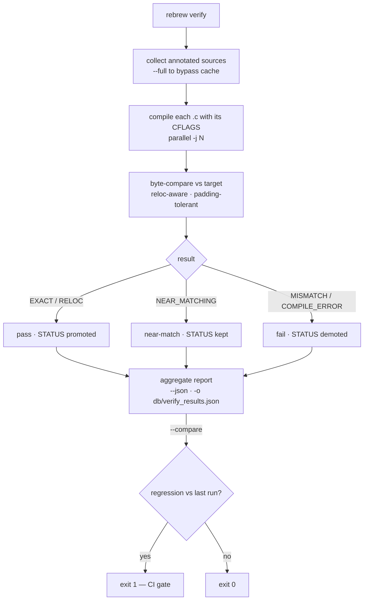
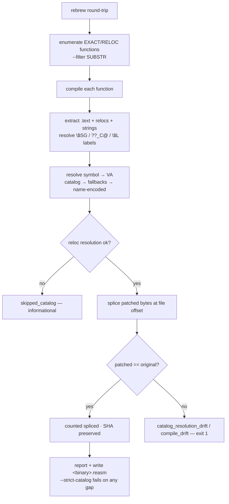

# CLI Reference

All 33 CLI commands are registered under the unified `rebrew` entry point in `main.py`.
Every tool supports `--target / -t` to select a target from `rebrew-project.toml` and
reads defaults (binary path, reversed_dir, compiler settings) from the project config.

Run any tool with `--help` to see usage examples and context
(typer `rich_markup_mode="rich"` with epilog text).

## Typical Workflow

```
rebrew todo              See what needs work (prioritized by ROI)
rebrew skeleton 0x<VA>   Generate a .c skeleton from address
rebrew test src/<func>.c Compile, byte-compare, and auto-update STATUS
rebrew diff src/f.c      Show byte diff for near-misses
rebrew verify            Bulk-verify all reversed functions
```

## test vs verify vs match

| Command | Scope | Caching | Use when |
|---------|-------|---------|----------|
| `rebrew test <file>` | Single function | No | Iterating on one function |
| `rebrew test --all` | Batch (all files) | No | Like verify but always recompiles |
| `rebrew verify` | Batch (incremental) | Yes | CI / bulk status check |
| `rebrew match <file>` | Single function | No | GA engine to find byte-perfect match |

Byte-match ladder (best → worst): `EXACT` → `RELOC` → `NEAR_MATCHING` → `STUB`.
`PROVEN` is a side path: semantic equivalence via `rebrew prove` when bytes still
differ (NEAR_MATCHING only). It is sticky under test/verify and ranks with RELOC
for `--compare` (not “better than EXACT”).

> The same table is shown in `rebrew --help` (source of truth: `src/rebrew/main.py` epilog).

## Entry Points

| Command | Script | Description |
|-------------|--------|-------------|
| `rebrew` | `main.py` | Unified CLI entry point for all subcommands |
| `rebrew rename` | `rename.py` | Rename a function and update all cross-references |
| `rebrew init` | `init.py` | Scaffold a new project directory and `rebrew-project.toml` |
| `rebrew test` | `test.py` | Compile-and-compare; auto-promotes STATUS on EXACT/RELOC; `--no-promote` to skip; `--json` output |
| `rebrew asm` | `asm.py` | Dump disassembly (`--format hex`) or NASM (`--format nasm`) from target binary at a VA |
| `rebrew diff` | `diff.py` | Side-by-side disassembly diff against target binary; `--fix-blocker` writes BLOCKER metadata |
| `rebrew skeleton` | `skeleton.py` | Generate annotated `.c` skeleton from VA (with `--decomp`, `--xrefs`, `--append` for multi-function files) |
| `rebrew catalog` | `catalog/` | Parse annotations, generate catalog + coverage JSON |
| `rebrew sync` | `ghidra/cli.py` | Sync source markers, metadata, structs, and signatures to/from Ghidra via ReVa MCP (`--push`, `--pull`, `--apply`, `--export`) |
| `rebrew lint` | `lint.py` | Lint source marker standards in decomp C files |
| `rebrew extract` | `extract.py` | Batch extract and disassemble functions from binary |
| `rebrew match` | `match.py` / `matcher/` | GA matching engine (single-function or `--all` batch); `--fix-blocker`; `--json` structured output |
| `rebrew verify` | `verify.py` | Compile all `.c` files and verify byte match against target binary; `--compare` regression detection; `--json` structured reports. 16-bit NE targets run when `profile = "msvc1.52"` is configured, otherwise short-circuit with a notice naming the required profile |
| `rebrew todo` | `todo.py` | Prioritized action list: what to work on next, ROI-ranked across all signals |
| `rebrew cache` | `cache_cli.py` | Compile cache management (`stats` reports hit rate + disk usage, `clear` purges cache) |
| `rebrew cfg` | `cfg.py` | Read and edit `rebrew-project.toml` programmatically (see [CONFIG.md](CONFIG.md)) |
| `rebrew split` | `split.py` | Split multi-function C files into individual files |
| `rebrew merge` | `merge.py` | Merge single-function C files into multi-function file |
| `rebrew prove` | `prove.py` | Prove semantic equivalence via angr symbolic execution (optional dep) |
| `rebrew flirt` | `flirt.py` | FLIRT signature scanning (see [FLIRT_SIGNATURES.md](FLIRT_SIGNATURES.md)) |
| `rebrew gen-flirt-pat` | `gen_flirt_pat.py` | Generate FLIRT `.pat` files from COFF `.lib` archives |
| `rebrew imports` | `imports.py` | List import-table symbols — PE IAT (with `jmp [iat]` stub detection) or 16-bit NE module references (library identification) |
| `rebrew strings` | `strings.py` | Extract printable ASCII/UTF-16 strings from data sections, with cross-references (`--xref`, `--filter`, `--min-len`, `--section`) |
| `rebrew xrefs` | `xrefs.py` | Cross-reference explorer: find code that references an address (calls, jumps, `push`/`mov`/`lea`, IAT slots) |
| `rebrew describe` | `describe.py` | Per-function recon dossier: callers, callees, strings, globals, imports (project-based) |
| `rebrew report` | `report.py` | Generate a static self-contained HTML documentation site (`--out`; index, strings, imports, call graph) |
| `rebrew dashboard` | `dashboard.py` | Read-only web dashboard over `db/coverage.db` (`--port`, `--host`) |
| `rebrew crt-match` | `crt_match.py` | CRT source cross-reference matcher (index, match, ASM detection) |
| `rebrew data` | `data.py` | Global data scanner for .data/.rdata/.bss; `--bss` layout verification; `--dispatch` vtable detection |
| `rebrew graph` | `depgraph.py` | Function dependency graph (mermaid, DOT, summary); `--cu-map` infers compilation unit boundaries |
| `rebrew doctor` | `doctor.py` | Diagnostic checks for project health (config, compiler, binary, paths); Delphi 1.0 toolchain readiness for 16-bit targets; `--install-wibo`; `--json` |
| `rebrew toolchain` | `toolchain_cli.py` | Standardized toolchain management (`list`, `status`, `detect`, `pull`, `build`) — docker-first invocation with host fallback |
| `rebrew binsync-export` | `binsync_export.py` | Export source markers and metadata to BinSync state directory (prototype, STATUS/CFLAGS, globals with real types, structs with fields; `--module`, `--git`) |
| `rebrew binsync-import` | `binsync_import.py` | Import a BinSync state directory into rebrew metadata (names, prototypes, globals; `--accept-binsync`/`--accept-local`, `--module`) |
| `rebrew build-db` | `build_db.py` | Build SQLite `db/coverage.db` from `data_*.json` ([schema docs](DB_FORMAT.md)) |
| `rebrew status` | `status.py` | At-a-glance reversing progress overview (per-module coverage, status ladder counts) |
| `rebrew similar` | `similar.py` | Find structurally similar functions in the target binary (clone detection) |
| `rebrew near-diag` | `near_diag.py` | Classify why a `NEAR_MATCHING` function does not byte-match |
| `rebrew round-trip` | `round_trip.py` | Splice matched functions back into the target PE and verify byte equality |
| `rebrew skills` | `skills.py` | Discover and display AI agent skills bundled with rebrew (`list`, `show` subcommands) |

## Tool Flags

### `rebrew match`

| Flag | Description |
|------|-------------|
| `--cl COMMAND` | CL.EXE command (auto from config) |
| `--inc DIR` | Include dir (auto from config) |
| `--cflags FLAGS` | Compiler flags (auto from source) |
| `--symbol NAME` | Symbol to match (auto from source) |
| `--va HEX` | Target VA hex (auto from source) |
| `--size N` | Target size (auto from source) |
| `--seed N` | Seed RNG for reproducible GA runs |
| `--ignore-lint` | Continue even if source marker linter finds errors |
| `--generations N` | Number of GA generations (default 100) |
| `--pop-size N` | GA population size (default 64) |
| `-j N` | Parallel compilation workers |
| `--out-dir DIR` | Output directory for GA results |
| `--compare-obj` / `--no-compare-obj` | Use object comparison instead of full link (default: true) |
| `--extra-seed FILE` | Extra `.c` file(s) to seed GA population from solved functions |
| `--no-seed` | Disable cross-function solution seeding |
| `--mutation-focus CAT` | Bias GA mutation selection: `register` / `equivalent` / `structural`, or `auto` (derives the category from the function's BLOCKER metadata; single-function only) — the category's suggested operators get 6x selection weight |
| `--link COMMAND` | LINK.EXE command (for non-obj comparison) |
| `--lib DIR` | Lib dir (for non-obj comparison) |
| `--ldflags FLAGS` | Linker flags (for non-obj comparison) |
| `--flag-sweep-only` | Exhaustive flag-combination sweep; skip GA |
| `--sweep-toolchain` | Try each vendored MSVC toolchain (SP versions); combine with `--flag-sweep-only` to flag-sweep with each toolchain ("which MSVC version + flags built this function?" — the combined mode reports the best flags per toolchain) |
| `--tier NAME` | Flag-sweep tier: `quick`, `targeted` (default), `normal`, `thorough`, `full` — see [FLAG_SWEEP_TIERS.md](FLAG_SWEEP_TIERS.md) |
| `--collect-pairs FILE` | Save source/binary pairs to JSONL for ML training |
| `--json` | Output results as JSON |

### `rebrew diff`

The seed argument accepts a `.c` path, a symbol name, or a hex VA — VAs and
symbols resolve to their source file (shared `resolve_source_arg` helper),
matching `rebrew prove` / `rebrew test`.

| Flag | Description |
|------|-------------|
| `-m` / `--mismatches-only` | Show only structural (`**`) diff lines |
| `-r` / `--register-aware` | Normalize register encodings and mark differences as `RR` |
| `--fix-blocker` | Auto-write `BLOCKER`/`BLOCKER_DELTA` metadata from diff classification |
| `--dry-run` | Preview BLOCKER metadata writes without touching the toml |
| `-f FORMAT` / `--format FORMAT` | Output format: `terminal` (default), `csv` |
| `--ignore-lint` | Continue even if source marker lint errors exist |
| `--json` | Output results as JSON |

When the compiled candidate is shorter than the target, `--json` adds a
`missing_tail` summary (`count` / `first` / `last` target instruction) —
the not-yet-decompiled tail, e.g. `{"count": 6, "first": "call 0xcf26",
"last": "ret"}` — and the terminal output prints a matching hint.

With `--fix-blocker --json`, the payload also embeds a `blocker` outcome
dict (`written` / `cleared` / `text` / `delta` / `dry_run`) so script
consumers can learn whether the blocker landed (mirrors `near-diag`'s
`blocker_written` contract).

### `rebrew test`

| Flag | Description |
|------|-------------|
| `<source>` | C source file (positional; omit with `--all`) |
| `--va HEX` | VA in hex (e.g. `0x10009310`) |
| `--symbol NAME` | COFF symbol name (e.g. `_funcname`) |
| `--target-bin PATH` | Test against a raw `.bin` file instead of the target binary |
| `--size N` | Target size in bytes |
| `--cflags FLAGS` | Override compiler flags |
| `--all` | Batch test all reversed .c files |
| `--dir PATH` | With `--all`, restrict to this subdirectory |
| `--origin TYPE` | With `--all`, filter by origin (GAME, MSVCRT, ZLIB) |
| `--jobs N` / `-j N` | Parallel compile jobs (with `--all`) |
| `--dry-run` | Preview changes without writing |
| `--no-promote` | Skip STATUS metadata update |
| `--force-status` | Force the STATUS update even from sticky PROVEN (deliberately demote a stale PROVEN to its actual result; single-function only) |
| `--watch` | Re-test the source file on every save (single-file mode) |
| `--json` | JSON structured output |
| `--target NAME` | Select a target from `rebrew-project.toml` |

`rebrew test <file.c> [--va 0xHEX] [--symbol NAME] [--size N]` tests one
function. On a multi-function file, `--va` selects the annotation AT that VA
(symbol and fallback size come from it); pass `--symbol` too to override the
symbol explicitly. With no `--va`/`--symbol`/`--size`, every annotated
function in the file is tested.  A resolved size is persisted to
`rebrew-function.toml` alongside STATUS, so `rebrew diff` / `rebrew near-diag`
can resolve it later without re-supplying `--size`.

### `rebrew rename`

`rebrew rename <old_ident> <new_name>`

Atomically renames a function across the entire project.

| Flag | Description |
|------|-------------|
| `--file NAME` | New filename (default: auto-rename if stem matches old name) |
| `--dry-run` | Preview changes without writing |
| `--json` | Output results as JSON |

Behavior:

- Symbol is derived automatically from the C function definition as `_<new_name>`
- Updates the C function definition name
- Replaces `extern` cross-references across all `.c` files
- Renames the file itself if the stem matches the old name

### `rebrew todo`

| Flag | Description |
|------|-------------|
| `-n N` / `--count N` | Number of items to show (default 20) |
| `-c CAT` / `--category CAT` | Filter by category (e.g. `start-function`, `fix-delta`, `compile-error`, `extract-error`, `improve-match`, `missing-annotation`, `documented`) |
| `-s` / `--stats` | Show the coverage stats header |
| `--json` | Output results as JSON |

`improve-match` items whose blocker was written by `near-diag --fix-blocker`
carry a `mutations` array in `--json` (the GA operators to try next) and a
`[try: ...]` hint in the terminal description.

### `rebrew skeleton`

| Flag | Description |
|------|-------------|
| `VA` | Function VA in hex (positional) |
| `--decomp` | Embed inline decompilation |
| `--decomp-backend BACKEND` | Decompiler backend: `r2ghidra`, `r2dec`, `ghidra`, `auto` |
| `--xrefs` | Fetch cross-references and caller decompilation from Ghidra via ReVa MCP |
| `--endpoint URL` | ReVa MCP endpoint URL (for `--xrefs` and `--decomp-backend ghidra`) |
| `--append FILE` | Append to existing multi-function file |
| `--name NAME` | Override function name |
| `-o FILE` / `--output FILE` | Output file path |
| `--force` | Overwrite existing files |
| `--batch N` | Generate N skeletons (smallest first) |
| `--min-size N` | Minimum function size (default 10) |
| `--max-size N` | Maximum function size (default 9999) |
| `--dry-run` | Preview skeletons without writing files or metadata |
| `--json` | Output results as JSON (for batch mode) |

### `rebrew verify`



| Flag | Description |
|------|-------------|
| `--compare` | Compare against last saved `db/verify_results.json`, detect regressions/improvements; exit code 1 on regression |
| `--summary` | Show EXACT/RELOC/NEAR_MATCHING summary table with match percentages |
| `--full` / `-f` | Force full verification, ignoring cached results (also required after header/include changes) |
| `-j N` / `--jobs N` | Number of parallel compile jobs (default: from `[project].jobs` or 4) |
| `--json` | Structured JSON report to stdout |
| `-o FILE` / `--output FILE` | Write report to specific file |
| `--dry-run` | Preview STATUS metadata changes without writing (JSON report carries `dry_run: true`) |
| `--watch` | Re-verify all sources whenever any `.c` file changes |
| `--fix-sizes` | Backfill `SIZE` into metadata from the binary-derived size: stale sizes (false `SIZE_MISMATCH`) and missing sizes (`MISSING_SIZE` stubs, which `rebrew test` refuses) |

The `--json` report carries `dry_run`, `size_divergences`, and `missing_sizes`
(plus `sizes_fixed` when `--fix-sizes` ran); VAs fixed by `--fix-sizes` are
stripped from the same-run `size_divergences`/`missing_sizes` lists.

Status promotion is always-on: after verification, STATUS is promoted/demoted in
`rebrew-function.toml` metadata. PROVEN status is sticky and never silently
demoted — deliberately reclassify a stale PROVEN with `rebrew test <file> --force-status`.

Output prefixes for unambiguous parsing:

| Prefix | Meaning |
|--------|---------|
| `[COMPILE_ERROR]` | Source failed to compile |
| `[MISSING_FILE]` | Source file not found |
| `[MISSING_SIZE]` | No SIZE annotation — backfill with `--fix-sizes` |
| `[FAIL]` / `[xx.x%]` | Compiled but bytes differ (percentage = match) |

### `rebrew match --all` (batch mode)

| Flag | Description |
|------|-------------|
| `--all` | Enable batch mode (required for all flags below) |
| `--all-targets` | Batch mode across EVERY configured target (aggregate JSON) |
| `--max-stubs N` | Max functions to process, 0=all (default 0) |
| `--generations N` / `-g N` | GA generations per function (default 100) |
| `--pop-size N` / `-p N` | GA population size (default 64) |
| `-j N` / `--jobs N` | Parallel jobs (default: from `[project].jobs`); stubs run in parallel, per-stub compiles serialized |
| `--timeout-min N` | Per-function GA timeout in minutes (default 30) |
| `--min-size N` | Min target size to attempt |
| `--max-size N` | Max target size to attempt |
| `--filter STR` | Only process functions matching this substring |
| `--near-miss` | Target NEAR_MATCHING functions instead of STUBs |
| `--improve` | Target all NEAR_MATCHING functions (no delta threshold) |
| `--threshold N` | Max byte delta for `--near-miss` mode (default 10) |
| `--dry-run` | Preview changes without writing |
| `--seed-from-solved` / `--no-seed-from-solved` | Seed GA population from similar solved functions (default: on) |
| `--json` | Output results as JSON |


### `rebrew doctor`

| Flag | Description |
|------|-------------|
| `--install-wibo` | Auto-download wibo (lightweight Wine alternative for Linux) |
| `--json` | Output results as JSON |

### `rebrew data`

| Flag | Description |
|------|-------------|
| `--conflicts` | Show only type-conflict globals |
| `--summary` | Show section-level summary only |
| `--bss` | Verify .bss layout and detect gaps |
| `--dispatch` | Detect dispatch tables / vtables |
| `--min-table-len N` | Minimum entries to qualify as a dispatch table (default: 3; requires `--dispatch`) |
| `--max-pointer-stride N` | Maximum byte stride between pointer slots when scanning (default: 4; requires `--dispatch`) |
| `--fix-bss` | Auto-generate `bss_padding.c` with dummy arrays for detected gaps |
| `--gen-header` | Output `rebrew_globals.h` locally without fetching from Ghidra |
| `--gen-header-out PATH` | Override output path for `--gen-header` (default: `{reversed_dir}/rebrew_globals.h`) |
| `--force` | Overwrite an existing file when using `--gen-header` |
| `--json` | JSON output for all modes |

### `rebrew graph`

| Flag | Description |
|------|-------------|
| `-f FORMAT` / `--format FORMAT` | Output format: `mermaid` (default), `dot`, `summary` |
| `--cu-map` | Infer compilation unit boundaries (clusters by .text contiguity + call graph) |
| `--focus NAME` | Neighbourhood of a specific function |
| `--depth N` | Depth for focus mode |
| `-o FILE` / `--output FILE` | Output file (default: stdout) |
| `--json` | Output results as JSON |

### `rebrew lint`

| Flag | Description |
|------|-------------|
| `--fix` | Auto-migrate old source marker formats |
| `--dry-run` | Preview changes without writing |
| `--quiet` | Suppress warnings, show errors only |
| `--json` | Machine-readable JSON output |
| `--summary` | Print status/origin breakdown table |
| `FILE...` | Specific files to check (positional) instead of full scan |

See [ANNOTATIONS.md](ANNOTATIONS.md) for the full linter code reference (E000–E017, W001–W019).

### `rebrew catalog`

| Flag | Description |
|------|-----------|
| `--data-json` | Write `db/data_<target>.json` (input for `build-db`) |
| `--json` | Print catalog summary as JSON to stdout |
| `--catalog` | Generate `CATALOG.md` in reversed directory |
| `--summary` | Print summary to stdout |
| `--csv` | Generate reccmp-compatible CSV |
| `--export-ghidra` | Cache Ghidra function list |
| `--export-ghidra-labels` | Generate `ghidra_data_labels.json` from detected tables |
| `--fix-sizes` | Update `SIZE` entries in `rebrew-function.toml` metadata to match canonical sizes — fixes both stale sizes (false `SIZE_MISMATCH`) and missing sizes (`MISSING_SIZE` stubs that `rebrew test` refuses) |
| `--root DIR` | Project root directory (auto-detected if omitted) |
### `rebrew sync`

| Flag | Description |
|------|-------------|
| `--export` | Export Ghidra commands to `ghidra_commands.json` |
| `--summary` | Show sync summary without exporting |
| `--apply` | Apply `ghidra_commands.json` to Ghidra via ReVa MCP |
| `--push` | Export and apply in one step |
| `--force` | With `--export`/`--push`: re-export already-applied operations (skip the dedup state) |
| `--watch` | With `--push`: watch sources + `rebrew-function.toml` and re-push on every change |
| `--create-functions` | Create functions at annotated VAs before labeling |
| `--skip-generic` / `--no-skip-generic` | Skip/include generic `func_` labels (default: skip) |
| `--sync-sizes` | Sync function sizes to Ghidra |
| `--sync-new-functions` | Create functions for newly discovered VAs |
| `--sync-structs` / `--no-sync-structs` | Push struct definitions to DTM (default: sync) |
| `--sync-signatures` / `--no-sync-signatures` | Push function prototypes (default: sync) |
| `--sync-data` / `--no-sync-data` | Push data segment labels (default: sync) |
| `--pull` | Fetch Ghidra renames and comments and update local `.c` files |
| `--accept-ghidra` | With `--pull`, accept Ghidra renames for all conflicts (updates cross-references) |
| `--accept-local` | With `--pull`, keep local names for all conflicts (records GHIDRA in metadata) |
| `--pull-signatures` | Pull function prototypes from Ghidra and update extern declarations |
| `--pull-params` | Pull Ghidra parameter names into unnamed parameters of local `.c` files (merge-safe: named params never overwritten, arity mismatch / function-pointer params skipped) |
| `--pull-datatypes` | Pull enum/typedef inventory from Ghidra into enums_types.h (ReVa exposes names/sizes/categories, not enum members) |
| `--pull-structs` | Pull struct definitions from Ghidra into `types.h` (single file, default) |
| `--types-out PATH` | With `--pull-structs`: override the output path (single-file mode; mutually exclusive with `--by-module`) |
| `--by-module` | With `--pull-structs`: split into per-module files (e.g. `types_server.h`, `types_shared.h`) |
| `--pull-comments` | Pull Ghidra analysis comments into source files |
| `--pull-data` | Fetch Ghidra data labels via MCP, generate `rebrew_globals.h` with typed extern declarations |
| `--refresh-cache` | Re-fetch all function structure and data labels from Ghidra MCP (invalidates cached data) |
| `--dry-run` | Preview any sync operation without applying changes |
| `--endpoint URL` | ReVa MCP endpoint URL |
| `--json` | Output results as JSON |

### `rebrew flirt`

| Flag | Description |
|------|-------------|
| `SIG_DIR` | Directory containing `.sig`/`.pat` files (positional, optional) |
| `--exe FILE` | Target PE file (default: from config) |
| `--min-size N` | Minimum function size in bytes to report (default 16) |
| `--json` | Output results as JSON |

### `rebrew crt-match`

| Flag | Description |
|------|-----------|
| `VA` | Virtual address to match (positional, optional) |
| `--all` | Match all functions with library origins (MSVCRT, ZLIB, etc.) |
| `--fix-source` | Auto-write `// SOURCE:` markers for matches |
| `--dry-run` | Preview `--fix-source` updates without writing |
| `--index` | Show the CRT source index (files and functions) |
| `--target NAME` | Select a target from `rebrew-project.toml` |
| `--json` | Output results as JSON |

### `rebrew extract`

| Flag / Arg | Description |
|------------|-------------|
| `COMMAND` | `list`, `show` (or `extract`), or `batch N` (positional argument) |
| `--exe PATH` | Path to DLL/EXE (default: from config) |
| `--size N` | With `show`, override the catalog-recorded size |
| `--start N` | With `batch`, start offset into the sorted candidate list |
| `--min-size N` | Minimum function size to extract (default 8) |
| `--max-size N` | Maximum function size to extract (default 50000) |
| `--dry-run` | With `batch`, preview which `.bin` files would be written |
| `--json` | Output results as JSON |

### `rebrew split`

`rebrew split <source_file> [--va HEX] [--out-dir DIR] [--dry-run] [--force] [--json]`

Split a multi-function `.c` file into individual single-function files. Each output file gets the shared preamble (includes, defines, extern declarations) plus its own marker block and function body. Filenames are derived from the C function definition name; falls back to `func_<VA>.c` when no function definition is present.

With `--va`, extract a **single function** into its own file (into a subdirectory named after the source file, such as `multi_c/`) and remove it from the original. This is useful for isolating a function to iterate on independently.

| Flag | Effect |
|------|---------|
| `--va HEX` | Extract a single function by VA into `multi_c/name.c` and remove from original |
| `--out-dir DIR` | Write output files to DIR (default: same directory / source-specific subdir for `--va`) |
| `--dry-run` | Preview changes without writing |
| `--force` | Overwrite existing output files |
| `--json` | Structured JSON output |

### `rebrew prove`

`rebrew prove <source> [--target NAME] [--json] [--timeout N] [--loop-bound N] [--check-edx] [--dry-run]`

Prove semantic equivalence of a NEAR_MATCHING function via angr symbolic execution + Z3 constraint solving. Requires the optional `angr` dependency (`uv sync --all-extras`). The source argument accepts a `.c` path, a symbol name, or a hex VA (resolved via the shared `resolve_source_arg` helper, like `rebrew diff`).

| Flag | Description |
|------|-------------|
| `SOURCE` | C source file path, symbol name, or VA (positional, required) |
| `--target NAME` | Select a target from `rebrew-project.toml` |
| `--json` | JSON structured output |
| `--timeout N` | Seconds before giving up (default: 60) |
| `--loop-bound N` | Max loop iterations for angr's LoopSeer (default: 10) |
| `--check-edx` | Also compare EDX register (auto-enabled when return type is `long long` / `__int64` / `int64_t` / `uint64_t`) |
| `--watch-va VA` | Also compare 4 bytes of memory at this VA (repeatable; can also come from `prove_constraints.watched_vas` metadata) |
| `--watch` | Re-prove the source on every save (single-file mode only) |
| `--dry-run` | Preview changes without writing |

On success, updates `STATUS` from `NEAR_MATCHING`/`SIZE_MISMATCH` → `PROVEN`. On failure (timeout, path explosion, or Z3 finds a distinguishing input), status remains unchanged. Failure messages include a concrete counterexample (register/memory values from the Z3 model). `SIZE_MISMATCH` is accepted so functions whose compiled size differs structurally can still be proven semantically equivalent — the proof is what makes them PROVEN.

**64-bit returns**: Functions that return `long long`, `__int64`, `int64_t`, or `uint64_t` use the EDX:EAX register pair for their return value. `rebrew prove` auto-detects this from the `PROTOTYPE` annotation and enables EDX comparison automatically — no flag needed. Pass `--check-edx` explicitly to force EDX checking even when the heuristic does not trigger.

**Memory side effects**: By default only return registers (EAX, optionally EDX) are compared. Functions that write to globals or output-pointer arguments can therefore pass even when their memory effects differ. Pass `--watch-va` (repeatable) or set `prove_constraints.watched_vas = [0x...]` in the function metadata to also compare the first 4 bytes at each watched address between the original and compiled executions; an address mapped on only one side counts as a difference. Keep the watched set small (<10) to avoid Z3 blowup.

### `rebrew merge`

`rebrew merge <file1> <file2> ... --output FILE [--dry-run] [--force] [--delete] [--json]`

Merge multiple single-function `.c` files into one multi-function file. Preamble lines (`#include`, `extern`, `#define`) are deduplicated. Function blocks are sorted by virtual address ascending.

| Flag | Effect |
|------|--------|
| `--output FILE` | Output merged file (required) |
| `--dry-run` | Preview changes without writing |
| `--force` | Overwrite output if it already exists |
| `--delete` | Delete input files after successful merge |
| `--json` | Structured JSON output |

### `rebrew build-db`

| Flag | Description |
|------|-------------|
| `--root DIR` | Project root directory (auto-detected if omitted) |
| `--force` | Delete and recreate the database if its schema version is incompatible |
| `--json` | Output results as JSON |

### `rebrew init`

| Flag | Description |
|------|-------------|
| `--target NAME` / `-t NAME` | Name of the initial target (default: `main`) |
| `--binary NAME` | Binary filename (default: `program.exe`) |
| `--compiler PROFILE` | Compiler profile (default: `msvc6`) |
| `--json` | Output results as JSON |

- `--link-tools-from PATH` — symlink `tools/<profile>` from a master toolchain
  directory (e.g. the rebrew repo's `tools/`).  Optional: compiler
  command/includes/libs that are missing under the project's `tools/` resolve
  against the rebrew install's own vendored `tools/` automatically, so a
  fresh project compiles out of the box without the symlink.
- `--install-completions` — write bash/zsh/fish completion scripts into `completions/`

### `rebrew asm`

`rebrew asm <VA> [--bytes | --nas] [--imports] [--strings] [--hints] [--json] [--target NAME]`

Disassemble a single function from the target binary as a hex dump (default) or
NASM-style listing (`--nas`).  `--imports`/`--strings`/`--hints` annotate the
listing with IAT imports, referenced strings, and codegen hints; `--json`
emits the structured instruction list (address, bytes, mnemonic, operands).

### `rebrew imports`

`rebrew imports [--json] [--target NAME]`

List the PE import table of the target binary (DLL → API, with IAT slot VAs)
and detect `jmp [IAT]` import stubs.  Used to spot which functions are
one-instruction thunks into imported APIs (unmatchable by decompilation —
they are linker glue, not compiled C).

### `rebrew resource`

`rebrew resource [--json] [--target NAME]`

Compare and extract the PE resource (`.rsrc`) section of the target binary —
a quick check whether the binary ships resources (icons, version info,
dialogs) that are irrelevant to function matching but matter for
understanding what the program is.

### `rebrew status`

`rebrew status [--json] [--target NAME]`

At-a-glance reversing progress: total/covered functions, per-status counts
(EXACT/RELOC/NEAR_MATCHING/STUB), byte coverage, per-module breakdown, and the
last verify summary.  When a verify cache exists, reported statuses are the
**effective** status (verify result overrides metadata; see
`docs/ANNOTATIONS.md` "Effective Status") — `verify_cache: {overrides,
missing_size}` in JSON surfaces how many functions the cache overrode.

### `rebrew similar`

`rebrew similar <VA> [--top N] [--min-score N] [--size N] [--json] [--target NAME]`

Find functions in the target binary that are structurally similar to the function at `<VA>`. The score (0–100) blends the mnemonic histogram cosine (60%) with call-count and branch-count agreement (20% each). Useful for finding which STUBs likely share the same source and optimisation approach as a solved function.

| Flag | Description |
|------|-------------|
| `<VA>` | Query function address in hex (positional, required) |
| `--size N` | Query function size in bytes (default: catalog size) |
| `--top N` | Number of results to show (default: 10) |
| `--min-score N` | Minimum similarity score (0–100) to include (default: 0) |
| `--json` | JSON structured output |
| `--target NAME` | Select a target from `rebrew-project.toml` |

### `rebrew cache`

| Subcommand | Description |
|------------|-------------|
| `stats` | Cache size, entry count, and session hit/miss rate |
| `clear` | Empty the compile result cache |

### `rebrew solutions`

`rebrew solutions [--symbol SUBSTR] [--min-size N] [--max-size N] [--best] [--json] [--target NAME]`

Query the GA solutions database.  Default mode lists winning solution
fingerprints from `.rebrew/solutions.json` (target, symbol, size, cflags,
score, solved_at); `--symbol`/`--min-size`/`--max-size` filter.  `--best`
instead shows the best-known GA outcome per function from the append-only run
history (`.rebrew/ga_runs.jsonl`).  Read-only.

### `rebrew cfg`

| Subcommand | Description |
|------------|-------------|
| `list-targets` | List configured targets |
| `show KEY` | Read a (dotted) config value, e.g. `show targets.main.binary` |
| `set KEY VALUE` | Set a (dotted) config value, e.g. `set compiler.timeout 120` |
| `add-target` / `remove-target` | Manage targets |
| `add-module` / `remove-module` | Manage `reversed_dir` modules |
| `set-cflags MODULE FLAGS` | Set a module's cflags preset (global, or per-target with `--target`) |
| `set-compiler TARGET PROFILE` | Write a compiler profile (`msvc6`, `msvc7`, `clang`, `gcc`) onto a target |
| `detect-crt` | Scan `tools/` for known MSVC CRT source dirs |
| `raw` | Dump `rebrew-project.toml` as JSON (`--format toml` for TOML) |
| `path` | Print the path to `rebrew-project.toml` |

### `rebrew skills`

| Subcommand | Description |
|------------|-------------|
| `list` | List bundled agent skills |
| `show NAME` | Print a skill's SKILL.md |

### `rebrew toolchain`

Standardized toolchain management — the docker-first abstraction
(one image per toolchain-version, uniform `docker run <image> <compiler>
<args>`, with vendored-host/PATH fallback).  See
[TOOLCHAIN.md](TOOLCHAIN.md) for the full model.

| Subcommand | Description |
|------------|-------------|
| `list` | List known toolchains + how each is invoked (`--json`) |
| `status NAME` | How one toolchain resolves (image pulled? host binary present?) |
| `detect BINARY` | Detect which compiler/toolchain built a binary (diec → PDB → heuristics); with a project present, also reports whether the configured profile can byte-match it (`--json`) |
| `pull NAME` | Pull a toolchain's docker image (locally-built images are reported as already present, not re-pulled) |
| `build NAME` | Build a toolchain's docker image from its `toolchain-images/<family>/<ver>-<arch>/Dockerfile` |

### `rebrew binsync-export`

Export annotations to a BinSync state directory.  Merges reversed annotations
(`scan_reversed_dir`) with the **project file / catalog** (`functions.txt` +
`function_structure.json` → `build_function_registry`, canonical sizes) so that
catalog-only functions appear in BinSync with correct offsets/sizes even before
they have a `.c` file.  Collaborators in IDA/BinSync see the same function list
and offsets as your project file.

| Flag | Description |
|------|-------------|
| `--dry-run` | Preview changes without writing |
| `--json` | JSON structured output |
| `--module NAME` | Only this module (e.g. SERVER) |
| `--git` | Stage + `git commit` the state directory after writing |
| `--target NAME` | Select a target from `rebrew-project.toml` |

### `rebrew binsync-import`

Import a BinSync state directory into rebrew metadata.  Also reads the project
file / catalog so that BinSync names for **catalog-known but not yet reversed**
functions surface as `proposed_missing`; pass `--create-missing` to materialize
them as STUB files.

| Flag | Description |
|------|-------------|
| `--dry-run` | Preview changes without writing |
| `--json` | JSON structured output |
| `--module NAME` | Only this module (e.g. SERVER) |
| `--accept-binsync` | Accept BinSync names for all conflicts |
| `--accept-local` | Keep local, record BinSync name as GHIDRA provenance |
| `--create-missing` | Create STUB files for BinSync functions present in the catalog but not yet in `src/` |
| `--target NAME` | Select a target from `rebrew-project.toml` |

### `rebrew near-diag`

`rebrew near-diag <source> [--va HEX] [--size N] [--json] [--fix-blocker] [--target NAME]`
`rebrew near-diag --all [--fix-blocker] [--json] [--target NAME]`

Compile the source and classify why it does not byte-match the target — which category of compiler choice is blocking the match. Every mismatching byte is bucketed into `register` (same instruction, different register allocation), `equivalent` (semantically equal instruction selection, e.g. `lea` vs `mov`), `reloc` (relocation-masked site), or `structural` (different layout/block order). The verdict suggests whether the delta is likely solvable via C-level changes, and lists the GA mutation operators most likely to fix the dominant category.
`--fix-blocker` writes the verdict as `BLOCKER` metadata (skipped on a
match), closing the classify → document loop in one command.  The written
blocker text includes the top GA mutation operators to try next (the
actionable step) ahead of the suggestion prose when the 200-char metadata
budget is tight.
`--all` runs the same classify-and-document pipeline over every
`NEAR_MATCHING` function in the project (mirrors `rebrew prove --all`:
per-function compile/extract failures are recorded in the results instead of
aborting the batch).

| Flag | Description |
|------|-------------|
| `<source>` | C source file for the function to diagnose (positional; omitted with `--all`) |
| `--all` | Classify every `NEAR_MATCHING` function in the project |
| `--va HEX` | Target VA (default: from the annotation; cannot combine with `--all`) |
| `--size N` | Target size in bytes (default: from the annotation) |
| `--fix-blocker` | Write each verdict as `BLOCKER` metadata (skipped on a match) |
| `--json` | JSON structured output (per-function results with `--all`) |
| `--target NAME` | Select a target from `rebrew-project.toml` |

### `rebrew analyze`

`rebrew analyze [BINARY] [--function 0xVA] [--output report.md] [--json]`

One-shot intelligence dossier: binary layout, toolchain detection (diec →
PDB → heuristics), strings + references, imports + IAT stubs, reversed-function
coverage, dispatch tables, FLIRT matches (when `flirt_sigs/` exists), and
NEAR_MATCHING blockers. Best-effort by design — every section is optional.

Works **standalone**: `rebrew analyze some_unknown.exe --json` runs outside
a project too (the binary argument becomes required). Project-scoped
sections (FLIRT sigs, library headers, near-match metadata) degrade to
`null`/`[]` instead of aborting — the dossier is usable as the first
intelligence step on a binary you haven't onboarded yet.

| Flag | Description |
|------|-------------|
| `BINARY` | Binary to analyze (default: the project target) |
| `--min-len N` | Minimum string length to report (default 4) |
| `--top-strings N` | How many most-referenced strings to list (default 10) |
| `--function 0xVA` | Drill into one function: callers, callees, strings, imports |
| `--output PATH` | Write a Markdown report instead of terminal output |
| `--json` | JSON dossier |

### `rebrew describe`

`rebrew describe [OPTIONS] VA`

Per-function recon dossier: callers, callees, strings, imports, globals.

### `rebrew discover-functions`

`rebrew discover-functions [OPTIONS] BINARY`

Chained function enumeration: rizin `aaa` → `aa; aap` → a capstone linear
sweep, merged with boundary validation and gap-based sizes — fixes rizin's
garbled merges and short sizes.  16-bit NE binaries short-circuit to the
native NE loader's linear sweep (rizin cannot analyze NE — its output is
garbage file-offset "functions").

### `rebrew gen-flirt-pat`

`rebrew gen-flirt-pat [OPTIONS] LIB_PATH`

Generate FLIRT `.pat` files from a compiler `.lib` archive (e.g. MSVC6's
`msvcrt.lib`) — the input for `rebrew flirt`.

### `rebrew identify-library`

`rebrew identify-library [OPTIONS]`

Mark VAs as library glue (CRT/ZLIB/etc.) using the library-identification
backends — powers `rebrew analyze`'s library section.

### `rebrew intake`

`rebrew intake [OPTIONS] BINARY`

One-shot binary onboarding: FLIRT scan, function catalog, coverage database,
triage — the automated version of the `rebrew-intake` skill's steps.

| Flag | Description |
|------|-------------|
| `-p NAME` / `--profile NAME` | Compiler profile (default: auto-detected) |
| `-t NAME` / `--target NAME` | Target name (default: binary stem) |
| `--dry-run` | Preview the onboarding without writing — runs rizin (read-only) and reports how many functions would be documented |
| `--json` | Structured JSON result |

Intake fails (exit 2) when rizin yields **zero** functions — a missing rizin
or an analysis timeout must not be reported as a successful empty onboarding
(the project scaffold is still created; fix rizin and re-run).

### `rebrew document-unmatched`

`rebrew document-unmatched [--dry-run] [--json] [--target]`

Standalone version of intake's document-unmatched step: writes a STUB
`.c` skeleton + BLOCKER/STATUS=STUB metadata for every function in the
function list that isn't already documented. Skips VAs that already have
a `fcn_<va>.c` file or a FUNCTION/STUB marker (covers renamed files).
Idempotent — re-running after documenting reports zero unmatched. Use it
after re-discovery to document newly-added functions without re-running
the whole intake.

| Flag | Description |
|------|-------------|
| `--dry-run` | Preview how many functions would be documented |
| `--backfill-blockers` | Write a BLOCKER for every existing STUB lacking one, and record an available annotation SIZE (JSON adds `backfilled_blockers` + `sizes_written`) |

### `rebrew pdb-info`

`rebrew pdb-info [OPTIONS] BINARY`

Extract PDB metadata (e.g. MSVC `S_COMPILE3` records: compiler + exact
command line) — feeds toolchain detection and per-function CFLAGS discovery.

### `rebrew report`

`rebrew report [OPTIONS] [--out DIR] [--json]`

Generate a static self-contained HTML documentation site (`index.html`,
`strings.html`, `imports.html`, `graph.html`). The function index table
includes a `Blocker` column carrying near-diag/diff blocker guidance.

### `rebrew strings`

`rebrew strings [OPTIONS] [BINARY]`

Extract printable strings from the binary's data sections, with
cross-references.

### `rebrew xrefs`

`rebrew xrefs [OPTIONS] [BINARY] VA`

Cross-reference explorer: every code location that references the given
address (calls, jmps, data references).

### `rebrew dashboard`

`rebrew dashboard [OPTIONS]`

Read-only web dashboard over `db/coverage.db` (bottle server) for triaging
large binaries.

## Examples

```bash
# Disassembly
rebrew asm 0x100011f0 --size 64                   # Hex dump 64 bytes at VA
rebrew asm 0x100011f0 --format nasm               # NASM disassembly at VA
rebrew asm 0x100011f0 --target server.dll         # Use alternate target
rebrew asm 0x100011f0 --imports                   # Annotate call/jmp [IAT] with import names
rebrew asm 0x100011f0 --strings                   # Annotate push/mov/lea of strings with their text
rebrew asm 0x100011f0 --hints                     # Decomp-pattern hints (post-decrement loops,
                                                  #   SEH prologues, CRT strlen, movsx, inc-mem)

# Skeleton generation
rebrew skeleton 0x10003da0 --decomp               # Skeleton with inline decompilation
rebrew skeleton 0x10003da0 --decomp --decomp-backend ghidra  # Ghidra via MCP
rebrew skeleton 0x10003da0 --decomp --decomp-backend r2dec   # Radare2 r2dec
rebrew skeleton 0x10003da0 --xrefs                # With caller context from Ghidra
rebrew skeleton 0x10003da0 --append getenv.c      # Append to multi-function file

# Testing (auto-promotes STATUS on EXACT/RELOC)
rebrew test src/target_name/my_func.c --json      # JSON test result
rebrew test src/target_name/my_func.c --no-promote # compile without updating STATUS

# Prioritization & action queue
rebrew todo                                        # Top 20 ROI-ranked actions
rebrew todo -c start-function                      # Only uncovered functions to start
rebrew todo -c fix-delta -n 50                     # Tiny byte diffs (quick wins)
rebrew todo -c compile-error                       # Build failures blocking progress
rebrew todo -c extract-error                       # Symbols missing from .obj (marker/impl issue)
rebrew todo -c documented                          # Audit-only: IAT thunks / non-reproducible code
rebrew todo --stats --json                         # Coverage stats + full JSON report

# Diff & investigation
rebrew diff src/target_name/f.c                    # Side-by-side diff
rebrew diff --mismatches-only src/target_name/f.c  # Only structural diffs
rebrew diff --fix-blocker src/target_name/f.c      # Auto-write BLOCKER metadata
rebrew diff --json src/target_name/f.c             # JSON diff
rebrew near-diag src/target_name/f.c               # Why doesn't this byte-match?
rebrew near-diag src/target_name/f.c --fix-blocker # ...and document the verdict as BLOCKER
rebrew near-diag --all --fix-blocker               # Classify + document ALL NEAR_MATCHING
rebrew match --all                                 # Batch GA on all STUBs
rebrew match --all --improve                       # Batch GA on all NEAR_MATCHING
rebrew match --all --near-miss --threshold 5       # GA on NEAR_MATCHING with <=5B delta
rebrew match --all --dry-run                       # List candidates only

# Verification & status
rebrew verify                                      # Verify all reversed functions
rebrew verify --compare                            # Compare against last report, detect regressions
rebrew verify --json                               # Structured JSON report
rebrew verify -o db/verify_results.json            # Write report to file
rebrew lint --fix && rebrew lint                   # Fix then re-lint
rebrew status                                      # Reversing progress overview
rebrew catalog                      # build catalog and show summary
rebrew catalog --data-json          # write db/data_<target>.json
rebrew catalog --summary --csv      # show summary + reccmp CSV

# Data analysis
rebrew data                                        # Inventory globals
rebrew data --dispatch --json                      # Dispatch tables as JSON
rebrew data --bss --json                           # BSS layout as JSON
rebrew data --fix-bss                              # Auto-generate BSS padding

# Dependency graph
rebrew graph                                       # Mermaid call graph
rebrew graph --format dot --output graph.dot       # DOT graph written to a file
rebrew graph --focus FuncName --depth 2            # Neighbourhood of a function

rebrew split src/target_name/multi.c               # split all functions into individual files
rebrew split src/target_name/multi.c --dry-run      # preview split
rebrew split --va 0x10003DA0 src/target_name/multi.c  # extract one function into multi_c/
rebrew split --va 0x10003DA0 --dry-run src/target_name/multi.c  # preview extraction
rebrew merge a.c b.c -o merged.c                    # merge into one file
rebrew merge multi_c/ multi.c -o multi.c --force --delete  # merge extracted function back

# Semantic equivalence proving
rebrew prove src/target_name/calculate_physics.c     # prove NEAR_MATCHING → PROVEN
rebrew prove src/target_name/calculate_physics.c --json  # JSON output
rebrew prove my_func --dry-run                        # find by symbol, preview only
rebrew prove src/target_name/func.c --timeout 120     # allow 2 min for complex functions

# FLIRT scanning
rebrew flirt                                       # Scan with default sigs
rebrew flirt sigs/ --min-size 32                   # Custom dir, skip tiny funcs
rebrew flirt --json                                # JSON output

# Compilation unit inference (via graph --cu-map)
rebrew graph --cu-map                              # Rich table of inferred TU clusters
rebrew graph --cu-map --json                       # JSON output for scripting
rebrew graph --cu-map --json | jq '.clusters | length'  # count clusters

# CRT source matching
rebrew crt-match 0x10006c00                     # match a single VA against CRT source
rebrew crt-match --all                           # match all library-marker functions
rebrew crt-match --fix-source --all              # auto-write // SOURCE: markers
rebrew crt-match --index                         # show CRT source index

# Sync to/from Ghidra
rebrew sync --summary                              # Preview what would sync
rebrew sync --push                                 # Export + apply to Ghidra
rebrew sync --export                               # Export ghidra_commands.json only
rebrew sync --pull                                 # Pull renames/comments from Ghidra
rebrew sync --pull-data                            # Fetch data labels into rebrew_globals.h
```

## `rebrew round-trip`

End-to-end correctness check: splice every EXACT/RELOC function's freshly
compiled bytes back into a copy of the target PE and verify byte equality.



```bash
rebrew round-trip                       # splice + write reasm + exit 1 on mismatch
rebrew round-trip --json                # machine-readable report
rebrew round-trip --out path/to/file    # override output PE path
rebrew round-trip --no-write            # in-memory only
rebrew round-trip --filter SUBSTR       # restrict to matching symbols
```

Catches relocation-application bugs and padding regressions that per-function
`rebrew verify` cannot expose — it applies relocations and compares actual
bytes, so a call to the wrong function (which `verify` masks as a reloc)
fails here. PROVEN functions are deliberately skipped.

Report fields (JSON): `schema_version`, `match`, `spliced`, `skipped_proven`,
`skipped_other`, `skipped_catalog` (unresolved symbols — informational by default),
`mismatches` (compile drift / oversize / catalog resolution drift — fail),
`byte_coverage` (`text_size`, `spliced_bytes`, `proven_bytes`, `passthrough_*`).

Before reporting a symbol as an unresolved catalog gap, the resolver tries
three round-trip-specific fallbacks: Ghidra auto-names that embed their VA in
trailing hex (`_g_1003546c`), MSVC `$L<N>`/`$cleanup_loop$<N>` jump/dispatch
tables (mapped via the function's own .obj layout), and string literals whose
compiled copy is a strict prefix of the target's (e.g. a source message
missing a trailing `\n` — bound to the start of the target string).  Wrong
fallback hits surface as `catalog_resolution_drift`, never as silent
corruption.

Mismatch details are actionable: a drift inside a REL32 relocation names both
call targets, e.g. `reloc@0x6: source → 0x100179b0 (gm_GetBuildingTypeCategory),
target → 0x10018200 (gm_MapEntityStatRange)` — a source-level call bug that
`rebrew test` cannot see. SIZE metadata that includes trailing NOP/INT3
padding does not cause a false "oversize" (the trimmed span is compared and
spliced; `spliced_bytes` counts the real span, not the padded SIZE).

```bash
rebrew round-trip --strict-catalog     # also fail on catalog gaps / zero splices
```

Exit 0 only when `mismatches` is empty **and** SHA-256(reasm) equals the original.
With `--strict-catalog`, non-empty `skipped_catalog` (or a non-empty splice set
that produced zero successful splices) also fails. Passthrough keeps the SHA
equal when a splice is skipped; compile/drift failures still exit 1.

See [CI.md](CI.md) for workspace CI recipes (`verify --compare`,
`round-trip --strict-catalog`).

## Internal Modules

### Matcher Engine

| Module | Purpose |
|--------|---------|
| `matcher/scoring.py` | Multi-metric fitness scoring (byte, reloc, mnemonic, structural similarity) |
| `matcher/compiler.py` | Compilation backend + `flag_sweep(tier=)` + `generate_flag_combinations(tier=)` |
| `matcher/flags.py` | `FlagSet`/`Checkbox` primitives (compatible with decomp.me) |
| `matcher/flag_data.py` | Auto-generated MSVC flags + sweep tiers (from `tools/sync_decomp_flags.py`) |
| `matcher/parsers.py` | COFF `.obj` and PE byte extraction (LIEF-based) |
| `matcher/mutator.py` | 120 C mutation operators for GA |
| `matcher/core.py` | SQLite `BuildCache` + GA checkpointing |
| `solutions.py` | Cross-function solution transfer database (`.rebrew/solutions.json`) |

### Source Markers, Metadata & Sync

| Module | Purpose |
|--------|---------|
| `annotation.py` | Canonical annotation parser (`parse_c_file`, `parse_c_file_multi`, `normalize_status`) |
| `lint.py` | Source marker linter (E000–E017 / W001–W019); `--fix` auto-migrates old formats |
| `ghidra/cli.py` | Sync annotations to Ghidra via ReVa MCP; skips generic `func_` labels by default |

### Binary Analysis

| Module | Purpose |
|--------|---------|
| `cu_map.py` | Compilation unit boundary inference (contiguity clustering + call-graph refinement) |

### Library Identification

| Module | Purpose |
|--------|---------|
| `flirt.py` | FLIRT signature matching (no IDA required) |
| `crt_match.py` | CRT source cross-reference matcher (index, match, ASM detection) |
| `gen_flirt_pat.py` | Generate `.pat` files from COFF `.lib` archives |

### Unified Compilation

All tools share a single compile path via `rebrew.compile`. The module provides
`compile_to_obj` for single-file compilation, `resolve_compiler_env(cfg)` for
consistent compiler + cache resolution, and the high-level `compile_and_compare`
that returns a `CompareResult` dataclass used by both `rebrew test` and
`rebrew verify`.

| Symbol | Module | Purpose |
|--------|--------|---------|
| `CompareResult` | `compile.py` | Structured result for compile+compare operations (`matched`, `status`, `match_percent`, `delta`, `obj_bytes`, `message`) |
| `classify_compare_result` | `compile.py` | Pure helper: classifies raw byte comparison into a `CompareResult` |
| `compile_and_compare` | `compile.py` | High-level: compile → extract → compare → `CompareResult` |
| `update_source_status` | `metadata.py` | Canonical STATUS writer — promotes STATUS in `rebrew-function.toml`; never touches `.c` files |

Both `rebrew test` (auto-promote after single test) and `rebrew verify`
(always-on batch promotion) call `update_source_status`.  The `.c` file is **never modified**
by either tool's status logic.

## Exit Code Alignment: `rebrew diff` vs `rebrew test`

`rebrew diff` and `rebrew test` differ in exit behavior.  `rebrew diff` exits 1
whenever a structural byte difference (`**`) exists between the compiled object and
the target function.

`rebrew test` honors the documented contract (0 EXACT or RELOC match / 1
NEAR_MATCHING or STUB / 2 build error) on **both** the single-function and
`--all` paths: any non-exact result exits 1 (`EXIT_MISMATCH`), any
`COMPILE_ERROR` exits 2 (`EXIT_ERROR`), and `--dry-run` always exits 0.
These semantics are intentionally distinct — a function can be
`NEAR_MATCHING` without a structural diff (pure relocation noise), and
`rebrew diff` is focused on interactive investigation rather than CI status
promotion.  For CI, run both tools with `--json` and branch on `.status` (for
`rebrew test`) or `.structural_diffs` (for `rebrew diff`) rather than relying on
the exit code alone.
