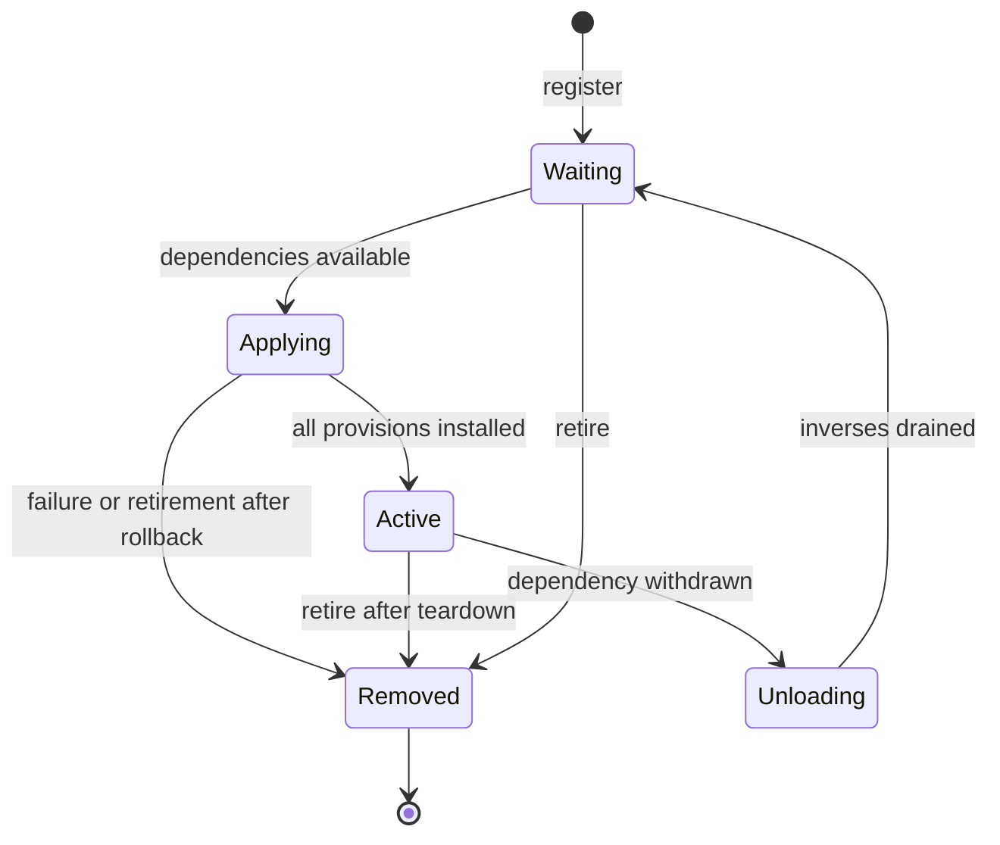

# Cordis composition in Rebrew

Read this when writing a component, extending CLI composition, or maintaining
plugin lifetimes. The [tutorial](CORDIS_TUTORIAL.md) runs a complete component
through activation, dependency withdrawal, replacement, and disposal. This
page owns the concepts, API contracts, and recipes; [ADR 014](adr/014-component-composition.md)
records why the CLI uses this design.

Rebrew implements a synchronous Python composition runtime in
[`rebrew.plugin`](../src/rebrew/plugin.py), following
[A Programming Paradigm for Spatiotemporal Composability](https://arxiv.org/abs/2608.25512).
It shares the context, dependency, and inverse discipline with DeepSeek Harness.
It has its own API and lifetime boundaries.

For a first component, start with the [runnable tutorial](CORDIS_TUTORIAL.md#run-the-example).
For a CLI extension, follow [Add a CLI plugin](#add-a-cli-plugin).

- [Five concepts](#five-concepts)
- [Dependencies and provisions](#declare-dependencies-and-provisions)
- [Lifecycle and ownership](#lifecycle-and-ownership)
- [Failure behavior](#failure-behavior)
- [Public runtime API](#public-runtime-api)
- [Recipes](#recipes)
- [Troubleshooting](#troubleshooting)
- [Paper contracts and limits](#paper-contracts-and-limits)
- [Coming from DeepSeek Harness](#coming-from-deepseek-harness)

## Five concepts

| Concept | Meaning in Rebrew |
|---|---|
| Component | An object with `needs`, `provides`, and `apply(ctx)`. It installs one unit of functionality. Structural typing suffices; subclassing `Component` is optional. |
| Service | A capability bound to a string key, such as `cli` or `console`. Consumers resolve the key instead of importing its concrete implementation. |
| Coeffect | A required service named in `needs`. All required bindings must be available before activation runs. |
| Effect | A binding or another change owned by an activation, paired with an inverse. `provide()` tracks its own inverse; other acquisitions need `effect(disposer)`. |
| Scope | A `CoeffectScope` groups registrations and reacts to service changes. Each registration owns the effects of its current activation. |

The host provides ambient services and retains the context and scope. A
component declares what it uses and publishes, then installs its effects inside
`apply()`. Service availability determines activation order.

## Declare dependencies and provisions

Both declarations are tuples of nonempty, unique string keys. A component
with no dependencies declares `needs = ()`; one publishing nothing declares
`provides = ()`. A single key needs a trailing comma: `("cli",)`.

`needs` gates activation. A missing key leaves the registration inactive;
`apply()` has not run, so it owns no activation effects. When the missing
service appears, the scope tries activation. Dependency cycles with no
available provider remain inactive; the runtime supplies no fallback binding.

`provides` reserves ownership at registration, including while inactive. A
second provider cannot claim the reserved key. Successful activation must
install every declared provision. A partial provider is unavailable to other
consumers until activation succeeds. To change declarations, retire the
registration and add a replacement; mutating the object's fields does not
revise the registered declarations.

The context passed to `apply()` is an activation view. It permits reads of
declared dependencies and its own provisions, plus dependencies committed by
enclosing component contexts. A parent's own provision must be declared in
the child's `needs`; this gates child activation until the parent commits and
orders child teardown before the binding is withdrawn. Nesting may introduce
that child's own declared dependencies. Calling `has()` on an undeclared key also raises
`ComponentError`; it is not an escape hatch for optional injection.

Dependency bindings are committed at activation. These are references to the
original service objects, not deep copies or immutable value snapshots.
Disposers can still resolve them throughout teardown. Afterwards the
activation view expires, and its service reads and effect installation fail.
A reactivated component receives a new view.

Service values use the contracts agreed by their producers and consumers.
The generic context returns `Any`; declaration checks do not establish the
Python type or commutativity of a custom service. Use a protocol or concrete
type in component code and validate external values at their boundary.

## Lifecycle and ownership



This is the public lifecycle; these state names are explanatory, rather than
an enum exposed by the Python API. `unresolved()` reports registrations
without an active activation.

Withdrawing a dependency deactivates its consumers transitively, across
scopes and forks. Every consumer finishes teardown before any inverse of
its provider runs, while its committed dependencies remain readable. A
provider entering teardown makes all its provisions unavailable to new
activations immediately. Within an activation, inverses run in reverse
installation order and are consumed at most once.

Dependency loss retains a component's registration and provision reservations:
it can activate again when its dependencies return. Retirement removes the
registration and releases its reservations after cleanup. Use
`scope.remove(component)` for replacement. Withdrawing any component-owned
provision also retires that whole provider, including its other provisions.
Host-owned bindings are withdrawn individually.

A fork and a scope created inside an activation are owned effects. They end
with that activation. Closing a scope removes its registrations; disposing a
host context also closes its child contexts and scopes. Both operations are
idempotent. Host disposal drains children and scopes before the remaining
host inverses, even when an ordinary host effect was recorded later. This
keeps host resources available during child cleanup. The remaining host
inverses run in reverse order; there is no single LIFO order across the whole
context tree. Inside `apply()`, record a resource's cleanup before creating
children that use it, so activation LIFO ends those children first.

A fork follows its parent for service lookup and notifications;
it cannot shadow a binding in its ancestor chain. `fork()` does not implement
the paper's isolation or interception operations.

## Failure behavior

An activation that raises, including cancellation, rolls back the effects it
already recorded. The failed registration is removed; an unrelated table
change does not retry it. Re-register explicitly after repairing the cause.
A reactive classification still processes healthy siblings before reporting
failures to the caller.

The synchronous runtime finishes a teardown before reacting to table changes
made by its inverses. For example, providing a new service from cleanup does
not start another activation until the current consumer's cleanup has finished.
Changes still settle before the outer lifecycle operation returns, including
when an inverse fails.

A cleanup callback must not synchronously retire its own registration, close
its enclosing scope or context, or withdraw a provider it is still using.
Those circular requests raise `ComponentError` before changing ownership;
remaining inverses still run. Request the enclosing operation after the
current lifecycle call returns. Closing an already closing or closed scope
remains a no-op, as does disposing the current unloading activation view.
Cleanup can close its own nested scopes and forks normally.
It can also retire independent siblings. Those removals do not skip the
remaining registrations during scope close or dependency withdrawal;
their inverses still run once, before provider cleanup.
Likewise, retiring a provider or disposing a host while a consumer's `apply()`
is running cannot invalidate that consumer's binding; the circular request
raises `ComponentError`. Perform host lifecycle changes between synchronous
activation calls.

`activate(components, ctx)` is an atomic startup convenience: if registration
or activation fails, it closes the scope it created, including successful
siblings in that startup group. Use a retained `CoeffectScope` and `add()` for
incremental registrations in a long-lived host.

Cleanup attempts remaining inverses even when one raises. A single failure
is re-raised; multiple failures form a `BaseExceptionGroup` (an
`ExceptionGroup` when all members are ordinary exceptions). If activation
and rollback both fail, both errors survive. A failing inverse is consumed,
so repeated disposal does not retry it. The runtime cannot guarantee that
an inverse that raised restored its external resource.

Register cleanup immediately after acquisition. Work performed before its
inverse is recorded remains the component author's responsibility. Module
import side effects also lie outside the activation's tracked accumulator.

## Public runtime API

The implementation lives in [`plugin.py`](../src/rebrew/plugin.py). The tutorial
exercises the public API directly; [`test_plugin.py`](../tests/test_plugin.py)
covers lifecycle, committed views, confinement, and failure behavior.

| Entry | Result and contract |
|---|---|
| `Context()` | An empty host context. Use `fork()` to create a child with tracked lifetime. |
| `ctx.provide(key, value) -> None` | Bind and track automatic withdrawal. Reject duplicate or reserved keys. An activation can publish only its declared provisions. |
| `ctx.resolve(key) -> Any` | Return a binding or raise `ComponentError`. An activation reads its committed dependency object through teardown; undeclared and expired reads fail. |
| `ctx.has(key) -> bool` | Test presence. Undeclared or expired activation reads fail. Host presence is not a public activation-readiness predicate: bindings can remain readable during teardown. |
| `ctx.unprovide(key) -> None` | Withdraw a binding owned here. A component view can withdraw only its own provision, retiring its whole registration. A host context likewise retires a component-owned provider. |
| `ctx.effect(dispose: Callable[[], None]) -> None` | Record a cleanup callable. It does not call the function now, acquire a resource, or return a disposer. |
| `ctx.fork() -> Context` | Create an owned child with inherited lookup and notifications. Forking a disposed or unloading activation fails. |
| `ctx.dispose() -> None` | End this context's lifetime and drain owned cleanup. On an activation view, retire that exact registration. |
| `ctx.disposed -> bool` | Report the disposal flag. A host sets it before cleanup; an activation view sets it after cleanup. It does not establish that cleanup succeeded. |
| `CoeffectScope(ctx)` | Attach a reactive scope and track its close on `ctx`. A disposed or unloading context rejects attachment. |
| `scope.add(component) -> None` | Reserve declared provisions and register the component; activate when satisfied. Adding to a closed scope has no effect. |
| `scope.remove(component) -> None` | Retire the first registration with that exact component object. An absent registration has no effect. |
| `scope.unresolved() -> list[Component]` | Return registered components without active effects. Failed and retired registrations are absent. |
| `scope.close() -> None` | Retire every registration and drain cleanup; idempotent. |
| `activate(components, ctx) -> CoeffectScope` | Register a startup group, settling dependencies after registration. Failure closes this new scope. |

Retain the component object when removal matters. Registering the same object
twice creates two registrations; `remove()` retires one. Each activation view's
`dispose()` targets its own registration.

### CLI composition helpers

These exports support hosts and CLI adapters; ordinary service components
need only the runtime API above.

| Export | Contract |
|---|---|
| `ComponentError` | A `RebrewError` and `RuntimeError` for declaration, access, ownership, and lifecycle violations. User inverses and `apply()` can also raise their own exceptions. |
| `Disposer` | Alias for `Callable[[], None]`. Cleanup is synchronous; passing a coroutine does not schedule or await it. |
| `CLI_SERVICE`, `CONSOLE_SERVICE` | String keys `"cli"` and `"console"`, supplied by the CLI host. |
| `CliComponent` | Adapter with required `name`, `module`, `help`, `panel`; optional `is_group=False`, `attr=""`, `origin="builtin"`, `needs=("cli", "console")`, `provides=()`. Keep the adapter's dependency declarations: its implementation resolves both services. An empty `attr` selects module form; a nonempty one selects an exported attribute. |
| `Panel` | Help-panel names `PROJECT_SETUP`, `DEVELOPMENT`, `ANALYSIS`, `MATCHING`, `EXPORT_SYNC`, `PLUGINS`; `ALL` lists their display values. |
| `COMMANDS_GROUP`, `MULTI_COMMANDS_GROUP` | Entry-point groups `"rebrew.commands"` and `"rebrew.multicommands"`. `CliComponent.group` selects by `is_group`. |
| `entry_point_components(existing: set[str])` | Return `(components, warnings)`. Duplicate names are skipped, and accepted names are added to `existing`. Discovery does not mount anything; returned warnings are data for the host to print. Malformed entry-point declarations follow the registry's logging policy. |
| `make_stub_command(module, error, console)` | Return a callable reporting the load error and exiting with `EXIT_ERROR` (2). |
| `make_stub_app(module, error, console)` | Return a Typer group using that unavailable-command fallback. |

Import or shape errors in `CliComponent.apply()` mount an `[unavailable]`
stub. This is an active adapter with an owned stub registration, rather than
a failed service activation awaiting repair. Restart after fixing the package;
registry refresh alone does not remount the CLI.

## Recipes

### Add a CLI plugin

Ordinary command authors use `CliComponent` through package entry points;
they do not need to implement a custom service component. A package can
publish a callable named `hello` as follows:

```toml
[project.entry-points."rebrew.commands"]
hello = "rebrew_hello:main"
```

The callable in `rebrew_hello.py` can use Typer options:

```python
"""A callable exported by the rebrew-hello CLI plugin package."""

import typer

from rebrew.utils import console


def main(name: str = typer.Option("world", "--name")) -> None:
    """Print a greeting."""
    console.print(f"Hello, {name}!")
```

Install that package in the Python environment running Rebrew. On the next
process start, its entry point becomes a command on the umbrella app.
`CliComponent` declares `cli` and `console`, publishes no services, and tracks
the exact Typer registration it adds. It can unmount without resetting
other commands. The full registration shapes and conflict policy live in
[CLI plugins](CLI.md#component-registration-plugins); the internal contributor
checklist lives in [Adding a command](ADDING_A_COMMAND.md).

### Own a resource

After opening a file, creating a temporary directory, or acquiring a handle,
record its cleanup on the activation view before doing more work. For a
temporary report directory, save this example as `/tmp/rebrew_cordis_resource.py`.
From a contributor checkout ([setup](DEVELOPMENT.md)), run:

```bash
uv run --frozen python /tmp/rebrew_cordis_resource.py
```

```python
"""Keep a temporary directory alive for its component's activation."""

import tempfile
from pathlib import Path

from rebrew.plugin import Context, activate


class ReportDirectory:
    needs: tuple[str, ...] = ()
    provides = ("report_dir",)

    def apply(self, ctx: Context) -> None:
        directory = tempfile.TemporaryDirectory()
        ctx.effect(directory.cleanup)
        ctx.provide("report_dir", Path(directory.name))


host = Context()
try:
    scope = activate([ReportDirectory()], host)
    path = host.resolve("report_dir")
    assert path.is_dir()
    scope.close()
    assert not host.has("report_dir")
    assert not path.exists()
finally:
    host.dispose()
```

Successful execution reaches the assertions and exits without output.
The binding is removed before the directory's cleanup
runs, and consumers drain before either provider inverse. Closing a resource
with a `with` block inside `apply()` instead would end it before consumers use
the service. [`test_cordis_docs.py`](../tests/test_cordis_docs.py) runs this
recipe alongside the CLI recipe; verify both with
`make test-one T=tests/test_cordis_docs.py`.

### Register on a shared service

An inverse removes the exact contribution this activation added. The
tutorial's command book uses callable identity to remove its `hello` entry
while preserving another entry. For a list, remove the original object by
identity. Clearing the service or restoring a whole old snapshot would erase
sibling contributions installed afterwards.

### Compose children or optional capabilities

Call `activate(children, ctx)` inside `apply()` to own a nested scope; use
`ctx.fork()` when its child lifetime needs a separate context. Child components
declare their own dependencies and provisions. To add behavior only when a
service exists, register a separate component whose `needs` names that
service. Probing an undeclared service in `apply()` violates declared access.

### Refresh a registry

Entry-point registries and `CoeffectScope` have different lifetimes. Registry
refresh republishes provider tables for future readers; it does not reload
Python modules or remount the CLI. Snapshot ownership, generation consistency,
and provider-removal rules live in
[Registry snapshots](DEVELOPMENT.md#registry-snapshots). The entry-point
catalog remains in the [CLI reference](CLI.md#component-registration-plugins).

## Troubleshooting

| Symptom | Check or action |
|---|---|
| `apply()` never runs | Inspect `scope.unresolved()` and each component's `needs`; supply missing providers and check for dependency cycles. |
| A key is reserved although no service is visible | An inactive registration owns it. Remove that component before adding another provider. |
| An undeclared-service error appears | Declare the dependency, or move conditional behavior into its own dependent component. |
| Activation reports missing declared provisions | Install every key in `provides` before returning; failure rolls back the partial activation. |
| A saved context rejects a callback | Its activation ended. Cancel callbacks during teardown; each later activation must use its new context. |
| Withdrawing one key removes several services | They share a component-owned provider; withdrawal retires that entire registration. |
| A failed component never retries | Failure removes its registration. Repair the cause and call `add()` explicitly. |
| An installed CLI plugin is missing | Check the package is in Rebrew's environment, its entry-point shape is valid, and its command name does not collide. Restart the process. |
| Teardown raises several errors | Inspect the exception group's members. Cleanup continues; repair inverses that failed rather than relying on repeated disposal. |
| A teardown request reports a circular lifecycle error | An inverse tried to retire its enclosing lifetime or a provider still in use. Move that request to the owner after the current lifecycle call returns. |

## Paper contracts and limits

| Paper contract | Implementation and evidence |
|---|---|
| Reversible effects and LIFO recovery (Theorem 16) | Context and activation accumulators own inverses, forks, and nested scopes. `TestCompositionLifecycle` checks rollback and cleanup in [`test_plugin.py`](../tests/test_plugin.py). `MutationLog` restores immutable source preimages; see [mutation tracking](GA_MUTATIONS.md#revertible-effect-tracking-inverse-machinery). |
| Declared access and total provision (Definitions 48, 55, 76) | Registration reserves `provides`; activation checks declared access and complete provision. `TestConfinedContext` checks committed bindings and expired views. |
| Ordering and resolution coherence (Theorems 70, 71) | Transitive consumers drain before provider inverses. Partial and unloading providers cannot start new consumers. Circular teardown requests are rejected and changes made by inverses settle after teardown. Tests cover reversed order, multiple scopes, forks, callback reentrancy, and equal-valued replacement. |
| Failure recovery (§4.4) | Partial activation rolls back, failures require explicit re-registration, and reactive failure preserves healthy siblings. The atomic `activate()` helper additionally closes its startup group on failure. |
| Replacement at integration boundaries | Registry refresh removes retired contributions and restores packaged defaults. Discovery captures a provider generation. Cache identity includes its factory. Registry, discovery, cache, and client shutdown regression tests cover these contracts. |

These tests do not prove Theorem 80. Confluence requires correct inverses and
independent or commutative operations on shared services. Python plugins are
trusted code: context checks constrain the public API, rather than arbitrary
imports, captured objects, or external mutations. Components still have to
honor service types and ownership.

The runtime is synchronous and runs on its host thread. Isolation realms,
service interception, typed event dispatch, asynchronous fibers, YAML loaders,
configuration reconciliation, and hot module replacement are outside its API.
The CLI composes at `rebrew.main` import and retains its context and scope in
`_COMPOSED` for process lifetime. Incremental scope operations do not imply
that the umbrella command surface supports hot reload.

Source and metadata edits, compiler artifacts, and network submissions are
command results (§6.1), rather than reversible component acquisitions. They
retain their explicit transaction and idempotence contracts. Shared compile
caches and HTTP clients are process-owned resources with shutdown cleanup;
removing a CLI component does not close them.

## Coming from DeepSeek Harness

DeepSeek Harness provides a [primer](https://github.com/deepseek-ai/deepseek-harness/blob/master/docs/cordis-primer.md),
a [hands-on tutorial](https://github.com/deepseek-ai/deepseek-harness/blob/master/docs/cordis-tutorial/index.md),
and a [framework API reference](https://github.com/deepseek-ai/deepseek-harness/blob/master/docs/cordis-api/inherited.md).
Use those for the harness's TypeScript APIs. The equivalent Rebrew entry points
are:

| Harness concept | Rebrew API |
|---|---|
| `inject` | `Component.needs`; `provides` separately declares published keys. |
| Service/property lookup | `ctx.resolve(key)`; service values follow the producer/consumer Python contract. |
| Plugin mounting | `CoeffectScope.add()` or `activate()`; retain the group scope. `add()` returns `None`; there is no public Fiber object. |
| Tracked effect | Acquire first, then `ctx.effect(cleanup)`. This method records cleanup and returns `None`; do not pass an acquisition callback that returns an inverse. |
| Service provision | `ctx.provide(key, value)` tracks withdrawal and returns `None`; use retirement for explicit replacement. |
| Derived context | `ctx.fork()` tracks child lifetime; it supplies no isolation or interception API. |
| Events, loaders, HMR | No equivalent in the Rebrew runtime. |
