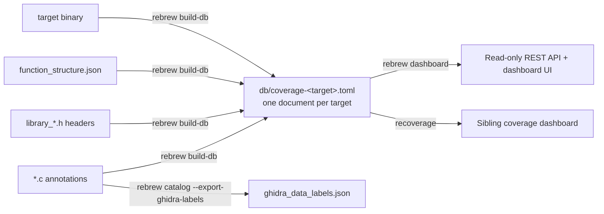

# Rebrew Coverage Document Format

> **Scope:** the `db/coverage-<target>.toml` documents `rebrew build-db` writes
> and the coverage dashboards read, and the `rebrew dashboard` REST API.  For
> `verify` / `status` flag semantics see
> [prd/05-verification-and-progress.md](prd/05-verification-and-progress.md).

Coverage is clear text.  `rebrew build-db` writes one TOML document per target,
`db/coverage-<target>.toml`, by scanning the project in-process, and
the dashboards read those documents directly.  There is no database file, no
schema version to gate a build on, and no cache tier between the catalog and the
reader: `rebrew.coverage_toml` owns the writer and the reader both, so the two
cannot disagree about the shape of a document.

---

## Data Pipeline Overview



### Pipeline Steps

| Step | Tool | Input | Output |
|------|------|-------|--------|
| 1. Build | `rebrew build-db [--target T]` | `*.c` annotations, `library_*.h` headers, `function_structure.json`, target binary | `db/coverage-<target>.toml`, one document per target |
| 1b. Export Labels | `rebrew catalog --export-ghidra-labels` | (same as above) | `ghidra_data_labels.json` (detected data labels/thunks for Ghidra round-trip) |
| 3. Serve | `rebrew dashboard [--host H] [--port P]` | `db/coverage-<target>.toml` | Read-only HTTP API and UI at `localhost:8000` |

A document has one writer, `rebrew build-db`, and the dashboards are its readers.
`rebrew dashboard` has no regeneration endpoint: re-run `rebrew build-db`
to refresh a document, and the running dashboard serves the new content on the
next request, because the reader keys its snapshot cache on the documents' own
stat.  A project that never ran `build-db` has no documents, and `rebrew dashboard`
refuses to start on a directory that yields no readable document.

`--force` is a no-op.  Every run replaces each document whole — a temporary
sibling file moved over the old one — so there is no stale schema to migrate past
and no partial state to recover.  The flag stays in the command line because
scripts pass it.

---

## 1. `db/coverage-<target>.toml`

One document holds everything one target knows: its sections and their cells, its
functions, its globals, its verify results and its status history.  The file is
the target's only storage — no sidecar stands beside it and no cache has to be
invalidated with it.  `rebrew build-db` is a thin front over
`rebrew.coverage_toml.write_coverage_toml`, and the same module's reader is what
the dashboards import.

### Document Shape

```toml
# Generated by rebrew's coverage TOML writer from the project tree.
# Rebuilt wholesale on every run: edit the annotations, not this file.

version = 1
target = "server.dll"
functions = [
  {va = 268439552, name = "adler32", vaStart = "0x10001000", size = 304, fileOffset = 4096, status = "EXACT", module = "GAME", cflags = ["-O2"], symbol = "adler32", markerType = "FUNCTION", ghidra_name = "", list_name = "", is_thunk = 0, is_export = 1, sha256 = "abc", files = ["zlib.c"], detected_by = ["flirt"], size_by_tool = {gcc = 300}, textOffset = 32, blocker = "", blockerDelta = "", size_reason = "", similarity = 1.0, updated_by = "tester", updated_at = "2026-01-01T00:00:00+00:00"},
]
globals = [
  {va = 268632064, name = "g_counter", decl = "int g_counter;", files = ["globals.c"], module = "GAME", size = 4, status = "VERIFIED"},
]
verify_results = [
  {va = 268439552, verified_at = "2026-02-01T00:00:00+00:00", byte_delta = 0, diff_lines = "", similarity = 1.0, reg_delta = 0, effective_match = 0},
]
history = [
  {va = 268439552, old_status = "STUB", new_status = "EXACT", changed_at = "2026-02-01T00:00:00+00:00", updated_by = "tester"},
]

[metadata]
paths = {originalDll = "/original/Server/server.dll", sourceRoot = "/src/server.dll"}

[sections.".text"]
va = 268439552
size = 4096
fileOffset = 4096
unitBytes = 64
columns = 64
cells = [
  {section = ".text", start = 0, end = 64, span = 1, state = "exact", functions = ["adler32"], label = "", parent_function = ""},
]
```

Top-level keys:

| Key | Type | Meaning |
|-----|------|---------|
| `version` | integer | Document-format version (current: `1`). |
| `target` | string | The target's name, matching the `<target>` in the filename. |
| `functions` | array of inline tables | One row per function, sorted by `va`. |
| `globals` | array of inline tables | One row per global, sorted by `va`. |
| `verify_results` | array of inline tables | One row per stored verification verdict. |
| `history` | array of inline tables | One row per recorded status change, oldest first. |
| `[metadata]` | table | Facts the catalog supplied; currently only `paths`. |
| `[sections."<name>"]` | one table per section | The section's scalars and its `cells` array. |

`[metadata]` carries `paths`, the catalog's originalDll / sourceRoot mapping.  A
number the reader could compute stays out of it: a stored aggregate is a second
place for two writers to disagree (see *Derived at Load*).

### The Two Rules the Format Depends On

**TOML has no null.**  A `None` is written as `""`, so a reader cannot tell an
absent value from an empty one.  Every nullable column is an optional field: a
cell's `label` / `parent_function`, a section's `va` / `size` / `fileOffset`, a
function's `size` / `fileOffset` / `textOffset` / `blockerDelta` / `similarity`,
and every measurement in a `verify_results` row.  Consumers already treat missing
and empty alike, and where the difference decides an answer the reader keeps it:
a section's `va` and `fileOffset` and a function's optional numbers come back as
`None`, not `0`.  A `.bss` section has no file offset at all, and reading that
absence back as 0 is what would make `/bytes` serve bytes from the start of the
file for a section that has none.  A section's own `size` is the exception: it
reads back as `0`.

**A bare key belongs to the table above it.**  `functions`, `globals`,
`verify_results` and `history` are therefore written BEFORE the first
`[sections."…"]` header, so they land at the document's top level.  Written after
one, they would silently become keys of that last section, and the reader would
see a document with no functions.

### Row Shapes

#### `functions`

| Key | Type | Meaning |
|-----|------|---------|
| `va` | integer | Virtual address, from the catalog key, falling back to `vaStart`. |
| `name` | string | Function name. |
| `vaStart` | string | Hex spelling of the VA (`0x10001000`). |
| `size` | integer or `""` | Byte size. |
| `fileOffset` | integer or `""` | Offset in the original binary. |
| `status` | string | Canonical STATUS (`EXACT`, `RELOC`, `PROVEN`, `STUB`, …); `UNKNOWN` when unset or outside the vocabulary. |
| `module` | string | Origin module (`GAME`, `ZLIB`, …), `""` when unset. |
| `cflags` | string or array | The catalog's compilation flags, stored as spelled. |
| `symbol` | string | Raw mangled or internal symbol name. |
| `markerType` | string | `FUNCTION` / `LIBRARY` / `STUB` for code rows; `GLOBAL` / `DATA` / `VTABLE` / `STRING` for data rows.  An unknown marker is stored as `FUNCTION`. |
| `ghidra_name` | string | Name as defined in Ghidra. |
| `list_name` | string | Name from the function list. |
| `is_thunk` | `0` / `1` | IAT thunk (`jmp [IAT]` stub). |
| `is_export` | `0` / `1` | Exported from the binary. |
| `sha256` | string | SHA-256 of the function's original bytes. |
| `files` | array of strings | Associated source files. |
| `detected_by` | array of strings | Detectors that found the row (`["ghidra", "list"]`). |
| `size_by_tool` | inline table | Tool name to reported size (`{ghidra = 302, list = 302}`). |
| `textOffset` | integer or `""` | Offset within the containing section. |
| `blocker` | string | Blocker text, `""` when none. |
| `blockerDelta` | integer or `""` | Bytes from the target while blocked. |
| `size_reason` | string | How the canonical size was chosen (`ghidra`, `list`, `annotation`). |
| `similarity` | float or `""` | Structural similarity in `[0, 1]`; `""` when never scored. |
| `updated_by` | string | Provenance tag of the last STATUS write. |
| `updated_at` | string | UTC stamp of the last STATUS write. |

Rows sharing a VA collapse to the last one with a warning, and a row whose VA
parses from neither the catalog key nor `vaStart` is dropped the same way, so the
document never holds a function no reader can key.

#### `globals`

| Key | Type | Meaning |
|-----|------|---------|
| `va` | integer | Virtual address. |
| `name` | string | Variable name. |
| `decl` | string | C declaration (`int g_counter;`). |
| `files` | array of strings | Associated source files. |
| `module` | string | Origin module. |
| `size` | integer | Bytes; `4` (pointer-sized) when the catalog gives no usable size. |
| `status` | string | Data verdict: `VERIFIED`, `DRIFT`, `UNCHECKED`, or `""` when never compared. |

#### `verify_results`

| Key | Type | Meaning |
|-----|------|---------|
| `va` | integer | Function VA. |
| `verified_at` | string | ISO 8601 stamp of the measurement. |
| `byte_delta` | integer or `""` | Differing bytes. |
| `diff_lines` | integer or `""` | Structural differing disassembly lines; register-encoding-only differences are not counted here (see `reg_delta`). |
| `similarity` | float or `""` | Code similarity in `[0, 1]`, from the verify cache's 0–100 `Sim %` divided by 100. |
| `reg_delta` | integer or `""` | Register-encoding-only differing instructions; `""` when the cache has no value. |
| `effective_match` | `0` / `1` or `""` | `1` when the whole byte delta is register allocation. |

The rows come from `.rebrew/verify_cache.json`, imported by `rebrew build-db`;
`rebrew verify` writes no document.  A cache that says nothing about the target
keeps the document's previous rows, and a row whose measurements did not move
keeps its earlier `verified_at` — a rebuild re-measures the same verdicts, and
the cache file's own mtime is not when a verdict was first measured.

#### `history`

| Key | Type | Meaning |
|-----|------|---------|
| `va` | integer | Function VA. |
| `old_status` | string | Status before the change. |
| `new_status` | string | Status after the change. |
| `changed_at` | string | ISO 8601 stamp of the change. |
| `updated_by` | string | Provenance tag of the write that caused it. |

`rebrew build-db` compares this build's function statuses against the previous
document's `functions` array, appends one row per transition, and keeps only the
newest 10,000 rows (`HISTORY_RETENTION`).  A text file has no row id, so
retention and ordering sort by `changed_at`.

#### `[sections."<name>"]`

The section's name is the table key, not a field inside it, so a dotted name such
as `.text` is quoted.  Each table holds five scalars and one array:

| Key | Type | Meaning |
|-----|------|---------|
| `va` | integer or `""` | Section virtual address. |
| `size` | integer or `""` | Section byte size. |
| `fileOffset` | integer or `""` | Section data's offset in the file; `""` for an uninitialised section such as `.bss`. |
| `unitBytes` | integer | Bytes per grid unit; `64` when the catalog omits it or gives a non-positive value. |
| `columns` | integer | Grid columns; `64` on the same fallback. |
| `cells` | array of inline tables | The section's cells, ordered by `start`; `[]` for a section with none. |

One `cells` row:

| Key | Type | Meaning |
|-----|------|---------|
| `section` | string | The section's own name. |
| `start` | integer | Start offset relative to the section. |
| `end` | integer | End offset relative to the section, clamped to at least `start`. |
| `span` | integer | Width in grid units, at least 1. |
| `state` | string | Match state (see *Cell States*). |
| `functions` | array of strings | Function names or VAs mapped to this cell. |
| `label` | string | Display label (a Ghidra data label, for instance); `""` when none. |
| `parent_function` | string | Name of the cell's parent function; `""` when none. |

`section` repeats the table's own name in every row because the row is
`build_db`'s `cells` row less its `target` column; the reader takes the section
from the table the row is in.  Cells sharing a `start` collapse to the last one
with a warning: a text file's row order is the key order a primary key would have
given it.

#### Cell States

The storable vocabulary is derived, not hand-listed: `KNOWN_STATUSES` lowercased,
unioned with the gap/label states and the data-metadata verdicts
(`_KNOWN_CELL_STATES` in `build_db.py`).  Adding an annotation `STATUS` therefore
widens the set without a format change.  The table below is the full set;
`tests/test_build_db.py::TestCellStateVocabulary` fails if it and the code drift
apart.

| State | Description | Bucket | Mark in the report |
|-------|-------------|--------|-------------------|
| `none` | Uncovered / unmatched region | `none` | none (count only) |
| `exact` | Byte-identical match | `exact` | EXACT `#15803d` |
| `verified` | Data verdict `VERIFIED` (`rebrew verify --data`) | `exact` | none (count only) |
| `reloc` | Match after relocation normalization | `reloc` | RELOC `#0369a1` |
| `near_matching` / `near_match` | Functionally matching, not byte-identical | `near_match` | NEAR_MATCHING `#b45309` |
| `proven` | PROVEN status (semantic equivalence, bytes differ) | `proven` | PROVEN `#0e7490` |
| `size_mismatch` | SIZE_MISMATCH status | `size_mismatch` | SIZE_MISMATCH `#92400e` |
| `stub` | Stub implementation (placeholder) | `stub` | STUB `#475569` |
| `padding` | NOP/INT3 alignment padding | `padding` | none (count only) |
| `data` | Non-code data in .text (residual switch tables, etc.) | `data` | none (count only) |
| `thunk` | IAT thunk stub (not reversible) | `thunk` | none (count only) |
| `skip` | Parked by annotation | `other` | SKIP `#556070` |
| `unknown` | Unset or unrecognized (the coercion target) | `other` | UNKNOWN `#555` |
| `compile_error` | The compile step failed | `other` | error `#b91c1c` |
| `extract_error` | No bytes could be extracted for the VA | `other` | error `#b91c1c` |
| `missing_size` | Target size unknown | `other` | error `#b91c1c` |
| `missing_file` | Source file missing | `other` | error `#b91c1c` |
| `invalid_va` | VA below the arch-aware floor | `other` | error `#b91c1c` |
| `drift` | Data verdict `DRIFT`: the recompiled bytes no longer match | `other` | none (count only) |
| `unchecked` | Data verdict `UNCHECKED` | `other` | none (count only) |

A state gets a mark only when it is a function `STATUS`: the report and the
dashboard paint `STATUS_HEX[<STATUS>]`, so a cell state that names a status
(`exact`, `reloc`, `stub`, the machine verdicts) is coloured the same as a
function row carrying it, and the gap/label/data states are only ever counts in
the sections table.  `tests/test_docs_hygiene.py::TestCellStateMarks` fails if a
hex here and `rebrew.status_style.STATUS_HEX` disagree.

The `Bucket` column is the key the reader counts that state under, and the
catch-all is a rule rather than a list: `other_count` is a catch-all, not a fixed
list, so any state the table above does not name is counted in it and served
under `other`, which keeps the buckets summing to `total_cells` with no reader
change.  Those are cell counts; the byte totals are `Section.buckets`, which
keeps the states apart.

### Derived at Load

Nothing below is stored.  The writer writes facts, and
`rebrew.coverage_toml`'s reader computes every aggregate once, at load:

| Field | Computed from | Rule |
|-------|---------------|------|
| `Cell.size` | the cell's `end` and `start` | Byte length of the span. |
| `Section.buckets` | the section's cells | Bytes covered, per state. |
| `Section.covered_bytes` | `buckets` | Every byte not in a `none` cell. |
| `Section.coverage_pct` | `covered_bytes` over the section's cell bytes | Rounded to 2 places; `0.0` for a section with no cells. |
| `Section.cell_count` | the section's cells | Number of cells. |
| `Section.bucket_counts` | the section's cells | Cell count per served bucket, `total_cells` and the `other` catch-all included. |
| `CoverageSnapshot.function_stats` | the stored code rows (`FUNCTION` / `LIBRARY` / `STUB`) and the `.text` size | `total`, `covered_bytes`, `matched_bytes`, `total_bytes`, `by_status`, `by_module_counts`. |
| `CoverageSnapshot.functions_by_va` | the `functions` array | VA to function index. |

A stored aggregate is a second place for two writers to disagree.  The number
would have to be computed on the way in and trusted on the way out, and every
change to the rule — what counts as covered, what counts as matched, how a
function's size is clipped at the next function's start — would have to be
applied to the stored copy as well or the file and the reader would report
different coverage for the same rows.  Each number here is a pure function of
rows already in the document, so one pass at load is the whole cost, and no file
can hold a figure that contradicts its own cells.

Two rules inside those aggregates are worth naming, because they decide what the
dashboard headlines mean:

- `covered_bytes` sums every code row's size, STUB placeholders included, so an
  all-STUB binary still reports high *identified* coverage.  `matched_bytes`
  sums `EXACT` and `RELOC` sizes only, and that is the headline figure:
  `/api/summary` divides it by `total_bytes` for `coverage_pct` and divides
  `covered_bytes` by `total_bytes` for `identified_pct`.  Data rows (`DATA`,
  `GLOBAL`, `VTABLE`, `STRING`) are in the document but not in these counts.
- `total_bytes` is the `.text` section's `size`, so a target with no `.text`
  table reports `0` there.  Byte counts past that size (a stale `size` field, a
  function span outside `.text`) are capped at it for the percentages and logged
  rather than shown as coverage over 100%.

### A Document the Reader Cannot Use

| Condition | Result |
|-----------|--------|
| `version` is not the current integer (`1`), including a float, a string, or a missing key | unreadable |
| the TOML does not parse | unreadable |
| `target` names a different target than the filename | unreadable |
| the file is absent, or cannot be read as UTF-8 | unreadable |
| a required array is not an array of tables, or `metadata` is not a table | unreadable |
| the target name carries a path separator | refused before a file is opened |

A request for target `a` answered with `b`'s coverage is the one failure a
dashboard cannot show the reader, so the document's own `target` key and the
filename must agree.  (A document whose `target` is missing or empty takes the
filename as the name.)  A target name is a filename component here, so a name
carrying `/` or `..` is refused before any file is opened rather than resolved.

Every failure above is one exception, `CoverageTomlError`.  The reader that walks
a whole directory skips an unreadable document with a log line naming the file
and the reason and serves the rest: two readable targets beside one broken file
beat a 500.  A target with no readable document is a 404 `unknown_target` on the
target-scoped routes, and `/api/health` answers 500 `database_error` only when
the whole directory yields none — the case `rebrew dashboard` also refuses to
start on.

There is no migration, no version gate and no `--force` unlink.  Every run
replaces the previous document whole, so there is no half-written state to
recover and no stale schema to migrate past; the flag exists for command lines
that already pass it.  A previous document of another `version` contributes
nothing, because the keys that carry history and verify rows are exactly the ones
a foreign layout would have to be guessed at.  For a document of the current
version the rebuild reads it for two things only: its `functions` statuses, as
the baseline for the new `history` rows, and its `verify_results`, to keep the
stamp of a verdict whose measurements did not move.

---

## 2. The In-Process Catalog Dict

`rebrew build-db` calls `rebrew.catalog.pipeline.build_catalog_data`, which
returns this dict for one target and is rendered into the document.  It is
never written to disk; it is an intermediate value, not a format.

```json
{
  "sections": {
    ".text": { "va": ..., "size": ..., "fileOffset": ..., "cells": [...], "unitBytes": 64, "columns": 64 },
    ".data": { ... },
    ".rdata": { ... },
    ".bss": { ... }
  },
  "globals": {
    "0x10030000": { "va": ..., "name": "g_var", "decl": "int g_var;", "files": ["file.c"] }
  },
  "summary": {
    "totalFunctions": 471, "matchedFunctions": 100,
    "exactMatches": 60, "relocMatches": 10, "nearMatchCount": 20, "stubCount": 10,
    "coveredBytes": 50000, "coveragePercent": 33.5, "textSize": 150000
  },
  "functions": {
    "0x10001000": {
      "name": "func_name", "vaStart": "0x10001000", "size": 302,
      "status": "EXACT", "module": "GAME", "cflags": "/O2",
      "symbol": "_func_name", "markerType": "FUNCTION",
      "fileOffset": 4096, "textOffset": 0, "sha256": "abcd...",
      "files": ["func_name.c"],
      "detected_by": ["ghidra", "list"],
      "size_by_tool": {"ghidra": 302, "list": 302},
      "ghidra_name": "FUN_10001000", "list_name": "fcn.10001000",
      "is_thunk": false, "is_export": false,
      "blocker": "", "blockerDelta": null, "size_reason": "ghidra"
    }
  },
  "paths": { "originalDll": "/original/Server/server.dll", "sourceRoot": "/src/server.dll" }
}
```

Functions and globals are keyed by **hex VA**.  `rebrew build-db` turns that key
into the document's integer `va`, falling back to the row's `vaStart` (or `va`),
sorting each array by the result.  A row where neither parses is dropped with a
warning naming the target and the count.

> [!NOTE] Coverage definitions
> The dict's `summary` blob is the catalog's precomputed answer and is NOT stored
> in the document.  Two coverage figures exist and measure different things:
> - `summary.coveragePercent` (catalog/grid) = **cell-based** coverage:
>   `(func_cell_bytes + padding + data + thunk) / textSize` — every accounted
>   byte, including padding and data.  A binary whose functions are all STUB
>   placeholders still reports high coverage here.
> - `function_stats` (the dashboard headline, derived at load) — `/api/summary`
>   computes `coverage_pct` from **matched bytes** `(EXACT + RELOC sizes) /
>   textSize`, the genuine progress metric, and `identified_pct` from
>   `covered_bytes` (every function incl. stubs), so "fully documented" stays
>   visible separately rather than reading as ~100% "coverage" for an all-STUB
>   binary.

> [!NOTE]
> All PE sections the catalog finds become `[sections."<name>"]` tables — not
> only the standard `.text`, `.rdata`, `.data` and `.bss`.  One exception is the
> headline denominator: `function_stats.total_bytes` is the `.text` section's
> size.

---

## 3. Dashboard REST API

`rebrew dashboard` serves the coverage documents read-only over HTTP on
`http://127.0.0.1:8000` by default (`--host` / `--port`). There is no
authentication: it binds loopback, and a non-loopback `--host` prints a startup
warning. The machine-readable contract is
[`dashboard-api.yaml`](dashboard-api.yaml) (OpenAPI 3.1); the table below is the
human summary, and both are checked against the code by
`tests/test_dashboard.py`.

| Method | Endpoint | Query | Description |
|--------|----------|-------|-------------|
| `GET`, `HEAD` | `/` | | Dashboard HTML shell (inlined CSS, deferred `/app.js`) |
| `GET`, `HEAD` | `/app.js` | `v` | Dashboard client; `?v=<content hash>` is served `immutable` |
| `GET`, `HEAD` | `/api/bootstrap` | | Targets plus the first target's summary and functions, in one round trip |
| `GET`, `HEAD` | `/api/health` | | `{"status": "ok", "db": "<coverage directory>", "targets": <n>, "requests": <n>, "server_errors": <n>, "slowest_ms": <ms>}` after one real read of the documents (the last three are the running server totals, absent off the HTTP server), so a directory that yields no readable document answers 500 `database_error`; served `no-store` with no `ETag`, so a probe cannot be cached or revalidated into a stale "healthy" |
| `GET`, `HEAD` | `/api/targets` | | Every target with a readable document |
| `GET`, `HEAD` | `/api/summary` | `target` | Coverage percentages plus the derived `function_stats` object |
| `GET`, `HEAD` | `/api/functions` | `target`, `status`, `module`, `q`, `limit`, `offset` | Paged function rows |
| `GET`, `HEAD` | `/api/sections` | `target` | Per-section cell counts, unpaged |
| `GET`, `HEAD` | `/api/globals` | `target`, `module`, `q`, `limit`, `offset` | Paged global data rows |
| `GET`, `HEAD` | `/api/history` | `target`, `limit`, `offset` | Paged status-change history, newest first |

`q` matches name or symbol on functions and name on globals, and also matches
exactly when it is a hex address of four or more digits (with or without
`0x`). A present empty `module=` matches a blank module; omitting `module`
does not filter. A repeated parameter takes its first value, and an
unrecognised one is ignored. A missing, malformed, or non-positive `limit`
uses 100 and larger values clamp to 5000; a missing, malformed, or negative
`offset` uses 0 and values past `VA_MAX` (rebrew's address ceiling) clamp to it,
so `limit=0`, `limit=-1`, and `limit=abc` never silently return an empty page.
Clients read the applied values back from the envelope.

> [!NOTE]
> Every row list is compact arrays under `cols`, never per-row objects, and
> every text column in those rows is a JSON string: a value the document stores
> as `""` (a history row's `old_status`/`new_status` for a VA's first recorded
> transition, a function with no module) is sent as `""`, so a client never
> has to null-check one route and not the next.
> List envelopes carry `count` (this page), `total`, the applied
> `limit`/`offset`, and `paged` — `true` on
> `/api/functions`, `/api/globals`, `/api/history`; `false` on
> `/api/sections`, `/api/targets`, and the top level of `/api/bootstrap`,
> which have no page (so `limit` there is the row count, not a page size).
> A client that pages steps by `count`, not by `limit`.
> Missing `target` → 400; unknown target or unreadable document → 404
> `unknown_target`; a `status` filter outside the STATUS vocabulary → 400 (an
> empty page would read as "no functions in that status").  A corrupt
> `function_stats` is not a case: it is derived from the stored function rows, so
> a target is either a readable document (200) or not (404 `unknown_target`).
> Every error body is
> `{"error": "<message>", "code": "<machine-readable code>"}`; branch on
> `code` (`missing_target`, `unknown_target`, `invalid_status`, `not_found`,
> `method_not_allowed`, `host_not_allowed`, `database_error` — the whole
> directory yielded no readable document, which only `/api/health` asks about —
> `internal_error`, `server_busy` (a connection refused
> because the 64-connection cap was full, answered before routing with
> `Retry-After: 1`), plus `bad_request` / `uri_too_long` /
> `header_fields_too_large` / `http_version_not_supported` for requests
> rejected before routing, and `request_error` for any other status raised
> there). Every response, error included, carries `X-Request-Id: r<N>`, the id
> its access and error log lines carry.
> A successful 200 carries an `ETag`: the content hash for `/` and `/app.js`,
> and every document's mtime and size — hashed together, so one target's rebuild
> invalidates the tag for all of them — plus a hash of the request's path and
> query for the JSON routes, so one validator never stands for two different
> routes, targets, or filters. `Cache-Control` is `private, no-cache`
> (revalidate, never serve stale after `build-db`) except on `/api/health`
> (`no-store`, no `ETag`) and on `/app.js` at its `?v=` URL
> (`private, max-age=31536000, immutable`). JSON and the shell negotiate
> `zstd` then `gzip` by `Accept-Encoding` quality.
> Its stderr log is one stream: every access line is
> `HH:MM:SS INFO    <addr> r<N> "<request line>" <status> <bytes> <ms>`
> and every error line `HH:MM:SS ERROR   rebrew.dashboard r<N> <reason> <path>`
> (plus an escaped single-line traceback), so `r<N>` pivots from a failure to
> its request; a 500 the route raised itself is logged the same way with no
> traceback. A fault that escapes the handler reaches the same stream as
> `r<N> unhandled <Exc> from <peer> serving <request line>` (ERROR, counted in
> `server errors`); a client that closed the connection mid-response is
> `r<N> client disconnected serving <request line>` (INFO, not counted).
> Totals (`requests`, `server errors`, `slowest ms`) print once on
> shutdown. See [`dashboard.py`](../src/rebrew/dashboard.py).
