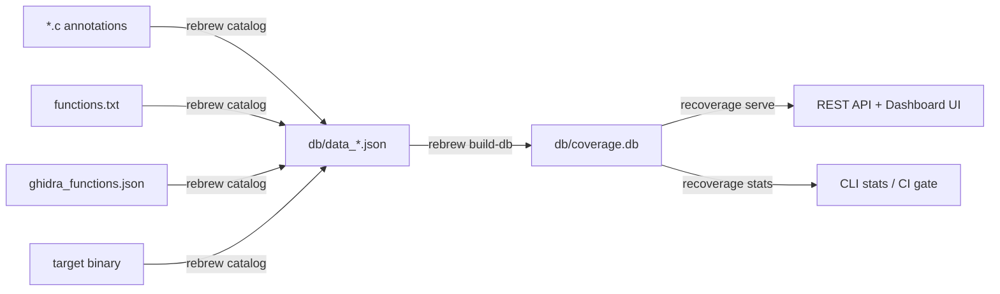

# Rebrew Database Formats

The `rebrew` tooling ecosystem uses SQLite databases to power its reverse-engineering, matching, and coverage dashboard workflows. This document details the schema and purpose of the two primary database formats:

1. **`coverage.db`** — The persistent SQLite database generated by `rebrew build-db` driving the `recoverage` development server and UI dashboard.
2. **`reccmp` In-Memory Database** — The temporary comparison database used by `reccmp` to track matching entities between the original and recompiled binaries.

---

## Data Pipeline Overview



### Pipeline Steps

| Step | Tool | Input | Output |
|------|------|-------|--------|
| 1. Catalog | `rebrew catalog --json` | `*.c` annotations, `functions.txt`, `ghidra_functions.json`, target binary | `db/data_<target>.json` |
| 1b. Export Labels | `rebrew catalog --export-ghidra-labels` | (same as above) | `ghidra_data_labels.json` (detected data labels/thunks for Ghidra round-trip) |
| 2. Build DB | `rebrew build-db` | `db/data_*.json` | `db/coverage.db` |
| 3. Serve | `recoverage serve` | `db/coverage.db` | HTTP dashboard at `localhost:8001` |
| 4. Regen | `POST /regen` or `recoverage serve --regen` | Runs steps 1+2 in sequence | Updated `coverage.db` |

---

## 1. `coverage.db` (Recoverage Dashboard DB)

### Overview
This database is generated by the `rebrew build-db` tool (defined in `rebrew/src/rebrew/build_db.py`). It aggregates `data_*.json` files generated across different compilation targets into a single queried persistence layer for `recoverage/server.py`. The DB lives in the `db/` directory of the project workspace.

The table design supports multi-target binaries by including a `target` column in nearly all tables. WAL mode is enabled for better concurrency during regeneration.

### `functions` Table
Stores details regarding decompiled and original functions.

| Column | Type | Description |
|---|---|---|
| `target` | `TEXT` | The binary target (e.g., `server_dll`). Part of the primary key. |
| `va` | `INTEGER` | The Virtual Address of the function. Part of the primary key. |
| `name` | `TEXT` | The name of the function. Indexed. |
| `vaStart` | `TEXT` | Hex string representation of the starting virtual address. |
| `size` | `INTEGER` | Byte size of the function (canonical: prefer Ghidra > r2). |
| `fileOffset` | `INTEGER` | Physical file offset of the function in the binary. |
| `status` | `TEXT` | Match status: `EXACT`, `RELOC`, `MATCHING`, `MATCHING_RELOC`, `STUB`. |
| `origin` | `TEXT` | Origin module/library — config-driven (e.g., `GAME`, `ZLIB`, `MSVCRT`). |
| `cflags` | `TEXT` | Compilation flags (if any). |
| `symbol` | `TEXT` | The raw mangled or internal symbol name. |
| `markerType` | `TEXT` | Annotation marker type: `FUNCTION`, `STUB`, `GLOBAL`, `DATA`. |
| `ghidra_name` | `TEXT` | Function name as defined in Ghidra. |
| `list_name` | `TEXT` | Function name from the function list. |
| `is_thunk` | `BOOLEAN` | True if the function is an IAT thunk (`jmp [IAT]` stub). |
| `is_export` | `BOOLEAN` | True if the function is exported from the binary. |
| `sha256` | `TEXT` | SHA-256 hash of the function's raw bytes from the original binary. |
| `files` | `TEXT` | JSON array of associated source file paths. |
| `detected_by` | `TEXT` | JSON array of sources that detected this function (e.g., `["ghidra", "list"]`). |
| `size_by_tool` | `TEXT` | JSON object mapping tool names to their reported sizes (e.g., `{"ghidra": 302, "list": 302}`). |
| `textOffset` | `INTEGER` | Offset of the function within its containing section. |
| `blocker` | `TEXT` | Blocker description (e.g. "needs vtable", "missing struct"). Empty string if none. |
| `blockerDelta` | `INTEGER` | Byte difference from target when blocker is set. NULL if no blocker. |
| `size_reason` | `TEXT` | Explanation of how canonical size was determined (e.g. "ghidra", "list", "annotation"). Empty string if unknown. |
| `similarity` | `REAL` | Structural similarity score (0.0–1.0). NULL if not computed. |

**Primary Key**: `(target, va)`
**Indexes**:
- `idx_functions_name` on `(target, name)`
- `idx_functions_status` on `(target, status)`
- `idx_functions_origin` on `(target, origin)`

### `globals` Table
Tracks global variables mapped during the decompilation effort.

| Column | Type | Description |
|---|---|---|
| `target` | `TEXT` | The binary target. Part of the primary key. |
| `va` | `INTEGER` | The Virtual Address. Part of the primary key. |
| `name` | `TEXT` | Variable name. Indexed. |
| `decl` | `TEXT` | Variable C/C++ declaration syntax. |
| `files` | `TEXT` | JSON array of associated source files. |
| `origin` | `TEXT` | Origin module (from `// GLOBAL: MODULE 0xVA` annotation). |
| `size` | `INTEGER` | Estimated size in bytes (default: 4 for pointer-sized). |

**Primary Key**: `(target, va)`
**Indexes**: `idx_globals_name` on `(target, name)`

### `sections` Table
Defines binary sections (e.g., `.text`, `.data`, `.rdata`, `.bss`).

| Column | Type | Description |
|---|---|---|
| `target` | `TEXT` | The binary target. Part of primary key. |
| `name` | `TEXT` | Section name (e.g. `.text`). Part of primary key. |
| `va` | `INTEGER` | Virtual Address where the section begins. |
| `size` | `INTEGER` | Total bytes in the section. |
| `fileOffset` | `INTEGER` | Physical file offset for the section. |
| `unitBytes` | `INTEGER` | Byte size per visual grid unit on the frontend (default `64`). |
| `columns` | `INTEGER` | Number of columns for visual representation (default `64`). |

### `cells` Table
Represents chunks (cells) of memory to be rendered in the UI coverage map.

| Column | Type | Description |
|---|---|---|
| `id` | `INTEGER` | Auto-increment primary key. |
| `target` | `TEXT` | The binary target. |
| `section_name` | `TEXT` | The section this cell belongs to. Indexed. |
| `start` | `INTEGER` | Start offset of the cell (relative to section start). |
| `end` | `INTEGER` | End offset of the cell (relative to section start). |
| `span` | `INTEGER` | Width of the cell in grid units. |
| `state` | `TEXT` | Match state (see table below). |
| `functions` | `TEXT` | JSON array of function names mapping to this cell. |
| `label` | `TEXT` | Optional display label (e.g., Ghidra data label name like `switchdataD_10002e9c`). |
| `parent_function` | `TEXT` | Optional name of the parent function (for data / thunk cells that immediately follow a function). |

**Indexes**:
- `idx_cells_section` on `(target, section_name)`
- `idx_cells_state` on `(target, section_name, state)`

#### Cell States

| State | Description | Color in UI |
|-------|-------------|-------------|
| `none` | Uncovered / unmatched region | Gray |
| `exact` | Byte-identical match | Green |
| `reloc` | Match after relocation normalization | Cyan |
| `matching` | Functionally matching (not byte-identical) | Yellow |
| `matching_reloc` | Matching after relocation normalization | Yellow |
| `stub` | Stub implementation (placeholder) | Red |
| `padding` | NOP/INT3 alignment padding | Silver |
| `data` | Non-code data in .text (residual switch tables, etc.) | Purple |
| `thunk` | IAT thunk stub (not reversible) | Orange |

### `metadata` Table
Stores arbitrary target-specific key-value pairs. Primary Key is `(target, key)`. Values are serialized JSON.

| Key | Description |
|-----|-------------|
| `summary` | JSON object with coverage statistics (totalFunctions, matchedFunctions, exactMatches, etc.) |
| `paths` | JSON object with file paths (originalDll, sourceRoot) |
| `db_version` | Schema version string (current: `"3"`) |

### `verify_results` Table
Stores the results of the `rebrew verify` command.

| Column | Type | Description |
|---|---|---|
| `target` | `TEXT` | Binary target. Part of primary key. |
| `va` | `INTEGER` | Function VA. Part of primary key. |
| `verified_at` | `TEXT` | ISO 8601 timestamp of verification. |
| `byte_delta` | `INTEGER` | Number of differing bytes. |
| `diff_lines` | `INTEGER` | Number of differing disassembly lines. |

**Primary Key**: `(target, va)`

> [!NOTE]
> This table is persistent (`IF NOT EXISTS`) — never dropped on rebuild.

### `history` Table
Tracks function status changes over time.

| Column | Type | Description |
|---|---|---|
| `id` | `INTEGER` | Auto-increment primary key. |
| `target` | `TEXT` | Binary target. |
| `va` | `INTEGER` | Function virtual address. |
| `old_status` | `TEXT` | Previous status before change. |
| `new_status` | `TEXT` | New status after change. |
| `changed_at` | `TEXT` | ISO 8601 timestamp of the change. |

**Index**: `idx_history_target_va` on `(target, va)`

> [!NOTE]
> This table is persistent (`IF NOT EXISTS`) — never dropped on rebuild.

### `section_cell_stats` (View)
A SQLite view aggregating matching metrics to quickly pull total/exact/stub cells per section.

| Column | Description |
|--------|-------------|
| `target` | Target name |
| `section_name` | Section name |
| `total_cells` | Total number of cells |
| `exact_count` | Cells with `state = 'exact'` |
| `reloc_count` | Cells with `state = 'reloc'` |
| `matching_count` | Cells with `state IN ('matching', 'matching_reloc')` |
| `stub_count` | Cells with `state = 'stub'` |
| `padding_count` | Cells with `state = 'padding'` |
| `data_count` | Cells with `state = 'data'` |
| `thunk_count` | Cells with `state = 'thunk'` |
| `none_count` | Cells with `state = 'none'` |

---

## 2. `data_*.json` Intermediate Format

Each `data_<target>.json` file is the output of `rebrew catalog --json`. It contains:

```json
{
  "sections": {
    ".text": { "va": ..., "size": ..., "fileOffset": ..., "cells": [...], "unitBytes": 64, "columns": 64 },
    ".data": { ... },
    ".rdata": { ... },
    ".bss": { ... }
  },
  "globals": {
    "0x10030000": { "va": ..., "name": "g_var", "decl": "int g_var;", "files": ["file.c"] }
  },
  "summary": {
    "totalFunctions": 471, "matchedFunctions": 100,
    "exactMatches": 60, "relocMatches": 10, "matchingMatches": 20, "stubCount": 10,
    "coveredBytes": 50000, "coveragePercent": 33.5, "textSize": 150000
  },
  "functions": {
    "func_name": {
      "name": "func_name", "vaStart": "0x10001000", "size": 302,
      "status": "EXACT", "origin": "GAME", "cflags": "/O2",
      "symbol": "_func_name", "markerType": "FUNCTION",
      "fileOffset": 4096, "textOffset": 0, "sha256": "abcd...",
      "files": ["func_name.c"],
      "detected_by": ["ghidra", "list"],
      "size_by_tool": {"ghidra": 302, "list": 302},
      "ghidra_name": "FUN_10001000", "list_name": "fcn.10001000",
      "is_thunk": false, "is_export": false,
      "blocker": "", "blockerDelta": null, "size_reason": "ghidra", "similarity": 1.0
    }
  },
  "paths": { "originalDll": "/original/Server/server.dll" }
}

> [!NOTE]
> All PE sections are now included dynamically in the catalog and database (not just the standard `.text`, `.rdata`, `.data`, and `.bss`).

> [!NOTE]
> Functions in the JSON are keyed by **name**, but in the DB they are keyed by `(target, va)`. The `build_db.py` tool extracts the VA from the `vaStart` hex string during import.

---

## 3. Recoverage REST API

The `recoverage` server exposes the following endpoints. All data endpoints return compressed JSON.

| Method | Endpoint | Description |
|--------|----------|-------------|
| `GET` | `/` | Dashboard HTML (single-page app with inlined CSS/JS) |
| `GET` | `/api/health` | Server health check (DB status, installed extras, version) |
| `GET` | `/api/targets` | List all targets in the database |
| `GET` | `/api/targets/<target>/stats` | Coverage statistics per section + function status counts |
| `GET` | `/api/targets/<target>/data` | Full section/cell data with search index (supports `?section=` filter, ETag caching) |
| `GET` | `/api/targets/<target>/functions` | Paginated function list (`?status=`, `?search=`, `?sort=field:dir`, `?limit=`, `?offset=`) |
| `GET` | `/api/targets/<target>/functions/<va>` | Single function or global detail (by VA integer or name string) |
| `GET` | `/api/targets/<target>/asm` | Disassembly for a VA range (`?va=`, `?size=`, `?section=`, `?format=text|json`) |
| `GET` | `/api/targets/<target>/sections/<section>/bytes` | Raw hex dump from original binary (`?offset=`, `?size=`) |
| `POST` | `/regen` | Regenerate catalog + DB (localhost only) |
| `GET` | `/src/<path>` | Serve source files from project dir |
| `GET` | `/original/<path>` | Serve original binary files from project dir |
| `GET` | `/potato` | Easter egg 🥔 |
