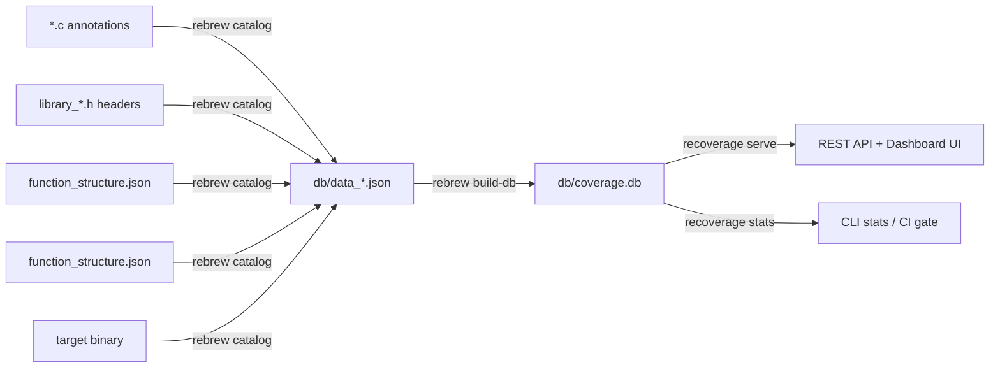

# Rebrew Database Formats

> **Scope:** table/column/JSON/API truth for `coverage.db` (and the reccmp
> in-memory DB).  For `verify`/`status` flag semantics and CLI contracts see
> [prd/05-verification-and-progress.md](prd/05-verification-and-progress.md).

The `rebrew` tooling ecosystem uses SQLite databases to power its reverse-engineering, matching, and coverage dashboard workflows. This document details the schema and purpose of the two primary database formats:

1. **`coverage.db`** — The persistent SQLite database generated by `rebrew build-db` driving the `recoverage` development server and UI dashboard.
2. **`reccmp` In-Memory Database** — The temporary comparison database used by `reccmp` to track matching entities between the original and recompiled binaries.

---

## Data Pipeline Overview


```mermaid
flowchart LR
    A["*.c annotations"] -->|rebrew catalog| B["db/data_*.json"]
    LH["library_*.h headers"] -->|rebrew catalog| B
    FL["function_structure.json"] -->|rebrew catalog| B
    GH["function_structure.json"] -->|rebrew catalog| B
    BIN["target binary"] -->|rebrew catalog| B
    B -->|rebrew build-db| C["db/coverage.db"]
    C -->|recoverage serve| D["REST API + Dashboard UI"]
    C -->|recoverage stats| E["CLI stats / CI gate"]
```

### Pipeline Steps

| Step | Tool | Input | Output |
|------|------|-------|--------|
| 1. Catalog | `rebrew catalog --data-json` | `*.c` annotations, `library_*.h` headers, `function_structure.json`, target binary | `db/data_<target>.json` |
| 1b. Export Labels | `rebrew catalog --export-ghidra-labels` | (same as above) | `ghidra_data_labels.json` (detected data labels/thunks for Ghidra round-trip) |
| 2. Build DB | `rebrew build-db [--regen] [--target T]` | `db/data_*.json` (skipped with `--regen`: coverage generated in-process per target) | `db/coverage.db` |
| 3. Serve | `recoverage serve` | `db/coverage.db` | HTTP dashboard at `localhost:8001` |
| 4. Regen | `POST /api/regen` or `recoverage serve --regen` | Runs steps 1+2 in sequence | Updated `coverage.db` |

---

## 1. `coverage.db` (Recoverage Dashboard DB)

### Overview
This database is generated by the `rebrew build-db` tool (defined in `src/rebrew/build_db.py`). It aggregates `data_*.json` files generated across different compilation targets into a single queried persistence layer for `recoverage/server.py`. The DB lives in the `db/` directory of the project workspace.

The table design supports multi-target binaries by including a `target` column in nearly all tables. WAL mode is enabled for better concurrency during regeneration.

### `functions` Table
Stores details regarding decompiled and original functions.

| Column | Type | Description |
|---|---|---|
| `target` | `TEXT` | The binary target (e.g., `server_dll`). Part of the primary key. |
| `va` | `INTEGER` | The Virtual Address of the function. Part of the primary key. |
| `name` | `TEXT` | The name of the function. Indexed. |
| `vaStart` | `TEXT` | Hex string representation of the starting virtual address. |
| `size` | `INTEGER` | Byte size of the function (canonical resolution; see `size_reason`). |
| `fileOffset` | `INTEGER` | Physical file offset of the function in the binary. |
| `status` | `TEXT` | Match status (e.g. `EXACT`, `RELOC`, `PROVEN`, `NEAR_MATCHING`, `STUB`, `SIZE_MISMATCH`, `COMPILE_ERROR`, …, or `UNKNOWN` when unset). CHECK-constrained to `KNOWN_STATUSES` ∪ `{UNKNOWN}`; insert path runs `canonical_status` and coerces unknowns to `UNKNOWN`. |
| `module` | `TEXT` | Origin module/library — config-driven (e.g., `GAME`, `ZLIB`, `MSVCRT`). |
| `cflags` | `TEXT` | Compilation flags (if any). |
| `symbol` | `TEXT` | The raw mangled or internal symbol name. |
| `markerType` | `TEXT` | Annotation marker type: `FUNCTION`, `LIBRARY`, `STUB`, `GLOBAL`, `DATA`. |
| `ghidra_name` | `TEXT` | Function name as defined in Ghidra. |
| `list_name` | `TEXT` | Function name from the function list. |
| `is_thunk` | `BOOLEAN` | True if the function is an IAT thunk (`jmp [IAT]` stub). |
| `is_export` | `BOOLEAN` | True if the function is exported from the binary. |
| `sha256` | `TEXT` | SHA-256 hash of the function's raw bytes from the original binary. |
| `files` | `TEXT` | JSON array of associated source file paths. |
| `detected_by` | `TEXT` | JSON array of sources that detected this function (e.g., `["ghidra", "list"]`). |
| `size_by_tool` | `TEXT` | JSON object mapping tool names to their reported sizes (e.g., `{"ghidra": 302, "list": 302}`). |
| `textOffset` | `INTEGER` | Offset of the function within its containing section. |
| `blocker` | `TEXT` | Blocker description (e.g. "needs vtable", "missing struct"). Empty string if none. |
| `blockerDelta` | `INTEGER` | Byte difference from target when blocker is set. NULL if no blocker. |
| `size_reason` | `TEXT` | Explanation of how canonical size was determined (e.g. "ghidra", "list", "annotation"). Empty string if unknown. |
| `similarity` | `REAL` | Structural similarity score (0.0–1.0). Populated from the catalog data-JSON `similarity` field (clamped to [0,1]); the `verify_results` table import writes per-run scores to its own `similarity` column, never back into `functions.similarity`. NULL when never scored. |
| `updated_by` | `TEXT` | Provenance tag of the last STATUS write (`test`/`verify`/`prove`/`match`/`lint`/`binsync-import`/`intake`). |
| `updated_at` | `TEXT` | UTC timestamp of the last STATUS write. |

**Primary Key**: `(target, va)`
**Indexes**:
- `idx_functions_name` on `(target, name)`
- `idx_functions_status` on `(target, status)`
- `idx_functions_module` on `(target, module)`
- `idx_functions_list` on `(target, va) WHERE markerType NOT IN ('GLOBAL', 'DATA')` — serves the dashboard / `_function_stats` list path (`WHERE target = ? AND markerType NOT IN (…) ORDER BY va`)

### `globals` Table
Tracks global variables mapped during the decompilation effort.

| Column | Type | Description |
|---|---|---|
| `target` | `TEXT` | The binary target. Part of the primary key. |
| `va` | `INTEGER` | The Virtual Address. Part of the primary key. |
| `name` | `TEXT` | Variable name. Indexed. |
| `decl` | `TEXT` | Variable C/C++ declaration syntax. |
| `files` | `TEXT` | JSON array of associated source files. |
| `module` | `TEXT` | Origin module (from `// GLOBAL: MODULE 0xVA` annotation). |
| `size` | `INTEGER` | Estimated size in bytes (default: 4 for pointer-sized). |
| `status` | `TEXT` | Data verdict from `verify --data` (`VERIFIED`/`DRIFT`/`UNCHECKED`; empty when never compared). CHECK-constrained. |

**Primary Key**: `(target, va)`
**Indexes**: `idx_globals_name` on `(target, name)`

### `sections` Table
Defines binary sections (e.g., `.text`, `.data`, `.rdata`, `.bss`).

| Column | Type | Description |
|---|---|---|
| `target` | `TEXT` | The binary target. Part of primary key. |
| `name` | `TEXT` | Section name (e.g. `.text`). Part of primary key. |
| `va` | `INTEGER` | Virtual Address where the section begins. |
| `size` | `INTEGER` | Total bytes in the section. |
| `fileOffset` | `INTEGER` | Physical file offset for the section. |
| `unitBytes` | `INTEGER` | Byte size per visual grid unit on the frontend (default `64`). |
| `columns` | `INTEGER` | Number of columns for visual representation (default `64`). |

### `cells` Table
Represents chunks (cells) of memory to be rendered in the UI coverage map.

| Column | Type | Description |
|---|---|---|
| `id` | `INTEGER` | Auto-increment primary key. |
| `target` | `TEXT` | The binary target. |
| `section_name` | `TEXT` | The section this cell belongs to. Indexed. |
| `start` | `INTEGER` | Start offset of the cell (relative to section start). |
| `end` | `INTEGER` | End offset of the cell (relative to section start). |
| `span` | `INTEGER` | Width of the cell in grid units. |
| `state` | `TEXT` | Match state (see table below). CHECK-constrained to the known cell-state set; insert path coerces unknowns to `unknown`. |
| `functions` | `TEXT` | JSON array of function names mapping to this cell. |
| `label` | `TEXT` | Optional display label (e.g., Ghidra data label name like `switchdataD_10002e9c`). |
| `parent_function` | `TEXT` | Optional name of the parent function (for data / thunk cells that immediately follow a function). |

**Indexes**:
- `UNIQUE (target, section_name, start)` serves the `(target, section_name)`
  prefix used by `section_cell_stats` and per-section queries — no separate
  `idx_cells_section` is created.

#### Cell States

| State | Description | Color in UI |
|-------|-------------|-------------|
| `none` | Uncovered / unmatched region | Gray |
| `exact` | Byte-identical match | Green |
| `reloc` | Match after relocation normalization | Cyan |
| `near_matching` / `near_match` | Functionally matching (not byte-identical) | Yellow |
| `proven` | PROVEN status (post-verify semantic promotion) | Bold cyan |
| `size_mismatch` | SIZE_MISMATCH status | Yellow |
| `compile_error`, `missing_file`, `missing_size`, `skip`, `unknown` | Error/other states (counted in `other_count`) | Red/Dim |
| `stub` | Stub implementation (placeholder) | Red |
| `padding` | NOP/INT3 alignment padding | Silver |
| `data` | Non-code data in .text (residual switch tables, etc.) | Purple |
| `thunk` | IAT thunk stub (not reversible) | Orange |

### `metadata` Table
Stores arbitrary target-specific key-value pairs. Primary Key is `(target, key)`. Values are serialized JSON.

**Indexes**: `idx_metadata_key` on `(key, target)` — serves key-first lookups
(`WHERE key = 'function_stats'` / legacy `db_version`) that cannot use the
leftmost-`target` primary key.

| Key | Description |
|-----|-------------|
| `summary` | JSON object with coverage statistics (totalFunctions, matchedFunctions, exactMatches, etc.) |
| `function_stats` | JSON object with coverage stats for the dashboard headline (`total`, `covered_bytes`, `matched_bytes`, `total_bytes`, `by_status`, `by_module_counts`) |
| `paths` | JSON object with file paths (originalDll, sourceRoot) |
| `db_version` | Schema version string (current: `"10"`) |

#### Schema Version History

`rebrew build-db` refuses to write into a database whose stored `db_version`
differs from the version it was built for; pass `--force` to delete and recreate
it. Bump `_CURRENT_DB_VERSION` in `src/rebrew/build_db.py` and add a row here
whenever the schema changes.

| Version | Change |
|---|---|
| `"10"` | `cells.state` known set is derived from `KNOWN_STATUSES` (lowercased) ∪ gap/data states, so `extract_error` / `invalid_va` (and any future annotation STATUS) stay CHECK-valid instead of coercing to `unknown`. Migration is `--force` (DROP+rebuild). |
| `"9"` | `cells.state` CHECK-constrained to the known cell-state set; insert path coerces unknowns to `unknown`. `idx_metadata_key` on `metadata(key, target)` for key-first lookups (targets list, legacy `db_version`). Migration is `--force` (DROP+rebuild), same as prior schema bumps. |
| `"8"` | `functions.status` CHECK-constrained to `KNOWN_STATUSES` ∪ `{UNKNOWN}`; insert path canonicalizes (case / `NEAR_MATCH` alias) and coerces unknowns to `UNKNOWN`. Migration is `--force` (DROP+rebuild), same as prior schema bumps. |
| `"7"` | `section_cell_stats` is a **table** rather than a view; new `section_cells_json` table (per-section cell JSON, zstd-compressed) so dashboards stop re-aggregating `cells` on every request. Migration is `--force` (DROP+rebuild), the existing convention: `history` and `verify_results` are not dropped by a rebuild, but `--force` unlinks the file, so `verify_results` is re-imported from `db/verify_results.json` / `.rebrew/verify_cache.json` and `history` is not recoverable. |
| `"6"` | `functions` gained `updated_by`/`updated_at` (STATUS-write provenance); `globals` gained `status` (data verdicts); `history` gained `updated_by`. |
| `"5"` | `verify_results` gained `reg_delta` and `effective_match` (the effective-match signal — register-only delta; see the table below). |
| `"4"` | Cell rows normalized and range-checked on insert (`start >= 0`, `end >= start`, `span > 0`); `cells` gained a `FOREIGN KEY (target, section_name)` to `sections` with `ON DELETE CASCADE`; `section_cell_stats` gained `other_count`; `verify_results` no longer dropped on full rebuild. |
| `"3"` | Baseline documented schema. |

### `verify_results` Table
Stores per-function verification results. Populated by `rebrew build-db`, which
imports `.rebrew/verify_cache.json` — it is not written directly by
`rebrew verify` (which writes no default report file; `-o` is explicit export
only, and `db/verify_results.json` is gone).

| Column | Type | Description |
|---|---|---|
| `target` | `TEXT` | Binary target. Part of primary key. |
| `va` | `INTEGER` | Function VA. Part of primary key. CHECK `va >= 0`. |
| `verified_at` | `TEXT` | ISO 8601 timestamp of verification. CHECK non-empty. |
| `byte_delta` | `INTEGER` | Number of differing bytes. CHECK `>= 0` when not NULL. |
| `diff_lines` | `INTEGER` | Number of **structural** differing disassembly lines (the register-aware diff's `structural` class; register-encoding-only diffs are *not* counted here — see `reg_delta`). Computed only for unmatched functions with compiled bytes; `NULL` when no diff was computed (matched or cached rows, no object bytes, or a diff failure). CHECK `>= 0` when not NULL. |
| `similarity` | `REAL` | Structural code-similarity score (0.0–1.0), when computable. CHECK in `[0.0, 1.0]` when not NULL. Imported from the verify cache's 0–100 ``Sim %`` (``code_similarity``) by always dividing by 100 (a ``[0, 1]`` pass-through used to treat ``1.0`` Sim% as a perfect match). |
| `reg_delta` | `INTEGER` | Number of register-encoding-only differing instructions (`RR` class). `0` when the register-aware classification was skipped (non-x86-32 targets); `NULL` when no diff was computed. CHECK `>= 0` when not NULL. |
| `effective_match` | `INTEGER` | `1` when the function is an effective match — the entire byte delta is register allocation (reccmp's 100% effective-match class; same instructions, different registers, not byte-identical). Only computable on x86-32 (register masking is x86-32 specific). CHECK `IN (0, 1)` when not NULL. |

**Primary Key**: `(target, va)`

> [!NOTE]
> This table is persistent — never dropped on rebuild (the per-target
> `INSERT OR REPLACE` + prune in `build_db` keeps it current; a full rebuild
> preserves every target's rows).  A rebuild that finds a pre-CHECK DDL
> recreates the table in place (clamping outliers) so range guards apply
> without `--force`.

### `history` Table
Tracks function status changes over time.

| Column | Type | Description |
|---|---|---|
| `id` | `INTEGER` | Auto-increment primary key. |
| `target` | `TEXT` | Binary target. |
| `va` | `INTEGER` | Function virtual address. CHECK `va >= 0`. |
| `old_status` | `TEXT` | Previous status before change. CHECK NULL or `KNOWN_STATUSES` ∪ `{UNKNOWN}`. |
| `new_status` | `TEXT` | New status after change. CHECK NULL or `KNOWN_STATUSES` ∪ `{UNKNOWN}`. |
| `changed_at` | `TEXT` | ISO 8601 timestamp of the change. CHECK non-empty. |
| `updated_by` | `TEXT` | Provenance tag of the write that caused the change. |

> [!NOTE]
> This table is persistent — never dropped on rebuild, but retention-capped:
> only the newest 10,000 rows per target survive each rebuild
> (`_HISTORY_RETENTION` in `build_db`), so long-lived projects that
> regenerate often do not accumulate rows forever.  A rebuild
> that finds a pre-CHECK DDL recreates the table in place (preserving `id`,
> clamping negative VAs and unknown statuses) so the guards apply without
> `--force`.

### `section_cell_stats` Table
Aggregated matching metrics per section: total/exact/stub cell counts, so a
dashboard never re-scans `cells` to render a progress bar.

This was a **view** through DB version 6, and is a table from v7. As a view
every reader re-aggregated the whole `cells` table — 13 `SUM(CASE state = …)`
over 64k rows measured 17.3 ms per request, 92% of a dashboard's cold
`/data` build. Materializing it at build time makes the same query ~0.02 ms.
No reader changed: every consumer (both dashboards) queries it as
`SELECT … FROM section_cell_stats WHERE target = ?`, which is indifferent to
table-vs-view, so a v6 database still carrying the old view stays *readable* —
though `build-db` requires `--force` to move it to v7 (see the version history
above).

**Primary Key**: `(target, section_name)` — the table is recreated with an
explicit schema on every build (not `CREATE TABLE AS SELECT`), so the serving
`WHERE target = ?` path is keyed and duplicate section rows cannot accumulate.

| Column | Description |
|--------|-------------|
| `target` | Target name |
| `section_name` | Section name |
| `total_cells` | Total number of cells |
| `exact_count` | Cells with `state = 'exact'` |
| `reloc_count` | Cells with `state = 'reloc'` |
| `near_match_count` | Cells with `state IN ('near_match', 'near_matching')` |
| `stub_count` | Cells with `state = 'stub'` |
| `padding_count` | Cells with `state = 'padding'` |
| `data_count` | Cells with `state = 'data'` |
| `thunk_count` | Cells with `state = 'thunk'` |
| `none_count` | Cells with `state = 'none'` |
| `proven_count` | Cells with `state = 'proven'` |
| `size_mismatch_count` | Cells with `state = 'size_mismatch'` |
| `other_count` | Cells in any other state (compile_error, missing_*, skip, unknown) — so `total_cells` always equals the sum of the counted columns |

> [!NOTE]
> Derived from `cells` and rebuilt whole on every build — do not write to it.

### `section_cells_json` Table
One row per target+section holding that section's cells already aggregated to
JSON (`json_group_array(… ORDER BY start)` via `SECTION_CELLS_AGG_SQL`) and
zstd-compressed. The `ORDER BY start` is load-bearing: the coverage grid needs
spatial order, and without it SQLite may emit cells in rowid/insertion order.

Serving a grid otherwise re-runs `json_group_array` over every cell on each
cold request: measured 10.7 ms of SQLite per 39k-cell section versus 0.3 ms to
read this row, for ~176 KB stored across a whole database. The cell projection
is `CELLS_JSON_OBJECT_SQL` in `rebrew.workspace`; the ordered aggregate is
`SECTION_CELLS_AGG_SQL` — both shared by this writer and the live fallback so
the two cannot drift into serving different cell shapes or cell orders.

| Column | Type | Description |
|---|---|---|
| `target` | `TEXT` | Binary target. |
| `section_name` | `TEXT` | Section name. |
| `cells_zstd` | `BLOB` | `zstd` frame holding the JSON array of that section's cells. |

**Primary Key**: `(target, section_name)`
**Foreign Key**: `(target, section_name)` → `sections(target, name)` `ON DELETE CASCADE`
(same referential rule as `cells`, so a scoped `--target` section delete cannot
leave a stale compressed blob behind).

The **column name is the codec**, and the codec itself is shared:
`rebrew.workspace.encode_section_cells`/`decode_section_cells` are the single
definition used by `build_db` (producer) and by recoverage (reader), so the two
cannot drift.  Those helpers defer their `zstandard` import to the call, so
consumers that only resolve a workspace path need no compression dependency.

A reader probes for the `cells_zstd` column rather than consulting `db_version`,
so a database whose cache table carries a different codec's column falls through
to the live `cells` query instead of decoding a frame it cannot read.  Renaming
that column is therefore part of changing the codec. Compression is zstd level 3: on 8.4 MB of cell JSON,
level 3 gives 176 KB in 3 ms, levels 9 and 15 give *more* bytes (205 KB /
210 KB), and level 19 reaches 141 KB only by spending 3.3 s.

> [!NOTE]
> Derived from `cells`, whose only writer is `build_db`, so it cannot go stale
> between builds — it is rebuilt whole on every build, including a scoped
> `--target` one. Since v7 it is also part of the versioned schema (listed in
> `_missing_required_objects`), which is what makes the stamp meaningful; the
> live-query fallback is what keeps a *pre-v7* database readable rather than
> merely rejected.

---

## 2. `data_*.json` Intermediate Format

Each `data_<target>.json` file is the output of `rebrew catalog --data-json`. It contains:

```json
{
  "sections": {
    ".text": { "va": ..., "size": ..., "fileOffset": ..., "cells": [...], "unitBytes": 64, "columns": 64 },
    ".data": { ... },
    ".rdata": { ... },
    ".bss": { ... }
  },
  "globals": {
    "0x10030000": { "va": ..., "name": "g_var", "decl": "int g_var;", "files": ["file.c"] }
  },
  "summary": {
    "totalFunctions": 471, "matchedFunctions": 100,
    "exactMatches": 60, "relocMatches": 10, "nearMatchCount": 20, "stubCount": 10,
    "coveredBytes": 50000, "coveragePercent": 33.5, "textSize": 150000
  },
  "functions": {
    "0x10001000": {
      "name": "func_name", "vaStart": "0x10001000", "size": 302,
      "status": "EXACT", "module": "GAME", "cflags": "/O2",
      "symbol": "_func_name", "markerType": "FUNCTION",
      "fileOffset": 4096, "textOffset": 0, "sha256": "abcd...",
      "files": ["func_name.c"],
      "detected_by": ["ghidra", "list"],
      "size_by_tool": {"ghidra": 302, "list": 302},
      "ghidra_name": "FUN_10001000", "list_name": "fcn.10001000",
      "is_thunk": false, "is_export": false,
      "blocker": "", "blockerDelta": null, "size_reason": "ghidra"
    }
  },
  "paths": { "originalDll": "/original/Server/server.dll", "sourceRoot": "/src/server.dll" }
}
```

> [!NOTE] Coverage definitions
> Two coverage figures exist and measure different things:
> - `summary.coveragePercent` (catalog/grid) = **cell-based** coverage:
>   `(func_cell_bytes + padding + data + thunk) / textSize` — every accounted
>   byte, including padding and data.  A binary whose functions are all STUB
>   placeholders still reports high coverage here.
> - `metadata.function_stats` (dashboard headline) — the dashboard computes
>   `coverage_pct` from **matched bytes** `(EXACT + RELOC + PROVEN sizes) /
>   textSize` — the genuine progress metric — and `identified_pct` from
>   `covered_bytes` (every function incl. stubs), so "fully documented"
>   stays visible separately (the dashboard previously summed
>   every function's size, so an all-STUB binary showed ~100% "coverage").

> [!NOTE]
> All PE sections are now included dynamically in the catalog and database (not just the standard `.text`, `.rdata`, `.data`, and `.bss`).

> [!NOTE]
> Functions in the JSON are keyed by **hex VA** (e.g. `"0x10001000"`), and in the DB they are keyed by `(target, va)`. The `build_db.py` tool extracts the VA from the JSON key during import.

---

## 3. Recoverage REST API

The `recoverage` server exposes the following endpoints. All data endpoints return compressed JSON.

| Method | Endpoint | Description |
|--------|----------|-------------|
| `GET` | `/` | Dashboard HTML (single-page app with inlined CSS/JS) |
| `GET` | `/api/health` | Server health check (DB status, installed extras, version) |
| `GET` | `/api/targets` | List all targets in the database |
| `GET` | `/api/targets/<target>/stats` | Coverage statistics per section + function status counts |
| `GET` | `/api/targets/<target>/data` | Full section/cell data with search index (supports `?section=` filter, ETag caching) |
| `GET` | `/api/targets/<target>/functions` | Paginated function list (`?status=`, `?search=`, `?sort=field:dir`, `?limit=`, `?offset=`) |
| `GET` | `/api/targets/<target>/functions/<va>` | Single function or global detail (by VA integer or name string) |
| `GET` | `/api/targets/<target>/asm` | Disassembly for a VA range (`?va=`, `?size=`, `?section=`, `?format=text|json`) |
| `GET` | `/api/targets/<target>/sections/<section>/bytes` | Raw hex dump from original binary (`?offset=`, `?size=`) |
| `POST` | `/api/regen` | Regenerate catalog + DB (localhost only) |
| `GET` | `/src/<path>` | Serve source files from project dir |
| `GET` | `/original/<path>` | Serve original binary files from project dir |
| `GET` | `/potato` | Easter egg 🥔 |

> [!NOTE]
> `rebrew dashboard` is a separate, read-only stdlib server over the same
> `coverage.db`. Its routes are query-param scoped (`/api/summary?target=`,
> `/api/functions?target=` with `status`/`module`/`q`/`limit`/`offset`,
> `/api/sections?target=`, `/api/globals?target=` with `q`/`limit`/`offset`,
> `/api/history?target=` with `limit`/`offset`, plus `/api/bootstrap`,
> `/app.js`, and `/api/targets`). Function, global, and history list rows are
> compact arrays under `cols`. Missing `target` → 400; unknown target → 404;
> corrupt `function_stats` on `/api/summary` → 500. It does **not** implement
> the path-style recoverage endpoints above, `/api/regen`, or `/api/health`.
> See [`dashboard.py`](../src/rebrew/dashboard.py).
