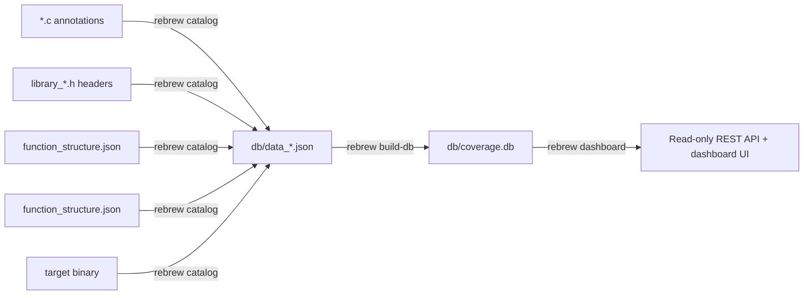

# Rebrew Database Formats

> **Scope:** table/column/JSON/API truth for `coverage.db` (and the reccmp
> in-memory DB).  For `verify`/`status` flag semantics and CLI contracts see
> [prd/05-verification-and-progress.md](prd/05-verification-and-progress.md).

The `rebrew` tooling ecosystem uses SQLite databases to power its reverse-engineering, matching, and coverage dashboard workflows. This document details the schema and purpose of the two primary database formats:

1. **`coverage.db`** — The persistent SQLite database generated by `rebrew build-db`, served read-only over HTTP by `rebrew dashboard`.
2. **`reccmp` In-Memory Database** — The temporary comparison database used by `reccmp` to track matching entities between the original and recompiled binaries.

---

## Data Pipeline Overview


```mermaid
flowchart LR
    A["*.c annotations"] -->|rebrew catalog| B["db/data_*.json"]
    LH["library_*.h headers"] -->|rebrew catalog| B
    FL["function_structure.json"] -->|rebrew catalog| B
    GH["function_structure.json"] -->|rebrew catalog| B
    BIN["target binary"] -->|rebrew catalog| B
    B -->|rebrew build-db| C["db/coverage.db"]
    C -->|rebrew dashboard| D["Read-only REST API + dashboard UI"]
```

### Pipeline Steps

| Step | Tool | Input | Output |
|------|------|-------|--------|
| 1. Catalog | `rebrew catalog --data-json` | `*.c` annotations, `library_*.h` headers, `function_structure.json`, target binary | `db/data_<target>.json` |
| 1b. Export Labels | `rebrew catalog --export-ghidra-labels` | (same as above) | `ghidra_data_labels.json` (detected data labels/thunks for Ghidra round-trip) |
| 2. Build DB | `rebrew build-db [--regen] [--target T]` | `db/data_*.json` (skipped with `--regen`: coverage generated in-process per target) | `db/coverage.db` |
| 3. Serve | `rebrew dashboard` | `db/coverage.db` | Read-only HTTP API and UI at `localhost:8000` |

`coverage.db` has one reader process, `rebrew dashboard`. There is no
regeneration endpoint: re-run `rebrew build-db --regen` to refresh the file,
and the running dashboard picks the new content up through its database
validators on the next request.

---

## 1. `coverage.db` (Dashboard DB)

### Overview
This database is generated by the `rebrew build-db` tool (defined in `src/rebrew/build_db.py`). It aggregates `data_*.json` files generated across different compilation targets into a single queried persistence layer for `src/rebrew/dashboard.py`. The DB lives in the `db/` directory of the project workspace.

The table design supports multi-target binaries by including a `target` column in nearly all tables. WAL mode is enabled for better concurrency during regeneration.

### `functions` Table
Stores details regarding decompiled and original functions.

| Column | Type | Description |
|---|---|---|
| `target` | `TEXT` | The binary target (e.g., `server_dll`). Part of the primary key. |
| `va` | `INTEGER` | The Virtual Address of the function. Part of the primary key. |
| `name` | `TEXT` | The name of the function. |
| `vaStart` | `TEXT` | Hex string representation of the starting virtual address. |
| `size` | `INTEGER` | Byte size of the function (canonical resolution; see `size_reason`). |
| `fileOffset` | `INTEGER` | Physical file offset of the function in the binary. |
| `status` | `TEXT` | Match status (e.g. `EXACT`, `RELOC`, `PROVEN`, `NEAR_MATCHING`, `STUB`, `SIZE_MISMATCH`, `COMPILE_ERROR`, …, or `UNKNOWN` when unset). CHECK-constrained to `KNOWN_STATUSES` ∪ `{UNKNOWN}`; insert path runs `canonical_status` and coerces unknowns to `UNKNOWN`. |
| `module` | `TEXT` | Origin module/library — config-driven (e.g., `GAME`, `ZLIB`, `MSVCRT`). |
| `cflags` | `TEXT` | Compilation flags (if any). |
| `symbol` | `TEXT` | The raw mangled or internal symbol name. |
| `markerType` | `TEXT` | Annotation marker type: `FUNCTION`, `LIBRARY`, `STUB` (code rows), `GLOBAL`, `DATA`, `VTABLE`, `STRING` (data rows). |
| `ghidra_name` | `TEXT` | Function name as defined in Ghidra. |
| `list_name` | `TEXT` | Function name from the function list. |
| `is_thunk` | `BOOLEAN` | True if the function is an IAT thunk (`jmp [IAT]` stub). |
| `is_export` | `BOOLEAN` | True if the function is exported from the binary. |
| `sha256` | `TEXT` | SHA-256 hash of the function's raw bytes from the original binary. |
| `files` | `TEXT` | JSON array of associated source file paths. |
| `detected_by` | `TEXT` | JSON array of sources that detected this function (e.g., `["ghidra", "list"]`). |
| `size_by_tool` | `TEXT` | JSON object mapping tool names to their reported sizes (e.g., `{"ghidra": 302, "list": 302}`). |
| `textOffset` | `INTEGER` | Offset of the function within its containing section. |
| `blocker` | `TEXT` | Blocker description (e.g. "needs vtable", "missing struct"). Empty string if none. |
| `blockerDelta` | `INTEGER` | Byte difference from target when blocker is set. NULL if no blocker. |
| `size_reason` | `TEXT` | Explanation of how canonical size was determined (e.g. "ghidra", "list", "annotation"). Empty string if unknown. |
| `similarity` | `REAL` | Structural similarity score (0.0–1.0). Populated from the catalog data-JSON `similarity` field (clamped to [0,1]); the `verify_results` table import writes per-run scores to its own `similarity` column, never back into `functions.similarity`. NULL when never scored. |
| `updated_by` | `TEXT` | Provenance tag of the last STATUS write (`test`/`verify`/`prove`/`match`/`lint`/`binsync-import`/`intake`). |
| `updated_at` | `TEXT` | UTC timestamp of the last STATUS write. |

**Primary Key**: `(target, va)`
**Indexes**:
- `idx_functions_status_va` on `(target, status, va)`: serves the dashboard's status-filtered page (`ORDER BY va`) without a sort
- `idx_functions_module_va` on `(target, module, va)`: same for the module filter
- `idx_functions_list` on `(target, va) WHERE markerType IN ('FUNCTION', 'LIBRARY', 'STUB')` — serves the dashboard / `_function_stats` list path (`WHERE target = ? AND markerType IN (…) ORDER BY va`); dropped and recreated on every build

### `globals` Table
Tracks global variables mapped during the decompilation effort.

| Column | Type | Description |
|---|---|---|
| `target` | `TEXT` | The binary target. Part of the primary key. |
| `va` | `INTEGER` | The Virtual Address. Part of the primary key. |
| `name` | `TEXT` | Variable name. |
| `decl` | `TEXT` | Variable C/C++ declaration syntax. |
| `files` | `TEXT` | JSON array of associated source files. |
| `module` | `TEXT` | Origin module (from `// GLOBAL: MODULE 0xVA` annotation). |
| `size` | `INTEGER` | Estimated size in bytes (default: 4 for pointer-sized). |
| `status` | `TEXT` | Data verdict from `verify --data` (`VERIFIED`/`DRIFT`/`UNCHECKED`; empty when never compared). CHECK-constrained. |

**Primary Key**: `(target, va)`
**Indexes**:
- `idx_globals_module_va` on `(target, module, va)`: serves the dashboard's module-filtered globals page (`ORDER BY va`) without a sort

Neither table carries a `(target, name)` index: the only name predicate the dashboard builds is a leading-wildcard search (`name LIKE '%q%'`), which a b-tree cannot serve, so such an index was written on every rebuild and never read.

### `sections` Table
Defines binary sections (e.g., `.text`, `.data`, `.rdata`, `.bss`).

| Column | Type | Description |
|---|---|---|
| `target` | `TEXT` | The binary target. Part of primary key. |
| `name` | `TEXT` | Section name (e.g. `.text`). Part of primary key. |
| `va` | `INTEGER` | Virtual Address where the section begins. |
| `size` | `INTEGER` | Total bytes in the section. |
| `fileOffset` | `INTEGER` | Physical file offset for the section. |
| `unitBytes` | `INTEGER` | Byte size per visual grid unit on the frontend (default `64`). |
| `columns` | `INTEGER` | Number of columns for visual representation (default `64`). |

### `cells` Table
Represents chunks (cells) of memory to be rendered in the UI coverage map.

Stored `WITHOUT ROWID`: the primary key is the table's own b-tree, so there is
no surrogate `id` column and no separate index to maintain on every cell insert.

| Column | Type | Description |
|---|---|---|
| `target` | `TEXT` | The binary target. Leftmost column of the `(target, section_name, start)` primary key. |
| `section_name` | `TEXT` | The section this cell belongs to. |
| `start` | `INTEGER` | Start offset of the cell (relative to section start). Completes the primary key. |
| `end` | `INTEGER` | End offset of the cell (relative to section start). |
| `span` | `INTEGER` | Width of the cell in grid units. |
| `state` | `TEXT` | Match state (see table below). CHECK-constrained to the known cell-state set; insert path coerces unknowns to `unknown`. |
| `functions` | `TEXT` | JSON array of function names mapping to this cell. |
| `label` | `TEXT` | Optional display label (e.g., Ghidra data label name like `switchdataD_10002e9c`). |
| `parent_function` | `TEXT` | Optional name of the parent function (for data / thunk cells that immediately follow a function). |

**Indexes**:
- `PRIMARY KEY (target, section_name, start)` on a `WITHOUT ROWID` table, so
  the clustered storage *is* the index: it serves the `(target, section_name)`
  prefix used by `section_cell_stats` and per-section queries, and holds rows
  in the order the cell JSON is emitted. No separate `idx_cells_section` is
  created.

#### Cell States

The CHECK vocabulary is derived, not hand-listed: `KNOWN_STATUSES` lowercased,
unioned with the gap/label states and the data-metadata verdicts
(`_KNOWN_CELL_STATES` in `build_db.py`). Adding an annotation `STATUS` therefore
widens the CHECK without a schema bump. The table below is the full set;
`tests/test_build_db.py::TestCellStateVocabulary` fails if it and the CHECK drift
apart.

| State | Description | Bucket in `section_cell_stats` | Color in UI |
|-------|-------------|------------------------------|-------------|
| `none` | Uncovered / unmatched region | `none_count` | Gray |
| `exact` | Byte-identical match | `exact_count` | Green |
| `verified` | Data verdict `VERIFIED` (`rebrew verify --data`) | `exact_count` | Green |
| `reloc` | Match after relocation normalization | `reloc_count` | Cyan |
| `near_matching` / `near_match` | Functionally matching (not byte-identical) | `near_match_count` | Yellow |
| `proven` | PROVEN status (semantic equivalence, bytes differ) | `proven_count` | Bold cyan |
| `size_mismatch` | SIZE_MISMATCH status | `size_mismatch_count` | Yellow |
| `stub` | Stub implementation (placeholder) | `stub_count` | Red |
| `padding` | NOP/INT3 alignment padding | `padding_count` | Silver |
| `data` | Non-code data in .text (residual switch tables, etc.) | `data_count` | Purple |
| `thunk` | IAT thunk stub (not reversible) | `thunk_count` | Orange |
| `skip` | Parked by annotation | `other_count` | Red/Dim |
| `unknown` | Unset or unrecognized (the insert-path coercion target) | `other_count` | Red/Dim |
| `compile_error` | The compile step failed | `other_count` | Red/Dim |
| `extract_error` | No bytes could be extracted for the VA | `other_count` | Red/Dim |
| `missing_size` | Target size unknown | `other_count` | Red/Dim |
| `missing_file` | Source file missing | `other_count` | Red/Dim |
| `invalid_va` | VA below the arch-aware floor | `other_count` | Red/Dim |
| `drift` | Data verdict `DRIFT`: the recompiled bytes no longer match | `other_count` | Red/Dim |
| `unchecked` | Data verdict `UNCHECKED` | `other_count` | Red/Dim |

`other_count` is a catch-all, not a fixed list: its `NOT IN (...)` term
(`_SECTION_CELL_STATS_SELECT`) enumerates the named buckets above, so any state
added later lands there and `total_cells` keeps equalling the sum of the
counted columns.

### `metadata` Table
Stores arbitrary target-specific key-value pairs. Primary Key is `(target, key)`. Values are serialized JSON.

**Indexes**: `idx_metadata_key` on `(key, target)` — serves key-first lookups
(`WHERE key = 'function_stats'` / legacy `db_version`) that cannot use the
leftmost-`target` primary key.

| Key | Description |
|-----|-------------|
| `summary` | JSON object with coverage statistics (totalFunctions, matchedFunctions, exactMatches, etc.) |
| `function_stats` | JSON object with coverage stats for the dashboard headline (`total`, `covered_bytes`, `matched_bytes`, `total_bytes`, `by_status`, `by_module_counts`). `by_module_counts` keys are the stored `functions.module` strings, `""` when the function has none. Byte counts are non-negative integers; a boolean, float, or negative is unreadable and `/api/summary` returns 500. |
| `paths` | JSON object with file paths (originalDll, sourceRoot) |
| `db_version` | Schema version string (current: `"11"`) |

`target = "__schema__"` (`rebrew.workspace.SCHEMA_TARGET`) is reserved for
database-level rows and is not a binary name. `build-db` rejects a
`data___schema__.json` snapshot before opening the write transaction, so the
reserved namespace cannot be reached through the filename-derived target name.

#### Schema Version History

`rebrew build-db` refuses to write into a database whose stored `db_version`
differs from the version it was built for; pass `--force` to delete and recreate
it. Bump `_CURRENT_DB_VERSION` in `src/rebrew/build_db.py` and add a row here
whenever the schema changes.

The version stamp alone is not treated as proof of shape: after reading the
stamp, `build-db` also verifies the required tables, the query-critical
columns, and the indexes the shipped queries depend on
(`idx_metadata_key`, `idx_functions_status_va`, `idx_functions_module_va`,
`idx_functions_list`, `idx_globals_module_va`, `idx_history_target_id`). Any
gap is reported as a version mismatch, so it takes the same `--force` path.

| Version | Change |
|---|---|
| `"11"` | `cells` is `WITHOUT ROWID` with `PRIMARY KEY (target, section_name, start)`; the unused auto-increment `id` and the `UNIQUE` index it required are gone, so a cell insert maintains one b-tree instead of two. Migration is `--force` (DROP+rebuild); the table is re-derived from `db/data_*.json` on every build, so nothing else is lost. |
| `"10"` | `cells.state` known set is derived from `KNOWN_STATUSES` (lowercased) ∪ gap/data states, so `extract_error` / `invalid_va` (and any future annotation STATUS) stay CHECK-valid instead of coercing to `unknown`. Migration is `--force` (DROP+rebuild). |
| `"9"` | `cells.state` CHECK-constrained to the known cell-state set; insert path coerces unknowns to `unknown`. `idx_metadata_key` on `metadata(key, target)` for key-first lookups (targets list, legacy `db_version`). Migration is `--force` (DROP+rebuild), same as prior schema bumps. |
| `"8"` | `functions.status` CHECK-constrained to `KNOWN_STATUSES` ∪ `{UNKNOWN}`; insert path canonicalizes (case / `NEAR_MATCH` alias) and coerces unknowns to `UNKNOWN`. Migration is `--force` (DROP+rebuild), same as prior schema bumps. |
| `"7"` | `section_cell_stats` is a **table** rather than a view; new `section_cells_json` table (per-section cell JSON, zstd-compressed) so dashboards stop re-aggregating `cells` on every request. Migration is `--force` (DROP+rebuild), the existing convention: `history` and `verify_results` are not dropped by a rebuild, and `--force` unlinks the file, so both are read out before the delete and restored by the rebuild (all columns, for `verify_results`); `verify_results` is also re-imported from `.rebrew/verify_cache.json`. |
| `"6"` | `functions` gained `updated_by`/`updated_at` (STATUS-write provenance); `globals` gained `status` (data verdicts); `history` gained `updated_by`. |
| `"5"` | `verify_results` gained `reg_delta` and `effective_match` (the effective-match signal — register-only delta; see the table below). |
| `"4"` | Cell rows normalized and range-checked on insert (`start >= 0`, `end >= start`, `span > 0`); `cells` gained a `FOREIGN KEY (target, section_name)` to `sections` with `ON DELETE CASCADE`; `section_cell_stats` gained `other_count`; `verify_results` no longer dropped on full rebuild. |
| `"3"` | Baseline documented schema. |

### `verify_results` Table
Stores per-function verification results. Populated by `rebrew build-db`, which
imports `.rebrew/verify_cache.json` — it is not written directly by
`rebrew verify` (which writes no default report file; `-o` is explicit export
only, and `db/verify_results.json` is gone).

| Column | Type | Description |
|---|---|---|
| `target` | `TEXT` | Binary target. Part of primary key. |
| `va` | `INTEGER` | Function VA. Part of primary key. CHECK `va >= 0`. |
| `verified_at` | `TEXT` | ISO 8601 timestamp of verification. CHECK non-empty. |
| `byte_delta` | `INTEGER` | Number of differing bytes. CHECK `>= 0` when not NULL. |
| `diff_lines` | `INTEGER` | Number of **structural** differing disassembly lines (the register-aware diff's `structural` class; register-encoding-only diffs are *not* counted here — see `reg_delta`). Computed only for unmatched functions with compiled bytes; `NULL` when no diff was computed (matched or cached rows, no object bytes, or a diff failure). CHECK `>= 0` when not NULL. |
| `similarity` | `REAL` | Structural code-similarity score (0.0–1.0), when computable. CHECK in `[0.0, 1.0]` when not NULL. Imported from the verify cache's 0–100 ``Sim %`` (``code_similarity``) by always dividing by 100 (a ``[0, 1]`` pass-through used to treat ``1.0`` Sim% as a perfect match). |
| `reg_delta` | `INTEGER` | Number of register-encoding-only differing instructions (`RR` class). `0` when the register-aware classification was skipped (non-x86-32 targets); `NULL` when no diff was computed. CHECK `>= 0` when not NULL. |
| `effective_match` | `INTEGER` | `1` when the function is an effective match — the entire byte delta is register allocation (reccmp's 100% effective-match class; same instructions, different registers, not byte-identical). Only computable on x86-32 (register masking is x86-32 specific). CHECK `IN (0, 1)` when not NULL. |

**Primary Key**: `(target, va)`

> [!NOTE]
> This table is persistent — never dropped on rebuild (the per-target
> `INSERT OR REPLACE` + prune in `build_db` keeps it current; a full rebuild
> preserves every target's rows).  A rebuild that finds a pre-CHECK DDL
> recreates the table in place so range guards apply without `--force`.
> Negative deltas clamp to 0, non-finite deltas become NULL, and a NULL
> `va` is dropped. Clamped `(target, va)` keys that collide keep the
> latest row.  `--force` unlinks the file rather than dropping the table, so
> every column of every row is read out beforehand and re-inserted inside the
> rebuild's transaction.

### `history` Table
Tracks function status changes over time.

| Column | Type | Description |
|---|---|---|
| `id` | `INTEGER` | Auto-increment primary key. |
| `target` | `TEXT` | Binary target. |
| `va` | `INTEGER` | Function virtual address. CHECK `va >= 0`. |
| `old_status` | `TEXT` | Previous status before change. CHECK NULL or `KNOWN_STATUSES` ∪ `{UNKNOWN}`. |
| `new_status` | `TEXT` | New status after change. CHECK NULL or `KNOWN_STATUSES` ∪ `{UNKNOWN}`. |
| `changed_at` | `TEXT` | ISO 8601 timestamp of the change. CHECK non-empty. |
| `updated_by` | `TEXT` | Provenance tag of the write that caused the change. |

**Unique**: `(target, va, old_status, new_status, changed_at, updated_by)` —
one status change is one row, enforced by the table rather than by the
`--force` restore's dedupe alone.  These are the six columns that dedupe
probes, and the constraint's own b-tree is what serves the probe, so there is
no separate index over them.

**Indexes**:
- `idx_history_target_id` on `(target, id)`: serves the dashboard page
  (`WHERE target = ? ORDER BY id DESC`) and the per-target retention delete
  without a sort.  Created on every build.

> [!NOTE]
> This table is persistent — never dropped on rebuild, but retention-capped:
> only the newest 10,000 rows of each rebuilt target survive
> (`_HISTORY_RETENTION` in `build_db`), so long-lived projects that
> regenerate often do not accumulate rows forever.  A rebuild
> that finds a pre-CHECK or pre-UNIQUE DDL recreates the table in place
> (preserving `id`, clamping negative VAs and unknown statuses) so the guards
> apply without `--force`; repeats are collapsed to the newest `id` of each
> transition, and the dedupe partitions on the *clamped* values because the
> clamp can fuse two stored rows into one transition.  `--force` unlinks the
> file rather than dropping the table, so every row is read out beforehand and
> re-inserted inside the rebuild's transaction, skipping a transition already
> recorded.
>
> The UNIQUE does not replace that dedupe: SQLite treats NULLs as DISTINCT
> inside a UNIQUE index, so two rows that both carry a NULL
> `old_status`/`new_status` are not the same transition to the constraint.  The
> restore's `IS` comparison is what makes them one.

### `section_cell_stats` Table
Aggregated matching metrics per section: total/exact/stub cell counts, so a
dashboard never re-scans `cells` to render a progress bar.

This was a **view** through DB version 6, and is a table from v7. As a view
every reader re-aggregated the whole `cells` table — 13 `SUM(CASE state = …)`
over 64k rows measured 17.3 ms per request, 92% of a dashboard's cold
`/data` build. Materializing it at build time makes the same query ~0.02 ms.
No reader changed: every consumer (both dashboards) queries it as
`SELECT … FROM section_cell_stats WHERE target = ?`, which is indifferent to
table-vs-view, so a v6 database still carrying the old view stays *readable* —
though `build-db` requires `--force` to move it to v7 (see the version history
above).

**Primary Key**: `(target, section_name)` — the table is recreated with an
explicit schema on every build (not `CREATE TABLE AS SELECT`), so the serving
`WHERE target = ?` path is keyed and duplicate section rows cannot accumulate.

| Column | Description |
|--------|-------------|
| `target` | Target name |
| `section_name` | Section name |
| `total_cells` | Total number of cells |
| `exact_count` | Cells with `state = 'exact'` |
| `reloc_count` | Cells with `state = 'reloc'` |
| `near_match_count` | Cells with `state IN ('near_match', 'near_matching')` |
| `stub_count` | Cells with `state = 'stub'` |
| `padding_count` | Cells with `state = 'padding'` |
| `data_count` | Cells with `state = 'data'` |
| `thunk_count` | Cells with `state = 'thunk'` |
| `none_count` | Cells with `state = 'none'` |
| `proven_count` | Cells with `state = 'proven'` |
| `size_mismatch_count` | Cells with `state = 'size_mismatch'` |
| `other_count` | Cells in any other state (compile_error, missing_*, skip, unknown) — so `total_cells` always equals the sum of the counted columns |

> [!NOTE]
> Derived from `cells` and rebuilt whole on every build — do not write to it.

### `section_cells_json` Table
One row per target+section holding that section's cells already aggregated to
JSON (`json_group_array(… ORDER BY start)` via `SECTION_CELLS_AGG_SQL`) and
zstd-compressed. The `ORDER BY start` is load-bearing: the coverage grid needs
spatial order, and without it SQLite may emit cells in rowid/insertion order.

Serving a grid otherwise re-runs `json_group_array` over every cell on each
cold request: measured 10.7 ms of SQLite per 39k-cell section versus 0.3 ms to
read this row, for ~176 KB stored across a whole database. The cell projection
is `CELLS_JSON_OBJECT_SQL` in `rebrew.workspace`; the ordered aggregate is
`SECTION_CELLS_AGG_SQL` — both shared by this writer and the live fallback so
the two cannot drift into serving different cell shapes or cell orders.

| Column | Type | Description |
|---|---|---|
| `target` | `TEXT` | Binary target. |
| `section_name` | `TEXT` | Section name. |
| `cells_zstd` | `BLOB` | `zstd` frame holding the JSON array of that section's cells. |

**Primary Key**: `(target, section_name)`
**Foreign Key**: `(target, section_name)` → `sections(target, name)` `ON DELETE CASCADE`
(same referential rule as `cells`, so a scoped `--target` section delete cannot
leave a stale compressed blob behind).

The **column name is the codec**, and the codec itself is shared:
`rebrew.workspace.encode_section_cells`/`decode_section_cells` are the single
definition used by `build_db` (producer) and by the dashboard (reader), so the
two cannot drift.  Those helpers defer their `zstandard` import to the call, so
consumers that only resolve a workspace path need no compression dependency.

A reader probes for the `cells_zstd` column rather than consulting `db_version`,
so a database whose cache table carries a different codec's column falls through
to the live `cells` query instead of decoding a frame it cannot read.  Renaming
that column is therefore part of changing the codec. Compression is zstd level 3: on 8.4 MB of cell JSON,
level 3 gives 176 KB in 3 ms, levels 9 and 15 give *more* bytes (205 KB /
210 KB), and level 19 reaches 141 KB only by spending 3.3 s.

> [!NOTE]
> Derived from `cells`, whose only writer is `build_db`, so it cannot go stale
> between builds — it is rebuilt whole on every build, including a scoped
> `--target` one. Since v7 it is also part of the versioned schema (listed in
> `_missing_required_objects`), which is what makes the stamp meaningful; the
> live-query fallback is what keeps a *pre-v7* database readable rather than
> merely rejected.

---

## 2. `data_*.json` Intermediate Format

Each `data_<target>.json` file is the output of `rebrew catalog --data-json`. It contains:

```json
{
  "sections": {
    ".text": { "va": ..., "size": ..., "fileOffset": ..., "cells": [...], "unitBytes": 64, "columns": 64 },
    ".data": { ... },
    ".rdata": { ... },
    ".bss": { ... }
  },
  "globals": {
    "0x10030000": { "va": ..., "name": "g_var", "decl": "int g_var;", "files": ["file.c"] }
  },
  "summary": {
    "totalFunctions": 471, "matchedFunctions": 100,
    "exactMatches": 60, "relocMatches": 10, "nearMatchCount": 20, "stubCount": 10,
    "coveredBytes": 50000, "coveragePercent": 33.5, "textSize": 150000
  },
  "functions": {
    "0x10001000": {
      "name": "func_name", "vaStart": "0x10001000", "size": 302,
      "status": "EXACT", "module": "GAME", "cflags": "/O2",
      "symbol": "_func_name", "markerType": "FUNCTION",
      "fileOffset": 4096, "textOffset": 0, "sha256": "abcd...",
      "files": ["func_name.c"],
      "detected_by": ["ghidra", "list"],
      "size_by_tool": {"ghidra": 302, "list": 302},
      "ghidra_name": "FUN_10001000", "list_name": "fcn.10001000",
      "is_thunk": false, "is_export": false,
      "blocker": "", "blockerDelta": null, "size_reason": "ghidra"
    }
  },
  "paths": { "originalDll": "/original/Server/server.dll", "sourceRoot": "/src/server.dll" }
}
```

> [!NOTE] Coverage definitions
> Two coverage figures exist and measure different things:
> - `summary.coveragePercent` (catalog/grid) = **cell-based** coverage:
>   `(func_cell_bytes + padding + data + thunk) / textSize` — every accounted
>   byte, including padding and data.  A binary whose functions are all STUB
>   placeholders still reports high coverage here.
> - `metadata.function_stats` (dashboard headline) — the dashboard computes
>   `coverage_pct` from **matched bytes** `(EXACT + RELOC sizes) /
>   textSize` — the genuine progress metric — and `identified_pct` from
>   `covered_bytes` (every function incl. stubs), so "fully documented"
>   stays visible separately (the dashboard previously summed
>   every function's size, so an all-STUB binary showed ~100% "coverage").

> [!NOTE]
> All PE sections are now included dynamically in the catalog and database (not just the standard `.text`, `.rdata`, `.data`, and `.bss`).

> [!NOTE]
> Functions in the JSON are keyed by **hex VA** (e.g. `"0x10001000"`), and in the DB they are keyed by `(target, va)`. The `build_db.py` tool extracts the VA from the JSON key during import.

---

## 3. Dashboard REST API

`rebrew dashboard` serves `coverage.db` read-only over HTTP on
`http://127.0.0.1:8000` by default (`--host` / `--port`). There is no
authentication: it binds loopback, and a non-loopback `--host` prints a
startup warning. The machine-readable contract is
[`dashboard-api.yaml`](dashboard-api.yaml) (OpenAPI 3.1); the table below is
the human summary, and both are checked against the code by
`tests/test_dashboard.py`.

| Method | Endpoint | Query | Description |
|--------|----------|-------|-------------|
| `GET`, `HEAD` | `/` | | Dashboard HTML shell (inlined CSS, deferred `/app.js`) |
| `GET`, `HEAD` | `/app.js` | `v` | Dashboard client; `?v=<content hash>` is served `immutable` |
| `GET`, `HEAD` | `/boot-guard.js` | `v` | Guard that reports a client that never booted |
| `GET`, `HEAD` | `/api/bootstrap` | | Targets plus the first target's summary and functions, in one round trip |
| `GET`, `HEAD` | `/api/health` | | `{"status": "ok", "db": "<path>", "targets": <n>, "requests": <n>, "server_errors": <n>, "slowest_ms": <ms>}` after one real read of the target list (the last three are the running server totals, absent off the HTTP server), so an unreadable `coverage.db` answers 500 `database_error`; served `no-store` with no `ETag`, so a probe cannot be cached or revalidated into a stale "healthy" |
| `GET`, `HEAD` | `/api/targets` | | Every target in the database |
| `GET`, `HEAD` | `/api/summary` | `target` | Coverage stats and the raw `function_stats` object for one target |
| `GET`, `HEAD` | `/api/functions` | `target`, `status`, `module`, `q`, `limit`, `offset` | Paged function rows |
| `GET`, `HEAD` | `/api/sections` | `target` | Per-section cell counts, unpaged |
| `GET`, `HEAD` | `/api/globals` | `target`, `module`, `q`, `limit`, `offset` | Paged global data rows |
| `GET`, `HEAD` | `/api/history` | `target`, `limit`, `offset` | Paged status-change history, newest first |

`q` matches name or symbol on functions and name on globals, and also matches
exactly when it is a hex address of four or more digits (with or without
`0x`). A present empty `module=` matches a blank module; omitting `module`
does not filter. A repeated parameter takes its first value, and an
unrecognised one is ignored. A missing, malformed, or non-positive `limit`
uses 100 and larger values clamp to 5000; a missing, malformed, or negative
`offset` uses 0 and values past SQLite's int64 range clamp to it, so
`limit=0`, `limit=-1`, and `limit=abc` never silently return an empty page.
Clients read the applied values back from the envelope.

> [!NOTE]
> Every row list is compact arrays under `cols`, never per-row objects, and
> every text column in those rows is a JSON string: a NULL in the database
> (a history row's `old_status`/`new_status` for a VA's first recorded
> transition, a function with no module) is sent as `""`, so a client never
> has to null-check one route and not the next.
> List envelopes carry `count` (this page), `total`, the applied
> `limit`/`offset`, and `paged` — `true` on
> `/api/functions`, `/api/globals`, `/api/history`; `false` on
> `/api/sections`, `/api/targets`, and the top level of `/api/bootstrap`,
> which have no page (so `limit` there is the row count, not a page size).
> A client that pages steps by `count`, not by `limit`.
> Missing `target` → 400; unknown target → 404;
> a `status` filter outside the STATUS vocabulary → 400 (an empty page would
> read as "no functions in that status"); corrupt `function_stats` on
> `/api/summary` → 500. Every error body is
> `{"error": "<message>", "code": "<machine-readable code>"}`; branch on
> `code` (`missing_target`, `unknown_target`, `invalid_status`, `not_found`,
> `method_not_allowed`, `host_not_allowed`, `corrupt_function_stats`,
> `database_error`, `internal_error`, plus `bad_request` / `uri_too_long` /
> `header_fields_too_large` / `http_version_not_supported` for requests
> rejected before routing, and `request_error` for any other status raised
> there). Every response, error included, carries `X-Request-Id: r<N>`, the id
> its access and error log lines carry.
> A successful 200 carries an `ETag`: the content hash for `/` and the two
> scripts, and the database mtime/size plus a hash of the request's path and
> query for the JSON routes, so one validator never stands for two different
> routes, targets, or filters. `Cache-Control` is `private, no-cache`
> (revalidate, never serve stale after `build-db`) except on `/api/health`
> (`no-store`, no `ETag`) and on the two scripts at their `?v=` URLs
> (`private, max-age=31536000, immutable`). JSON and the shell negotiate
> `zstd` then `gzip` by `Accept-Encoding` quality.
> Its stderr log is one stream: every access line is
> `HH:MM:SS INFO    <addr> r<N> "<request line>" <status> <bytes> <ms>`
> and every error line `HH:MM:SS ERROR   rebrew.dashboard r<N> <reason> <path>`
> (plus an escaped single-line traceback), so `r<N>` pivots from a failure to
> its request; a 500 the route raised itself is logged the same way with no
> traceback. A fault that escapes the handler reaches the same stream as
> `r<N> unhandled <Exc> from <peer> serving <request line>` (ERROR, counted in
> `server errors`); a client that closed the connection mid-response is
> `r<N> client disconnected serving <request line>` (INFO, not counted).
> Totals (`requests`, `server errors`, `slowest ms`) print once on
> shutdown. See [`dashboard.py`](../src/rebrew/dashboard.py).
