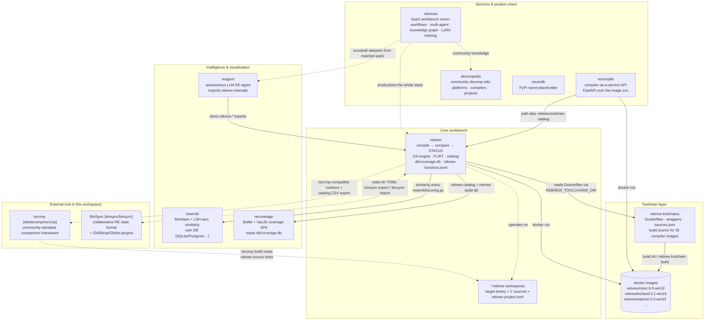
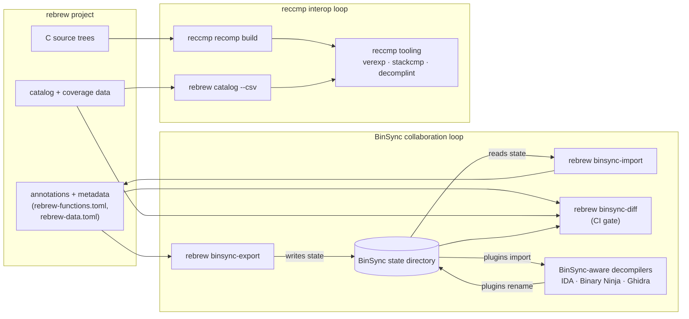
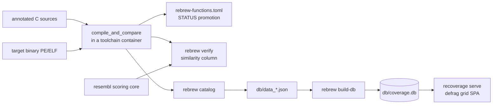

# Rebrew Ecosystem

How rebrew fits together with the sibling repositories in the `relumea`
workspace (`~/Desktop/Projects/relumea/`): the toolchain image source, the
assembly-similarity engine, the coverage dashboard, the compiler service,
the autonomous agent, and the product vision. It also covers the external
tools rebrew interoperates with — most notably
[reccmp](https://github.com/isledecomp/reccmp) and
[BinSync](https://github.com/binsync/binsync).

> **Scope** — this document covers the *between-repo* architecture: what
> each project is, what it depends on, and how data flows across the
> boundary. For rebrew's internal module map and data flow, see
> [ARCHITECTURE.md](ARCHITECTURE.md).

## Component map



## Components

### rebrew — the core workbench (this repo)

Compiler-in-the-loop decompilation: annotated C source is compiled with the
target's original compiler (MSVC 1.0–11.0 — 16-bit 1.0/1.5/1.52 plus 32-bit
2.0–11.0 — Borland C++ 5.5 / Turbo C 2.0/3.1, Watcom, Delphi 1.0, gcc-pe),
byte-compared against the target binary, and the result drives
`STATUS` promotion, diff analysis, and the GA matching engine. It is both
the CLI workbench and a Python library (`rebrew.*`) that the sibling agent
and service projects import. Internals: [ARCHITECTURE.md](ARCHITECTURE.md).

What rebrew *produces* for the ecosystem:

- matched C sources + per-function `rebrew-functions.toml` / `rebrew-data.toml`
  metadata (the durable output),
- `db/coverage.db` — the SQLite coverage database consumed by recoverage
  ([DB_FORMAT.md](DB_FORMAT.md)),
- GA run history (`ga_runs.jsonl`) and FLIRT signature indexes,
- docker image names/builds (consumed via rebrew-toolchains).

### rebrew-toolchains — the compiler image source

Standalone docker images for every legacy Windows/DOS compiler. This repo is
the *build source only*: Dockerfiles, the shared `base` image, wrapper
scripts, and the sha256-pinned `sources.json` manifest. No compiler binaries
live here — 32-bit images download verified sources at build time; the six
16-bit images need a user-supplied media tarball next to the Dockerfile.

The images are self-contained (runtime — wine/wibo/DOSBox — baked in, the
wrapper is the entrypoint), so any tool can use them without rebrew itself.
`rebrew toolchain build` (and `vendor`/`update`) reads the Dockerfiles from
the sibling checkout (`REBREW_TOOLCHAINS_DIR`, defaults to
`../rebrew-toolchains`); `pull`/`smoke` operate on the built images, and
compilation shells out via `docker run`. The same images back the
`recompile` service. See [TOOLCHAIN.md](TOOLCHAIN.md).

### resembl — assembly similarity search

Standalone CLI/library for finding structurally similar assembly snippets
in a database: normalization lexer (registers → `REG`, immediates → `IMM`),
weighted shingling, MinHash + banded LSH index, and a hybrid
Jaccard + Levenshtein (rapidfuzz) score, plus CFG similarity in `compare`.
Backends: SQLite (default), PostgreSQL, MySQL, DuckDB.

Integration with rebrew is at the package level: the `similarity` extra
path-pins the sibling `resembl` checkout, and rebrew reuses
`resembl/scoring.py` (importable without resembl's DB stack) for the
`verify_results.similarity` column — the structural score verify reports for
unmatched functions. resembl itself has no rebrew dependency and keeps its
own database.

### recoverage — coverage dashboard

Standalone consumer of rebrew's output: a Bottle web server + zero-build
VanJS SPA rendering a defrag-style per-byte coverage grid over
`db/coverage.db` (exact/reloc/matching/stub/none cells, function detail
panel, live cross-references, potato mode, CI gate via `recoverage check`).

The contract is the database file alone: `rebrew catalog --json` →
`db/data_*.json` → `rebrew build-db` → `db/coverage.db` → `recoverage serve`.
recoverage imports nothing from rebrew and runs on any machine with a
compiled `coverage.db` — no toolchain required.

### recompile — compiler-as-a-service

FastAPI service wrapping the toolchain zoo as an HTTP API:
`POST /api/v1/compile` accepts C source + a compiler id + flags, runs the
compile in the matching pinned toolchain container, and returns the
artifact. It path-depends on rebrew (the compiler catalog comes from
`rebrew.toolchain`) and needs the rebrew-toolchains images to execute
compiles.

It is also the dataset side of the ML vision: `emit_assembly: true` appends
`(source, listing)` pairs to `train_data/train.jsonl` — the raw material
for the snowball/LoRA fine-tuning pipeline ([ML_TRAINING.md](ML_TRAINING.md),
relumea below).

### reagent — autonomous LLM RE agent

Unattended reversing loop built directly on rebrew internals: it talks to a
local LLM over an OpenAI-compatible endpoint, picks a per-function workflow
(`skip` / `ga_only` / `llm_then_ga` / `llm_only` / `flag_sweep_first`), and
runs the ASM → LLM → compile → test → feedback loop, tracking state in
SQLite and emitting a run report. It imports `rebrew.*` modules directly
(`annotation`, `cli`, `skeleton`, `test`, `matcher`) — no subprocess
overhead, no reimplementation of the workbench.

The repo also hosts the product PRDs for the wider agent vision: RAG-based
recon context, the multi-agent AUTO_AGENT design, knowledge-graph plans, and
GA model training.

### relumea — the SaaS workbench vision

The umbrella product: an AI-powered, collaborative reverse-engineering
platform. Currently a Go backend (`backend/main.go`), a React + Vite
frontend, and the PRD set (`docs/prd/`): visual workflow builder, multi-agent
orchestration, a Cognee-based knowledge graph over ASTs/xrefs, and
continuous learning — generating LoRA fine-tuning datasets from
successfully matched functions (the "snowball effect"). A Python placeholder
package reserves the `relumea` name on PyPI.

relumea is the vision layer over the whole stack: rebrew does the low-level
matching, reagent automates it, recompile serves compiles at scale, and the
matched-pair corpora they generate feed the fine-tuning loop.

### recondb — PyPI placeholder

A placeholder package that reserves the `recondb` name (future "recon
database" component). No code, no consumers.

### decompedia — community decomp wiki

A markdown knowledge base about video game decompilation: platforms
(N64, PS1, Saturn, …), compilers, libraries, projects, and tool
directories. Independent of the code repos — a reference resource, not a
dependency.

## External interoperability

### reccmp

[reccmp](https://github.com/isledecomp/reccmp) is the binary recompilation
comparison framework from the LEGO Island decomp community — the de-facto
standard toolset for Windows binary-matching decomp projects. It is
**external** (not a sibling repo in this workspace), but rebrew deliberately
maintains format- and workflow-level compatibility with it, so a rebrew
project is a drop-in for a reccmp-based one and vice versa.

| Boundary | How rebrew interoperates |
|---|---|
| Source markers | The `// FUNCTION: MODULE 0xVA` annotation format is reccmp-compatible: reccmp's parser reads rebrew source files (marker + symbol; the extra rebrew KV lines are ignored), and `annotation.py` parses reccmp-style blocks. The reccmp-only `ANALYSIS` key is tolerated inline so reccmp files round-trip, even though rebrew's own convention routes it to metadata (inline use fires lint W019) |
| Catalog CSV | `rebrew catalog --csv` emits the pipe-delimited CSV per reccmp's `docs/csv.md` spec (`catalog/export.py`) |
| Tool equivalents | rebrew reimplements reccmp's toolset natively: `rebrew verify-exports` = `verexp`, `rebrew stack-cmp` = `stackcmp` (adapted — frames derived from disassembly on both sides instead of a recomp PDB, so it works for MSVC 6.0 whose PDBs `llvm-pdbutil` cannot read), `rebrew lint` = `decomplint`-inspired, `rebrew verify --nolib` = reccmp `--nolib` |
| Match semantics | Verify's *effective match* parity: a delta that is pure register allocation counts as 100%, matching reccmp's effective-match rule (`rebrew near-diag` reports it as `EFFECTIVE`) |
| Recomp build | rebrew sources build into a reccmp-style recomp binary: `rebrew round-trip` splices matched functions back into the PE and reports the naked-fenced sources so the reccmp build can compile them with `-DREBREW_ALLOW_NAKED=1` |

### BinSync

[BinSync](https://github.com/binsync/binsync) is the decompilation
community's collaboration framework: a shared state format plus plugins for
IDA Pro, Binary Ninja, and Ghidra that synchronize names, prototypes,
structs, and comments between analysts and tools. rebrew bridges to it at
the **state directory** level — no `libbs` dependency, the state is plain
TOML (via `tomlkit`):

- `rebrew binsync-export <outdir>` writes a BinSync state directory from
  the project: one `functions/<hex>.toml` per function (reversed +
  catalog-only, canonical sizes), `global_vars.toml` (DATA/GLOBAL
  annotations with real C types), and `structs/<name>.toml`
  (tree-sitter-collected definitions with fields). Rebrew-specific fields
  with no BinSync counterpart (STATUS, CFLAGS) are stored as structured
  comments (`[rebrew] STATUS=EXACT CFLAGS=/O1 /Gd`).
- `rebrew binsync-import <state-dir>` is the inverse — it reads a state
  directory produced by any BinSync-aware decompiler and applies names,
  prototypes, and global labels back into rebrew metadata/source, with the
  same conflict resolution as `rebrew sync` (`--accept-binsync` /
  `--accept-local`, `--module`, `--dry-run`, `--create-missing`).
- `rebrew binsync-diff <state-dir>` is a read-only divergence report (exit
  1 on any divergence, JSON output) for previewing imports and guarding
  sync drift in CI.

BinSync is the *team/tool* boundary, complementary to the Ghidra-only ReVa
MCP bridge (`rebrew sync`): anything BinSync-aware can consume rebrew's
exports and feed renames back, while the Ghidra bridge stays interactive.
Full details: [BINSYNC_INTEGRATION.md](BINSYNC_INTEGRATION.md); the planned
`libbs`-based umbrella (`rebrew binsync` push/pull, stack vars, enums) is
in [prd/09-binsync-full.md](prd/09-binsync-full.md).

### Interop flows



Both interop loops in one view: the BinSync collaboration cycle
(export → decompilers → import back, with `binsync-diff` guarding drift)
and the reccmp format interop (sources into the recomp build, catalog into
reccmp's CSV).

The full external-tools table (decomp.me, LIEF, Capstone, angr, ReVa, and
the adjacent tools) lives in the README's "Ecosystem & Related Tools"
section.

## Data flow across the boundary



The compile-service flow is the same compiler boundary, served over HTTP
instead of a local loop: API client → `recompile` (FastAPI) → `docker run`
on a toolchain image → `artifacts/{id}` + `ledger.json`, with optional
`emit_assembly` pairs streaming into `train_data/`.

## Dependency layering

Edges point strictly upward in the diagram above — the graph is acyclic:

| Component | Depends on | Boundary contract |
|---|---|---|
| rebrew | resembl (scoring core), rebrew-toolchains (image source) | python import; sibling checkout + `docker run` |
| recoverage | (nothing from rebrew) | `db/coverage.db` SQLite schema |
| recompile | rebrew (toolchain catalog), toolchain images | path dependency + HTTP API out |
| reagent | rebrew (internals) | direct `rebrew.*` imports |
| relumea | none yet — vision layer over the stack | — |
| recondb / decompedia | none | — |
| reccmp (external) | nothing from rebrew — consumes its outputs | marker/CSV format + recomp build |
| BinSync (external) | nothing from rebrew — consumes its exports | BinSync state-dir TOML layout |

Decoupling is by stable contract, not shared code:

- **toolchains** — docker images + the `sources.json` manifest; rebrew and
  recompile are interchangeable consumers,
- **coverage** — the SQLite schema in [DB_FORMAT.md](DB_FORMAT.md); rebrew
  writes it, recoverage reads it, and the two never import each other,
- **similarity** — the `resembl/scoring.py` module, importable without
  resembl's database stack,
- **compiles** — `POST /api/v1/compile` for remote consumers,
- **collaboration** — the BinSync state-dir TOML layout for any
  BinSync-aware decompiler; the reccmp marker/CSV formats for the
  comparison ecosystem,
- **agents/vision** — HTTP + file datasets (train JSONL), nothing shipped
  depends on the SaaS layer.

## Workspace layout

```
~/Desktop/Projects/relumea/
├── rebrew/              # the core workbench (this repo)
├── rebrew-toolchains/   # docker image build source (35 images)
├── rebrew-flirt-sigs/   # FLIRT signatures merged into project flirt_sigs/
├── rebrew-projects/     # *-rebrew project instances (win2k-*, skifree16/32,
│                        #   test_*, bench, smygb, makehm, ...)
├── resembl/             # asm similarity search library
├── recoverage/          # coverage dashboard SPA
├── recompile/           # compiler-as-a-service API
├── reagent/             # autonomous LLM RE agent
├── relumea/             # SaaS workbench vision (Go backend + React frontend)
├── recondb/             # PyPI name placeholder
├── decompedia/          # community decomp wiki (markdown vault)
└── objconv-fork/        # objconv fork used by rebrew's tools/
```

The `*-rebrew` directories under `rebrew-projects/` are rebrew *project
instances*, not code: each holds a target binary, the written C sources, its
`rebrew-project.toml`, per-function metadata, and its own `db/` — one per
binary being decompiled.

## Further reading

- [ARCHITECTURE.md](ARCHITECTURE.md) — rebrew internals: module map, compile
  loop, metadata routing rules
- [TOOLCHAIN.md](TOOLCHAIN.md) — the toolchain zoo and image provenance
- [DB_FORMAT.md](DB_FORMAT.md) — the `coverage.db` schema shared with
  recoverage
- [BINSYNC_INTEGRATION.md](BINSYNC_INTEGRATION.md) — the BinSync state-dir
  bridge in detail
- [ML_TRAINING.md](ML_TRAINING.md) — dataset collection and the snowball
  training vision
- [PRINCIPLES.md](PRINCIPLES.md) — idempotency, score monotonicity, snowball
  effect
- Sibling READMEs: `../rebrew-toolchains`, `../resembl`, `../recoverage`,
  `../recompile`, `../relumea`, `../reagent`
