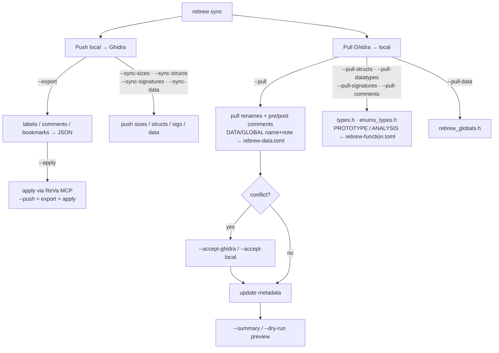

# Ghidra ↔ Rebrew Integration

> This page is the **current-state reference** for `rebrew sync` — which features are
> implemented, their flags, and known issues.
> For the full CLI flag reference see [CLI.md](CLI.md#rebrew-sync).
> For the product vision and future roadmap see [prd/07-ghidra-sync.md](prd/07-ghidra-sync.md).

## Feature Matrix

| Feature | Direction | Status | Command |
|---------|-----------|--------|---------|
| Export labels / comments / bookmarks to JSON | Local → file | ✅ Done | `--export` |
| Apply JSON commands to Ghidra via ReVa MCP | Local → Ghidra | ✅ Done | `--apply` |
| Export + apply in one step | Local → Ghidra | ✅ Done | `--push` |
| Skip generic `func_XXXXXXXX` labels | Local → Ghidra | ✅ Done | `--skip-generic` (default on) |
| Status-based bookmark categories | Local → Ghidra | ✅ Done | automatic (`rebrew/exact`, `/reloc`, etc.) |
| Custom MCP endpoint URL | — | ✅ Done | `--endpoint URL` |
| Summary / dry-run preview | — | ✅ Done | `--summary` |
| Pull function renames from Ghidra | Ghidra → Local | ✅ Done | `--pull` |
| Pull struct/type definitions from Ghidra | Ghidra → Local | ✅ Done | `--pull-structs` |
| Pull enum/typedef inventory (names/sizes) | Ghidra → Local | ✅ Done | `--pull-datatypes` (ReVa exposes names/sizes/categories, not enum members) |
| Pull function prototypes from Ghidra | Ghidra → Local | ✅ Done | `--pull-signatures` |
| Pull comments from Ghidra | Ghidra → Local | ✅ Done | `--pull-comments` (analysis) and `--pull` (pre/post) |
| Batch rename accept from Ghidra | Ghidra → Local | ✅ Done | `--pull --accept-ghidra` |
| Push struct definitions to Ghidra DTM | Local → Ghidra | ✅ Done | `--sync-structs` |
| Push function signatures to Ghidra | Local → Ghidra | ✅ Done | `--sync-signatures` |
| Push function sizes to Ghidra | Local → Ghidra | ✅ Done | `--sync-sizes` |
| Push data segments (.bss, .data) to Ghidra | Local → Ghidra | ✅ Done | `--sync-data` |
| Bidirectional conflict detection | Both | ✅ Done | Warns on conflict, `--accept-ghidra`/`--accept-local` |
| Pull data labels from Ghidra | Ghidra → Local | ✅ Done | `--pull-data` (generates `rebrew_globals.h`); **name/note** written to `rebrew-data.toml` metadata |
| Refresh function structure + data label cache from Ghidra | Ghidra → Local | ✅ Done | `--refresh-cache` |
| Split pulled structs into per-module files | Ghidra → Local | ✅ Done | `--pull-structs --by-module` (e.g. `types_server.h`, `types_shared.h`); `--types-out PATH` for single-file override |
| ghidra-cli backend (alternative to ReVa MCP) | Both | ✅ Done | `ghidra_backend = "cli"` routes push apply AND pull (functions/symbols/comments) through the `ghidra-cli` binary (`cli_backend.py`) |
| Validate `programPath` against Ghidra project | — | ✅ Done | `validate_program_path()` queries `get-current-program` via ReVa MCP and warns on mismatch |
| XREF context in skeleton generation | Ghidra → Local | ✅ Done | `skeleton --xrefs` |
| Ghidra decompilation backend for skeleton | Ghidra → Local | ✅ Done | `skeleton --decomp --decomp-backend ghidra` |
| Metadata-aware linting | Local | ✅ Done | `rebrew lint` reads `rebrew-function.toml` before validation |
| Incremental / dirty-only sync | Both | ✅ Done | Dedup tracking (below) makes re-pushes incremental automatically — only content-changed operations are re-applied |
| Watch mode (live file-change sync) | Local → Ghidra | ✅ Done | `--watch` (requires `--push`): watches sources + `rebrew-function.toml`, re-pushes on change |
| Deduplication / idempotency tracking | — | ✅ Done | `.rebrew/ghidra_sync_state.json` records applied op hashes; `--export`/`--push` skip them (`--force` re-pushes) |

For improvement ideas related to Ghidra sync, see [IDEAS.md](IDEAS.md) (#5–#9, #11).

---

## Known Issues

### ~~`sync.py` doesn't validate programPath against actual Ghidra project~~ *(resolved)*

`validate_program_path()` in `ghidra/commands.py` now calls `get-current-program` via ReVa MCP
and compares the active Ghidra path against the derived `/binary.dll` path. On mismatch it
prints a warning with the correct value to set as `ghidra_program_path` in `rebrew-project.toml`.
The path is also configurable via `ghidra_program_path` in the target config section.

### ~~No deduplication check~~ *(resolved)*

`--export`/`--push` now skip operations already applied to Ghidra, tracked by
content hash in `.rebrew/ghidra_sync_state.json` (`--force` re-pushes
everything). Applied operations are recorded after a fully successful apply;
a partial failure records nothing so the retry re-applies conservatively.
