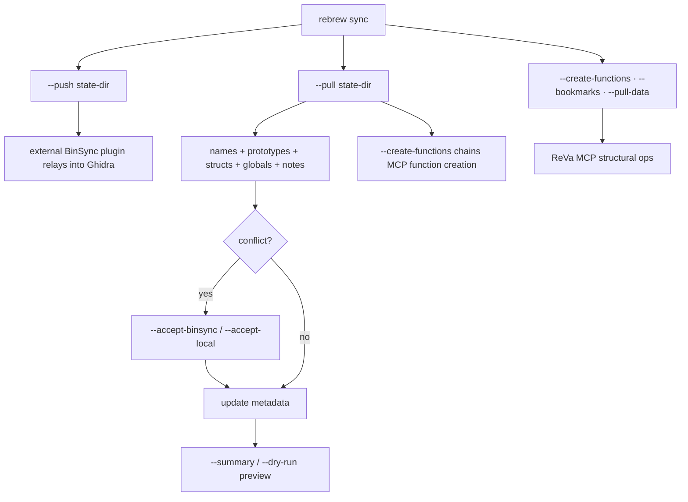

# Ghidra ↔ Rebrew Integration

> This page is the **current-state reference** for `rebrew sync` — which features are
> implemented, their flags, and known issues.
> For the full CLI flag reference see [CLI.md](CLI.md#rebrew-sync).
> For the product vision and future roadmap see [prd/07-ghidra-sync.md](prd/07-ghidra-sync.md).

`rebrew sync` is BinSync-primary: field sync (names, prototypes, structs,
globals) goes through a shared BinSync state directory, and ReVa MCP remains
only for the structural ops the state dir cannot express (create-functions,
bookmarks, pull-data). See [BINSYNC_INTEGRATION.md](BINSYNC_INTEGRATION.md)
for the state-dir format.

## Feature Matrix

| Feature | Direction | Status | Command |
|---------|-----------|--------|---------|
| Export annotations to a BinSync state dir | Local → file | ✅ Done | `--push --state-dir D` |
| Import a BinSync state dir into rebrew | File → Local | ✅ Done | `--pull --state-dir D` |
| Import structs / notes / global types+sizes | File → Local | ✅ Done | `--pull` (structs → `binsync_types.h`, notes → metadata, global type/size → `rebrew-data.toml`) |
| Create missing functions in Ghidra | Local → Ghidra | ✅ Done | `--pull --create-functions` (MCP create op over imported VAs) |
| Status-based bookmark categories | Local → Ghidra | ✅ Done | automatic (`rebrew/exact`, `/reloc`, etc.) via `--bookmarks` |
| Custom MCP endpoint URL | — | ✅ Done | `--endpoint URL` |
| Summary / dry-run preview | — | ✅ Done | `--summary`, `--dry-run` |
| Prototype conflict gating | File → Local | ✅ Done | differing local prototype reports a conflict; `--accept-binsync` overwrites |
| Whitespace-normalized prototype compare | — | ✅ Done | formatting-only differences are not divergence |
| Freshness manifest | File | ✅ Done | `manifest.toml` (`exported_at`, `content_hash`); surfaced by `binsync-diff --json` |
| Conflict detection (names, prototypes) | Both | ✅ Done | Warns on conflict, `--accept-binsync`/`--accept-local` |
| Pull data labels from Ghidra | Ghidra → Local | ✅ Done | `--pull-data` (generates `rebrew_globals.h`) |
| Validate `programPath` against Ghidra project | — | ✅ Done | queries `get-current-program` via ReVa MCP and warns on mismatch |
| Watch mode (live file-change sync) | Local → Ghidra | ✅ Done | `--watch` (push only) |
| XREF context in skeleton generation | Ghidra → Local | ✅ Done | `skeleton --xrefs` |
| Ghidra decompilation backend for skeleton | Ghidra → Local | ✅ Done | `skeleton --decomp --decomp-backend ghidra` |
| Metadata-aware linting | Local | ✅ Done | `rebrew lint` reads `rebrew-functions.toml` before validation |

For improvement ideas related to Ghidra sync, see [IDEAS.md](IDEAS.md) (#5–#9, #11).

---

## Known Issues

### ~~`sync.py` doesn't validate programPath against actual Ghidra project~~ *(resolved)*

`validate_program_path()` in `ghidra/commands.py` now calls `get-current-program` via ReVa MCP
and compares the active Ghidra path against the derived `/binary.dll` path. On mismatch it
prints a warning with the correct value to set as `ghidra_program_path` in `rebrew-project.toml`.
The path is also configurable via `ghidra_program_path` in the target config section.

### Per-instruction comments do not round-trip

Function-level notes sync via `[comments]`; per-instruction comments have no
BinSync surface in the current format and are not synced.
