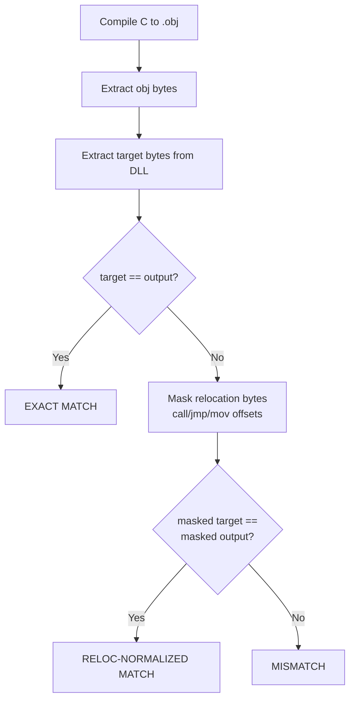

# Match Types Reference

When you compile your C source and compare against the target function bytes from the DLL,
the test harness classifies the result into one of these categories.

## EXACT

Byte-for-byte identical. Every single byte in your compiled .obj matches the target bytes
extracted from the DLL. This is the gold standard.

```
Target:  53 8b 5c 24 08 56 57 8b 43 10 50 e8 f0 83 00 00
Output:  53 8b 5c 24 08 56 57 8b 43 10 50 e8 f0 83 00 00
         == == == == == == == == == == == == == == == ==
```

This is rare in practice because `call` and `jmp` instructions encode relative offsets
that depend on where the function is placed in the final binary. You get EXACT when
the function has no calls to other functions and no references to global variables, or
when comparing at the .obj level with the same linker layout.

## RELOC

Identical after masking relocatable bytes. The function's logic, register allocation,
and control flow are all correct. The only differences are in bytes that the linker
patches at link time:

- `call rel32` (`E8 xx xx xx xx`) — the 4-byte displacement after a call opcode
- `jmp rel32` (`E9 xx xx xx xx`) — long jump displacements
- `mov eax, [abs32]` (`A1 xx xx xx xx`) — absolute address loads
- `cmp [abs32], imm` (`83 3D xx xx xx xx yy`) — comparisons against globals

```
Target:  50 e8 f0 83 00 00 8b f8 83 c4 04 a1 80 58 03 10
Output:  50 e8 00 00 00 00 8b f8 83 c4 04 a1 00 00 00 00
         == ~~ ~~ ~~ ~~ ~~ == == == == == ~~ ~~ ~~ ~~ ~~
```

The `~~` bytes are relocation-only differences — the linker would fill these in with the
correct addresses. A RELOC match means your source code is functionally correct and
produces the same machine code structure. **This is the typical best result** for
functions that reference globals or call other functions.

## MATCHING

The compiled output is close but not identical even after relocation masking. There are
structural byte differences (`**` in diff output) — meaning the compiler generated
slightly different instructions. Common causes:

| Cause | Example | Fix |
|-------|---------|-----|
| Wrong comparison operator | `< 2` generates `cmp 2; setl` vs `<= 1` generates `cmp 1; setle` | Try the equivalent expression |
| Register allocation swap | Counter in EAX vs ECX | Change variable declaration order, types, or usage |
| Loop structure | Peeled first iteration, inverted exit condition | Try `for` vs `do-while` vs `while` |
| Code block ordering | `return 1` placed before vs after `return 0` | Restructure if/else/goto |
| Addressing mode | `[eax + ecx*4]` vs `[ecx]` with separate `add ecx, 4` | Change how you express pointer arithmetic |
| Extra indirection | `mov reg, [global]; call [reg+off]` vs `call [off+global]` | Use array declaration instead of pointer-to-pointer |

A MATCHING file should include a `BLOCKER` annotation describing the specific difference:
```c
// STATUS: MATCHING
// BLOCKER: register allocation (esi/edi swap) + loop peeling, 123B vs 130B
```

## MATCHING_RELOC

Like MATCHING but even closer — the only structural differences are small (1-5 bytes)
and the rest matches after relocation masking. Worth iterating on.

## STUB

Placeholder or far-off implementation. The compiled output is significantly different
from the target — wrong size, wrong structure, or still contains TODO placeholders.
A STUB should always have a `BLOCKER` annotation:

```c
// STATUS: STUB
// BLOCKER: needs complete rewrite, 199B vs 163B
```

## How rebrew-test Classifies Results



```text
1. Compile your .c file to a .obj with MSVC6 under Wine
2. Extract the symbol's bytes from the .obj (COFF parser)
3. Extract the target bytes from the DLL at the given VA
4. Compare:
   a. If target_bytes == output_bytes → EXACT MATCH
   b. Else, mask relocation bytes in both (zero out call/jmp/mov displacements)
      If masked_target == masked_output → RELOC-NORMALIZED MATCH
   c. Else → MISMATCH (shows byte count and hex dump)
```

## Relocation Masking Details

The normalizer (`_normalize_reloc_x86_32`) walks the x86 instruction stream and zeros
out bytes that are expected to differ between compilations:

| Pattern | Opcode | Bytes zeroed | Why |
|---------|--------|-------------|-----|
| `call rel32` | `E8` | bytes 1-4 | Call target is a relative offset from current IP |
| `jmp rel32` | `E9` | bytes 1-4 | Jump target is a relative offset |
| `mov eax, [moffs32]` | `A1` | bytes 1-4 | Absolute address of a global variable |
| `cmp [abs32], imm8` | `83 3D` | bytes 2-5 | Address of global in comparison |
| Conditional jumps near | `0F 8x` | bytes 2-5 | 32-bit relative offsets in Jcc instructions |
| `push imm32` | `68` | bytes 1-4 | Only when value looks like an address (> 0x10000000) |
| `mov reg, imm32` | `B8`-`BF` | bytes 1-4 | Only when value looks like an address |
| `mov reg, [abs32]` | `8B 0D/15/1D/25/2D/35/3D` | bytes 2-5 | Global variable loads |
| `mov [abs32], reg` | `89 0D/15/1D/25/2D/35/3D` | bytes 2-5 | Global variable stores |

After masking, if the bytes are identical, the code is structurally the same — only the
linker-dependent addresses differ. This is the RELOC match.
