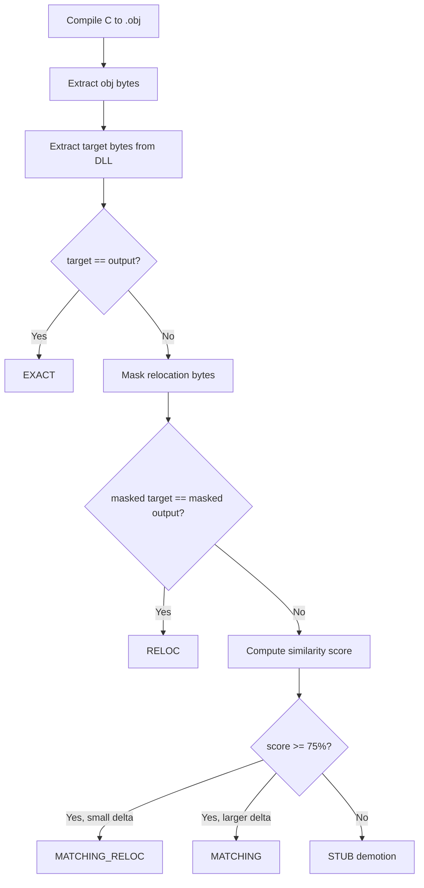

# Function Status Reference

All function statuses are stored in the `rebrew-function.toml` metadata, keyed by hex VA.
The `.c` file contains only the stable `// FUNCTION: MODULE 0xVA` marker line.

## Status Overview

```
UNDOCUMENTED  →  STUB  →  MATCHING  →  RELOC  →  EXACT
                                  ↘             ↗
                               MATCHING_RELOC
                                  ↓
                               PROVEN (from MATCHING or MATCHING_RELOC via rebrew prove)
                               SKIP   (parallel track — intentionally unmatchable)
```

| Status | Byte match | Set by | Counts in coverage |
|--------|-----------|--------|-------------------|
| `UNDOCUMENTED` | — | Automatic (no .c file) | ❌ No |
| `STUB` | <75% | `rebrew test` (demotion) | ❌ No |
| `MATCHING` | ≥75% | `rebrew test` | ⚠️ Partial |
| `MATCHING_RELOC` | Near-reloc | `rebrew test` | ⚠️ Partial |
| `RELOC` | 100% (masked) | `rebrew test` | ✅ Yes |
| `EXACT` | 100% (raw) | `rebrew test` | ✅ Yes |
| `PROVEN` | Semantic | `rebrew prove` | ✅ Yes |
| `SKIP` | N/A | Manual (metadata) | ✅ Yes (excluded) |

---

## UNDOCUMENTED

Function exists in `function_structure.json` but no `.c` file has been created yet.
This is the implicit starting state — rebrew tracks it from the function list, not the
metadata. Tools like `rebrew todo` surface these as action items.

```bash
rebrew todo --json          # find next UNDOCUMENTED function to start
rebrew skeleton 0x10008880  # generate .c skeleton → transitions to STUB
```

No metadata entry exists yet. Coverage dashboard shows these as "untouched".

---

## STUB

A `.c` file exists but the implementation is a placeholder — either empty, contains
`TODO`, or compiles to something radically different from the target (< 75% byte match,
or wrong size).

Also assigned automatically by `rebrew test` when a previously-matching function
regresses below the 75% match threshold (demotion).

```toml
["SERVER.0x10008880"]
status = "STUB"
size = 163
blocker = "needs complete rewrite from scratch, 199B target vs 163B compiled"
```

Common causes: LLM-generated skeleton that doesn't match, missing CRT internals,
wrong calling convention, completely wrong algorithm structure.

---

## MATCHING

The compiled output is ≥ 75% byte-similar to the target but has structural differences
that persist after relocation masking — different register allocation, different loop
structure, different branch ordering.

`rebrew match --fix-blocker` auto-classifies the difference type and writes it to the metadata:

```toml
["SERVER.0x10008880"]
status = "MATCHING"
size = 130
blocker = "register allocation (esi/edi swap)"
blocker_delta = 7
```

Common blockers: register allocation, loop peeling, branch inversion, code block
reordering, stack frame choice.

**Next steps**: Iterate code structure, or run `rebrew match` (GA engine) to explore
permutations. For near-miss cases (small delta), try `rebrew match --all --near-miss`.

---

## MATCHING_RELOC

Like MATCHING but the structural differences are very small (typically 1–5 bytes) and
the remainder matches after relocation masking. An intermediate milestone worth tracking
separately — these are prime candidates for the GA engine.

```toml
["SERVER.0x10008880"]
status = "MATCHING_RELOC"
size = 128
blocker = "operand swap in one instruction, 2B delta"
blocker_delta = 2
```

**Next steps**: Strong candidate for `rebrew match` or `rebrew prove`.

---

## RELOC

Identical after masking relocatable bytes (`call rel32`, `jmp rel32`, `mov eax,[abs32]`,
etc.). The function's logic, register allocation, and control flow are all correct.
Only call targets and global addresses differ, which is expected — the linker patches
these at link time.

```
Target:  50 e8 f0 83 00 00 8b f8 83 c4 04 a1 80 58 03 10
Output:  50 e8 00 00 00 00 8b f8 83 c4 04 a1 00 00 00 00
         == ~~ ~~ ~~ ~~ ~~ == == == == == ~~ ~~ ~~ ~~ ~~
```

This is the **typical best result** for functions that call other functions or reference
globals. Counts as complete in the project coverage metrics.

```toml
["SERVER.0x10008880"]
status = "RELOC"
size = 42
```

---

## EXACT

Byte-for-byte identical. Every single byte in the compiled `.obj` matches the target
bytes extracted from the DLL.

```
Target:  53 8b 5c 24 08 56 57 8b 43 10 50 e8 f0 83 00 00
Output:  53 8b 5c 24 08 56 57 8b 43 10 50 e8 f0 83 00 00
         == == == == == == == == == == == == == == == ==
```

Rare in practice for functions with external calls (since call offsets are
linker-dependent). Common for leaf functions with no calls or global refs.

```toml
["SERVER.0x10008880"]
status = "EXACT"
size = 31
```

---

## PROVEN

Semantically equivalent — mathematically verified by `rebrew prove` via angr
symbolic execution + Z3 constraint solving. The compiled bytes differ structurally
(different register allocation, instruction reordering, loop unrolling), but for **all
possible inputs**, the return value and observable side-effects are identical.

Used when a function is stuck on MATCHING due to compiler jitter that can't be
resolved by flag sweeps or code restructuring.

```toml
["SERVER.0x10008880"]
status = "PROVEN"
size = 142
```

```bash
rebrew prove src/target/calculate_physics.c   # runs angr + Z3, ~15-60s
```

Counts as complete. Holds the same weight as EXACT or RELOC in coverage metrics.

---

## SKIP

Intentionally excluded from matching. Used for functions that are known to be
unmatchable or irrelevant to the decompilation effort:

| Reason | Examples |
|--------|---------|
| IAT thunks | `jmp [__imp_GetProcAddress]` — compiler-generated, no source |
| SEH helpers | `__except_handler3`, `__local_unwind2` — MSVC runtime internals |
| ASM builtins | `_memcpy_rep`, `_strlen_sse2` — hand-written assembly |
| Import stubs | Trampolines to DLL imports with no game logic |
| Padding / alignment | Dead bytes between functions, never executed |
| Linker-generated | `__security_cookie_check`, `__SEH_prolog` |

```toml
["SERVER.0x10001234"]
status = "SKIP"
skip_reason = "IAT thunk — jmp [__imp_CreateFileA]"
```

SKIP functions are excluded from the "unmatched" count in coverage metrics — they
are treated as intentionally resolved, not as open work items.

```bash
rebrew todo --json    # surface likely SKIP candidates
```

---

## How rebrew test Classifies Results


```mermaid
flowchart TD
    A[Compile C to .obj] --> B[Extract obj bytes]
    B --> C[Extract target bytes from DLL]
    C --> D{target == output?}
    D -- Yes --> E[EXACT]
    D -- No --> F[Mask relocation bytes]
    F --> G{masked target == masked output?}
    G -- Yes --> H[RELOC]
    G -- No --> I[Compute similarity score]
    I --> J{score >= 75%?}
    J -- "Yes, small delta" --> K[MATCHING_RELOC]
    J -- "Yes, larger delta" --> L[MATCHING]
    J -- No --> M[STUB demotion]
```

```text
1. Compile .c file to .obj with MSVC6 under Wine
2. Extract symbol bytes from .obj (COFF parser)
3. Extract target bytes from DLL at the given VA
4. Compare:
   a. target_bytes == output_bytes               → EXACT
   b. masked_target == masked_output             → RELOC
   c. similarity >= 75%, delta <= threshold      → MATCHING_RELOC
   d. similarity >= 75%, delta > threshold       → MATCHING
   e. similarity < 75% or wrong size             → STUB (demotion)
```

## Relocation Masking Details

The normalizer (`_normalize_reloc_x86_32`) walks the x86 instruction stream and zeros
out bytes that are expected to differ between compilations:

| Pattern | Opcode | Bytes zeroed | Why |
|---------|--------|-------------|-----|
| `call rel32` | `E8` | bytes 1-4 | Call target is a relative offset from current IP |
| `jmp rel32` | `E9` | bytes 1-4 | Jump target is a relative offset |
| `mov eax, [moffs32]` | `A1` | bytes 1-4 | Absolute address of a global variable |
| `cmp [abs32], imm8` | `83 3D` | bytes 2-5 | Address of global in comparison |
| Conditional jumps near | `0F 8x` | bytes 2-5 | 32-bit relative offsets in Jcc instructions |
| `push imm32` | `68` | bytes 1-4 | Only when value looks like an address (> 0x10000000) |
| `mov reg, imm32` | `B8`-`BF` | bytes 1-4 | Only when value looks like an address |
| `mov reg, [abs32]` | `8B 0D/15/1D/25/2D/35/3D` | bytes 2-5 | Global variable loads |
| `mov [abs32], reg` | `89 0D/15/1D/25/2D/35/3D` | bytes 2-5 | Global variable stores |

After masking, if the bytes are identical, the code is structurally the same — only the
linker-dependent addresses differ. This is the RELOC match.
