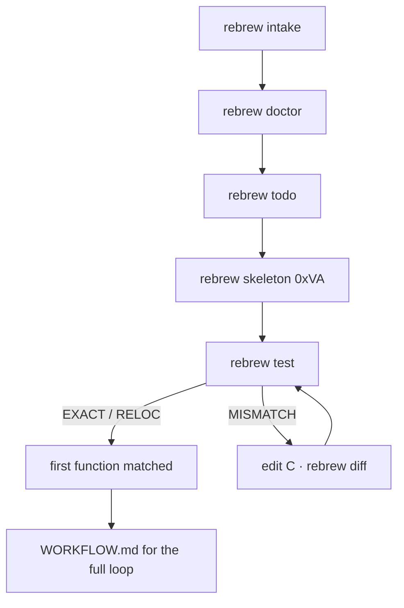

# Onboarding — your first rebrew project

This is the first-run walkthrough: from a binary to a documented, verified
decomp project.  It takes ~5 minutes and covers every step the tools
automate, plus the errors a new user can actually hit and what each one
means.  For the full command reference see [CLI.md](CLI.md); for toolchains
see [TOOLCHAIN.md](TOOLCHAIN.md).

## Prerequisites

| Tool | Needed for | Install |
|------|-----------|---------|
| Python 3.12+ + `uv` | running rebrew | `pip install uv` / your distro |
| rebrew itself | everything | `uv pip install -e .` in this checkout |
| **docker** | every compiler (MSVC, Borland, Watcom, Turbo C, Delphi, GCC, Clang, MinGW) — execution is docker-only; the image wraps wine/DOSBox or holds the native compiler | your distro's `docker` |
| **rizin** (`rz`/`rizin`) | packaged function discoverer (`rebrew.discoverers`; alternatives plug in without host edits) | `apt install rizin` / [rizin.re](https://rizin.re) |
| `diec` (optional) | stronger compiler detection in `rebrew doctor`/`intake` | `tools/diec` (vendored) |

Every compiler — including GCC, Clang and MinGW — needs docker: the image
holds it (see `rebrew toolchain list`).

> **Runtime: wine is the default.**  Every docker image runs the compiler
> under **wine** (`REBREW_RUNNER` defaults to `wine` inside the image).
> `wibo` — the minimal decompals PE loader — is faster but **fails on some
> tools**, so rebrew keeps wine as the default and never steers you toward
> wibo (a wibo binary in `tools/` is informational only; `--install-wibo`
> leaves docker-backed projects' runner config untouched).

## The 5-minute path

### 1. Initialize the project

```bash
rebrew init --target SERVER --binary server.dll
```

Creates `rebrew-project.toml`, `original/`, `src/SERVER/`, metadata files,
and prints the next steps.  If you have the binary handy, skip straight to
`rebrew intake` — it runs `init` for you.

#### Interactive wizard

Bare `rebrew init` on a TTY runs an **onboarding wizard** (`--wizard` is the
default; `--no-wizard` or `--json` opts out).  It only asks about parameters
you did NOT pass on the command line — a fully flagged run
(`--target/--binary/--toolchain/--install-completions` all given) prompts
nothing.

1. **Binary** — scans `original/` first, then the current directory, for
   `*.exe`/`*.dll`/`*.sys`/`*.bin`/`*.com` and offers a numbered pick list
   (`m` lets you type a path/name manually).
2. **Detection → compiler profile** — the chosen binary is fingerprinted
   (format/arch + toolchain family) and the suggested profile becomes the
   default answer, visibly flagged (`detection suggests …`).  An unknown
   answer gets one reprompt, then falls back to the current value.
3. **Target name** — defaults to the binary stem (`mini_pe.exe` → `mini_pe`).
4. **Summary + confirm** — nothing is written before you answer "yes".
5. **Shell completions** — optional `completions/` scripts.
6. **Toolchain image** — after the project is written, the docker image
   state for the chosen profile is reported; a missing image prints the
   exact `rebrew toolchain build <profile>` command and offers to run it.

Piped/CI invocations (non-TTY stdin, `--json`) never prompt.

### 2. One-shot onboarding

```bash
rebrew intake original/server.dll          # auto-detects the compiler profile
rebrew intake original/server.dll --toolchain msvc-6.0   # or pin it explicitly
```

`intake` does the whole first pass automatically:

1. **detects the compiler profile** (diec → PDB → heuristics)
2. runs `rebrew init` (skipped if the project already exists — re-running
   intake is a safe re-discovery)
3. copies the binary to `original/`
4. **enumerates functions** via discoverer plugins → `src/SERVER/function_structure.json`
5. **documents every function** as a `// STUB:` skeleton with a BLOCKER,
   so `rebrew status`/`rebrew todo` show the full reversing landscape

When it finishes you get a summary like:

```
Intake complete: server (msvc-8.0)
  detected family: msvc (MSVC 14.00 …)
  functions: 259, documented: 259
  toolchain: msvc-8.0 runs through docker image rebrew/msvc:8.0-win32 — run 'rebrew toolchain build msvc-8.0' if the image is missing
  next: rebrew doctor && rebrew status --json
  first run? see docs/ONBOARDING.md for the walkthrough
```

### 3. Health check

```bash
rebrew doctor            # green/red checklist with fixes for every failing item
rebrew doctor --json     # machine-readable
```

`doctor` validates the config, binary, toolchain (docker image or native
compiler), include/lib paths, function list, sources, metadata, and more.
Every `fail` line names its fix.  The common ones after a fresh intake:

- **`Compiler`/`Toolchain`/`Runner` fail** — the docker image isn't built:
  `rebrew toolchain build <profile>` (execution is docker-only).
- **`Toolchain alignment` fail** — the detected compiler family doesn't match
  the configured profile: switch the profile (e.g. `rebrew cfg set
  compiler.profile msvc-6.0`) or document it as a blocker.
- **`Include path`/`Lib path`** — for docker-backed profiles these are
  provided *by the image* (it is built from the pinned source in the sibling
  `rebrew-toolchains` checkout), so a dangling host path is informational,
  not a failure.  Every shipped profile is docker-backed; only a plugin
  toolchain registered without an image uses real host paths.

### 4. See where you stand

```bash
rebrew status            # progress overview, per-status counts, per-module breakdown
rebrew todo              # prioritized action list (what to work on next)
```

### 5. Start reversing

```bash
rebrew skeleton 0x00401000          # generate a function skeleton (convention-aware)
rebrew test src/SERVER/fcn_00401000.c   # compile, byte-compare, auto-update STATUS
rebrew diff src/SERVER/fcn_00401000.c   # see WHY bytes differ (register/reloc/structural)
rebrew near-diag src/SERVER/fcn_00401000.c  # classify the delta + GA mutation hints
rebrew verify            # bulk: compile every annotated function, compare, promote STATUS
rebrew match src/SERVER/fcn_00401000.c    # GA engine — search for the byte-perfect C
```

Before reversing, rule out library code — statically linked CRT sits in
`.text` looking exactly like target code:

```bash
rebrew flirt flirt_sigs/              # identify library functions via FLIRT
rebrew crt-match --all --fix-source   # auto-annotate MSVCRT functions
```

The agent skills in `.agents/skills/` (`rebrew-intake`, `rebrew-workflow`,
`rebrew-matching`, `rebrew-data-analysis`) walk the same loop with
step-by-step instructions for AI agents.



## First-run errors and what they mean

| Error | Cause | Fix |
|-------|-------|-----|
| `binary not found: …` | typo'd path | pass the real path — `rebrew intake` copies it to `original/` |
| `no functions discovered` | no discoverer found functions (rizin missing, timed out, or couldn't analyze the binary) | `apt install rizin` or register another `rebrew.discoverers` plugin; re-run `rebrew intake` (the scaffold is kept) |
| `docker image rebrew/… not built` | image missing | `rebrew toolchain build <profile>` (or `rebrew toolchain pull <profile>`) |
| `Toolchain alignment` fail | detected family ≠ configured profile | `rebrew cfg set compiler.profile <detected>` |
| `Cannot extract DLL bytes` (verify) | binary changed since the annotation | re-run `rebrew intake` for re-discovery, or fix the marker VA (see `rebrew doctor`'s *Annotation staleness* check) |
| `Failed to load: …` (doctor) | `format` doesn't match the binary | set `format = "pe"/"elf"/"macho"/"ne"` in `rebrew-project.toml` |
| `A rebrew-project.toml already exists` | `init` in an existing project | use `rebrew intake` instead — it re-runs init only when needed |

## 16-bit DOS targets

For MZ/NE (DOS) binaries `intake` sets `arch = "x86_16"` automatically and
the profile must be a 16-bit-capable compiler (`msvc-1.52`, `borland-3.1`, `borland-2.0`,
`watcom-2.0-win16`).  `rebrew doctor` explains exactly which profile to configure.

## Manual discovery (without `intake`)

When onboarding by hand (or feeding a third-party tool's output), write
`src/<target>/function_structure.json` directly — `[{va, size, name}]` with
integer VAs:

```bash
# Ghidra: Auto-Analyze, export the function list, save as above.
# radare2 / rizin headless:
r2 -q -c 'aaa; aflj' original/mygame.exe > /tmp/funcs.json
python3 -c "
import json
funcs = json.load(open('/tmp/funcs.json'))
out = [{'va': f['offset'], 'size': f['size'], 'name': f['name']} for f in funcs]
json.dump(out, open('src/mygame/function_structure.json', 'w'), indent=2)
"
```

Then continue at step 3 (`rebrew doctor`).

## Next

- [CLI.md](CLI.md) — every command
- [TOOLCHAIN.md](TOOLCHAIN.md) — compilers, images, per-library overrides
- [ANNOTATIONS.md](ANNOTATIONS.md) — the `// FUNCTION:` annotation format
- [CONFIG.md](CONFIG.md) — `rebrew-project.toml` reference
- [ARCHITECTURE.md](ARCHITECTURE.md) — how the pieces fit together
