# User Stories & Workflow Diagrams

> [!NOTE]
> These stories describe the **target architecture** for rebrew workflows.
> Some tools and orchestration steps (e.g. agent batch processing, LLM pipelines)
> are aspirational and not yet implemented.

User stories for the Rebrew decompilation workbench, organized by persona and workflow.

---

## Personas

| Persona | Description |
|---------|-------------|
| **RE Dev** | A reverse engineer manually decompiling functions |
| **AI Operator** | Someone running AI-assisted batch pipelines |
| **Project Lead** | Sets up projects, reviews progress, manages targets |
| **Contributor** | New team member learning the workflow |

---

## 1. Project Initialization

> **As a Project Lead**, I want to initialize a new rebrew project for a binary so that my team has a standardized workspace with config, directories, and toolchain ready.

### Acceptance Criteria
- `rebrew.toml` created with target binary, format, arch, and compiler settings
- Source, bin, and output directories scaffolded
- Compiler detected from PE Rich Header or CRT prologue patterns
- Running `rebrew-init` a second time changes nothing (idempotent)

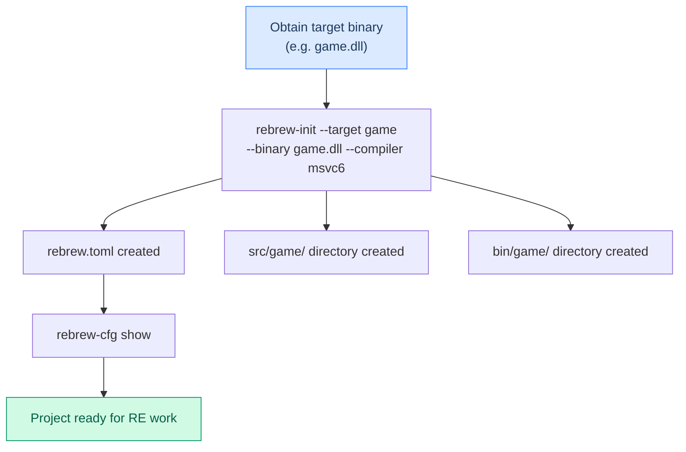

---

## 2. Adding a Second Target Binary

> **As a Project Lead**, I want to add a second binary (e.g. client.exe) to an existing project so that shared code between DLL and EXE can be tracked together.

### Acceptance Criteria
- New `[targets.client_exe]` section added to `rebrew.toml`
- Existing target config untouched
- Origins and cflags presets configurable per-target
- Shared source directory pattern (`src/shared/`) documented

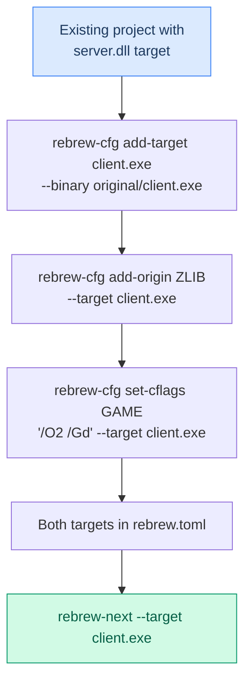

---

## 3. Function Discovery & Triage

> **As an RE Dev**, I want to discover all functions in a binary and triage them by type (library, game, CRT) so that I can prioritize which ones to reverse first.

### Acceptance Criteria
- Function list generated (r2 / Ghidra / lief)
- FLIRT signatures auto-identify CRT/zlib/Lua functions (~20-40%)
- `rebrew-triage` classifies functions by origin, size, and matchability
- Functions ranked by size and tagged with origin
- IAT thunks, SEH helpers, and ASM builtins flagged as non-matchable

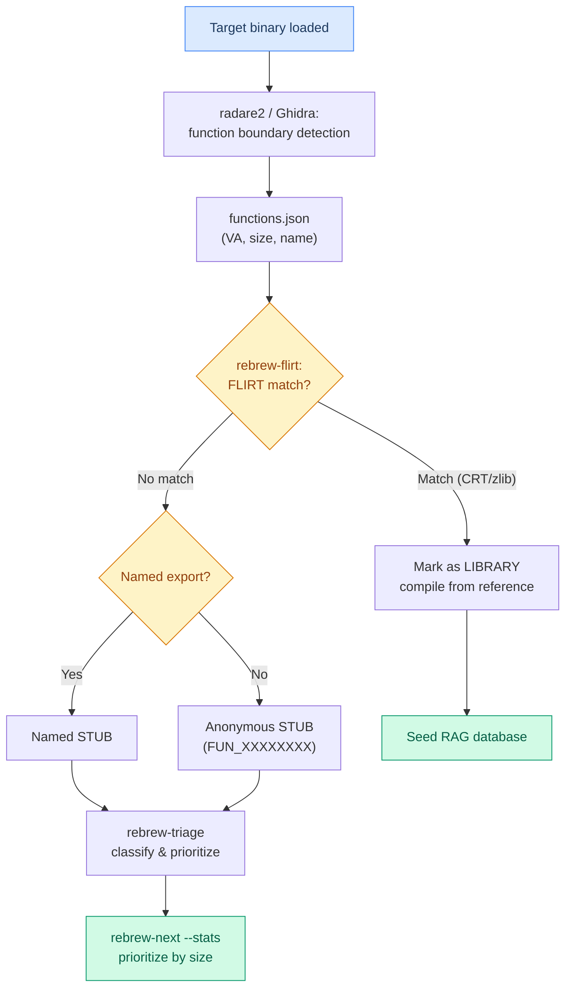

---

## 4. Manual Decompilation (Single Function)

> **As an RE Dev**, I want to pick a function, write C89 source, and verify it produces byte-identical output so that I can incrementally build the decompiled codebase.

### Acceptance Criteria
- `rebrew-next` shows prioritized list of uncovered functions
- `rebrew-skeleton` creates annotated `.c` file
- `rebrew-test` classifies result as EXACT / RELOC / MATCHING / MISMATCH
- Annotation header updated with correct STATUS and BLOCKER (if any)
- `rebrew-promote` used to promote status on match

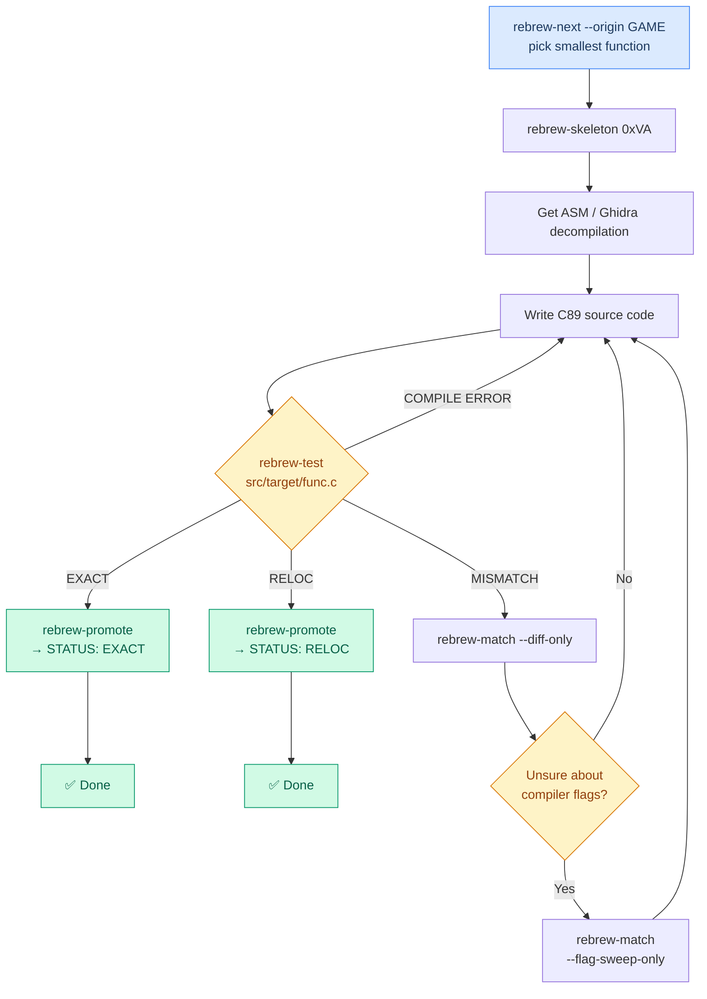

---

## 5. GA-Assisted Matching (Workflow B)

> **As an RE Dev**, I want to hand off a MATCHING function to the genetic algorithm so that it can brute-force the last few byte differences without me manually tweaking comparison operators.

### Acceptance Criteria
- GA accepts my `.c` file as seed
- 40+ mutation operators applied (if-swaps, loop transforms, operand commutation)
- Results cached in SQLite `BuildCache` to prevent duplicate compilations
- GA finds EXACT/RELOC or reports stagnation after N generations

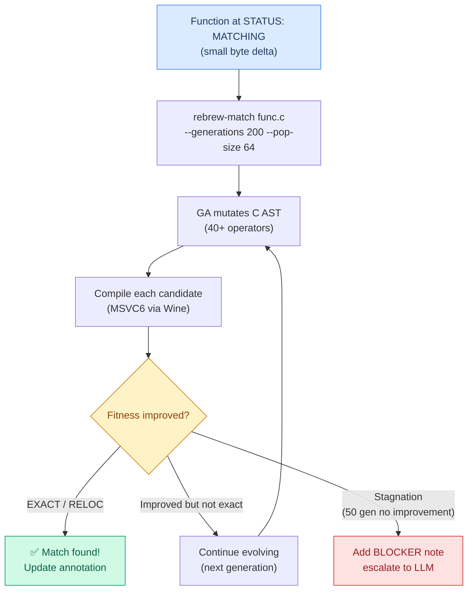

---

## 6. AI Zero-Shot Decompilation (Workflow A)

> **As an AI Operator**, I want the LLM to generate an initial C implementation from assembly so that I get a semantic baseline without manual effort.

### Acceptance Criteria
- ASM extracted via `rebrew-asm` and fed to LLM with RAG context
- RAG resolves called function signatures, globals, strings, and caller context
- Output normalized (C89 dialect, proper annotation header prepended)
- Result tested and classified automatically

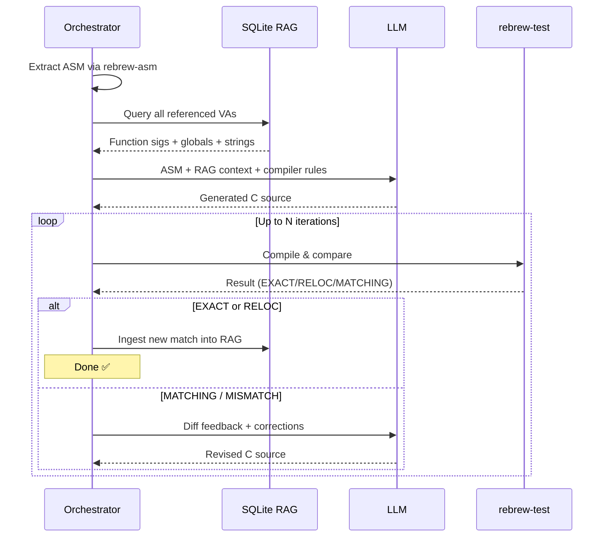

---

## 7. Autonomous Agent Batch Processing

> **As an AI Operator**, I want to run the agent overnight to process an entire binary's worth of functions so that I can review results in the morning.

### Acceptance Criteria
- Agent auto-selects workflow (A/B/C/D/E) per function based on state
- Score monotonicity enforced (never makes a function worse)
- Shadow workspace (`staging/`) used — never writes directly to `src/`
- Git branch `agent/batch-<timestamp>` created for all changes
- Run report generated with stats, stalled functions, and audit trail

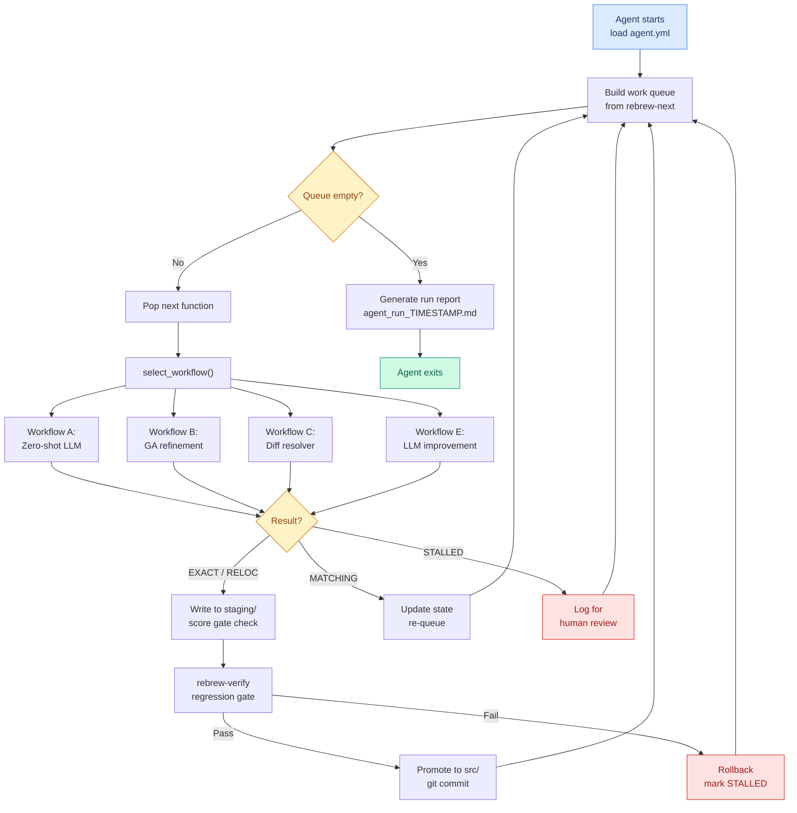

---

## 8. Ghidra ↔ Local Sync

> **As an RE Dev**, I want improvements from my `.c` files pushed to Ghidra (and vice versa) so that the decompiler always shows resolved names and correct types.

### Acceptance Criteria
- `rebrew-sync --push` pushes function names, comments, and bookmarks to Ghidra via ReVa MCP
- Generic `func_XXXXXXXX` labels are skipped by default (`--skip-generic`)
- Struct definitions pushed via `parse-c-structure` MCP tool
- Ghidra decompilation and struct info can be pulled into local `.c` files
- Sync is bidirectional and incremental

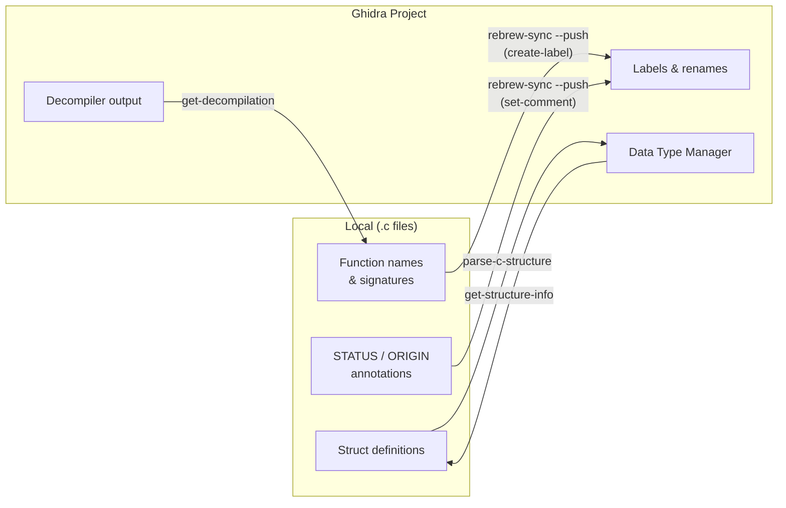

### Recommended Sync Cycle

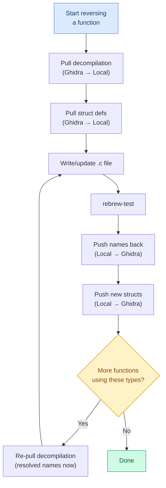

---

## 9. Cold-Start Bootstrapping (Workflow D)

> **As a Project Lead**, I want to bootstrap an entirely new binary from scratch so that the RAG database gets seeded progressively and enables the snowball effect.

### Acceptance Criteria
- `rebrew-init` scaffolds the project directory and config
- Function boundaries detected via radare2/Ghidra
- FLIRT identifies library functions automatically
- `rebrew-triage` classifies and prioritizes all functions
- Smallest leaf functions processed first (snowball strategy)
- Each match enriches RAG for subsequent functions

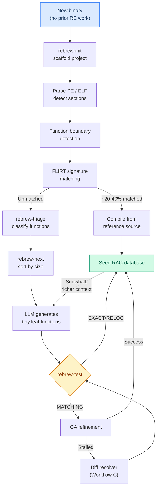

---

## 10. Progress Monitoring & Verification

> **As a Project Lead**, I want to see at-a-glance progress stats and verify all existing matches still hold so that I can track coverage and catch regressions.

### Acceptance Criteria
- `rebrew-status` shows at-a-glance reversing progress overview
- `rebrew-next --stats` shows function counts by status and origin
- `rebrew-verify` bulk-compiles and re-verifies all `.c` files
- `rebrew-catalog --json` regenerates coverage JSON and function registry
- `rebrew-build-db` updates the dashboard database
- `rebrew-verify` regression gate prevents breaking existing matches

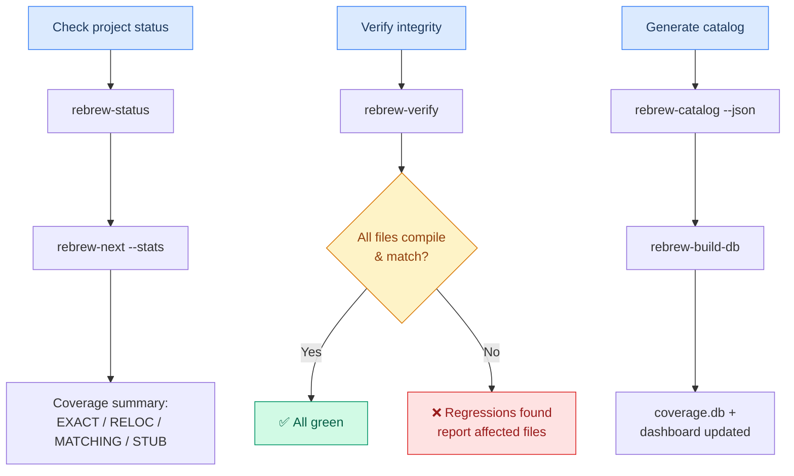

---

## 11. Annotation Linting & Quality

> **As a Contributor**, I want the linter to catch annotation mistakes in my `.c` files so that all files follow the project's annotation standard.

### Acceptance Criteria
- `rebrew-lint` checks all annotation fields (FUNCTION, STATUS, ORIGIN, SIZE, CFLAGS)
- Error codes E001–E017 for hard errors, W001–W015 for warnings
- `rebrew-lint --fix` auto-migrates old annotation formats
- Running lint twice changes nothing (idempotent)

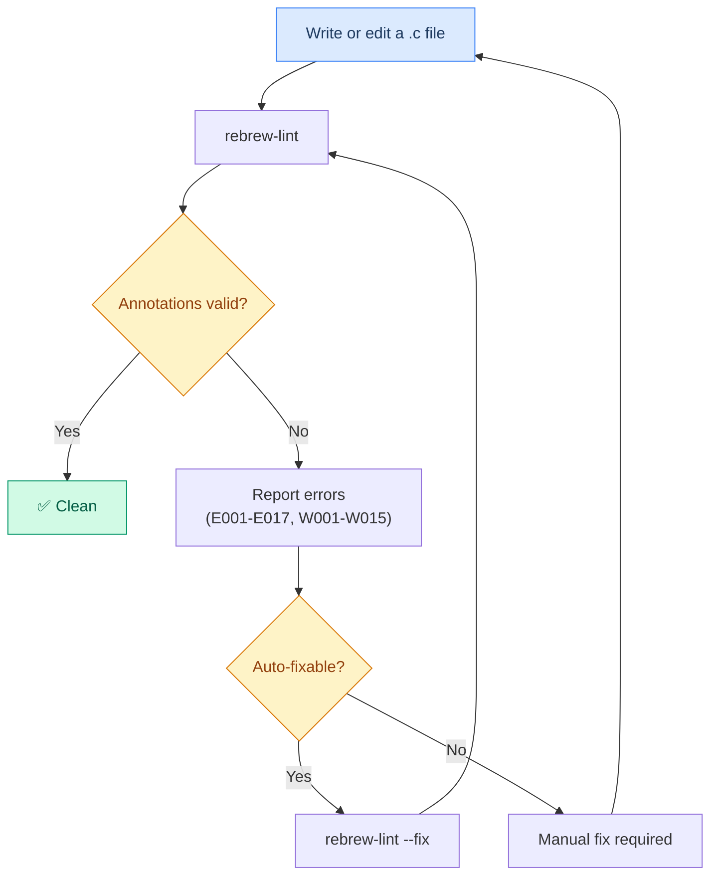

---

## 12. FLIRT Signature Identification

> **As an RE Dev**, I want to scan the target binary against FLIRT signatures so that known library functions (CRT, zlib, Lua) are identified without wasting LLM tokens.

### Acceptance Criteria
- `.sig` / `.pat` files loaded from signature directory
- Scans `.text` section in 16-byte aligned chunks
- Matches reported with VA and function name
- Custom `.pat` files can be generated from any `.lib` archive

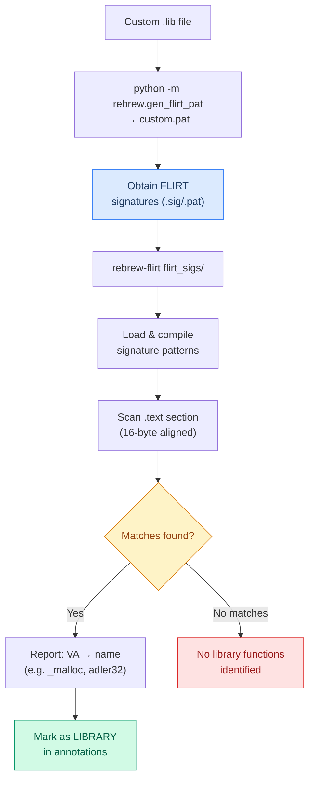

---

## 13. Improving Existing Decompilations (Workflow E)

> **As an AI Operator**, I want the LLM to take a fresh pass at existing MATCHING functions so that functions close to RELOC can be pushed over the finish line.

### Acceptance Criteria
- Existing `.c` file + diff fed to LLM with BLOCKER context
- Targeted fixes (swap if/else, adjust comparisons) without full rewrite
- If still MATCHING after LLM, hand off to GA (Workflow B)
- Score must improve or change is rejected

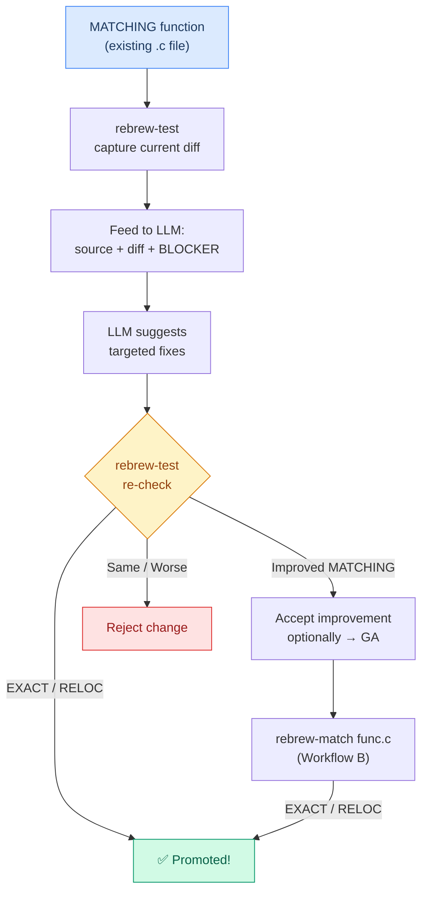

---

## 14. Cosmetic Improvements on Matched Functions

> **As an RE Dev**, I want to rename variables and add comments on EXACT/RELOC functions without risking the byte match so that the codebase is more readable over time.

### Acceptance Criteria
- Variable renames, comments, whitespace changes are allowed on frozen functions
- Change compiled → bytes compared → **must be byte-identical**
- If bytes differ at all, the edit is rejected (it wasn't purely cosmetic)

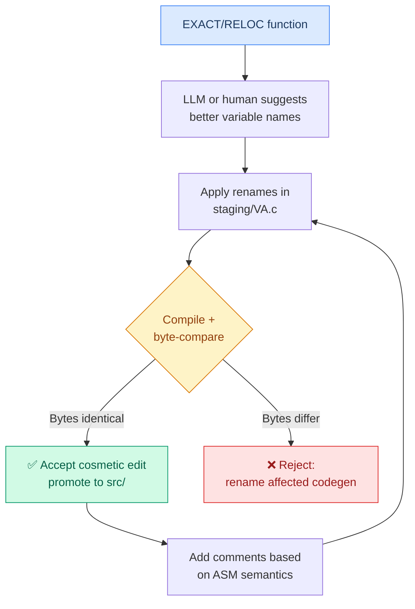

---

## End-to-End Pipeline Summary

> **As an AI Operator**, I want the full pipeline from `.exe` to `.c` files to run autonomously so that overnight batch processing maximizes coverage.

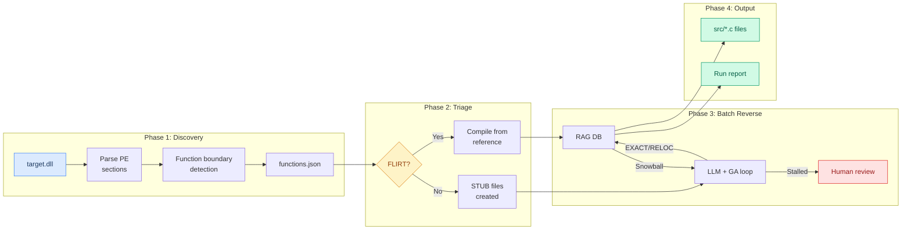
