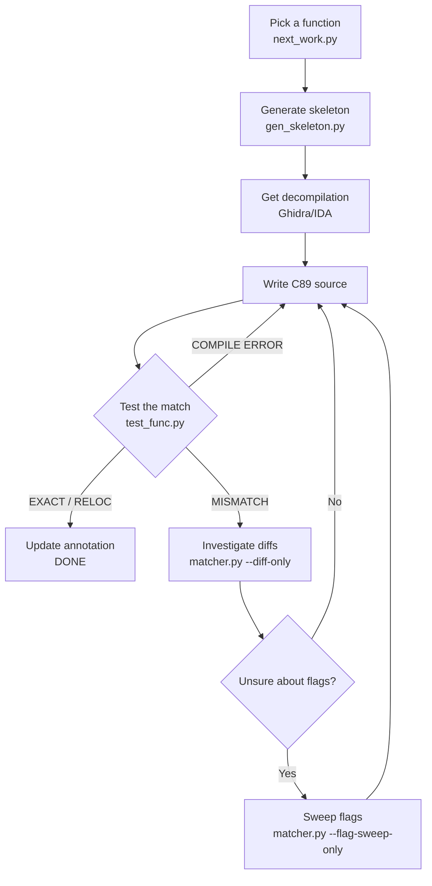
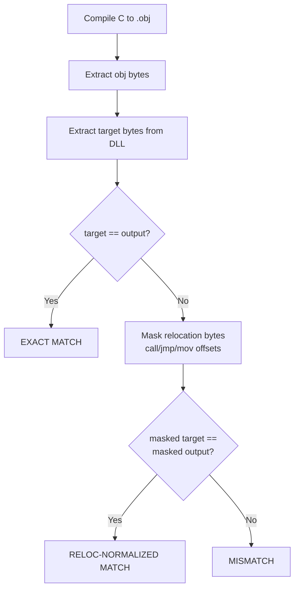
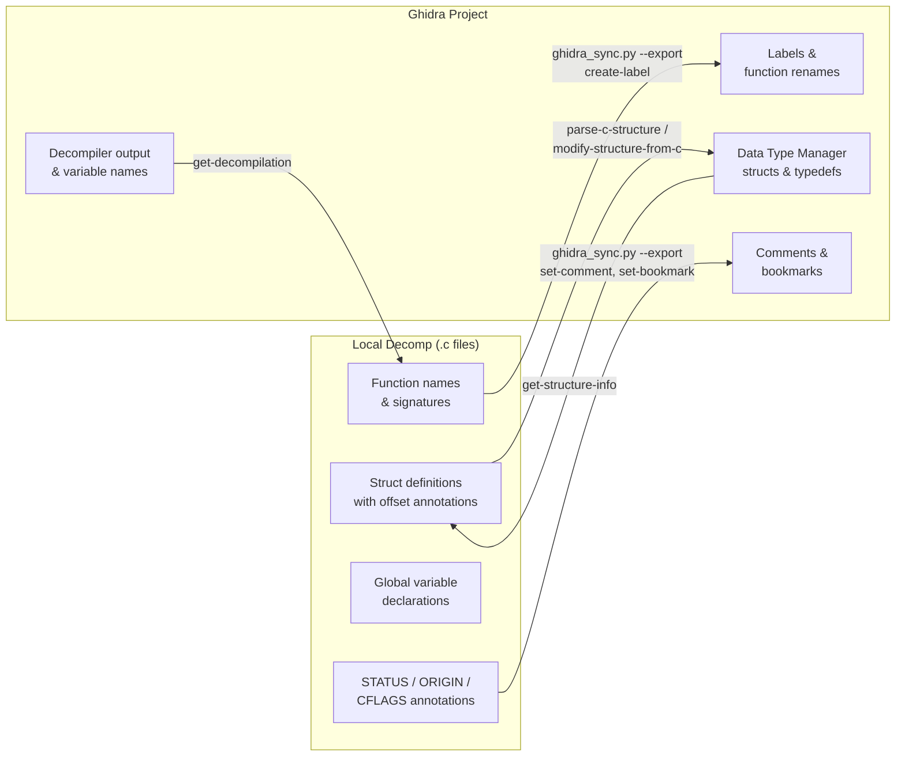
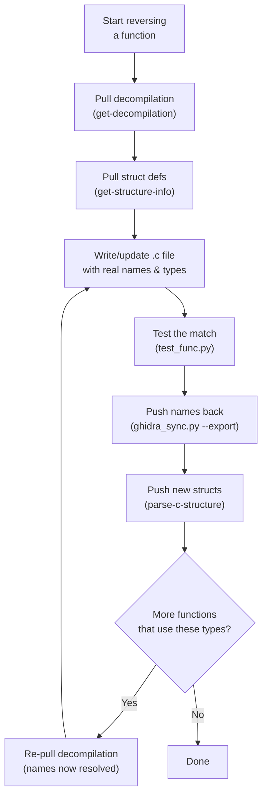

# Decompilation Workflow Guide

Step-by-step guide for reverse engineering server.dll functions.
Aimed at AI agents and new contributors.

## Prerequisites

- MSVC6 toolchain at `tools/MSVC600/VC98/` (already in repo)
- Wine installed and working
- Python with dependencies (`pefile`, `capstone`, `pygad`, etc.) specified in `pyproject.toml`. Install them using: `uv sync`
- Ghidra with ReVa MCP (optional but strongly recommended)

## Quick Reference

```bash
# See what needs work
rebrew-next --stats
rebrew-next --origin GAME -n 30

# Generate a skeleton .c file
rebrew-skeleton 0x10003da0

# Test a function
rebrew-test src/server_dll/my_func.c --update

# Structural diff (see exactly which bytes differ)
rebrew-match \
    --cl "wine tools/MSVC600/VC98/Bin/CL.EXE" \
    --inc "tools/MSVC600/VC98/Include" \
    --cflags "/nologo /c /O2 /MT /Gd" \
    --diff-only src/server_dll/my_func.c \
    --target-exe original/Server/server.dll \
    --target-va 0x10003da0 --target-size 160 \
    --symbol "_my_func" --seed-c src/server_dll/my_func.c

# Run the GA to auto-search for matching source
rebrew-match \
    --cl "wine tools/MSVC600/VC98/Bin/CL.EXE" \
    --inc "tools/MSVC600/VC98/Include" \
    --cflags "/nologo /c /O2 /MT /Gd" \
    --target-exe original/Server/server.dll \
    --target-va 0x10003da0 --target-size 160 \
    --symbol "_my_func" \
    --seed-c src/server_dll/my_func.c \
    --out-dir run_my_func \
    --generations 200 --pop 64 --elite 8 -j 16 --diff

# Validate all annotations
rebrew-catalog --summary

# Batch test all reversed functions
./tools/batch_test.sh

# [EXPERIMENTAL] Scan DLL against FLIRT signatures
uv run python tools/identify_libs.py flirt_sigs/
```

## Step-by-Step Process



### 1. Pick a function

```bash
rebrew-next --origin GAME -n 10
```

Pick from the top of the list (smallest = easiest).
Difficulty ratings: `*` = trivial, `*****` = very hard.

### 2. Generate skeleton

```bash
rebrew-skeleton 0x<VA>
```

This creates `src/server_dll/<name>.c` with proper annotations and
prints the exact test command.

### 3. Get the decompilation

If you have Ghidra + ReVa MCP:
```
get-decompilation programPath="/server.dll" functionNameOrAddress="0x<VA>"
```

the function at the given VA in `original/Server/server.dll`.

Alternatively, use the built-in offline disassembler script:
```bash
rebrew-asm 0x<VA> <SIZE>
```

Or you can try to automatically identify it against known FLIRT signatures (**experimental**):
```bash
uv run python tools/identify_libs.py [path_to_sig_directory]
```

### 4. Write C89 source

Replace the TODO placeholder in the skeleton with actual C code.

**Critical C89 rules (MSVC6):**
- Declare ALL variables at the top of each block (before any statements)
- No `//` comments inside function bodies (use `/* */` instead)
- No `for(int i=0; ...)` — declare `int i;` separately
- No mixed declarations and code
- No C99 features (`_Bool`, `restrict`, VLAs, etc.)

**Calling convention:**
- Game functions: `__cdecl` (default with `/Gd` flag)
- Win32 API imports: `__stdcall` (use `__declspec(dllimport)`)
- Symbol decoration: `_funcname` for cdecl, `_funcname@N` for stdcall

**Common patterns:**
```c
/* Extern declarations for globals */
extern int g_some_global;
extern void *DAT_10035000;

/* Extern declarations for called functions */
extern int __cdecl SomeOtherFunc(int param);

int __cdecl my_func(int param_1, char *param_2)
{
    int result;       /* declare all vars first */
    char *ptr;
    int i;

    ptr = *(char **)(param_1 + 0x5d);
    if (ptr == 0)
        return -1;

    for (i = 0; i < 10; i++) {
        /* loop body */
    }

    result = SomeOtherFunc(*(int *)(param_1 + 8));
    return result;
}
```

### 5. Test the match

```bash
rebrew-test src/server_dll/my_func.c --update
```

**Possible results:**

| Result | Meaning | Action |
|--------|---------|--------|
| `EXACT MATCH` | Byte-for-byte identical | Set STATUS: EXACT |
| `RELOC-NORMALIZED MATCH` | Identical except relocation addresses | Set STATUS: RELOC |
| `MISMATCH` with same size | Logic matches but some bytes differ | Set STATUS: MATCHING, investigate diffs |
| `MISMATCH` with different size | Significantly different code generation | Investigate with diff mode |
| `COMPILE ERROR` | C code doesn't compile | Fix syntax errors |
| `Symbol not found` | Wrong symbol name | Check the decorated name |

### 6. If MISMATCH — use diff mode

```bash
rebrew-match \
    --cl "wine tools/MSVC600/VC98/Bin/CL.EXE" \
    --inc "tools/MSVC600/VC98/Include" \
    --cflags "/nologo /c /O2 /MT /Gd" \
    --compare-obj \
    --diff-only src/server_dll/my_func.c \
    --target-exe original/Server/server.dll \
    --target-va 0x<VA> --target-size <SIZE> \
    --symbol "_my_func" --seed-c src/server_dll/my_func.c
```

**Diff markers:**
- `==` identical bytes
- `~~` relocation-only difference (acceptable)
- `**` structural difference (needs fixing)

### 7. If unsure about compiler flags — sweep

```bash
rebrew-match \
    --cl "wine tools/MSVC600/VC98/Bin/CL.EXE" \
    --inc "tools/MSVC600/VC98/Include" \
    --cflags "/nologo /c /MT" \
    --flag-sweep-only \
    --target-exe original/Server/server.dll \
    --target-va 0x<VA> --target-size <SIZE> \
    --symbol "_my_func" \
    --seed-c src/server_dll/my_func.c -j 16
```

### 8. Update the annotation

Based on test results, update the header:
```c
// FUNCTION: SERVER 0x<VA>
// STATUS: RELOC              <-- update this
// ORIGIN: GAME
// SIZE: <SIZE>
// CFLAGS: /O2 /Gd
// SYMBOL: _my_func
```

If STATUS is MATCHING, add a BLOCKER line:
```c
// STATUS: MATCHING
// BLOCKER: loop-tail inversion (3B size diff)
```

## Compiler Flags by Origin

| Origin | CFLAGS | Notes |
|--------|--------|-------|
| GAME | `/O2 /Gd` | Full optimization, cdecl calling convention |
| MSVCRT | `/O1` | Size optimization. Some need `/O1 /Oy-` (frame pointer) or `/O1 /Oi` (intrinsics) |
| ZLIB | `/O2` | Full optimization (no `/Gd` needed — zlib uses default cdecl) |

Always include `/nologo /c /MT` as base flags (added automatically by test_func.py).

## Annotation Format

Every .c file MUST start with an annotation block. See AGENTS.md for full spec.

Required fields: marker (FUNCTION/LIBRARY/STUB), STATUS, ORIGIN, SIZE, CFLAGS.
Recommended: SYMBOL, SOURCE (for CRT/ZLIB), BLOCKER (for MATCHING/STUB).

Two comment styles are both valid:
```c
// FUNCTION: SERVER 0x10003da0
// STATUS: RELOC
```
```c
/* FUNCTION: SERVER 0x10003da0 */
/* STATUS: RELOC */
```

## Known MSVC6 Codegen Patterns

These affect whether your code produces matching bytes:

| Pattern | Effect | Solution |
|---------|--------|----------|
| Variable declaration order | Changes register allocation | Match Ghidra's variable order |
| `for` vs `do-while` loops | Different loop peeling behavior | Try both |
| `>=` vs `>` comparisons | `>=5` generates `jl`, `>4` generates `jle` | Check target's comparison opcodes |
| `char` vs `int` return type | `char` uses `mov al,N` (2B), `int` uses `mov eax,N` (5B) | Match target's return instruction size |
| Store ordering | Controls parameter load scheduling | Match Ghidra's assignment order |
| FPU operand order | `fld [a]; fmul [b]` vs `fld [b]; fmul [a]` | Both are mathematically equal but produce different bytes; NOT controllable from C |
| `BOOL retcode = TRUE` | Extends live range, affects register pressure | Initialization at declaration matters |
| Frame pointer (`push ebp; mov ebp,esp`) | Indicates `/Oy-` flag needed | Check prologue for `push ebp` |
| Switch with jump table | Table appears after function body | Test harness ignores table bytes |
| `signed` vs `unsigned` shift | `(int)x >> n` = `sar`, `(unsigned)x >> n` = `shr` | Check target's shift instructions |
| `>= N` vs `> N-1` constants | `x >= 1` → `cmp ecx,1; jl` (exact constant); `0 < x` → `test ecx,ecx; jle` (optimized away) | Always use `>=`/`<=` with the EXACT constant from the target binary |
| `<= 0` vs `< 1` encoding | `<= 0` → `test reg,reg; setle` (2B test); `< 1` → `cmp reg,1; setl` (3B cmp) | `<= 0` saves 1 byte; check target for `test` vs `cmp ,1` |
| Byte param zero-extend | `mov dl,[reg+off]` vs `xor edx,edx; mov dl,[reg+off]` — compiler decides based on register liveness | NOT controllable from C; causes 2B diff per occurrence; accept as MATCHING blocker |
| `if/else` nesting order | First checked condition becomes the fallthrough path; reversing nesting changes branch targets | Match the original nesting order exactly — `if (ptr != NULL)` first, not `if (ptr == NULL) { } else` |
| `unsigned char *` vs `char *` | `char *` → `MOVSX` (sign-extend), `unsigned char *` → `AND reg, 0xFF` (zero-extend) | Check target for `movsx` vs `and 0xff` to determine signedness |
| Short vs far branch encoding | Small target offsets (≤127B) use `jne rel8` (2B); larger use `je rel32` (6B) — 4B diff per branch | Opposite condition with far jump is 4B larger; reorder blocks to minimize branch distance |
| `if (x == -1) return -1;` idiom | Generates `inc/neg/sbb` (7B); `(x != -1) - 1` generates `setne` (13B) | Use explicit `if` + `return` for the compact form; avoid expression tricks |
| `memcpy()` inlining | `memcpy()` inlines to `rep movsd/movsw/movsb`; explicit loops do NOT | Use `memcpy()` when target has `rep movs`; never hand-roll byte loops |
| `goto` for shared error tail | `goto label;` at end of if-block controls block ordering in output | Use `goto` to merge duplicate return paths and match block layout |
| Eliminating intermediate pointers | Removing a temp pointer var in loops can fix register allocation | If loop uses extra callee-saved reg, try inlining `arr[i].field` directly |
| `__stdcall` without `__declspec(dllimport)` | Produces `CALL thunk` instead of `CALL DWORD PTR [IAT]` | For Winsock/DLL imports, declare as plain `__stdcall` prototypes |

## File Naming Conventions

| Origin | Prefix | Example |
|--------|--------|---------|
| GAME | `game_` | `game_alloc_object.c` |
| MSVCRT | `crt_` | `crt_sbh_heap_init.c` |
| ZLIB | `zlib_` | `zlib_adler32.c` |
| Unknown/Unnamed | `func_` | `func_10003da0.c` |

## Reference Sources

| Source | Location | Use for |
|--------|----------|---------|
| MSVC6 CRT source | `tools/MSVC600/VC98/CRT/SRC/` | Heap, I/O, startup functions |
| CRT source (extended) | github.com/shihyu/learn_c/tree/master/vc_lib_src/src | Missing CRT files |
| zlib 1.1.3 | `references/zlib-1.1.3/` | All zlib functions |
| reccmp annotations | `tools/reccmp/docs/annotations.md` | Annotation format spec |
| reccmp recommendations | `tools/reccmp/docs/recommendations.md` | Best practices |

## Match Types Explained

When you compile your C source and compare against the target function bytes from the DLL,
the test harness classifies the result into one of these categories:

### EXACT

Byte-for-byte identical. Every single byte in your compiled .obj matches the target bytes
extracted from the DLL. This is the gold standard.

```
Target:  53 8b 5c 24 08 56 57 8b 43 10 50 e8 f0 83 00 00
Output:  53 8b 5c 24 08 56 57 8b 43 10 50 e8 f0 83 00 00
         == == == == == == == == == == == == == == == ==
```

This is rare in practice because `call` and `jmp` instructions encode relative offsets
that depend on where the function is placed in the final binary. You get EXACT when
the function has no calls to other functions and no references to global variables, or
when comparing at the .obj level with the same linker layout.

### RELOC

Identical after masking relocatable bytes. The function's logic, register allocation,
and control flow are all correct. The only differences are in bytes that the linker
patches at link time:

- `call rel32` (`E8 xx xx xx xx`) — the 4-byte displacement after a call opcode
- `jmp rel32` (`E9 xx xx xx xx`) — long jump displacements
- `mov eax, [abs32]` (`A1 xx xx xx xx`) — absolute address loads
- `cmp [abs32], imm` (`83 3D xx xx xx xx yy`) — comparisons against globals

```
Target:  50 e8 f0 83 00 00 8b f8 83 c4 04 a1 80 58 03 10
Output:  50 e8 00 00 00 00 8b f8 83 c4 04 a1 00 00 00 00
         == ~~ ~~ ~~ ~~ ~~ == == == == == ~~ ~~ ~~ ~~ ~~
```

The `~~` bytes are relocation-only differences — the linker would fill these in with the
correct addresses. A RELOC match means your source code is functionally correct and
produces the same machine code structure. **This is the typical best result** for
functions that reference globals or call other functions.

### MATCHING

The compiled output is close but not identical even after relocation masking. There are
structural byte differences (`**` in diff output) — meaning the compiler generated
slightly different instructions. Common causes:

| Cause | Example | Fix |
|-------|---------|-----|
| Wrong comparison operator | `< 2` generates `cmp 2; setl` vs `<= 1` generates `cmp 1; setle` | Try the equivalent expression |
| Register allocation swap | Counter in EAX vs ECX | Change variable declaration order, types, or usage |
| Loop structure | Peeled first iteration, inverted exit condition | Try `for` vs `do-while` vs `while` |
| Code block ordering | `return 1` placed before vs after `return 0` | Restructure if/else/goto |
| Addressing mode | `[eax + ecx*4]` vs `[ecx]` with separate `add ecx, 4` | Change how you express pointer arithmetic |
| Extra indirection | `mov reg, [global]; call [reg+off]` vs `call [off+global]` | Use array declaration instead of pointer-to-pointer |

A MATCHING file should include a `BLOCKER` annotation describing the specific difference:
```c
// STATUS: MATCHING
// BLOCKER: register allocation (esi/edi swap) + loop peeling, 123B vs 130B
```

### MATCHING_RELOC

Like MATCHING but even closer — the only structural differences are small (1-5 bytes)
and the rest matches after relocation masking. Worth iterating on.

### STUB

Placeholder or far-off implementation. The compiled output is significantly different
from the target — wrong size, wrong structure, or still contains TODO placeholders.
A STUB should always have a `BLOCKER` annotation:

```c
// STATUS: STUB
// BLOCKER: needs complete rewrite, 199B vs 163B
```

### How test_func.py Classifies Results



```text
1. Compile your .c file to a .obj with MSVC6 under Wine
2. Extract the symbol's bytes from the .obj (COFF parser)
3. Extract the target bytes from the DLL at the given VA
4. Compare:
   a. If target_bytes == output_bytes → EXACT MATCH
   b. Else, mask relocation bytes in both (zero out call/jmp/mov displacements)
      If masked_target == masked_output → RELOC-NORMALIZED MATCH
   c. Else → MISMATCH (shows byte count and hex dump)
```

### Relocation Masking Details

The normalizer (`_normalize_reloc_x86_32`) walks the x86 instruction stream and zeros
out bytes that are expected to differ between compilations:

| Pattern | Opcode | Bytes zeroed | Why |
|---------|--------|-------------|-----|
| `call rel32` | `E8` | bytes 1-4 | Call target is a relative offset from current IP |
| `jmp rel32` | `E9` | bytes 1-4 | Jump target is a relative offset |
| `mov eax, [moffs32]` | `A1` | bytes 1-4 | Absolute address of a global variable |
| `cmp [abs32], imm8` | `83 3D` | bytes 2-5 | Address of global in comparison |
| Conditional jumps near | `0F 8x` | bytes 2-5 | 32-bit relative offsets in Jcc instructions |
| `push imm32` | `68` | bytes 1-4 | Only when value looks like an address (> 0x10000000) |
| `mov reg, imm32` | `B8`-`BF` | bytes 1-4 | Only when value looks like an address |
| `mov reg, [abs32]` | `8B 0D/15/1D/25/2D/35/3D` | bytes 2-5 | Global variable loads |
| `mov [abs32], reg` | `89 0D/15/1D/25/2D/35/3D` | bytes 2-5 | Global variable stores |

After masking, if the bytes are identical, the code is structurally the same — only the
linker-dependent addresses differ. This is the RELOC match.

## Non-Matchable Functions (Skip These)

- **IAT thunks**: 6-byte `jmp [addr]` stubs (8 total) — not C code
- **ASM builtins**: `memset`, `strcmp`, `strstr`, `strchr`, `strlen`, `strncpy`, `strpbrk`, `strcspn`, `__local_unwind2`, `__aulldiv`, `__aullrem` — hand-written assembly
- **Single-byte stubs**: `ret` alignment padding — not real functions

### SEH (Structured Exception Handling) Helpers

SEH helper functions in MSVCRT are **not matchable from pure C89 source**. These functions manipulate the exception handling frame directly in ways that cannot be expressed in C.

**Identified SEH helpers in server.dll:**

| VA | Size | Name | Description |
|----|------|------|-------------|
| 0x1001e726 | 24B | `__local_unwind2` | Core unwinder for local exception frames |
| 0x1001e899 | 27B | `FUN_1001e899` | SEH frame restore helper |
| 0x1001e8ba | ~20B | `FUN_1001e8ba` | Exception filter helper |

**Why they're unmatchable:**

1. **Frame pointer manipulation**: These functions load `ebp` from a saved value in an exception frame structure, not from the normal stack. Example from `FUN_1001e899`:
   ```asm
   push ebp
   mov ecx, [esp+8]      ; get frame pointer from parameter
   mov ebp, [ecx]        ; load ebp from exception frame - NOT possible in C
   mov eax, [ecx+0x1c]   ; get saved value
   push eax
   call __local_unwind2
   ...
   ```

2. **Non-standard control flow**: SEH functions use `ret N` (stack-cleaning return) with custom calling conventions that don't match `__cdecl` or `__stdcall`.

3. **Exception registration manipulation**: These functions directly modify the Windows exception registration chain (`fs:[0]`), which cannot be done portably in C.

**How to handle them:**

- Mark as `STUB` with BLOCKER: `"SEH helper - not matchable from C"`
- Don't waste time trying to match them - they're CRT internal functions
- The actual game code doesn't call these directly; they're only used by the exception handling runtime

**Verification pattern**: If you see a function that:
- Loads `ebp` from `[reg]` or `[reg+offset]` instead of `mov ebp, esp`
- Uses `ret N` with N > 0 but isn't `__stdcall`
- References `fs:[0]` or exception-related structures
- Has `__local_unwind` or `except` in the call graph

...then it's likely an SEH helper. Mark as STUB and move on.

## Syncing Improvements Between Ghidra and Local Decomp

As you reverse-engineer functions, improvements accumulate in **two places**: your
local `.c` files (names, types, struct definitions, signatures) and the Ghidra project
(decompiler output, renamed labels, data types, structure layouts). Keeping them
in sync prevents duplicated work and ensures each side benefits from the other's
discoveries.

### Overview



### Direction 1: Ghidra → Local (Pull)

Use these patterns when Ghidra has information you want in your `.c` files.

#### Pulling decompilation (function signatures & logic)

```
get-decompilation programPath="/server.dll" functionNameOrAddress="0x<VA>"
```

From the output, extract:
- **Function signature** → update your `extern` declarations and the function prototype
- **Parameter names** → use Ghidra's suggested names as a starting point
- **Calling convention** → confirm `__cdecl` vs `__stdcall` from Ghidra's analysis
- **Variable count and types** → match Ghidra's local variable declarations

#### Pulling struct/type definitions

```
get-structure-info programPath="/server.dll" structureName="<name>"
```

Copy the struct layout into your `.c` file with offset annotations:

```c
// SIZE 0x24
typedef struct {
    int field_0x00;         // 0x00
    int field_0x04;         // 0x04
    void *pData;            // 0x08
    /* ... */
} MyStruct;
```

#### Pulling the full function list (offline cache)

```bash
rebrew-catalog --export-ghidra
```

This caches all Ghidra function entries to `src/server_dll/ghidra_functions.json`
so that `gen_skeleton.py` and `next_work.py` work offline.

#### Pulling cross-references (callers & callees)

```
find-cross-references programPath="/server.dll" addressOrSymbol="0x<VA>"
get-call-graph programPath="/server.dll" functionNameOrAddress="0x<VA>"
```

Use xrefs to discover:
- Who calls this function → infer parameter types from call sites
- What this function calls → determine which `extern` declarations you need
- Data references → identify globals and their types

### Direction 2: Local → Ghidra (Push)

Use these patterns when your local `.c` files have improvements that should
be reflected in Ghidra.

#### Pushing function names and annotations (batch)

```bash
rebrew-sync --export
```

This reads all annotation headers from `src/server_dll/*.c` and generates
`ghidra_commands.json` containing ReVa MCP operations:

| Operation | What it does |
|-----------|-------------|
| `create-label` | Renames the function at the VA to your local name |
| `set-comment` | Adds a plate comment with STATUS, ORIGIN, CFLAGS, SYMBOL |
| `set-bookmark` | Bookmarks the function under its origin category |

To apply them via MCP, iterate the commands:
```
create-label programPath="/server.dll" addressOrSymbol="0x10003DA0" labelName="alloc_game_object"
set-comment programPath="/server.dll" addressOrSymbol="0x10003DA0" comment="..." commentType="plate"
```

#### Pushing struct definitions to Ghidra

When you've recovered a struct in your `.c` file, push it to Ghidra's Data Type
Manager so the decompiler uses it everywhere:

```
parse-c-structure programPath="/server.dll" cCode="typedef struct { int bitvEntryHi; int bitvEntryLo; int bitvCommit; void *pHeapData; void *pRegion; } HEADER;"
```

To update an existing Ghidra struct:

```
modify-structure-from-c programPath="/server.dll" structureName="HEADER" cCode="typedef struct { ... };"
```

#### Pushing individual renames (ad-hoc)

When you discover a function's real name during RE but haven't written a full
`.c` file yet:

```
create-label programPath="/server.dll" addressOrSymbol="0x10001000" labelName="inflate_init"
set-comment programPath="/server.dll" addressOrSymbol="0x10001000" comment="zlib inflateInit2_ wrapper" commentType="plate"
```

### Recommended Sync Cycle

Follow this cycle to keep both sides current:



**Key principle**: After naming a function or defining a struct locally, push it
to Ghidra *before* moving on. This way, the next function you pull from Ghidra
will already show the resolved names instead of `FUN_XXXXXXXX`, making each
successive function easier to understand.

### What to sync and when

| Discovery | Sync direction | When |
|-----------|---------------|------|
| You name a function in `.c` | Local → Ghidra (`create-label`) | Immediately after test passes |
| You define a struct in `.c` | Local → Ghidra (`parse-c-structure`) | After struct is verified via byte match |
| You discover a function's calling convention | Local → Ghidra (via comment) | When confirmed by byte match |
| Ghidra renames are better than yours | Ghidra → Local (manual) | When starting work on related function |
| Ghidra shows a struct you haven't defined | Ghidra → Local (`get-structure-info`) | When starting function that uses it |
| You identify a global variable's type | Both directions | Push to Ghidra comment + update `.c` extern |
| A batch of functions is done | Local → Ghidra (`ghidra_sync.py`) | At session end or milestone |

### Current Limitations

> [!NOTE]
> The sync is currently **semi-manual**. There is no fully automated
> round-trip tool that watches for changes on either side and propagates
> them. The recommended workflow relies on the MCP tools and
> `ghidra_sync.py` as building blocks.

**Not yet automated:**
- Pulling Ghidra renames back into annotation headers (requires parsing MCP output)
- Syncing Ghidra's variable renames into local `.c` files
- Detecting when Ghidra and local disagree on a type/name
- Pushing `extern` function declarations as Ghidra function signatures with parameter types

**Future improvements** (from AI_RAG_PRD §5.3):
- Expand `ghidra_sync.py` to dump decompiled pseudo-C per function
- Add `--import` mode to pull Ghidra renames/types back into `.c` files
- Build a diffing tool that compares local annotations against Ghidra state

## Experimental Tools

> [!WARNING]
> The tools in this section are experimental and may produce incomplete or incorrect results.
> They are provided as aids, not as replacements for manual analysis.

### FLIRT Signature Scanner (`identify_libs.py`)

Automatically identifies known library functions in the target DLL by matching
against [IDA FLIRT](https://hex-rays.com/products/ida/tech/flirt/) signature
files (`.sig` / `.pat`). This runs standalone — **no IDA Pro required**.

> [!TIP]
> For a comprehensive guide on obtaining, creating, and troubleshooting FLIRT
> signatures, see [FLIRT_SIGNATURES.md](FLIRT_SIGNATURES.md).

Uses the [`python-flirt`](https://pypi.org/project/python-flirt/) library.

**Usage:**
```bash
# Scan using signatures in the flirt_sigs/ directory
uv run python tools/identify_libs.py flirt_sigs/

# Scan using a custom signature directory
uv run python tools/identify_libs.py /path/to/my/signatures/
```

**Where to get signatures:**

Place `.sig` or `.pat` files into the `flirt_sigs/` directory. Pre-generated
signatures for the MSVC6 CRT are already included (generated from the repo's
own `tools/MSVC600/VC98/Lib/` files).

Community sources for additional signatures:

| Repository | URL | Notes |
|------------|-----|-------|
| Maktm/FLIRTDB | github.com/Maktm/FLIRTDB | Community DB, has Lua VC6 sigs |
| push0ebp/sig-database | github.com/push0ebp/sig-database | Broad MSVC coverage (VC12+) |

**Generating your own `.pat` files** from any COFF `.lib` archive:
```bash
uv run python tools/gen_flirt_pat.py tools/MSVC600/VC98/Lib/LIBCMT.LIB -o flirt_sigs/libcmt_vc6.pat
```

**How it works:**
1. Loads all `.sig`/`.pat` files from the given directory
2. Compiles them into a matching engine via `python-flirt`
3. Scans the `.text` section of the target binary in 16-byte aligned chunks
4. Reports any function signature matches with their VA and name

### Assembly Dumper (`dump_asm.py`)

Quick offline disassembly of a function from the target binary using
`pefile` + `capstone`. Useful when Ghidra MCP is unavailable or for
quick spot-checks.

```bash
rebrew-asm 0x<VA> [SIZE]
```

## Bootstrapping a New Binary

Step-by-step guide for adding an entirely new executable or DLL to the project
when **no prior RE work exists** for it — no `.c` files, no `ghidra_functions.json`,
no catalog entries.

### 1. Place the binary

Copy the target file into the `original/` directory under a descriptive subfolder:

```bash
mkdir -p original/MyGame
cp /path/to/mygame.exe original/MyGame/mygame.exe
```

### 2. Register the target in `rebrew.toml`

Add a new entry under `[targets]`. The key becomes the target label used
in annotation markers (e.g., `// FUNCTION: MYGAME 0x...`).

```toml
[targets.server_dll]
binary = "original/Server/server.dll"
format = "pe"
arch = "x86_32"
reversed_dir = "src/server_dll"
function_list = "src/server_dll/r2_functions.txt"

# ↓ New target ↓
[targets.mygame]
binary = "original/MyGame/mygame.exe"
format = "pe"
arch = "x86_32"
reversed_dir = "src/mygame"
function_list = "src/mygame/r2_functions.txt"

[compiler]
profile = "msvc6"
command = "wine tools/MSVC600/VC98/Bin/CL.EXE"
includes = "tools/MSVC600/VC98/Include"
libs = "tools/MSVC600/VC98/Lib"
```

### 3. Create the source directory

```bash
mkdir -p src/mygame
```

This is where all reversed `.c` files for this target will live.

### 4. Discover functions

You need a `ghidra_functions.json` inside the source directory. This is the
function list that `gen_skeleton.py` and `next_work.py` consume.

**Option A — Ghidra (recommended):**

1. Import the binary into a Ghidra project.
2. Run Auto-Analysis (`Analysis → Auto Analyze...`).
3. Export the function list via script or the ReVa MCP plugin.
4. Save as `src/mygame/ghidra_functions.json` with the schema:

```json
[
  {"va": 4198400, "size": 64, "ghidra_name": "FUN_00401000"},
  {"va": 4198464, "size": 128, "ghidra_name": "entry"}
]
```

> [!NOTE]
> VAs must be **integers** (not hex strings). The `ghidra_name` field is used
> for origin detection and filename generation.

**Option B — radare2 (headless):**

```bash
r2 -q -c 'aaa; aflj' original/MyGame/mygame.exe > /tmp/r2_funcs.json
# Convert to rebrew schema:
python3 -c "
import json, sys
funcs = json.load(open('/tmp/r2_funcs.json'))
out = [{'va': f['offset'], 'size': f['size'], 'ghidra_name': f['name']} for f in funcs]
json.dump(out, open('src/mygame/ghidra_functions.json', 'w'), indent=2)
print(f'Exported {len(out)} functions')
"
```

### 5. Identify the compiler and flags

Determine the original compiler so you can set up the correct build backend.

**PE Rich Header (Windows binaries):**

```bash
uv run python -c "
import pefile
pe = pefile.PE('original/MyGame/mygame.exe')
print('Rich header entries:')
for entry in pe.RICH_HEADER.values if hasattr(pe, 'RICH_HEADER') else []:
    print(f'  Product {entry.get(\"prodid\", \"?\")} count {entry.get(\"count\", \"?\")}')
"
```

**Quick heuristic checks:**

| Artifact | Indicates |
|----------|-----------|
| Rich Header with product IDs 0x006x | MSVC6 |
| `.comment` section with `GCC:` string | GCC |
| `__local_unwind2` in imports/code | MSVC with SEH |
| CRT strings like `MSVCRT.dll` in imports | Microsoft runtime |
| Presence of `__libc_start_main` | GCC/Linux |

Once identified, ensure the matching toolchain is available (e.g., `tools/MSVC600/`
for MSVC6, or a system GCC for ELF targets).

### 6. Scan with FLIRT signatures

Run the FLIRT scanner to auto-identify known library functions. This provides
**free wins** — functions that can be matched from reference source without
any manual RE.

```bash
uv run python tools/identify_libs.py flirt_sigs/ \
    --target original/MyGame/mygame.exe
```

If you need signatures for a specific library version, generate them:

```bash
uv run python tools/gen_flirt_pat.py /path/to/LIBCMT.LIB \
    -o flirt_sigs/libcmt_vc6.pat
```

### 7. Adapt tool paths (current limitation)

> [!WARNING]
> Most tools (`gen_skeleton.py`, `next_work.py`, `test_func.py`, `matcher.py`)
> currently hardcode paths to `server.dll` and `src/server_dll/`. Until these
> are made target-aware, you must either:
>
> 1. **Edit the tool constants** (e.g., `SRC_DIR`, `GHIDRA_JSON`, target paths)
>    to point at your new target, or
> 2. **Use the tools manually** by passing explicit `--target-exe`, `--target-va`,
>    and `--symbol` flags to `matcher.py` and `test_func.py`.

Example manual test for a new binary:

```bash
rebrew-test src/mygame/my_func.c _my_func \
    --va 0x00401000 --size 64 \
    --cflags "/O2 /Gd" \
    --target original/MyGame/mygame.exe
```

### 8. Start with leaf functions

Begin with the **smallest, simplest functions** — typically 10–30 byte leaf
functions with no calls to other functions. These are often trivial
getters/setters/wrappers.

```bash
# List the smallest uncovered functions
# (adjust tool paths or use the function list directly)
head -20 src/mygame/ghidra_functions.json | python3 -c "
import json, sys
funcs = sorted(json.load(sys.stdin), key=lambda f: f['size'])
for f in funcs[:20]:
    print(f'0x{f[\"va\"]:08x}  {f[\"size\"]:4d}B  {f[\"ghidra_name\"]}')
"
```

Each successful match becomes context for harder functions — creating a
**snowball effect** where early wins unlock progressively more of the binary.

### 9. Set up annotation conventions

Decide on the origin categories for your binary. For `server.dll`, the origins
are `GAME`, `MSVCRT`, and `ZLIB`. For a new binary, define your own:

```c
// FUNCTION: MYGAME 0x00401000
// STATUS: STUB
// ORIGIN: GAME
// SIZE: 64
// CFLAGS: /O2 /Gd
// SYMBOL: _my_func
```

Update the file naming conventions table in your project notes:

| Origin | Prefix | Example |
|--------|--------|---------|
| GAME | `game_` | `game_init_player.c` |
| ENGINE | `eng_` | `eng_render_frame.c` |
| CRT | `crt_` | `crt_malloc.c` |

### Bootstrapping checklist

```text
[ ] Binary placed in original/<Name>/
[ ] Target added to rebrew.toml under [targets.<name>]
[ ] Source directory created: src/<target>/
[ ] Function list exported: src/<target>/ghidra_functions.json
[ ] Compiler identified and toolchain verified
[ ] FLIRT scan completed, library functions cataloged
[ ] Tool paths adapted or manual commands prepared
[ ] First leaf functions reversed and tested
[ ] Annotation conventions documented
```
