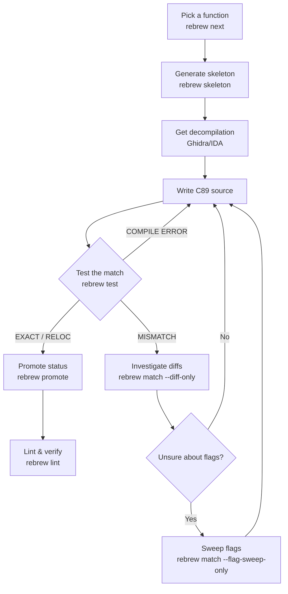

# Decompilation Workflow Guide

Step-by-step guide for reverse engineering target binary functions.
Aimed at AI agents and new contributors.

## Prerequisites

- MSVC6 toolchain at `tools/MSVC600/VC98/` (already in repo)
- Wine installed and working
- Python with dependencies (`lief`, `capstone`, `numpy`, etc.) specified in `pyproject.toml`. Install them using: `uv sync`
- Ghidra with ReVa MCP (optional but strongly recommended)

# Quick Reference

```bash
# Initialize a new project
rebrew init --target target_name --binary target.dll --compiler msvc6

# Verify toolchain health
rebrew doctor

# See what needs work
rebrew next --stats
rebrew next --origin GAME -n 30

# Generate a skeleton .c file
rebrew skeleton --va 0x10003da0

# Test a function
rebrew test src/target_name/my_func.c

# Structural diff (see exactly which bytes differ)
rebrew match \
    --diff-only src/target_name/my_func.c \
    --target-va 0x10003da0 --target-size 160

# Run the GA to auto-search for matching source
rebrew match \
    src/target_name/my_func.c \
    --target-va 0x10003da0 --target-size 160 \
    --out-dir run_my_func \
    --generations 200 --pop-size 64 -j 16 --diff-only

# Validate all annotations
rebrew catalog --summary

# Bulk compile and verify all reversed functions
rebrew verify

# Auto-update STATUS annotations if they drift
rebrew verify --fix-status

# Lint and verify Python health
uv run ruff check .
uv run ruff format .

# Scan DLL against FLIRT signatures
rebrew flirt flirt_sigs/
```

## JSON Output for Automation

All core CLI tools support `--json` for machine-readable output, enabling
scripting and AI agent integration:

```bash
# Test a function and parse results with jq
rebrew test src/target_name/my_func.c --json | jq '.status'

# Get progress stats as JSON
rebrew next --stats --json | jq '.coverage_pct'

# List recommendations as JSON
rebrew next --json -n 10 | jq '.items[] | {va, size, difficulty}'

# List MATCHING functions sorted by byte delta
rebrew next --improving --json | jq '.items[] | select(.byte_delta != null and .byte_delta <= 5)'

# Structured diff output
rebrew match --diff-only --json src/target_name/my_func.c | jq '.summary'

# Disassembly as JSON
rebrew asm 0x10003da0 --size 160 --json | jq '.instructions[] | .mnemonic'
```

**Tools with `--json` support:**
| Tool | Modes |
|------|-------|
| `rebrew test` | Single and multi-function test results |
| `rebrew next` | `--stats`, default recommendations, `--improving`, `--unmatchable`, `--group` |
| `rebrew match` | `--diff-only` mode |
| `rebrew asm` | Disassembly output |
| `rebrew verify` | Verification report |
| `rebrew lint` | Lint results |
| `rebrew flirt` | FLIRT scan results |
| `rebrew status` | Status overview |
| `rebrew data` | Data scan results |
| `rebrew promote` | Promotion results |
| `rebrew triage` | Triage report |
| `rebrew ga` | Batch GA results |
| `rebrew extract` | Batch extraction results |
| `rebrew catalog` | Catalog JSON generation (`--json`) |
| `rebrew doctor` | Project health check results |
| `rebrew sync` | Ghidra sync operations (`--pull`, `--push`) |
| `rebrew skeleton` | Generated skeleton output |

## Step-by-Step Process



### 1. Pick a function

```bash
rebrew next --origin GAME -n 10
```

Pick from the top of the list (smallest = easiest).
Difficulty ratings: `*` = trivial, `*****` = very hard.

> [!TIP]
> `rebrew next` **auto-filters unmatchable functions** (IAT thunks, single-byte
> RET/INT3 stubs, SEH `fs:[0]` handlers) so you only see actionable targets.
> Use `--stats` to see the unmatchable breakdown, or `--unmatchable` to list them.

To see MATCHING functions sorted by how close they are to RELOC:

```bash
rebrew next --improving
```

The **Delta** column shows how many non-reloc bytes differ (parsed from BLOCKER
annotations). Smallest delta = highest ROI for improvement.

### 2. Generate skeleton

```bash
rebrew skeleton 0x<VA>
rebrew skeleton 0x<VA> --decomp                    # with inline decompilation
rebrew skeleton 0x<VA> --decomp --decomp-backend r2dec  # specific backend
```

This creates `src/target_name/<name>.c` with proper annotations and
prints the exact test command. Use `--decomp` to embed pseudo-C from
a decompiler backend (r2ghidra, r2dec, or auto).

To add a function to an existing multi-function file:
```bash
rebrew skeleton 0x<VA> --append existing_file.c
```

### 3. Get the decompilation

If you have Ghidra + ReVa MCP, use the `get-decompilation` tool:
```
get-decompilation programPath="/target.dll" functionNameOrAddress="0x<VA>"
```

This will fetch the decompiled C pseudo-code for the function at the given VA in `original/target.dll`.

Alternatively, use the built-in offline disassembler script:
```bash
rebrew asm --va 0x<VA> --size <SIZE>
```

Or you can try to automatically identify it against known FLIRT signatures (**experimental**):
```bash
rebrew flirt [path_to_sig_directory]
```

### 4. Write C89 source

Replace the TODO placeholder in the skeleton with actual C code.

**Critical C89 rules (MSVC6):**
- Declare ALL variables at the top of each block (before any statements)
- No `//` comments inside function bodies (use `/* */` instead)
- No `for(int i=0; ...)` — declare `int i;` separately
- No mixed declarations and code
- No C99 features (`_Bool`, `restrict`, VLAs, etc.)

**Calling convention:**
- Game functions: `__cdecl` (default with `/Gd` flag)
- Win32 API imports: `__stdcall` (use `__declspec(dllimport)`)
- Symbol decoration: `_funcname` for cdecl, `_funcname@N` for stdcall

**Common patterns:**
```c
/* Extern declarations for globals */
extern int g_some_global;
extern void *DAT_10035000;

/* Extern declarations for called functions */
extern int __cdecl SomeOtherFunc(int param);

int __cdecl my_func(int param_1, char *param_2)
{
    int result;       /* declare all vars first */
    char *ptr;
    int i;

    ptr = *(char **)(param_1 + 0x5d);
    if (ptr == 0)
        return -1;

    for (i = 0; i < 10; i++) {
        /* loop body */
    }

    result = SomeOtherFunc(*(int *)(param_1 + 8));
    return result;
}
```

### 5. Test the match

```bash
rebrew test src/target_name/my_func.c
```

**Possible results:**

| Result | Meaning | Action |
|--------|---------|--------|
| `EXACT MATCH` | Byte-for-byte identical | Set STATUS: EXACT |
| `RELOC-NORMALIZED MATCH` | Identical except relocation addresses | Set STATUS: RELOC |
| `MISMATCH` with same size | Logic matches but some bytes differ | Set STATUS: MATCHING, investigate diffs |
| `MISMATCH` with different size | Significantly different code generation | Investigate with diff mode |
| `COMPILE ERROR` | C code doesn't compile | Fix syntax errors |
| `Symbol not found` | Wrong symbol name | Check the decorated name |

For a detailed explanation of each match type, see [MATCH_TYPES.md](MATCH_TYPES.md).

### 6. If MISMATCH — use diff mode

```bash
rebrew match --diff-only src/target_name/my_func.c --target-va 0x<VA> --target-size <SIZE>

# Show only structural differences (** lines)
rebrew match --diff-only --mm src/target_name/my_func.c
```

**Diff markers:**
- `==` identical bytes
- `~~` relocation-only difference (acceptable)
- `**` structural difference (needs fixing)

### 7. If unsure about compiler flags — sweep

```bash
rebrew match --flag-sweep-only src/target_name/my_func.c --target-va 0x<VA> --target-size <SIZE>
```

### 8. Update the annotation

Based on test results, update the header:
```c
// FUNCTION: SERVER 0x<VA>
// STATUS: RELOC              <-- update this
// ORIGIN: GAME
// SIZE: <SIZE>
// CFLAGS: /O2 /Gd
// SYMBOL: _my_func
```

If STATUS is MATCHING, add a BLOCKER line:
```c
// STATUS: MATCHING
// BLOCKER: register allocation (esi/edi swap), 123B vs 130B
```

### 9. Promote on success

When a function reaches EXACT or RELOC, promote it:

```bash
rebrew promote src/target_name/my_func.c
rebrew promote src/target_name/my_func.c --json   # agent-friendly output
```

`rebrew promote` updates the STATUS annotation and verifies the match still holds.

### 10. Lint and Verify Annotation Health

Before committing or finishing a batch of functions, ensure your C files have valid headers and annotations. Run the built-in annotation linter (`rebrew lint`) periodically throughout the RE pipeline to catch formatting errors early, especially when collaborating or generating many templates:

```bash
rebrew lint              # Check for invalid headers, statuses, and origins
rebrew catalog --summary # View overall RE progress and stats
```

## Compiler Flags by Origin

| Origin | CFLAGS | Notes |
|--------|--------|-------|
| GAME | `/O2 /Gd` | Full optimization, cdecl calling convention |
| MSVCRT | `/O1` | Size optimization. Some need `/O1 /Oy-` (frame pointer) or `/O1 /Oi` (intrinsics) |
| ZLIB | `/O2` | Full optimization (no `/Gd` needed — zlib uses default cdecl) |

Always include `/nologo /c /MT` as base flags (added automatically by `rebrew test`).

## Annotation Format

Every .c file MUST start with an annotation block. See [ANNOTATIONS.md](ANNOTATIONS.md) for the full format reference.

Required fields: marker (FUNCTION/LIBRARY/STUB), STATUS, ORIGIN, SIZE, CFLAGS.
Recommended: SYMBOL, SOURCE (for CRT/ZLIB), BLOCKER (for MATCHING/STUB).

A file may contain **multiple annotation blocks** for multi-function compilation.
See [ANNOTATIONS.md](ANNOTATIONS.md#multi-function-files) for details.

## Known MSVC6 Codegen Patterns

These affect whether your code produces matching bytes:

| Pattern | Effect | Solution |
|---------|--------|----------|
| Variable declaration order | Changes register allocation | Match Ghidra's variable order |
| `for` vs `do-while` loops | Different loop peeling behavior | Try both |
| `>=` vs `>` comparisons | `>=5` generates `jl`, `>4` generates `jle` | Check target's comparison opcodes |
| `char` vs `int` return type | `char` uses `mov al,N` (2B), `int` uses `mov eax,N` (5B) | Match target's return instruction size |
| Store ordering | Controls parameter load scheduling | Match Ghidra's assignment order |
| FPU operand order | `fld [a]; fmul [b]` vs `fld [b]; fmul [a]` | Both are mathematically equal but produce different bytes; NOT controllable from C |
| `BOOL retcode = TRUE` | Extends live range, affects register pressure | Initialization at declaration matters |
| Frame pointer (`push ebp; mov ebp,esp`) | Indicates `/Oy-` flag needed | Check prologue for `push ebp` |
| Switch with jump table | Table appears after function body | Test harness ignores table bytes |
| `signed` vs `unsigned` shift | `(int)x >> n` = `sar`, `(unsigned)x >> n` = `shr` | Check target's shift instructions |
| `>= N` vs `> N-1` constants | `x >= 1` → `cmp ecx,1; jl` (exact constant); `0 < x` → `test ecx,ecx; jle` (optimized away) | Always use `>=`/`<=` with the EXACT constant from the target binary |
| `<= 0` vs `< 1` encoding | `<= 0` → `test reg,reg; setle` (2B test); `< 1` → `cmp reg,1; setl` (3B cmp) | `<= 0` saves 1 byte; check target for `test` vs `cmp ,1` |
| Byte param zero-extend | `mov dl,[reg+off]` vs `xor edx,edx; mov dl,[reg+off]` — compiler decides based on register liveness | NOT controllable from C; causes 2B diff per occurrence; accept as MATCHING blocker |
| `if/else` nesting order | First checked condition becomes the fallthrough path; reversing nesting changes branch targets | Match the original nesting order exactly — `if (ptr != NULL)` first, not `if (ptr == NULL) { } else` |
| `unsigned char *` vs `char *` | `char *` → `MOVSX` (sign-extend), `unsigned char *` → `AND reg, 0xFF` (zero-extend) | Check target for `movsx` vs `and 0xff` to determine signedness |
| Short vs far branch encoding | Small target offsets (≤127B) use `jne rel8` (2B); larger use `je rel32` (6B) — 4B diff per branch | Opposite condition with far jump is 4B larger; reorder blocks to minimize branch distance |
| `if (x == -1) return -1;` idiom | Generates `inc/neg/sbb` (7B); `(x != -1) - 1` generates `setne` (13B) | Use explicit `if` + `return` for the compact form; avoid expression tricks |
| `memcpy()` inlining | `memcpy()` inlines to `rep movsd/movsw/movsb`; explicit loops do NOT | Use `memcpy()` when target has `rep movs`; never hand-roll byte loops |
| `goto` for shared error tail | `goto label;` at end of if-block controls block ordering in output | Use `goto` to merge duplicate return paths and match block layout |
| Eliminating intermediate pointers | Removing a temp pointer var in loops can fix register allocation | If loop uses extra callee-saved reg, try inlining `arr[i].field` directly |
| `__stdcall` without `__declspec(dllimport)` | Produces `CALL thunk` instead of `CALL DWORD PTR [IAT]` | For Winsock/DLL imports, declare as plain `__stdcall` prototypes |

## File Naming Conventions

| Origin | Prefix | Example |
|--------|--------|---------|
| GAME | `game_` | `game_alloc_object.c` |
| MSVCRT | `crt_` | `crt_sbh_heap_init.c` |
| ZLIB | `zlib_` | `zlib_adler32.c` |
| Unknown/Unnamed | `func_` | `func_10003da0.c` |

## Reference Sources

| Source | Location | Use for |
|--------|----------|---------|
| MSVC6 CRT source | `tools/MSVC600/VC98/CRT/SRC/` | Heap, I/O, startup functions |
| CRT source (extended) | github.com/shihyu/learn_c/tree/master/vc_lib_src/src | Missing CRT files |
| zlib 1.1.3 | `references/zlib-1.1.3/` | All zlib functions |
| reccmp annotations | `tools/reccmp/docs/annotations.md` | Annotation format spec |
| reccmp recommendations | `tools/reccmp/docs/recommendations.md` | Best practices |

## Non-Matchable Functions (Skip These)

> [!NOTE]
> `rebrew next` now **auto-detects** most unmatchable patterns via byte-level
> inspection. They are automatically filtered from the work queue. Run
> `rebrew next --stats` to see the breakdown, or `--unmatchable` to list them.

- **IAT thunks**: 6-byte `jmp [addr]` stubs (8 total) — not C code
- **ASM builtins**: `memset`, `strcmp`, `strstr`, `strchr`, `strlen`, `strncpy`, `strpbrk`, `strcspn`, `__local_unwind2`, `__aulldiv`, `__aullrem` — hand-written assembly
- **Single-byte stubs**: `ret` alignment padding — not real functions

### SEH (Structured Exception Handling) Helpers

SEH helper functions in MSVCRT are **not matchable from pure C89 source**. These functions manipulate the exception handling frame directly in ways that cannot be expressed in C.

**Identified SEH helpers in target binary:**

| VA | Size | Name | Description |
|----|------|------|-------------|
| 0x1001e726 | 24B | `__local_unwind2` | Core unwinder for local exception frames |
| 0x1001e899 | 27B | `FUN_1001e899` | SEH frame restore helper |
| 0x1001e8ba | ~20B | `FUN_1001e8ba` | Exception filter helper |

**Why they're unmatchable:**

1. **Frame pointer manipulation**: These functions load `ebp` from a saved value in an exception frame structure, not from the normal stack. Example from `FUN_1001e899`:
   ```asm
   push ebp
   mov ecx, [esp+8]      ; get frame pointer from parameter
   mov ebp, [ecx]        ; load ebp from exception frame - NOT possible in C
   mov eax, [ecx+0x1c]   ; get saved value
   push eax
   call __local_unwind2
   ...
   ```

2. **Non-standard control flow**: SEH functions use `ret N` (stack-cleaning return) with custom calling conventions that don't match `__cdecl` or `__stdcall`.

3. **Exception registration manipulation**: These functions directly modify the Windows exception registration chain (`fs:[0]`), which cannot be done portably in C.

**How to handle them:**

- Mark as `STUB` with BLOCKER: `"SEH helper - not matchable from C"`
- Don't waste time trying to match them - they're CRT internal functions
- The actual game code doesn't call these directly; they're only used by the exception handling runtime

**Verification pattern**: If you see a function that:
- Loads `ebp` from `[reg]` or `[reg+offset]` instead of `mov ebp, esp`
- Uses `ret N` with N > 0 but isn't `__stdcall`
- References `fs:[0]` or exception-related structures
- Has `__local_unwind` or `except` in the call graph

...then it's likely an SEH helper. Mark as STUB and move on.
> `rebrew next` auto-detects functions starting with `mov eax, fs:[0]` (`64 A1 00 00 00 00`) and filters them.

## Working with Multiple Binaries

When a game ships multiple executables or DLLs that share code (e.g. a
`server.dll` and a `Europa1400Gold_TL.exe` built from the same codebase),
rebrew handles them as **separate targets** inside one project.

Define each binary as its own `[targets.<name>]` section. Each target gets
its own binary path, source directory, function list, and optional overrides.
Global compiler settings under `[compiler]` are inherited by all targets
unless overridden.

See [CONFIG.md](CONFIG.md) for the full `rebrew-project.toml` key reference and architecture presets.

Tools default to the **first** target. Use `--target` to select another:

```bash
rebrew test --target Europa1400Gold_TL.exe src/Europa1400Gold_TL.exe/my_func.c
rebrew next --target Europa1400Gold_TL.exe --stats
```

## Sharing code between targets

Two binaries compiled from the same source tree will have **identical function
bodies** at different VAs. Rather than duplicating the C implementation, keep
the shared logic in a common directory and use thin per-target wrapper files
that `#include` it.

**Directory layout:**

```
src/
  shared/                          # shared implementations (no rebrew headers)
    my_shared_func.c
  server.dll/                      # target 1 wrappers + unique functions
    game_my_shared_func.c          # wrapper with SERVER annotations
    game_server_only_func.c        # unique to server.dll
  Europa1400Gold_TL.exe/           # target 2 wrappers + unique functions
    game_my_shared_func.c          # wrapper with CLIENT annotations
    game_client_only_func.c        # unique to client
```

**`src/shared/my_shared_func.c`** — the single source of truth:

```c
/* No rebrew annotation header here */
int __cdecl my_shared_func(int param)
{
    int result;
    result = param + 1;
    return result;
}
```

**`src/server.dll/game_my_shared_func.c`** — target 1 wrapper:

```c
// FUNCTION: SERVER 0x10001000
// STATUS: RELOC
// ORIGIN: GAME
// SIZE: 42
// CFLAGS: /O2 /Gd
// SYMBOL: _my_shared_func

#include "../shared/my_shared_func.c"
```

This way rebrew tests and catalogs each target independently at the correct VA
and size, while the actual C logic lives in one place. When you fix a mismatch,
both targets benefit automatically.

> [!TIP]
> If a function exists in both binaries but with **different compiler flags**
> (e.g. one uses `/O2`, the other `/O1`), both wrappers can specify different
> `CFLAGS` lines while still `#include`-ing the same source file.

## See Also

| Document | Content |
|----------|---------|
| [BOOTSTRAPPING.md](BOOTSTRAPPING.md) | Adding a new binary to a project from scratch |
| [MATCH_TYPES.md](MATCH_TYPES.md) | EXACT / RELOC / MATCHING explained with byte-level examples and relocation masking details |
| [ANNOTATIONS.md](ANNOTATIONS.md) | Full annotation format reference and linter codes (E000–E017, W001–W017) |
| [GHIDRA_SYNC.md](GHIDRA_SYNC.md) | Ghidra ↔ Rebrew sync feature matrix and known issues |
| [FLIRT_SIGNATURES.md](FLIRT_SIGNATURES.md) | Obtaining, creating, and using FLIRT signatures |
| [CLI.md](CLI.md) | All 24 CLI tools, flags, and examples |
| [CONFIG.md](CONFIG.md) | `rebrew-project.toml` format, arch presets, compiler profiles |
| [TOOLCHAIN.md](TOOLCHAIN.md) | External tools, MSVC6 toolchain, Python dependencies |
