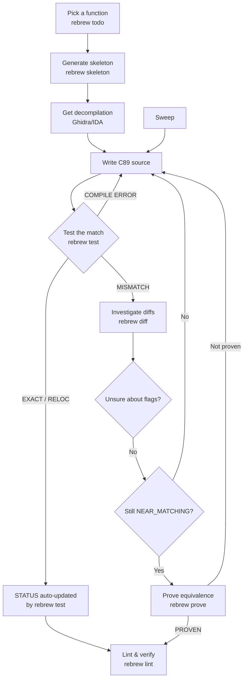

# Decompilation Workflow Guide

Step-by-step guide for the full reversing iteration loop. Aimed at contributors and
AI agents who have already completed initial setup.

**First time here?** Start with [QUICKSTART.md](QUICKSTART.md) to get from clone to
first matched function in 5 steps. Come back here for the deeper loop.

**Byte-level mismatches?** See [CODEGEN_PATTERNS.md](CODEGEN_PATTERNS.md) for MSVC6
codegen patterns, SEH helpers, and matching idioms.

---

## Iteration Loop


```mermaid
graph TD
    Pick[Pick a function<br/>rebrew todo] --> Gen[Generate skeleton<br/>rebrew skeleton]
    Gen --> Decomp[Get decompilation<br/>Ghidra/IDA]
    Decomp --> Write[Write C89 source]
    Write --> Test{Test the match<br/>rebrew test}
    Test -->|EXACT / RELOC| Done[STATUS auto-updated<br/>by rebrew test]
    Test -->|MISMATCH| Diff[Investigate diffs<br/>rebrew diff]
    Test -->|COMPILE ERROR| Write
    Done --> Lint[Lint & verify<br/>rebrew lint]
    Diff --> Flags{Unsure about flags?}
    Sweep --> Write
    Flags -->|No| Prove{Still NEAR_MATCHING?}
    Prove -->|Yes| Symbolic[Prove equivalence<br/>rebrew prove]
    Symbolic -->|PROVEN| Lint
    Symbolic -->|Not proven| Write
    Prove -->|No| Write
```

### 1. Pick a function

```bash
rebrew todo
rebrew todo -c start-function    # easiest uncovered functions, ranked by size/difficulty
rebrew todo --stats              # coverage summary
```

`rebrew todo` evaluates the entire project and surfaces the highest Return-on-Investment
tasks: compile errors, symbol-extraction errors (EXTRACT_ERROR), 1–4 byte near-misses,
and easy new starts.  Each item carries a ready-to-run `command` — follow it verbatim.

### 2. Generate skeleton

```bash
rebrew skeleton 0x<VA>
rebrew skeleton 0x<VA> --decomp                         # with inline decompilation
rebrew skeleton 0x<VA> --decomp --decomp-backend ghidra # Ghidra via MCP
rebrew skeleton 0x<VA> --decomp --decomp-backend r2dec  # radare2 r2dec
rebrew skeleton 0x<VA> --xrefs                          # with caller context from Ghidra
```

Creates `src/target_name/<name>.c` with proper markers and prints the exact test command.

To add a function to an existing multi-function file:

```bash
rebrew skeleton 0x<VA> --append existing_file.c
```

### 3. Get the decompilation

With Ghidra + ReVa MCP:
```
get-decompilation programPath="/target.dll" functionNameOrAddress="0x<VA>"
```

Without Ghidra — use the built-in disassembler:
```bash
rebrew asm 0x<VA> --size <SIZE>
```

For known library functions, identify via FLIRT or CRT cross-reference:
```bash
rebrew flirt [path_to_sig_directory]
rebrew crt-match 0x<VA>
```

### 4. Write C89 source

Replace the TODO placeholder in the skeleton with actual C code. See
[CODEGEN_PATTERNS.md](CODEGEN_PATTERNS.md) for the full list of MSVC6-specific rules
and patterns that affect byte output.

### 5. Test the match

```bash
rebrew test src/target_name/my_func.c
```

| Result | Meaning | Action |
|--------|---------|--------|
| `EXACT MATCH` | Byte-for-byte identical | STATUS auto-promoted to EXACT |
| `RELOC-NORMALIZED MATCH` | Identical except relocations | STATUS auto-promoted to RELOC |
| `MISMATCH` with same size | Logic matches but some bytes differ | Set STATUS: NEAR_MATCHING, investigate diffs |
| `MISMATCH` with different size | Significantly different codegen | Investigate with diff mode |
| `COMPILE ERROR` | C code doesn't compile | Fix syntax errors |
| `Symbol not found` | Wrong symbol name | Check the decorated name |

For a detailed explanation of each match type, see [MATCH_TYPES.md](MATCH_TYPES.md).

`--dry-run` (single-function) compiles and prints the would-be STATUS change
without writing — useful to preview a promotion or a `--force-status` demotion
before applying it. `test --all --dry-run` lists batch candidates without
compiling.

### 6. If MISMATCH — use diff mode

```bash
rebrew diff src/target_name/my_func.c

# Show only structural differences (** lines)
rebrew diff --mismatches-only src/target_name/my_func.c

# VA form works too: resolves to the source file and targets the annotation
# whose VA matches (multi-function files: NOT the first function).
rebrew diff 0x10009310
```

**Diff markers:**
- `==` identical bytes
- `~~` relocation-only difference (acceptable)
- `**` structural difference (needs fixing)

### 7. If unsure about compiler flags — run the GA

```bash
# Side-by-side diff to understand what differs
rebrew diff src/target_name/my_func.c

# Run the GA with flag sweep (brute-forces compiler flag combinations)
rebrew match src/target_name/my_func.c --generations 100 --pop-size 64

# Batch flag sweep on all NEAR_MATCHING functions, auto-update CFLAGS on improvement
rebrew match --all --flag-sweep --fix-cflags

# Near-miss batch — focus on NEAR_MATCHING functions with ≤5B delta
rebrew match --all --near-miss --threshold 5
```

### 8. Update metadata

`rebrew test` auto-promotes STATUS on EXACT or RELOC matches, writing atomically to
`rebrew-function.toml`:

```bash
rebrew test src/target_name/my_func.c           # compile + update STATUS
rebrew test src/target_name/my_func.c --no-promote  # compile without updating STATUS
```

The `.c` file only ever contains the stable `// FUNCTION: MODULE 0xVA` marker line.
STATUS, SIZE, and CFLAGS all live in the metadata.

For NEAR_MATCHING functions, auto-classify and write the BLOCKER:

```bash
rebrew diff --fix-blocker src/target_name/my_func.c
```

This writes to `rebrew-function.toml`:
```toml
["SERVER.0x<VA>"]
status = "NEAR_MATCHING"
blocker = "register allocation, jump condition swap"
blocker_delta = 3
```

> [!CAUTION]
> **Never manually edit `rebrew-function.toml`.** Volatile metadata (STATUS, CFLAGS,
> SIZE, BLOCKER, NOTE, GHIDRA) is managed exclusively by Rebrew CLI tools.

### 9. If still NEAR_MATCHING — prove semantic equivalence

When the remaining diff is purely structural (register allocation, instruction
reordering), use symbolic execution to verify equivalence:

```bash
rebrew prove src/target_name/my_func.c                # prove and update STATUS → PROVEN
rebrew prove src/target_name/my_func.c --json         # JSON output
rebrew prove src/target_name/my_func.c --dry-run      # preview without updating
rebrew prove my_func --timeout 120                    # allow 2 minutes for complex functions
```

Uses angr's symbolic execution engine and Z3 constraint solving to compare the return
register (`EAX`) for all possible inputs. If no input can distinguish the two
implementations, STATUS is promoted to `PROVEN`.

> [!NOTE]
> `angr` is an optional dependency (~500 MB). Install with `uv sync --all-extras` —
> the documented dev install includes the prove extra.
> Functions with heavy floating-point math or complex loops may time out.

> [!CAUTION]
> **PROVEN is sticky.** `rebrew test` / `rebrew verify` will never silently demote
> a PROVEN function, even after you edit its source so it no longer matches — the
> status stays PROVEN until you deliberately reclassify it. To demote a stale
> PROVEN to its actual byte-compare result (e.g. STUB or NEAR_MATCHING):
>
> ```bash
> rebrew test src/target_name/my_func.c --force-status
> ```
>
> This is the only intended remedy — it forces the STATUS update from a sticky
> status, so use it deliberately per function.

### 10. Verify STATUS is current

```bash
rebrew verify  # recompiles all tracked functions; auto-updates any drifted STATUS
```

`verify` promotes and corrects drifted statuses but respects sticky PROVEN
(see section 9) — a stale PROVEN surfaces as a failure in the report while its
metadata stays PROVEN until you demote it with
`rebrew test <file> --force-status`.

### 11. Lint and verify source marker health

```bash
rebrew lint              # check for invalid headers, statuses, and origins
rebrew catalog --summary # view overall RE progress and stats
```

**DATA/GLOBAL annotation convention:** each global is annotated exactly once
(single `// DATA:` line above its declaration). Duplicating the annotation in
multiple files — common when several TUs reference the same `extern` — fires
lint **E013** (duplicate VA) and **W021** (duplicate name); the coverage grid
dedupes by VA so it is not harmful, but it is noise. Keep the annotation in one
file (the symbol's home, e.g. `globals.c`) and leave plain `extern` declarations
elsewhere.

---

## JSON Output for Scripting and CI

All core CLI tools support `--json` for machine-readable output:

```bash
# Test a function and parse results with jq
rebrew test src/target_name/my_func.c --json | jq '.status'

# Get progress stats as JSON
rebrew todo --stats --json | jq '.pct_matched'

# List prioritized action items as JSON
rebrew todo --json -n 10 | jq '.items[] | {category, roi_score, name}'

# List tiny-byte-diff quick wins (fix-delta category, ≤5B)
rebrew todo -c fix-delta --json | jq '.items[] | select(.byte_delta != null and .byte_delta <= 5)'

# Structured diff output
rebrew diff --json src/target_name/my_func.c | jq '.summary'

# Disassembly as JSON
rebrew asm 0x10003da0 --size 160 --json | jq '.instructions[] | .mnemonic'
```

**Tools with `--json` support:**

| Tool | Modes |
|------|-------|
| `rebrew test` | Single and multi-function test results |
| `rebrew todo` | Prioritized action items |
| `rebrew diff` | Side-by-side diff output |
| `rebrew asm` | Disassembly output |
| `rebrew verify` | Verification report |
| `rebrew lint` | Lint results |
| `rebrew flirt` | FLIRT scan results |
| `rebrew crt-match` | CRT source matching results |
| `rebrew data` | Data scan results |
| `rebrew match --all` | Batch GA results |
| `rebrew split` | Split results (files created, VAs, symbols) |
| `rebrew merge` | Merge results (inputs, output, VA list) |
| `rebrew prove` | Prove results (proven/not, state counts, status update) |
| `rebrew extract` | Batch extraction results |
| `rebrew catalog` | Catalog JSON generation (`--json`) |
| `rebrew doctor` | Project health check results |
| `rebrew sync` | Ghidra sync operations (`--pull`, `--push`) |
| `rebrew skeleton` | Generated skeleton output |
| `rebrew rename` | Rename results (old/new names, files updated) |
| `rebrew graph` | Dependency graph (nodes, edges, by-status) |
| `rebrew build-db` | Build database results (paths, targets) |
| `rebrew init` | Project initialization results |

---

## Working with Multiple Binaries

When a game ships multiple executables or DLLs that share code, rebrew handles them
as **separate targets** inside one project.

Define each binary as its own `[targets.<name>]` section in `rebrew-project.toml`.
Each target gets its own binary path, source directory, function list, and optional
compiler overrides. Global `[compiler]` settings are inherited unless overridden.

See [CONFIG.md](CONFIG.md) for the full `rebrew-project.toml` key reference and
architecture presets.

Tools default to the **first** target. Use `--target` to select another:

```bash
rebrew test --target Europa1400Gold_TL.exe src/Europa1400Gold_TL.exe/my_func.c
rebrew todo --target Europa1400Gold_TL.exe
```

### Sharing code between targets

Two binaries compiled from the same source tree will have identical function bodies
at different VAs. Keep shared logic in a common directory and use thin per-target
wrapper files that `#include` it.

**Directory layout:**

```
src/
  shared/                          # shared implementations (no rebrew headers)
    my_shared_func.c
  server.dll/                      # target 1 wrappers + unique functions
    my_shared_func.c               # wrapper with SERVER markers
    server_only_func.c
  Europa1400Gold_TL.exe/           # target 2 wrappers + unique functions
    my_shared_func.c               # wrapper with CLIENT markers
    client_only_func.c
```

**`src/shared/my_shared_func.c`** — single source of truth, no rebrew marker:

```c
int __cdecl my_shared_func(int param)
{
    int result;
    result = param + 1;
    return result;
}
```

**`src/server.dll/my_shared_func.c`** — target wrapper:

```c
// FUNCTION: SERVER 0x10001000

#include "../shared/my_shared_func.c"
```

When you fix a mismatch, both targets benefit automatically. If a function exists in
both binaries with **different compiler flags**, each target's metadata can specify
different CFLAGS while still `#include`-ing the same source file.

---

## File Naming Conventions

Filenames are derived from the function's symbol name. No origin-based prefixes are
added; users control the directory structure freely.

| Pattern | Example |
|---------|---------|
| Symbol-based | `alloc_object.c`, `sbh_heap_init.c`, `adler32.c` |
| Unknown/Unnamed | `func_10003da0.c` |

## Source Marker Format

Every `.c` file must start with a marker block. See [ANNOTATIONS.md](ANNOTATIONS.md)
for the full format reference.

Only the marker line is enforced as a linter error (E001): `FUNCTION`/`LIBRARY`/`STUB`
with MODULE and VA. STATUS and SIZE are metadata-only — they live in
`rebrew-function.toml` and are no longer validated inline. Optional: CFLAGS
(metadata; falls back to project config default). Conditional: SOURCE (for
CRT/ZLIB), BLOCKER (for NEAR_MATCHING/STUB — stored in `rebrew-function.toml`).

A file may contain **multiple marker blocks** for multi-function compilation. See
[ANNOTATIONS.md](ANNOTATIONS.md#multi-function-files) for details.

---

## See Also

| Document | Content |
|----------|---------|
| [QUICKSTART.md](QUICKSTART.md) | 5-step path from clone to first matched function |
| [CODEGEN_PATTERNS.md](CODEGEN_PATTERNS.md) | MSVC6 codegen patterns, SEH helpers, matching idioms |
| [BOOTSTRAPPING.md](BOOTSTRAPPING.md) | Adding a new binary to a project from scratch |
| [MATCH_TYPES.md](MATCH_TYPES.md) | EXACT / RELOC / NEAR_MATCHING explained with byte-level examples |
| [ANNOTATIONS.md](ANNOTATIONS.md) | Full marker format reference and linter codes (E000–E017, W001–W019) |
| [GHIDRA_SYNC.md](GHIDRA_SYNC.md) | Ghidra ↔ Rebrew sync feature matrix and known issues |
| [FLIRT_SIGNATURES.md](FLIRT_SIGNATURES.md) | Obtaining, creating, and using FLIRT signatures |
| [CLI.md](CLI.md) | All 33 CLI commands, flags, and examples |
| [CONFIG.md](CONFIG.md) | `rebrew-project.toml` format, arch presets, compiler profiles |
| [TOOLCHAIN.md](TOOLCHAIN.md) | External tools, MSVC6 toolchain, Python dependencies |
