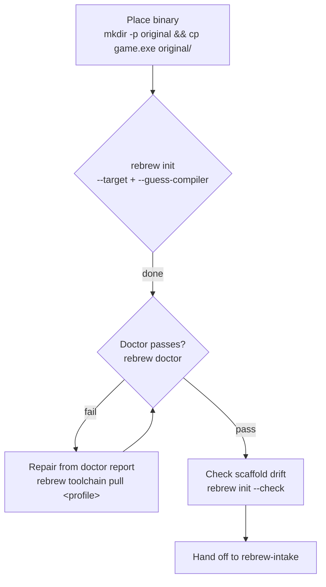

# Rebrew Init

Scaffold a new rebrew project from an empty directory and a target binary.

## When NOT to use this skill

- One-shot binary onboard (`rebrew intake <binary>`) → use `rebrew-intake`
- Day-to-day reversing → use `rebrew-workflow`
- Deep matching → use `rebrew-matching`

Use when the user needs scaffold decisions (name, profile). Prefer `rebrew intake`
for "here's a binary, set it up". `rebrew-init` names this skill; the executable
is `rebrew`, with `init` as a subcommand. Re-run `rebrew init --refresh-agents` to
re-render the scaffold after template changes.

## Scaffold

Run from the project root directory:

```bash
mkdir -p original && cp /path/to/<binary> original/
rebrew init --target <name> --binary <filename> --guess-compiler --no-wizard
```

Target naming: bare binary stem, no extension (`server.dll` → `server`, `game.exe` → `game`; lowercased, non-alnum → `_`), and a name becomes a path component, so no separators. With `--no-wizard` nothing derives it: `--target` defaults to `main` and you must pass the name. The wizard prompt and `rebrew intake` default to the binary stem. Override with `--target` when existing MODULE keys already use a different form (e.g. legacy `server.dll`). Paths are `layout/<target>/`, `src/<target>/`.

Starting from a splat YAML instead of a bare binary:
`rebrew source import-splat <config>` plans names, layout, and annotations, and writes
nothing until `--write` (`--force` replaces conflicting annotations).

## Profile selection

`--guess-compiler` detects from the binary (diec → PDB → heuristics) and is
right for standard builds. Override with `--toolchain <profile>` when:

- The binary is a rebuild or repack whose headers lie (guess follows the
  headers, not the codegen).
- You already know the exact toolchain (matching SP-level profile matters:
  `msvc-6.0-sp6` vs `msvc-6.0` is a different code generator).
- 16-bit DOS/NE binaries where the heuristic prefers wrong (see
  rebrew repo `docs/TOOLCHAIN.md` for the `watcom-2.0-win16` / `msvc-1.52` / `borland-3.1`
  decision tree).

```bash
rebrew init --target <name> --binary <filename> --toolchain <profile> --no-wizard
```

## Done-gate

```bash
rebrew doctor
```

Run it right after `rebrew init`. Doctor must report healthy
(warnings for unconfigured optionals such as FLIRT, Ghidra, BinSync are fine;
failures are not) before handing off. The commonest failure is the toolchain
image missing: run `rebrew toolchain pull <profile>` (a docker image pull).
`rebrew toolchain build <profile>` compiles the image from the sibling
rebrew-toolchains checkout, which is a long job and fails without that
checkout. Use a pull for setup; build when the task calls for building the image
or the user has already authorized it. Otherwise clarify before a long build.

## Scaffold drift check

`rebrew init` renders AGENTS.md, PRINCIPLES.md, and the packaged skills (plus
any `REBREW_SKILLS_DIR` overlay) into `.agents/skills/`, substituting the
target name. Run `rebrew init --check` to report drift in any of them; it exits
1 when a rendered file differs from the packaged source, so it is the check to
run rather than comparing the tree by hand.

## Global organization

Organize game and CRT extern declarations separately, with one canonical header
per subsystem and one CRT header. Headers do not allocate storage; definitions
belong to one source owner or linked stock library member. A section range is not
subsystem ownership. Preserve an existing curated split when refreshing scaffolds
or generating headers; use `rebrew-data-analysis` for consolidation.

## Handoff

Scaffold done → `rebrew-intake` owns the binary from here (FLIRT scan,
catalog, triage). The handoff is one line: the target name and profile.
