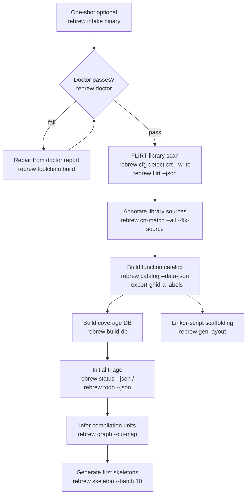

# Rebrew Intake

Onboard a binary and run the first recon pass (library ID → catalog → triage).

## When NOT to use this skill

- Teaching bare-dir `rebrew init` / profile / target naming only → use `rebrew-init`
- Day-to-day reversing on an already-onboarded target → use `rebrew-workflow`
- Deep matching for a single function → use `rebrew-matching`

Use once per new target (or when re-running initial recon). Re-run individual
steps later if needed.

## Prerequisites

Need a `rebrew-project.toml` and the binary at the configured path (default
`original/<filename>`). Two ways to get there:

```bash
# A) One-shot (preferred when the user hands you a binary):
rebrew intake <path-to-binary>            # detect profile → init (if needed) → enumerate → STUB+BLOCKER every function
rebrew intake <path-to-binary> --toolchain <profile>   # pin profile; --dry-run to preview

# B) Explicit scaffold (when teaching init / overriding guess):
rebrew init --target <name> --binary <filename> --guess-compiler
rebrew toolchain build <profile>          # docker image for the profile (required; no host wine/wibo)
```

`rebrew intake` does **not** run FLIRT, catalog, or `build-db` — continue with
§1–§8 below after it (or after a manual `rebrew init`). Shipped toolchains are
docker-only.

### Multi-target file layout

Shared code across targets: add a second `// FUNCTION: BETA10 0x...` marker
above the same body — do not duplicate `.c` files.

### Linker-script scaffolding (optional, after the catalog)

```bash
rebrew gen-layout --target <name>
```

Writes `src/<target>/<target>.def`, `src/<target>/crt_region/crt_imports.c`, and
`layout/<target>/` (`rebrew-layout.toml` + hex dumps). Then
`rebrew postlink <built.dll> --layout layout/<target>` can converge without the
original DLL. Keep `layout/` in VCS.

## Intake Procedure

### 0. Toolchain ID + optional recon

Before FLIRT/catalog, confirm the compiler family (MSVC vs MinGW vs DOS MZ vs NE).
Decision tree / packing: `references/toolchain-id.md`. Prefer `rebrew intake` or
`rebrew init --guess-compiler`; override with `--toolchain` when headers lie.

Optional fingerprints / `pe-info` / crypto-scan / `security-scan`:
`references/binary-recon.md`.

### 1. Doctor

```bash
rebrew doctor                           # validate config, binary, toolchain, metadata
rebrew doctor --json                    # machine-readable per-check report
rebrew toolchain build <profile>        # build the profile's docker image (or `pull`) when the toolchain check fails
rebrew cfg list-targets                 # confirm target is configured
```

Exit 1 on any `fail`. `--json` → `checks[].fix` repair commands. Missing image →
`rebrew toolchain build <profile>`. Config fail → `rebrew init` or `rebrew intake`.
Missing binary → place at configured path. Missing FLIRT →:

```bash
rebrew gen-flirt-pat /path/to/msvcrt.lib --output flirt_sigs/msvcrt_vc6.pat
# .lib from a vendored toolchain/ tree, or extract Lib/ from the profile docker image
rebrew cfg add-target <name> --binary original/<filename>   # or --force if binary absent
```

### 2. FLIRT Library Scan

Identify known library functions (MSVCRT, zlib, DirectX, etc.) to separate
library code from game code:

```bash
rebrew cfg detect-crt --write           # auto-detect and register CRT source dirs (required before crt-match)
rebrew flirt --json                     # scan binary against FLIRT signatures
rebrew crt-match --index --json         # verify CRT source directories are configured
rebrew crt-match --all --fix-source --json # auto-annotate SOURCE references for library functions
```

Needs `cfg detect-crt` first or `crt-match --all` finds nothing. FLIRT JSON:
`matches[].names`; ambiguous hits in `ambiguous_matches`. Use
`crt-match --all --fix-source` for `// SOURCE:` on confirmed library hits.

### 3. Build Function Catalog + Coverage DB

```bash
rebrew catalog --data-json              # write db/data_<target>.json
rebrew catalog --export-ghidra-labels   # write ghidra_data_labels.json (switch tables etc.)
rebrew catalog --fix-sizes              # backfill SIZE in rebrew-functions.toml from catalog
rebrew build-db                         # build SQLite coverage database (db/coverage.db)
```

`--data-json` → `db/data_<target>.json` (+ `function_structure.json` when no Ghidra
export). `--fix-sizes` prompts unless `--force` (required with `--json`).
`build-db` needs `--force` to rebuild on schema mismatch.

### 4. Initial Triage

```bash
rebrew status --json                    # high-level overview: STATUS counts, % coverage
rebrew todo --json                      # prioritized action items
rebrew data --dispatch --json           # detect dispatch tables / vtables
```

- `status --json` → `{functions: {total, covered}, status: {EXACT, RELOC, PROVEN, NEAR_MATCHING, STUB}, coverage_pct, matched_pct, ...}`.
- `todo --json` → ranked `items[]`; each item carries a ready-to-run `command` field
  (e.g. `rebrew skeleton 0x...`, `rebrew diff 0x...`) — use those commands directly.
  Filter with `-c <category>` (e.g. `fix-delta`, `start-function`).
- `data --dispatch --json` → JSON array of dispatch tables `[{va, section, entries: [{target_va, name, status}]}]`
  (requires the target binary).

### 5. Infer Compilation Units

Identify which functions were likely compiled from the same source file:

```bash
rebrew graph --cu-map --json            # cluster functions into inferred translation units
```

This uses inter-function gap analysis and call-graph signals to group contiguous functions.
`--json` → `{total_functions, clustered_functions, total_clusters, clusters, unclustered}`.
High-confidence clusters suggest functions that should be merged into the same `.c` file.

### 6. Assess Scope

From the triage output, evaluate:

- **Total functions** and size distribution
- **Library vs game code ratio** (from FLIRT matches)
- **Quick wins**: small functions, leaf functions, known library matches
- **Blockers**: large functions, functions with many dependencies

### 7. Extract Disassembly (Optional)

```bash
rebrew extract list                     # list un-reversed candidates
rebrew extract batch 20                 # extract first 20 smallest
```

### 8. Generate First Skeletons

Start with the easiest functions identified by triage:

```bash
rebrew todo --json                      # get recommended functions to start
rebrew skeleton --batch 10              # generate 10 skeletons (smallest first)
rebrew skeleton 0x<VA>                  # generate one skeleton by VA
rebrew skeleton 0x<VA> --decomp         # include decompilation in skeleton
rebrew skeleton 0x<VA> --decomp --decomp-backend ghidra  # Ghidra via MCP
rebrew skeleton 0x<VA> --xrefs          # with caller context from Ghidra
```

`--batch N` picks the N smallest eligible functions first. `--decomp` requires a reachable
decompiler (`--decomp-backend`: `auto`, `r2ghidra`, `r2dec`, `ghidra`, `kuna`, `m2c`; default `auto`).

For library functions identified by FLIRT, check if vendored reference source is
available under the project's `toolchain/` tree (e.g. MSVCRT at
`toolchain/msvc/…/CRT/SRC/` after `cfg detect-crt --write`) or a project
`zlib-1.1.3/` tree.

### 9. Sync to Ghidra (Optional)

Field sync needs only the shared BinSync state dir — no Ghidra, no MCP:

```bash
rebrew sync --push --state-dir <dir>      # export annotations to the BinSync state dir
```

`--push` exports to the state dir; `--pull --state-dir <dir>` imports it back
(conflicts via `--accept-binsync` / `--accept-local`). MCP structural ops
(`--create-functions`, `--bookmarks`, `--pull-data`) still need ReVa.

### 10. Coverage Dashboard (optional — ask first)

```bash
rebrew build-db                         # refresh db/coverage.db after any changes
rebrew dashboard                        # read-only UI at http://127.0.0.1:8000 (blocks the shell)
```

Only start `dashboard` when the user asks for the UI. It blocks until stopped; do
not leave it running. `--port` changes the bind. Default handoff is
`rebrew status --json` / `rebrew todo --json`, then `rebrew-workflow`.
