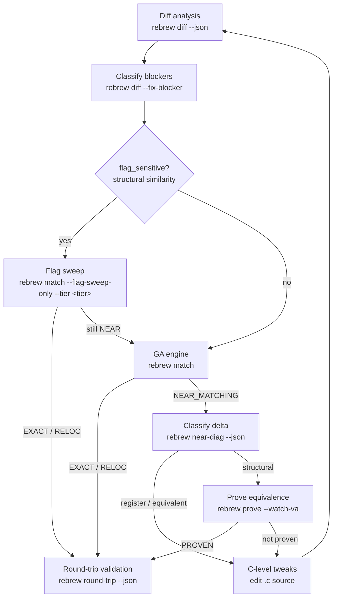

# Rebrew Matching

Deep dive into diff analysis and the GA engine.
For the overall reversing workflow, see the `rebrew-workflow` skill.

## When NOT to use this skill

- Picking which function to work on → use `rebrew-workflow` (`rebrew todo`)
- Generating skeletons / editing source / verifying STATUS → use `rebrew-workflow`
- Fixing missing globals / `~~` diffs caused by BSS gaps → use `rebrew-data-analysis`

## 1. Diff Analysis (Always Start Here)

```bash
rebrew diff src/<target>/<file>.c --json         # structured diff + structural similarity
rebrew diff src/<target>/<file>.c -m --json      # mismatches only (** lines)
rebrew diff src/<target>/<file>.c -r --json      # register-aware (mark RR encoding diffs)
rebrew diff src/<target>/<file>.c --format csv   # CSV for spreadsheet analysis
rebrew diff 0x10009310 --json                    # resolve a VA directly (no .c path needed)
rebrew near-diag src/<target>/<file>.c --json    # classify WHY it doesn't match (first-mismatch diagnosis)
rebrew gap-trace src/<target>/<file>.c --json    # length-gap trace (short body? early table?) when scores stall flat
rebrew objdiff --output objdiff.json                # GUI diffing project (objdiff) from target objects
```

`rebrew objdiff` synthesizes one target COFF object per annotated source file
from the reference binary and writes an objdiff project config — open
`objdiff.json` in the objdiff GUI for instruction-level diffing of every
function at once (objdiff rebuilds base objects via `rebrew-objdiff-build`).

> **VA on a multi-function file**: `rebrew diff/match/prove/test 0x<va>` targets the
> annotation whose VA matches, NOT the first function in the file. When the
> resolved file covers a different function than the VA, the tool errors out
> instead of silently diffing the wrong bytes.

### Diff Markers

- `==` identical bytes
- `~~` relocation difference (acceptable — counts as RELOC)
- `RR` register encoding difference (only with `-r` / `--register-aware`)
- `**` structural difference (needs fixing)
- `XX` invalid relocation difference (wrong target VA — counts as MISMATCH)

If the diff shows only `~~` lines, the function is already RELOC — `rebrew test` will promote it.

Exit codes: `0` = no structural differences (EXACT/RELOC), `1` = structural `**` lines
found (fix them), `2` = build error. With `--json`, read `summary.exact / summary.reloc /
summary.reg / summary.structural` instead of parsing lines.

### How Relocations are Scored
Rebrew parses the COFF object's relocation and symbol tables. It resolves symbols against
the Data Catalog to find their intended VAs.
- `~~` means the relocation points to the correct global variable.
- `XX` means it points to the wrong variable (forces MISMATCH).
Use `-r` / `--register-aware` to see if remaining `**` diffs are register allocation differences.

### Auto-Classified Blockers

`rebrew diff` auto-classifies systemic compiler differences from `**` / `RR` lines
(e.g. "register allocation", "loop rotation / branch layout", "stack frame choice").
Use `--fix-blocker` to auto-write these to the `rebrew-functions.toml` metadata file:

```bash
rebrew diff --fix-blocker src/<target>/<file>.c        # auto-write BLOCKER to metadata file
rebrew diff --fix-blocker --json src/<target>/<file>.c # with JSON output
# Ad-hoc BLOCKERs that diff cannot classify (needs structs, SEH helper, etc.):
rebrew blocker set src/<target>/<file>.c "needs RE structs -- see struct_recover"
rebrew blocker clear src/<target>/<file>.c
```

When no structural diffs remain, `--fix-blocker` clears existing BLOCKER/BLOCKER_DELTA.
**Never hand-edit `rebrew-functions.toml` for BLOCKER — use `rebrew blocker set/clear` or the `--fix-blocker` writers.**

Use this to quickly rule out structural issues before running the GA.

## 2. GA Engine (Single File)

For automated matching when manual tuning and diffs are insufficient:

```bash
rebrew match src/<target>/<file>.c --generations 200 --pop-size 64 -j 16
```

Key flags: `-g/--generations` (default 100), `-p/--pop-size` (64), `-j/--jobs`,
`--seed`, `--seed-file`, `--no-seeds`, `--mutation-focus register|equivalent|structural|auto`,
`--seed-solved/--no-seed-solved`, `--out-dir` (single-function only; default
`output/ga_runs`), `--compare-obj`, `--ignore-lint`, `--collect-pairs`.
Best source → `best.c` under `--out-dir` and back into the `.c` when it wins.
Exit: `0` match · `1` no match · `2` build/config error.

## 3. Flag Sweep

When diff shows `flag_sensitive: true`, try compiler flag combinations before running the GA:

```bash
rebrew match src/<target>/<file>.c --flag-sweep-only                      # targeted tier (default)
rebrew match src/<target>/<file>.c --flag-sweep-only --tier quick         # 192 combos, < 1 min
rebrew match src/<target>/<file>.c --flag-sweep-only --tier targeted      # 1,152 combos, adds /Oy /Op
rebrew match src/<target>/<file>.c --flag-sweep-only --tier normal        # 5,376 combos, adds /ML-/MTd
rebrew match src/<target>/<file>.c --flag-sweep-only --tier thorough      # 258k combos, ~15–60 min
rebrew match src/<target>/<file>.c --flag-sweep-only --tier full          # 6.2M combos, hours
rebrew match --all --flag-sweep                                           # batch: all NEAR_MATCHING
rebrew match --all --flag-sweep --fix-cflags                             # auto-update CFLAGS on hit
rebrew merge-sweep --dry-run                         # TU-partition search (original was amalgamated)
rebrew climb src/<target>/<file>.c --json                # deterministic single-statement hill-climb (statement-order pass)
rebrew match --all --flag-sweep-then-ga                                        # sweep flags, then GA with best flags
rebrew match --all --flag-sweep-then-ga --skip-recent 24                       # resume: skip stubs GA-run in last 24h
```

Sweep axes are per-profile (MSVC `/` flags, Watcom `-os/-ot/…`, Borland `-O1/-O2`,
16-bit MSVC). Shipped profiles are docker-only (`rebrew toolchain pull <profile>`);
no host wine/wibo — see `docs/TOOLCHAIN.md`. Try `/O2` or `/O1` by hand before a
blind sweep; heuristics + unreproducible patterns: `references/codegen-hints.md`.

| Tier | Combinations | When to use |
|------|-------------|-------------|
| `quick` | 192 | First pass on a new STUB |
| `targeted` | 1,152 | Default; when `quick` is close |
| `normal` | 5,376 | General-purpose |
| `thorough` | 258,048 | After `normal` still near |
| `full` | 6,193,152 | Last resort; add `--sample N` |

MSVC6 counts: `docs/FLAG_SWEEP_TIERS.md`.

### Batch GA Mode (`--all`)

```bash
rebrew match --all --near-miss
rebrew match --all --improve
rebrew match --all --threshold 8
rebrew match --all --max-stubs 10
rebrew match --all --min-size 32 --max-size 512
rebrew match --all --filter "MyClass::"
rebrew match --all --timeout-min 5
rebrew match --all --dry-run
rebrew match --ga-history --json
```

Check `--ga-history` before long batches; `--skip-recent N` resumes; `--seed-solved`
is on by default (`--no-seed-solved` to disable).

## 4. Structural Similarity Metric

`rebrew diff` outputs a structural similarity breakdown:

```
Structural similarity (flags unlikely to help):
  Instructions: 12 exact, 3 reloc, 2 register, 1 structural (of 18 total)
  Mnemonic match: 94.4%  |  Structural ratio: 5.6%
```

With `--json`, the output includes a `structural_similarity` object:
- `mnemonic_match_ratio`: how similar the mnemonic sequences are (1.0 = identical)
- `structural_ratio`: fraction of instructions with real structural diffs
- `flag_sensitive`: `true` when flag sweeping may help

Use this to quickly rule out flag-based solutions before spending time on sweeps:
`flag_sensitive: false` means flag sweeping won't help — go straight to the GA or
`rebrew prove`. A high `mnemonic_match_ratio` with low `structural_ratio` means the
code is semantically close and C-level tweaks (or `rebrew near-diag`) may finish
the job. When the kinds match but the registers don't (allocator wall, not
order), run `rebrew qual-sweep` — the exhaustive per-declaration qualifier
sweep, counterpart to `rebrew climb` for naming residue.

## 5. Blocker Tracking

When a function is NEAR_MATCHING but not byte-perfect, blockers live in the `rebrew-functions.toml` metadata file (managed programmatically — never hand-edit):

```toml
["SERVER.0x<VA>"]
blocker = "register allocation, jump condition swap"
blocker_delta = 3
```

Set them via `rebrew blocker set <file|0xVA> "<reason>" [--delta N]` (and `rebrew blocker clear` to remove).
Use `rebrew diff --fix-blocker` / `rebrew near-diag --fix-blocker` to auto-generate from classification.

## 6. Tips

- Always start with `rebrew diff` before running the GA.
- For library-origin functions (MSVCRT, ZLIB), use `rebrew crt-match` to identify the reference source first.
- Common CFLAGS presets: `/O2 /Gd` (GAME), `/O1 /Gd` (MSVCRT).
- If a function remains NEAR_MATCHING after GA and blockers are structural, use `rebrew prove`.
- While iterating on a single function, `--watch` (on `diff`, `prove`, or `match`) re-runs on every
  file save — faster than re-typing the command.

## 7. Symbolic Equivalence Proving

When stuck at NEAR_MATCHING (register alloc / reorder / loop layout), classify
then prove:

```bash
rebrew near-diag src/<target>/<file>.c --json
rebrew near-diag --all --fix-blocker --json
rebrew prove src/<target>/<file>.c --json
rebrew prove --all --json
```

Register-gap verdicts (`REGISTER (N% of delta)`) are prime PROVEN candidates —
run `rebrew prove --all` before more GA. Full flags, EDX/`--watch-va` gotchas,
and angr mechanics: `references/prove.md`. Requires `uv pip install -e ".[prove]"`.

## 8. End-to-End Round-Trip

After `rebrew verify` reports all EXACT/RELOC:

```bash
rebrew round-trip --json                     # full splice validation
rebrew round-trip --json --dry-run           # preview the splice set
rebrew round-trip --json --filter "MyClass::"  # scope to a symbol substring
rebrew round-trip --json --strict-catalog    # exit non-zero on unresolved catalog symbols
```

Writes `<binary>.reasm` next to the target. Inspect `spliced`, `mismatches`
(`compile_drift` / `catalog_resolution_drift`), `skipped_catalog`,
`skipped_proven`. Full splice/fallback rules: `rebrew-workflow` →
`references/round-trip.md`. Use in CI alongside `verify --compare`.
