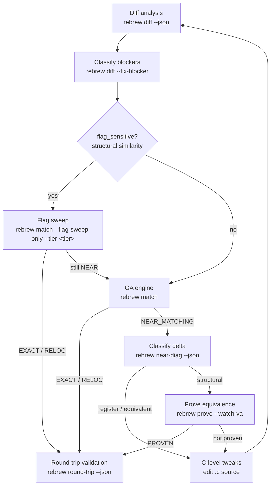

# Rebrew Matching

Deep dive into diff analysis and the GA engine.
For the overall reversing workflow, see the `rebrew-workflow` skill.

## When NOT to use this skill

- Picking which function to work on → use `rebrew-workflow` (`rebrew todo`)
- Generating skeletons / editing source / verifying STATUS → use `rebrew-workflow`
- `XX` rows or `missing_globals` hints (wrong or unresolved globals) → use `rebrew-data-analysis`

## 1. Diff Analysis (Always Start Here)

```bash
rebrew diff src/server.dll/<file>.c --json         # structured diff + structural similarity
rebrew diff src/server.dll/<file>.c -m --json      # mismatches only (** lines)
rebrew diff src/server.dll/<file>.c -r --json      # register-aware (mark RR encoding diffs)
rebrew diff src/server.dll/<file>.c --format csv   # CSV for spreadsheet analysis
rebrew diff 0x10009310 --json                    # resolve a VA directly (no .c path needed)
rebrew near-diag src/server.dll/<file>.c --json    # classify WHY it doesn't match (first-mismatch diagnosis)
rebrew gap-trace src/server.dll/<file>.c --json    # length-gap trace (short body? early table?) when scores stall flat
rebrew objdiff --output objdiff.json                # GUI diffing project (objdiff) from target objects
```

`rebrew objdiff` synthesizes one target COFF object per annotated source file
from the reference binary and writes an objdiff project config — open
`objdiff.json` in the objdiff GUI for instruction-level diffing of every
function at once (objdiff rebuilds base objects via `rebrew-objdiff-build`).

> **VA on a multi-function file**: `rebrew diff/match/prove/test 0x<va>` targets the
> annotation whose VA matches, NOT the first function in the file. When the
> resolved file covers a different function than the VA, the tool errors out
> instead of silently diffing the wrong bytes.

### Diff Markers

- `==` identical bytes
- `~~` relocation difference (acceptable — counts as RELOC)
- `RR` register encoding difference (only with `-r` / `--register-aware`)
- `**` structural difference (needs fixing)
- `XX` invalid relocation difference (wrong target VA — counts as MISMATCH)

If the diff shows only `~~` lines, the function is already RELOC — `rebrew test` will promote it.

Exit codes: `0` = no structural differences (EXACT/RELOC), `1` = structural `**` lines
found (fix them), `2` = build error. With `--json`, read `summary.exact / summary.reloc /
summary.reg / summary.structural` instead of parsing lines.

### How Relocations are Scored
Rebrew parses the COFF object's relocation and symbol tables. It resolves symbols against
the Data Catalog to find their intended VAs.
- `~~` means the relocation points to the correct global variable.
- `XX` means it points to the wrong variable (forces MISMATCH).
Use `-r` / `--register-aware` to see if remaining `**` diffs are register allocation differences.

### Auto-Classified Blockers

`rebrew diff` auto-classifies systemic compiler differences from `**` / `RR` lines
(e.g. "register allocation", "loop rotation / branch layout", "stack frame choice").
Use `--fix-blocker` to auto-write these to the `rebrew-functions.toml` metadata file:

```bash
rebrew diff --fix-blocker src/server.dll/<file>.c        # auto-write BLOCKER to metadata file
rebrew diff --fix-blocker --json src/server.dll/<file>.c # with JSON output
rebrew near-diag src/server.dll/<file>.c --fix-blocker   # BLOCKER from the near-miss classification
# Ad-hoc BLOCKERs that diff cannot classify (needs structs, SEH helper, etc.):
rebrew blocker set src/server.dll/<file>.c "needs RE structs -- see rebrew recover-structs" --delta 3
rebrew blocker clear src/server.dll/<file>.c
```

BLOCKER/BLOCKER_DELTA land in `rebrew-functions.toml` under `["<MODULE>.0x<VA>"]`.
When no structural diffs remain, `--fix-blocker` clears them.
**Never hand-edit `rebrew-functions.toml` for BLOCKER — use `rebrew blocker set/clear` or the `--fix-blocker` writers.**

Use this to quickly rule out structural issues before running the GA.

## 2. GA Engine (Single File)

For automated matching when manual tuning and diffs are insufficient:

```bash
rebrew match src/server.dll/<file>.c --generations 200 --pop-size 64 -j 16
```

Key flags: `-g/--generations` (default 100), `-p/--pop-size` (64), `-j/--jobs`,
`--seed`, `--seed-file`, `--no-seeds`, `--mutation-focus register|equivalent|structural|auto`,
`--seed-solved/--no-seed-solved`, `--out-dir` (single-function only; default
`output/ga_runs`), `--compare-obj`, `--ignore-lint`, `--collect-pairs`.
Best source → `best.c` under `--out-dir` and back into the `.c` when it wins.
Exit: `0` match · `1` no match · `2` build/config error.

## 3. Flag Sweep

When diff shows `flag_sensitive: true`, try compiler flag combinations before
the GA. Default to `--flag-sweep-only` (targeted tier). Escalation tiers,
batch `--all` flags, and safety stops:
`references/flag-sweep.md`.

```bash
rebrew match src/server.dll/<file>.c --flag-sweep-only              # targeted (default)
rebrew match src/server.dll/<file>.c --flag-sweep-only --tier quick # first pass
```

Do **not** run `--tier thorough` / `--tier full` or long `--all` sweeps unless
the user asks. Hand-try `/O2` or `/O1` first; see `references/codegen-hints.md`.

## 4. Structural Similarity Metric

`rebrew diff` outputs a structural similarity breakdown:

```
Structural similarity (flags unlikely to help):
  Instructions: 12 exact, 3 reloc, 2 register, 1 structural (of 18 total)
  Mnemonic match: 94.4%  |  Structural ratio: 5.6%
```

With `--json`, the output includes a `structural_similarity` object:
- `mnemonic_match_ratio`: how similar the mnemonic sequences are (1.0 = identical)
- `structural_ratio`: fraction of instructions with real structural diffs
- `flag_sensitive`: `true` when flag sweeping may help

Use this to quickly rule out flag-based solutions before spending time on sweeps:
`flag_sensitive: false` means flag sweeping won't help — go straight to the GA or
`rebrew prove`. A high `mnemonic_match_ratio` with low `structural_ratio` means the
code is semantically close and C-level tweaks (or `rebrew near-diag`) may finish
the job.

When kinds match but residue remains (statement order / qualifiers), prefer these
over another GA pass:

```bash
rebrew climb src/server.dll/<file>.c --json                 # adjacent statement-order hill-climb
rebrew climb src/server.dll/<file>.c --objective aligned --json
rebrew qual-sweep src/server.dll/<file>.c --json            # declaration qualifier sweep
rebrew qual-sweep src/server.dll/<file>.c --dry-run --json
```

`climb` = adjacent statement swaps; `qual-sweep` = exhaustive per-declaration
qualifier variants. Batch flag/GA details: `references/flag-sweep.md`.

## 5. Tips

- Always start with `rebrew diff` before running the GA.
- For library-origin functions (MSVCRT, ZLIB), use `rebrew crt-match` to identify the reference source first.
- Common CFLAGS presets: `/O2 /Gd` (GAME), `/O1 /Gd` (MSVCRT).
- If a function remains NEAR_MATCHING after GA and blockers are structural, use `rebrew prove`.
- While iterating on a single function, `--watch` (on `diff`, `prove`, or `match`) re-runs on every
  file save — faster than re-typing the command.
- Do not start long GA (`-g` large / `--all`) or thorough/full sweeps without user confirmation.

## 6. Symbolic Equivalence Proving

When stuck at NEAR_MATCHING (register alloc / reorder / loop layout):

```bash
rebrew near-diag src/server.dll/<file>.c --json
rebrew prove src/server.dll/<file>.c --json
```

`REGISTER (N% of delta)` verdicts are prime PROVEN candidates — prefer
`rebrew prove --all` before more GA. Full flags, EDX/`--watch-va` gotchas, and
angr mechanics: `references/prove.md`. Needs the `[prove]` extra (angr); if
`rebrew prove` import-fails, stop and ask the user to install it (see the reference).

## 7. End-to-End Round-Trip

After `rebrew verify` reports all EXACT/RELOC, run `rebrew round-trip --json`
(`--dry-run` previews; `--filter`, `--strict-catalog`). Splice/fallback rules and
`compile_drift` / `catalog_resolution_drift` triage: the rebrew-workflow skill
(its round-trip reference). Use in CI alongside `verify --compare`.
