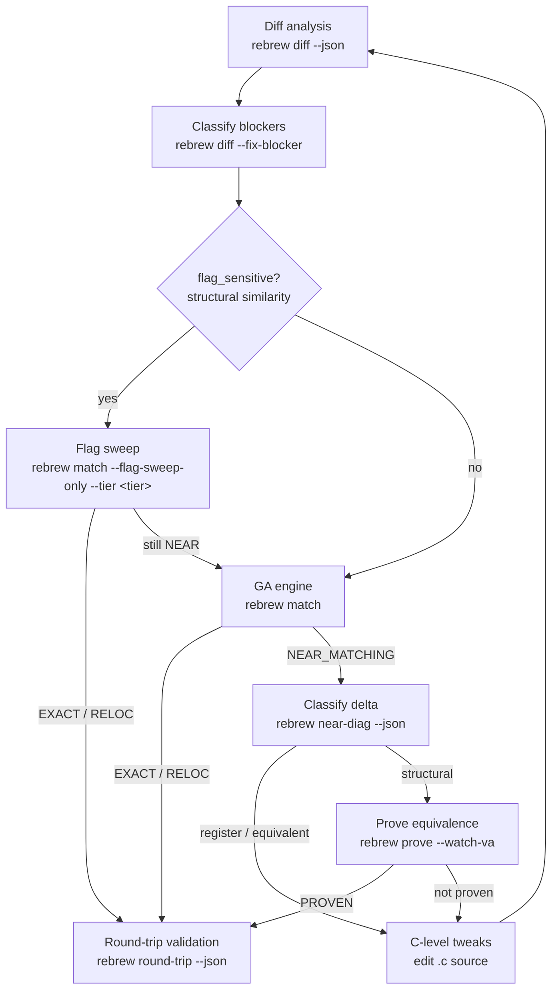

# Rebrew Matching

Deep dive into diff analysis and the GA engine.
For the overall reversing workflow, see the `rebrew-workflow` skill.

## When NOT to use this skill

- Picking which function to work on → use `rebrew-workflow` (`rebrew todo`)
- Generating skeletons / editing source / verifying STATUS → use `rebrew-workflow`
- Fixing missing globals / `~~` diffs caused by BSS gaps → use `rebrew-data-analysis`

## 1. Diff Analysis (Always Start Here)

```bash
rebrew diff src/<target>/<file>.c --json         # structured diff + structural similarity
rebrew diff src/<target>/<file>.c -m --json      # mismatches only (** lines)
rebrew diff src/<target>/<file>.c -r --json      # register-aware (mark RR encoding diffs)
rebrew diff src/<target>/<file>.c --format csv   # CSV for spreadsheet analysis
rebrew diff 0x10009310 --json                    # resolve a VA directly (no .c path needed)
```

### Diff Markers

- `==` identical bytes
- `~~` relocation difference (acceptable — counts as RELOC)
- `RR` register encoding difference (only with `-r` / `--register-aware`)
- `**` structural difference (needs fixing)
- `XX` invalid relocation difference (wrong target VA — counts as MISMATCH)

If the diff shows only `~~` lines, the function is already RELOC — `rebrew test` will promote it.

Exit codes: `0` = no structural differences (EXACT/RELOC), `1` = structural `**` lines
found (fix them), `2` = build error. With `--json`, read `summary.exact / summary.reloc /
summary.reg / summary.structural` instead of parsing lines.

### How Relocations are Scored
Rebrew parses the COFF object's relocation and symbol tables. It resolves symbols against
the Data Catalog to find their intended VAs.
- `~~` means the relocation points to the correct global variable.
- `XX` means it points to the wrong variable (forces MISMATCH).
Use `-r` / `--register-aware` to see if remaining `**` diffs are register allocation differences.

### Auto-Classified Blockers

`rebrew diff` auto-classifies systemic compiler differences from `**` / `RR` lines
(e.g. "register allocation", "loop rotation / branch layout", "stack frame choice").
Use `--fix-blocker` to auto-write these to the `rebrew-function.toml` metadata file:

```bash
rebrew diff --fix-blocker src/<target>/<file>.c        # auto-write BLOCKER to metadata file
rebrew diff --fix-blocker --json src/<target>/<file>.c # with JSON output
```

When no structural diffs remain, `--fix-blocker` clears existing BLOCKER/BLOCKER_DELTA.

Use this to quickly rule out structural issues before running the GA.

## 2. GA Engine (Single File)

For automated matching when manual tuning and diffs are insufficient:

```bash
rebrew match src/<target>/<file>.c --generations 200 --pop-size 64 -j 16
```

- `-g / --generations N` — GA generations (default: 100)
- `-p / --pop-size N` — population size (default: 64)
- `-j / --jobs N` — parallel compilation jobs (default: from config)
- `--seed N` — RNG seed for reproducibility
- `--extra-seed FILE` — additional `.c` file(s) to seed initial population
- `--no-seed` — disable cross-function solution seeding
- `--seed-from-solved / --no-seed-from-solved` — seed from solutions DB (default on)
- `--out-dir DIR` — output directory (default: `output/ga_runs`)
- `--compare-obj / --no-compare-obj` — use object-level comparison
- `--ignore-lint` — continue even if annotation linter finds errors
- `--collect-pairs FILE` — record `(source, binary)` pairs for ML training

The GA mutates C source (variable types, casts, loop structures) and scores
each variant against the target bytes. Best source is written to `best.c` in
`--out-dir` (default `output/ga_runs/<relpath>/`) and, when it beats the current
source, back into the `.c` file itself.

Exit codes: `0` = match found (EXACT or RELOC), `1` = no match (structural diffs
remain — see §8), `2` = build or config error. `--out-dir` applies to
single-function mode only; batch mode always writes to `output/ga_runs` and
errors if you pass it.

## 3. Flag Sweep

When diff shows `flag_sensitive: true`, try compiler flag combinations before running the GA:

```bash
rebrew match src/<target>/<file>.c --flag-sweep-only                      # targeted tier (default)
rebrew match src/<target>/<file>.c --flag-sweep-only --tier quick         # 192 combos, < 1 min
rebrew match src/<target>/<file>.c --flag-sweep-only --tier targeted      # 1,152 combos, adds /Oy /Op
rebrew match src/<target>/<file>.c --flag-sweep-only --tier normal        # 5,376 combos, adds /ML-/MTd
rebrew match src/<target>/<file>.c --flag-sweep-only --tier thorough      # 258k combos, ~15–60 min
rebrew match src/<target>/<file>.c --flag-sweep-only --tier full          # 6.2M combos, hours
rebrew match --all --flag-sweep                                           # batch: all NEAR_MATCHING
rebrew match --all --flag-sweep --fix-cflags                              # auto-update CFLAGS on hit
rebrew match --all --sweep-then-ga                                        # sweep flags, then GA with best flags
rebrew match --all --sweep-then-ga --skip-recent 24                       # resume: skip stubs GA-run in last 24h
```

Tiers (combinations are for MSVC6; see [FLAG_SWEEP_TIERS.md](../../../../docs/FLAG_SWEEP_TIERS.md)):

| Tier | Combinations | When to use |
|------|-------------|-------------|
| `quick` | 192 | First pass on a new STUB |
| `targeted` | 1,152 | Default tier; when `quick` is close but not EXACT |
| `normal` | 5,376 | Good general-purpose sweep |
| `thorough` | 258,048 | Near-match persists after `normal` |
| `full` | 6,193,152 | Last resort; combine with `--sample N` |

### Batch GA Mode (`--all`)

```bash
rebrew match --all --near-miss                            # only run on near-misses
rebrew match --all --improve                              # try to improve any non-EXACT
rebrew match --all --threshold 8                          # only target functions ≤8 byte delta
rebrew match --all --max-stubs 10                         # cap how many stubs to attempt
rebrew match --all --min-size 32 --max-size 512           # filter by target function size
rebrew match --all --filter "MyClass::"                   # substring match on symbol names
rebrew match --all --timeout-min 5                        # per-function wall-clock budget
rebrew match --all --dry-run                              # plan without compiling
rebrew match --ga-history                                 # show past GA runs (.rebrew/ga_runs.jsonl)
rebrew match --ga-history --json                          # same, machine-readable
```

Before launching a long batch, run `--ga-history` to see how many past runs
converged (total / matched % / avg & best score) — it tells you whether GA has
already plateaued on these stubs. `--skip-recent N` drops stubs with a GA run
record in the last N hours, so you can resume an interrupted batch without
re-attempting finished work. `--seed-from-solved` (default on) seeds the
population from similar solved functions; pass `--no-seed-from-solved` to
disable.

## 4. Scoring (lower = better)

| Component | Weight | Measures |
|-----------|--------|----------|
| Length penalty | 3.0 | `abs(candidate_size - target_size)` |
| Weighted byte similarity | 1000.0 | Position-weighted, prologue 3x |
| Relocation-aware similarity | 500.0 | After masking relocatable fields |
| Mnemonic similarity | 200.0 | Via capstone disassembly |
| Prologue bonus | -100.0 | If first 20 bytes match |

## 5. Structural Similarity Metric

`rebrew diff` outputs a structural similarity breakdown:

```
Structural similarity (flags unlikely to help):
  Instructions: 12 exact, 3 reloc, 2 register, 1 structural (of 18 total)
  Mnemonic match: 94.4%  |  Structural ratio: 5.6%
```

With `--json`, the output includes a `structural_similarity` object:
- `mnemonic_match_ratio`: how similar the mnemonic sequences are (1.0 = identical)
- `structural_ratio`: fraction of instructions with real structural diffs
- `flag_sensitive`: `true` when flag sweeping may help

Use this to quickly rule out flag-based solutions before spending time on sweeps:
`flag_sensitive: false` means flag sweeping won't help — go straight to the GA or
`rebrew prove`. A high `mnemonic_match_ratio` with low `structural_ratio` means the
code is semantically close and C-level tweaks (or `rebrew near-diag`) may finish
the job.

## 6. Blocker Tracking

When a function is NEAR_MATCHING but not byte-perfect, blockers live in the `rebrew-function.toml` metadata file:

```toml
["SERVER.0x<VA>"]
blocker = "register allocation, jump condition swap"
blocker_delta = 3
```

Use `rebrew diff --fix-blocker` to auto-generate these from diff classification.

## 7. Tips

- Always start with `rebrew diff` before running the GA.
- For library-origin functions (MSVCRT, ZLIB), use `rebrew crt-match` to identify the reference source first.
- Common CFLAGS presets: `/O2 /Gd` (GAME), `/O1 /Gd` (MSVCRT).
- If a function remains NEAR_MATCHING after GA and blockers are structural, use `rebrew prove`.
- While iterating on a single function, `--watch` (on `diff`, `prove`, or `match`) re-runs on every
  file save — faster than re-typing the command.

## 8. Symbolic Equivalence Proving

When stuck at NEAR_MATCHING due to structural differences (register allocation, instruction reordering,
loop unrolling), first classify the delta, then use `rebrew prove` to mathematically prove semantic
equivalence:

```bash
rebrew near-diag src/<target>/<file>.c --json    # classify the delta: register/equivalent/reloc/structural
rebrew prove src/<target>/<file>.c --json                 # prove and update STATUS → PROVEN
rebrew prove src/<target>/<file>.c --dry-run --json       # preview without updating
rebrew prove src/<target>/<file>.c --timeout 120 --json   # allow 2 min for complex funcs
rebrew prove src/<target>/<file>.c --loop-bound 50        # raise LoopSeer ceiling (default 10)
rebrew prove my_func --start-offset 0 --end-offset 48     # prove only a byte slice of the function
rebrew prove --all --json                                 # batch: prove every NEAR_MATCHING function
rebrew prove my_func --json                               # find by symbol name
rebrew prove my_func --check-edx --json                   # also compare EDX (64-bit return)
rebrew prove my_func --watch-va 0x10123456 --json         # also compare memory at a watched VA
```

`near-diag` buckets the mismatching bytes — register-alloc and equivalent-selection deltas are usually
solvable via C-level tweaks; a structural verdict points at block/loop layout, where `rebrew prove`
(register + watched-VA memory equivalence) is the right tool. With `--json`, read `categories`
(byte count per bucket: `register` / `equivalent` / `reloc` / `structural`) and `verdict` (dominant
category + share, e.g. `STRUCTURAL (70% of delta)`).

How it works:
1. Extracts target bytes from the DLL and compiles the C source to an .obj
2. Loads both byte blobs into angr's symbolic execution engine
3. Parses the C function definition for calling convention and argument setup
4. Hooks external call relocations with `ReturnUnconstrained`
5. Runs LoopSeer-bounded symbolic execution on both
6. Compares EAX (and optionally EDX) via Z3 — if no input can distinguish them, PROVEN

**64-bit returns and EDX**: Functions that return `long long`, `__int64`, `int64_t`, or
`uint64_t` use the EDX:EAX register pair (high 32 bits in EDX, low 32 bits in EAX). Pass
`--check-edx` to include EDX in the comparison. When the function's `PROTOTYPE` annotation
declares one of the above return types, EDX checking is **auto-enabled** — no flag needed.
Use `--check-edx` to force it even when the prototype heuristic does not trigger.

Requirements:
- angr must be installed: `uv sync --all-extras` (the documented dev install includes the prove extra)
- Function must have STATUS: NEAR_MATCHING

Limitations:
- Floating-point heavy functions may not prove (Z3 struggles with x87/SSE)
- Complex loops may cause timeout (raise `--timeout` or `--loop-bound`)
- Never produces false positives — if it can't prove, STATUS stays NEAR_MATCHING
- Use `--start-offset`/`--end-offset` to prove tail-call or partial-block equivalence
- Memory side-effect checking is implemented via `--watch-va` (repeatable) or
  `prove_constraints.watched_vas` metadata: the first 4 bytes at each watched
  address are compared between the original and compiled executions; an address
  mapped on only one side counts as a difference. Keep the watched set small
  (<10) to avoid Z3 blowup. Gotcha: `--watch-va` values are **decimal unless
  `0x`-prefixed** — unlike most other rebrew tools, bare digits are NOT hex
  (use `0x10123456`, not `10123456`)

## 9. End-to-End Round-Trip

After `rebrew verify` reports all EXACT/RELOC, run round-trip to confirm
the matches actually splice back into a byte-identical PE:

```bash
rebrew round-trip --json                     # full splice validation
rebrew round-trip --json --dry-run           # preview the splice set
rebrew round-trip --json --filter "MyClass::"  # scope to a symbol substring
rebrew round-trip --json --strict-catalog    # exit non-zero on unresolved catalog symbols
```

Writes `<binary>.reasm` next to the target and exits non-zero on any mismatch.
Report keys to inspect: `spliced`, `mismatches` (each with a `reason` —
`compile_drift` vs `catalog_resolution_drift`), `skipped_catalog`, `skipped_proven`.

- Relocation targets the catalog can't resolve by name fall back to three
  round-trip-specific lookups: Ghidra auto-names with hex VAs (`_g_1003546c`),
  MSVC `$L<N>` / `$cleanup_loop$<N>` jump-table labels mapped from the compiled
  .obj's own layout, and string literals whose compiled copy is a strict prefix
  of the target's. A wrong fallback surfaces as a `catalog_resolution_drift`
  mismatch — never silent corruption.
- PROVEN functions are deliberately skipped (`skipped_proven`): their bytes
  differ by design (semantic, not byte, equivalence), so they are excluded from
  the splice and reported separately. Treat them as matched.

Use this in CI alongside `verify --compare`.
