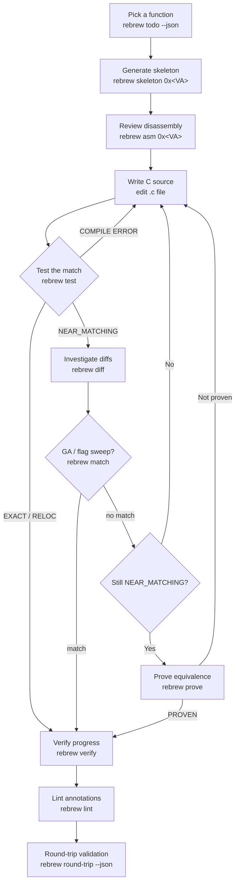

# Rebrew Workflow

All commands run from a directory containing `rebrew-project.toml`. Use `--json` for structured output.
For annotation syntax details, see `references/annotation-format.md`.

## When NOT to use this skill

- New binary onboarding (FLIRT scan, catalog, triage) → use `rebrew-intake`
- Deep byte-level matching / GA / flag sweep / prove → use `rebrew-matching`
- Global variables, `.bss` gaps, dispatch tables → use `rebrew-data-analysis`
- Ghidra push/pull operations → use `rebrew-ghidra-sync`

## 1. Pick a Function

```bash
rebrew status --json                    # Quick overview: counts per STATUS, % coverage
rebrew todo --json                      # Primary: highest ROI action items
rebrew todo -c start-function --json    # Filter category: start-function | fix-delta | compile-error | extract-error | improve-match | missing-annotation | identify-library | run-prover | setup | documented (audit-only)
rebrew flirt --json                     # FLIRT scan: identify known library functions (fast wins)
rebrew crt-match --all --json           # Find matching CRT source files for LIBRARY functions
rebrew similar 0x10001000 --json        # Find structurally similar functions (same source family)
```

**Default to `rebrew todo --json`.** Each item carries a ready-to-run `command` field
(e.g. `rebrew skeleton 0x...`, `rebrew diff 0x...`, `rebrew prove 0x...`) — run it verbatim.
Items are tiered by ROI:
1. Compile errors / extract errors (blocks progress — fix the source/marker/symbol first)
2. Near-misses (1-4 byte deltas, fast wins)
3. Stubs that need finishing
4. New function starts (ranked by similarity + size)
5. Automated tasks (prove, data fixups)

> **`extract-error` items** mean the compiled `.obj` lacks the annotated symbol:
> the STUB/FUNCTION marker name, the C definition's decorated symbol, or the
> implementation is wrong. Run the item's `rebrew test 0x<va>` command to see
> the exact failure. Do NOT run a flag sweep or GA on these — the symbol must
> resolve before matching can help.

The JSON `coverage` block (`total`/`covered`/`exact`/`reloc`/`proven`/`matching`/`stub`/`pct_matched`)
is the source of truth for progress. Use `rebrew status --json` first if the project state is
unfamiliar — it is read-only and cheap (no compilation).

## 2. Generate Skeleton

```bash
rebrew skeleton 0x<VA>                             # generate annotated .c stub
rebrew skeleton 0x<VA> --decomp --decomp-backend ghidra # embed Ghidra decompilation via MCP
rebrew skeleton 0x<VA> --xrefs                     # include caller context from Ghidra xrefs
rebrew skeleton 0x<VA> --append existing_file.c    # append to multi-function file (path relative to reversed_dir)
rebrew skeleton --batch 10                         # generate 10 skeletons (smallest first)
rebrew skeleton 0x<VA> --force                     # overwrite if the file already exists
```

The skeleton writes the `// FUNCTION:` marker + a stub body and records SIZE in
`rebrew-function.toml` automatically (SIZE is required for test/verify to extract target
bytes). It prints the exact `rebrew test` command to run next — use it.

## 3. Review Disassembly

```bash
rebrew asm 0x<VA> --size 128               # hex dump + disassembly
rebrew asm 0x<VA> --size 128 --format nasm # NASM-reassembleable source
rebrew asm 0x<VA> --size 128 --json        # structured JSON output
```

### Multiple Target Synchronization
Rebrew filters annotations by the active `--target`. Multiple `// FUNCTION: <MODULE>` marker lines in the same C file are supported — **no other metadata in the .c file**:
```c
// FUNCTION: LEGO1 0x1009a8c0

// FUNCTION: BETA10 0x101832f7
void my_func() {}
```

> [!CAUTION]
> **All volatile metadata lives in `rebrew-function.toml` at `cfg.metadata_dir`
> (the parent of `reversed_dir`, e.g. `src/` for `src/server.dll/`), never inline
> in the `.c` file.** Metadata-owned keys: STATUS, SIZE, CFLAGS, BLOCKER/BLOCKER_DELTA,
> NOTE, GHIDRA, ORIGIN, SOURCE, SECTION, SKIP, GLOBALS, prove_constraints.
> STATUS is promoted only by `rebrew test` / `rebrew verify` (canonical writer:
> `metadata.update_source_status`); PROVEN is sticky — never silently demoted
> (deliberate demotion: `rebrew test <file> --force-status`). Use
> `rebrew lint --fix` to migrate any leftover inline `// STATUS:`-style keys.
> **Never manually edit `rebrew-function.toml` or `rebrew-data.toml`.**

## 4. Implement and Test

Iteratively edit source and compile-compare against the target binary:

```bash
rebrew test src/<target>/<file>.c          # compile + byte-compare; auto-updates STATUS
rebrew test src/<target>/<file>.c --json   # JSON output with byte-level mismatches
rebrew test src/<target>/<file>.c --no-promote          # skip STATUS update
rebrew test 0x<VA> --json                  # find by VA (also accepts a symbol name)
rebrew test src/<target>/<file>.c --va 0x10001000 \
    --symbol _myfunc --size 64 --cflags "/O1 /Gd"        # override metadata for ad-hoc tests
```

On a multi-function file, `--va` selects the annotation AT that VA (its symbol
and fallback size come from it — same rule as diff/match/prove). Pass
`--symbol` too to override the symbol explicitly; with no `--va`/`--symbol`/
`--size`, every annotated function in the file is tested.
rebrew test --all --json                   # batch test all reversed .c files
rebrew test --all --origin GAME --json     # batch mode, filter by origin
rebrew test --all --dir src/<target>/ --json    # restrict to subdir
rebrew test --all -j 8 --json              # parallel compile (default from config)
rebrew test --all --dry-run                # list candidates without compiling
rebrew test src/<target>/<file>.c --dry-run  # compile but PREVIEW the STATUS change (no write)
```

**`--dry-run` semantics** (consistent across tools): it must never write. For
`rebrew test`, single-function `--dry-run` compiles and prints the would-be
STATUS change without writing; `--all --dry-run` lists candidates without
compiling. `rebrew match --dry-run` is **batch-only** (`--all`); a single-file
`match --dry-run` is rejected — the GA always runs for a single function.
`rebrew prove --dry-run` previews the STATUS promotion; `rebrew verify
--dry-run` previews STATUS sync and skips cache/report writes.

`rebrew test` always syncs STATUS in `rebrew-function.toml` after each run (`--no-promote` skips):
- **EXACT / RELOC** → STATUS updated; BLOCKER/BLOCKER_DELTA cleared
- **NEAR_MATCHING** (≥60% byte match) → STATUS updated; user-set BLOCKERs preserved
- **STUB** (<60%) → STATUS demoted to STUB
- **PROVEN is sticky** — never demoted by test/verify (set only by `rebrew prove`);
  to deliberately demote a stale PROVEN (source changed, no longer byte-matches),
  run `rebrew test src/<target>/<file>.c --force-status` (single-function only)
- Exit codes: `0` EXACT/RELOC · `1` NEAR_MATCHING/STUB · `2` compile error (scriptable)

For a byte diff of the current state:

```bash
rebrew diff src/<target>/<file>.c                # byte diff vs target
rebrew diff src/<target>/<file>.c -m             # mismatches only (** lines)
rebrew diff src/<target>/<file>.c -r             # register-aware (mark RR encoding diffs)
rebrew diff src/<target>/<file>.c --fix-blocker  # auto-write BLOCKER to rebrew-function.toml
rebrew diff src/<target>/<file>.c --format csv   # CSV for spreadsheet analysis
rebrew diff 0x<VA> --json                        # JSON diff + structural similarity + blockers
```

`rebrew diff` also accepts a VA or symbol name. Exit codes: `0` no structural diffs ·
`1` structural diffs (`**` rows) · `2` build failed. `--fix-blocker` classifies structural
diffs (register allocation, jump-condition swap, loop rotation, stack-frame choice, …) and
writes BLOCKER/BLOCKER_DELTA metadata. Unresolved global references (a `[0]` operand on a
non-reloc row) are reported as hints — add a `// GLOBAL:` annotation for the target address.

For deeper matching (GA engine), see the `rebrew-matching` skill.

## 5. File Organization

```bash
rebrew split src/<target>/multi.c                    # split into individual files
rebrew split src/<target>/multi.c --dry-run           # preview without writing
rebrew split --va 0x10003DA0 src/<target>/multi.c     # extract one function
rebrew merge a.c b.c -o merged.c                     # merge into one file
rebrew rename old_func new_func                       # rename across entire project
rebrew rename old_func new_func --dry-run             # preview rename without writing
```

Split when functions need different CFLAGS or independent tracking.
Merge when functions share a translation unit (static locals, file-scoped globals).

Use `rebrew graph --cu-map` to identify functions likely from the same compilation unit:

```bash
rebrew graph --cu-map --json                         # infer TU boundaries
```

## 6. Global Data

If the function references globals, use the `rebrew-data-analysis` skill for
`// GLOBAL:` / `// DATA:` annotations and the `rebrew data` tool. Global metadata
lives in the **`rebrew-data.toml`** metadata file at `cfg.metadata_dir`, managed
automatically by `rebrew data`, `rebrew data --fix-bss`, and `rebrew sync --pull`.

## 7. Prove Stubborn NEAR_MATCHING Functions

If a function remains NEAR_MATCHING after source adjustments (structural blockers like
register allocation), use `rebrew prove` for symbolic equivalence:

```bash
rebrew prove src/<target>/<file>.c --json               # prove NEAR_MATCHING → PROVEN
rebrew prove src/<target>/<file>.c --dry-run --json      # preview without updating
rebrew prove my_func --timeout 120 --json                # find by symbol, 2 min timeout
rebrew prove src/<target>/<file>.c --watch-va 0x10034640 --json  # also compare 4 bytes of memory at this VA (repeatable)
rebrew prove --all --json                                # batch-prove all NEAR_MATCHING functions
```

- Requires the optional dep: `uv pip install -e ".[prove]"` (angr).
- Precondition: STATUS must be NEAR_MATCHING (EXACT/RELOC already match byte-for-byte;
  PROVEN is reserved for semantic equivalence).
- If the compiled bytes already match after relocation accounting, it promotes to
  RELOC/EXACT instead of PROVEN (`already_matched` in the JSON output).
- 64-bit returns (`long long`, `__int64`, `int64_t`) auto-compare the EDX:EAX pair;
  `--check-edx` forces the EDX check.
- `--watch-va` values are decimal unless `0x`-prefixed (unlike most other rebrew tools).
- On success, STATUS → PROVEN via metadata; PROVEN is sticky, so test/verify
  never demote it. To deliberately demote a stale PROVEN (source changed since
  the proof), run `rebrew test <file> --force-status` (single-function only).

For details, see the `rebrew-matching` skill.

## 8. Verify and Track Progress

```bash
rebrew doctor                           # check toolchain/config health (run first on any breakage)
rebrew verify --summary                 # summary table with match %
rebrew verify --json                    # bulk compile + diff all reversed functions
rebrew verify -j 8 -o report.json       # parallel compile, save report to file
rebrew verify --compare --json          # compare against last saved report, detect regressions
rebrew verify --watch                   # re-verify all sources on every file change
rebrew verify --full --json             # ignore cache, force full re-verification
rebrew lint src/<target>/<file>.c       # lint one file (files are POSITIONAL args)
rebrew lint --json                      # check annotation correctness
rebrew lint --fix                       # auto-migrate inline metadata to rebrew-function.toml
rebrew lint --fix --dry-run             # preview migrations without writing
rebrew lint --summary                   # status/origin breakdown table
rebrew lint --quiet                     # errors only, suppress warnings
```

`rebrew verify` compiles every annotated `.c`, reports EXACT/RELOC/NEAR_MATCHING/STUB/
COMPILE_ERROR per function, and syncs STATUS (PROVEN preserved). The JSON report has a
`summary` block (per-status counts) plus per-function `results` — use it for triage.
Exit code 1 when any function fails.

`rebrew lint` checks marker syntax (E001/E002/…), duplicate VAs, and warns (W019) when
metadata-owned keys appear inline. Pass specific files as positional args; exit code 1 on
any error.

### Coverage Database

```bash
rebrew catalog --data-json              # write db/data_<target>.json
rebrew build-db                         # build SQLite coverage database
```

### Regression Detection

`rebrew verify --compare` compares the current run against `db/verify_results.json`.
Exit code 1 if any regressions — suitable for CI/pre-commit hooks.
The first run has no baseline: it warns "No previous verify report" and skips the diff.

## 9. Final Validation: Round-Trip

When a whole set of functions is matched, validate the entire binary reassembles to the
original byte-for-byte:

```bash
rebrew round-trip --json                # splice every EXACT/RELOC function back into the PE
rebrew round-trip --dry-run             # preview without writing <binary>.reasm
rebrew round-trip --strict-catalog      # exit non-zero on unresolved catalog symbols
rebrew round-trip --filter <substr>     # only splice symbols containing this substring
rebrew round-trip --out <path>          # override output path
```

- Compiles every EXACT/RELOC function, applies COFF relocations against the function +
  data catalogs, splices the patched bytes into a byte copy of the target PE, SHA-256s the
  result, and writes `<binary>.reasm` next to the original.
- **Every EXACT/RELOC function needs SIZE in `rebrew-function.toml`** — a legacy
  inline-only `// SIZE:` makes round-trip report `oversize (size <= 0 in metadata)` and
  fail the splice. Run `rebrew lint --fix` first to migrate inline SIZE/CFLAGS/STATUS
  keys into the metadata file (dry-run with `--dry-run`).
- **`catalog_resolution_drift` with CRT names** (e.g. `_fread`): the library
  header can list both `fread` (a small wrapper) and `_fread` (the real
  implementation) at different VAs — MSVC-decorated calls exact-match `_fread`
  while the target's code called the wrapper. Correct the `library_*.h` VA
  mapping (rename/drop the shadowing entry) or annotate the call sites; the
  drift is never silent.
- **Resolution fallbacks** for symbols the catalog cannot resolve by name: Ghidra
  auto-names encoding their VA in trailing hex (`_g_1003546c`), MSVC `$L<N>` /
  `$cleanup_loop$<N>` jump/dispatch tables mapped from the compiled .obj layout, and
  string literals whose compiled copy is a strict prefix of the target's (bound to the
  target string's start). A wrong fallback surfaces as a `catalog_resolution_drift`
  mismatch, never silent corruption.
- **PROVEN functions are deliberately skipped** — their bytes differ by design (semantic,
  not byte, equivalence) and are reported as `skipped_proven`.
- Exit `0` = SHA-equal + no mismatches; exit `1` otherwise. Read the JSON `reason_counts`
  (per-reason triage) and `byte_coverage` (spliced vs passthrough %) to see what's left.

## 10. Dependency Graph

```bash
rebrew graph --format summary           # stats, leaf functions, top blockers
rebrew graph --focus <Func> --depth 2   # neighbourhood of a specific function
rebrew graph                            # full mermaid call graph
rebrew graph --cu-map --json            # infer compilation unit boundaries
```

For Ghidra integration, see the `rebrew-ghidra-sync` skill.
For GA matching and batch processing, see the `rebrew-matching` skill.
