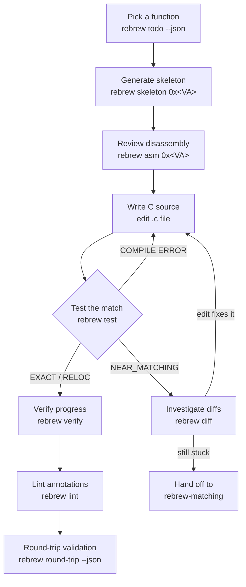

# Rebrew Workflow

All commands run from a directory containing `rebrew-project.toml`. Use `--json` for structured output.
For annotation syntax details, see `references/annotation-format.md`.

## When NOT to use this skill

- New binary onboarding (FLIRT scan, catalog, triage) → use `rebrew-intake`
- Deep byte-level matching / GA / flag sweep / prove → use `rebrew-matching`
- Global variables, `.bss` gaps, dispatch tables → use `rebrew-data-analysis`
- Ghidra push/pull operations → use `rebrew-ghidra-sync`
Also note `rebrew types` in §8 for struct/signature rewrites.

## 1. Pick a Function

```bash
rebrew status --json                    # Quick overview: counts per STATUS, % coverage
rebrew todo --json                      # Primary: highest ROI action items
rebrew todo -c start-function --json    # Filter category: start-function | fix-delta | compile-error | extract-error | improve-match | missing-annotation | identify-library | run-prover | setup | documented (audit-only) | data-drift | start-data | blocked (any item with BLOCKER)
rebrew flirt --json                     # FLIRT scan: identify known library functions (fast wins)
rebrew crt-match --all --json           # Find matching CRT source files for LIBRARY functions
rebrew similar 0x10001000 --json        # Find structurally similar functions (same source family)
```

**Default to `rebrew todo --json`.** Each item has a ready `command` — run it.
ROI tiers: compile/extract errors → near-misses → stubs → new starts → prove/data.
`extract-error` = symbol missing from `.obj`; fix the marker/definition before GA.
`coverage` in JSON is the progress source of truth; `status --json` is cheap recon.

> [!IMPORTANT]
> **Before starting a function, check it is not library code.** CRT/zlib in
> `.text` looks like target code. Probe first:
>
> ```bash
> rebrew flirt --va 0x<VA> --json
> rebrew crt-match 0x<VA> --json
> rebrew lib-match --lib LIBCMT.LIB --va 0x<VA>
> ```
>
> A miss is inconclusive. FLIRT can under-match across library builds;
> `lib-match` settles whole-body identity against the linked archive. Mark hits
> `// LIBRARY:` and move on.

## 2. Generate Skeleton

```bash
rebrew skeleton 0x<VA>                             # generate annotated .c stub
rebrew skeleton 0x<VA> --decomp --decomp-backend ghidra # embed Ghidra decompilation via MCP
rebrew skeleton 0x<VA> --xrefs                     # include caller context from Ghidra xrefs
rebrew skeleton 0x<VA> --append existing_file.c    # append to multi-function file (path relative to reversed_dir)
rebrew skeleton --batch 10                         # generate 10 skeletons (smallest first)
rebrew skeleton 0x<VA> --force                     # overwrite if the file already exists
```

The skeleton writes the `// FUNCTION:` marker + a stub body and records SIZE in
`rebrew-functions.toml` automatically (SIZE is required for test/verify to extract target
bytes). It prints the exact `rebrew test` command to run next — use it.

## 3. Review Disassembly

```bash
rebrew asm 0x<VA> --size 128               # hex dump + disassembly
rebrew asm 0x<VA> --size 128 --format nasm # NASM-reassembleable source
rebrew asm 0x<VA> --size 128 --json        # structured JSON output
```

### Multiple Target Synchronization
Rebrew filters annotations by the active `--target`. Multiple `// FUNCTION: <MODULE>` marker lines in the same C file are supported — **no other metadata in the .c file**:
```c
// FUNCTION: LEGO1 0x1009a8c0

// FUNCTION: BETA10 0x101832f7
void my_func() {}
```

> [!CAUTION]
> **Volatile metadata lives only in `rebrew-functions.toml` at `cfg.metadata_dir`
> — never inline in `.c`, never hand-edit the TOML.** Keys: STATUS, SIZE, CFLAGS,
> BLOCKER/BLOCKER_DELTA, NOTE, GHIDRA, ORIGIN, SOURCE, SECTION, SKIP, GLOBALS,
> prove_constraints. STATUS via `rebrew test`/`verify` only; use `rebrew blocker
> set/clear`, `rebrew lint --fix` for migrations. Files are mode 0444
> (`atomic_write_locked`). Full rules: `references/annotation-format.md`.

## 4. Implement and Test

Iteratively edit source and compile-compare against the target binary:

```bash
rebrew test src/<target>/<file>.c          # compile + byte-compare; auto-updates STATUS
rebrew test src/<target>/<file>.c --json   # JSON output with byte-level mismatches
rebrew test src/<target>/<file>.c --no-promote          # skip STATUS update
rebrew test 0x<VA> --json                  # find by VA (also accepts a symbol name)
rebrew test src/<target>/<file>.c --va 0x10001000 \
    --symbol _myfunc --size 64 --cflags "/O1 /Gd"        # override metadata for ad-hoc tests
rebrew test --all --json                   # batch test all reversed .c files
rebrew test --all --origin GAME --json     # batch mode, filter by origin
rebrew test --all --dir src/<target>/ --json    # restrict to subdir
rebrew test --all -j 8 --json              # parallel compile (default from config)
rebrew test --all --dry-run                # list candidates without compiling
rebrew test src/<target>/<file>.c --dry-run  # compile but PREVIEW the STATUS change (no write)
rebrew probe src/<target>/<file>.c --json    # read-only ruler: strict + generous + aligned, never writes
```

On a multi-function file, `--va` selects the annotation AT that VA (its symbol
and fallback size come from it — same rule as diff/match/prove). Pass
`--symbol` too to override the symbol explicitly; with no `--va`/`--symbol`/
`--size`, every annotated function in the file is tested.

**`--dry-run` never writes.** `test` single-file: compile + preview STATUS;
`--all --dry-run`: list only. `match --dry-run` is batch-only (`--all`).
`prove`/`verify --dry-run` preview STATUS/cache writes.

`rebrew test` syncs STATUS (`--no-promote` skips): EXACT/RELOC update + clear
BLOCKER; NEAR_MATCHING (≥60%) updates; STUB (<60%) demotes; PROVEN is sticky
(`--force-status` to demote). Exit: `0` EXACT/RELOC · `1` NEAR/STUB · `2` compile/extract error.

For a byte diff of the current state:

```bash
rebrew diff src/<target>/<file>.c                # byte diff vs target
rebrew diff src/<target>/<file>.c -m             # mismatches only (** lines)
rebrew diff src/<target>/<file>.c -r             # register-aware (mark RR encoding diffs)
rebrew diff src/<target>/<file>.c --fix-blocker  # auto-write BLOCKER to rebrew-functions.toml
rebrew diff src/<target>/<file>.c --format csv   # CSV for spreadsheet analysis
rebrew diff 0x<VA> --json                        # JSON diff + structural similarity + blockers
rebrew blocker set src/<target>/<file>.c "needs RE structs"   # programmatic BLOCKER for STUBs diff cannot classify
rebrew blocker set 0x<VA> "SEH helper -- not matchable from C"
rebrew blocker clear src/<target>/<file>.c       # remove BLOCKER again
```

`rebrew diff` accepts VA/symbol. Exit: `0` clean · `1` structural `**` · `2` build fail.
`--fix-blocker` writes BLOCKER metadata. Unresolved `[0]` globals → add `// GLOBAL:`.
Deep GA/prove → `rebrew-matching`.

## 5. File Organization

```bash
rebrew split src/<target>/multi.c [--dry-run] [--va 0x...]
rebrew merge a.c b.c -o merged.c
rebrew merge-sweep --dry-run
rebrew link-order --check
rebrew layout-map
rebrew rename old_func new_func [--dry-run]
rebrew graph --cu-map --json              # infer TU boundaries for merge decisions
rebrew recommend --json                   # all lanes: TU layout + hygiene + next action
```

Split for different CFLAGS; merge for shared TU (statics/file globals).
`rebrew merge --shared` collapses per-target twin copies into one stacked
`src/shared` file (refuses divergent bodies).
`rebrew cross-import --shared` stacks one matched function at a time
(`--promote` moves the file first); `split --va` matches any stacked marker.

## 6. Global Data

Globals → `rebrew-data-analysis` (`// GLOBAL:` / `// DATA:`, `rebrew data`).
Metadata in `rebrew-data.toml` at `cfg.metadata_dir`.

## 7. Stubborn NEAR_MATCHING

When `rebrew diff` / C edits stall, switch to `rebrew-matching` (flag sweep, GA,
`near-diag`, `prove`). Do not run long GA/prove from this skill.

## 8. Verify and Track Progress

```bash
rebrew doctor
rebrew verify --summary                 # or --json / --compare / --full
rebrew lint --json                      # --fix migrates leftover inline metadata
rebrew orphans --prune --dry-run
rebrew types --json
rebrew types apply-type <file> --param N --type T
```

Full flag set + coverage DB + decomp.me: `references/verify-and-progress.md`.
`verify --compare` is the CI regression gate.

## 9. Final Validation: Round-Trip

When a whole set is matched, splice EXACT/RELOC back into a byte-identical PE:

```bash
rebrew round-trip --json                # splice every EXACT/RELOC function back into the PE
rebrew round-trip --dry-run             # preview without writing <binary>.reasm
```

SIZE must live in `rebrew-functions.toml` (`rebrew lint --fix` migrates inline keys).
PROVEN is skipped. Full fallback/drift rules: `references/round-trip.md`.

## 10. Dependency Graph

```bash
rebrew graph --format summary           # stats, leaf functions, top blockers
rebrew graph --focus <Func> --depth 2   # neighbourhood of a specific function
rebrew graph                            # full mermaid call graph
rebrew graph --cu-map --json            # infer compilation unit boundaries
```

For Ghidra integration, see the `rebrew-ghidra-sync` skill.
For GA matching and batch processing, see the `rebrew-matching` skill.

## Toolchains

Shipped profiles (`msvc-*`, `mingw-*`, …) compile only through their docker image —
`rebrew toolchain list/status/pull/build`. No host wine/wibo fallback. See `docs/TOOLCHAIN.md`.

## Advanced commands

Linkage / inspection tools outside the main loop:
`references/advanced-commands.md`.
